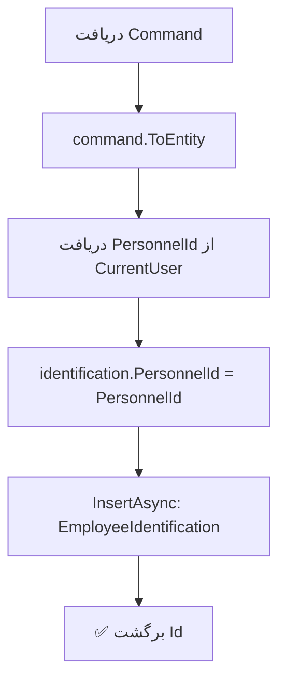

<div dir="rtl">

# IdentifyStudentEmploymentCommand.cs

**مسیر**: `Csis.Admission.Application/Features/Employments/Commands/IdentifyStudentEmploymentCommand.cs`

---

## 1. Purpose (هدف)

Command ثبت **شناسایی موردی** اشتغال دانشجو توسط کارمند. این Command زمانی استفاده می‌شود که کارمند اشتغال دانشجو را به صورت دستی شناسایی و ثبت می‌کند (معمولاً برای موارد خاص یا موارد احصاء شده).

---

## 2. مستندات XML موجود

```csharp
/// <summary>شناسایی موردی اشتغال</summary>
```

**کامل**: Command ثبت شناسایی اشتغال توسط کارمند با ذکر محل کار و توضیحات.

---

## 3. خلاصه اتفاقات

**جریان اصلی**:
```
1. دریافت اطلاعات شناسایی از Command
2. تبدیل به Entity
3. افزودن PersonnelId کارمند شناساننده
4. Insert در جدول EmployeeIdentification
5. برگشت Id
```

---

## 4. اجزای اصلی

### Command:
```csharp
record IdentifyStudentEmploymentCommand : IRequest<int>
{
    int Codm                // کد مرکز خدمات دانشجو
    string EmployeeName     // محل اشتغال شناسایی شده
    string Description      // توضیحات شناسایی
}
```

### Handler Dependencies:
- **IRepository<EmployeeIdentification>**: ذخیره شناسایی
- **ICurrentUserService**: دریافت PersonnelId کارمند

---

## 5. Flow



---

## 6. Business Rules

### BR-1: فقط کارمندان
- این Command **فقط** توسط کارمندان قابل اجرا است
- `PersonnelId` از سرویس احراز هویت گرفته می‌شود

### BR-2: ثبت Audit
- **چه کسی** شناسایی کرده: `PersonnelId`
- **چه زمانی**: از طریق CreatedOn (احتمالاً در Entity)
- **کدام دانشجو**: `Codm`
- **چه محلی**: `EmployeeName`

### BR-3: مستقل از StudentEmployment
- این رکورد در جدول **جداگانه** (EmployeeIdentification) ذخیره می‌شود
- یک نوع Audit Log برای شناسایی‌های دستی

---

## 7. Dependencies

### Internal:
- `IRepository<EmployeeIdentification>`: ثبت شناسایی
- `ICurrentUserService`: دریافت PersonnelId

---

## 8. Input/Output

### Input:
```csharp
int Codm                // کد مرکز خدمات
string EmployeeName     // محل اشتغال
string Description      // توضیحات
```

### Output:
```csharp
int Id      // شناسه رکورد شناسایی
```

### Exceptions:
- **UnauthorizedException**: اگر PersonnelId در دسترس نباشد (کاربر کارمند نیست)

---

## 9. Side Effects

1. **ثبت رکورد شناسایی**: در جدول EmployeeIdentification
2. **Audit Trail**: ثبت اطلاعات کارمند شناساننده

---

## 10. الگوهای استفاده شده

### ✅ Audit Pattern
- ثبت کامل اطلاعات شناسایی برای پیگیری آینده

### ✅ CurrentUser Injection
```csharp
identification.PersonnelId = (await currentUserService.PersonnelId()).Value;
```

---

## 11. Performance

- **Database Operations**: 1 INSERT
- عملیات بسیار ساده و سریع

---

## 12. Security

- ✅ **Authentication**: نیاز به توکن معتبر کارمند
- ✅ **Audit Trail**: ثبت کامل PersonnelId
- ⚠️ **Authorization**: نیاز به بررسی سطح دسترسی کارمند

---

## 13. نکات مهم

### 💡 جدول مجزا
- `EmployeeIdentification` یک جدول مجزا است
- **نه** بخشی از `StudentEmployment`
- احتمالاً برای Audit و پیگیری استفاده می‌شود

### 🎯 Use Case
**سناریو**: کارمند در بررسی پرونده متوجه می‌شود دانشجو در محلی مشغول است که خودش اعلام نکرده:
1. کارمند این Command را فراخوانی می‌کند
2. محل اشتغال و توضیحات را وارد می‌کند
3. شناسایی ثبت می‌شود
4. احتمالاً فرآیند پیگیری شروع می‌شود

### ⚠️ رابطه با StudentEmployment
- این Command StudentEmployment را تغییر نمی‌دهد
- فقط یک **شناسایی** ثبت می‌کند
- برای بروزرسانی واقعی StudentEmployment، باید از Command دیگری استفاده شود

---

## 14. مثال استفاده

```csharp
// کارمند در بررسی پرونده متوجه اشتغال غیرمجاز می‌شود
var cmd = new IdentifyStudentEmploymentCommand {
    Codm = 12345,
    EmployeeName = "شرکت ABC",
    Description = "دانشجو به صورت تمام وقت در این شرکت مشغول است اما اعلام نکرده"
};
var identificationId = await mediator.Send(cmd);

// نتیجه: یک رکورد شناسایی با PersonnelId کارمند ثبت می‌شود
```

---

## 15. Related Commands

- **IdentifyStudentEmploymentRequestCommand**: نسخه درخواستی (احتمالاً از طریق Request System)
- **CreateOrUpdateStudentEmploymentCommand**: بروزرسانی واقعی Employment

---

## 16. Related Entities

### EmployeeIdentification
```csharp
class EmployeeIdentification {
    int Id
    int Codm              // دانشجوی شناسایی شده
    int PersonnelId       // کارمند شناساننده
    string EmployeeName   // محل اشتغال
    string Description    // شرح
    DateTime CreatedOn    // زمان شناسایی
}
```

---

## 17. تغییرات پیشنهادی

### 1. بررسی PersonnelId
```csharp
var personnelId = await currentUserService.PersonnelId();
if (!personnelId.HasValue)
    throw new UnauthorizedException("فقط کارمندان مجاز به شناسایی هستند");

identification.PersonnelId = personnelId.Value;
```

### 2. افزودن Response بهتر
```csharp
// بجای int، return کردن DTO با اطلاعات بیشتر
return new IdentificationResultDto {
    Id = identification.Id,
    Codm = identification.Codm,
    EmployeeName = identification.EmployeeName,
    IdentifiedBy = personnelId.Value,
    IdentifiedOn = identification.CreatedOn
};
```

---

</div>
