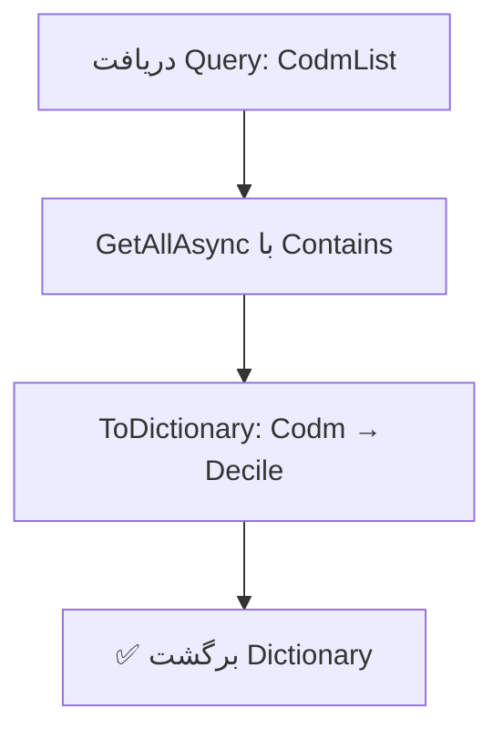

<div dir="rtl">

# GetDecileByCodmQuery.cs

**مسیر**: `Csis.Admission.Application/Features/Employments/Queries/GetDecileByCodmQuery.cs`

---

## 1. Purpose (هدف)

Query دریافت **دهک درآمدی** برای لیستی از دانشجویان. این Query برای دریافت سریع دهک درآمدی چندین دانشجو به صورت Batch استفاده می‌شود.

---

## 2. مستندات XML موجود

```csharp
/// <summary>
/// دریافت دهک بر اساس لیست کدمرکز
/// </summary>
/// <param name="CodmList"></param>
```

**کامل**: Query دریافت دهک درآمدی برای لیست دانشجویان.

---

## 3. خلاصه اتفاقات

**جریان اصلی**:
```
1. دریافت لیست Codm ها
2. Query به StudentEmployment با فیلتر IN
3. تبدیل به Dictionary<Codm, Decile>
4. برگشت Dictionary
```

---

## 4. اجزای اصلی

### Query:
```csharp
sealed record GetDecileByCodmQuery(List<int> CodmList) : IRequest<Dictionary<int, short?>>
{
    List<int> CodmList   // لیست کدهای مرکز خدمات
}
```

### Handler Dependencies:
- **IRepository<StudentEmployment>**: دریافت اطلاعات اشتغال

---

## 5. Flow



---

## 6. Business Rules

### BR-1: Batch Processing
- دریافت دهک برای چندین دانشجو به صورت یکجا
- بهینه برای کاهش Query های متعدد

### BR-2: Nullable Decile
- `Decile` می‌تواند `null` باشد (دانشجو ممکن است دهک نداشته باشد)

### BR-3: Dictionary Output
- کلید: Codm
- مقدار: Decile (short?)

---

## 7. Dependencies

### Internal:
- `IRepository<StudentEmployment>`: دریافت دهک

---

## 8. Input/Output

### Input:
```csharp
List<int> CodmList   // [12345, 12346, 12347, ...]
```

### Output:
```csharp
Dictionary<int, short?> {
    12345 => 5,
    12346 => 3,
    12347 => null,
    ...
}
```

### Exceptions:
- هیچ Exception خاصی پرتاب نمی‌شود
- اگر Codm در DB نباشد، در Dictionary نمی‌آید

---

## 9. Side Effects

- **هیچ**: Query فقط خواندن است

---

## 10. الگوهای استفاده شده

### ✅ Batch Query Pattern
```csharp
WHERE x.Codm IN (12345, 12346, ...)
```
- یک Query بجای N Query

### ✅ Dictionary Projection
```csharp
.ToDictionary(x => x.Codm, x => x.Decile)
```

---

## 11. Performance

- **Database Queries**: 1 SELECT با IN clause
- **Optimization**: بسیار بهینه برای دریافت دهک چندین دانشجو
- ⚠️ **IN clause limit**: در صورت لیست بسیار بزرگ (هزاران Codm)، ممکن است نیاز به Pagination باشد

---

## 12. Security

- ⚠️ **Authorization**: بررسی نمی‌شود که آیا کاربر مجاز به دیدن دهک این دانشجویان است
- پیشنهاد: افزودن Authorization Check

---

## 13. نکات مهم

### 💡 Use Case
این Query معمولاً در سناریوهایی استفاده می‌شود که:
- لیست دانشجویان نمایش داده می‌شود
- نیاز است دهک هر کدام نمایش داده شود
- بجای N Query، یک Query برای همه

### ⚠️ Missing Codm Handling
```csharp
// اگر Codm در DB نباشد، در Dictionary نمی‌آید
var deciles = await mediator.Send(new GetDecileByCodmQuery([1, 2, 3]));
// اگر Codm=2 در DB نباشد:
// deciles.ContainsKey(2) => false

// بهتر است:
foreach (var codm in codmList) {
    var decile = deciles.TryGetValue(codm, out var d) ? d : null;
}
```

### 🎯 Decile Range
- دهک معمولاً بین 1 تا 10 است
- `null` یعنی دهک محاسبه نشده یا اشتغال ثبت نشده

---

## 14. مثال استفاده

```csharp
// دریافت دهک برای 5 دانشجو
var query = new GetDecileByCodmQuery(
    CodmList: [12345, 12346, 12347, 12348, 12349]
);
var deciles = await mediator.Send(query);

// نتیجه:
// {
//   12345 => 5,
//   12346 => 3,
//   12347 => null,  // اشتغال ندارد یا دهک ثبت نشده
//   12348 => 8,
//   12349 => 2
// }

// استفاده:
foreach (var codm in query.CodmList) {
    var decile = deciles.GetValueOrDefault(codm);
    Console.WriteLine($"Codm {codm}: Decile {decile?.ToString() ?? "نامشخص"}");
}
```

---

## 15. Related Queries

- **GetStudentEmploymentByCodmQuery**: دریافت اطلاعات کامل اشتغال (تک دانشجو)

---

## 16. تغییرات پیشنهادی

### 1. افزودن Authorization
```csharp
public async Task<Dictionary<int, short?>> Handle(...) {
    // بررسی دسترسی کاربر
    if (!await currentUser.CanViewDeciles())
        throw new UnauthorizedException();
    
    var result = await employmentRepo.GetAllAsync(...);
    return result.ToDictionary(x => x.Codm, x => x.Decile);
}
```

### 2. بهبود Performance برای لیست بزرگ
```csharp
// اگر CodmList بزرگتر از 1000 باشد
if (query.CodmList.Count > 1000) {
    // Chunking
    var chunks = query.CodmList.Chunk(1000);
    var result = new Dictionary<int, short?>();
    
    foreach (var chunk in chunks) {
        var chunkResult = await employmentRepo.GetAllAsync(
            x => chunk.Contains(x.Codm), ...);
        foreach (var item in chunkResult) {
            result[item.Codm] = item.Decile;
        }
    }
    
    return result;
}
```

### 3. افزودن Caching
```csharp
// Cache کردن دهک‌ها (چون کم تغییر می‌کنند)
var cacheKey = $"deciles:{string.Join(",", query.CodmList.OrderBy(x => x))}";
var cached = await cache.GetAsync<Dictionary<int, short?>>(cacheKey);
if (cached != null) return cached;

var result = await employmentRepo.GetAllAsync(...).ToDictionary(...);
await cache.SetAsync(cacheKey, result, TimeSpan.FromHours(1));
```

### 4. Projection بهتر
```csharp
// بجای GetAllAsync که کل Entity را برمی‌گرداند
var result = await employmentRepo.GetAllAsync(
    x => query.CodmList.Contains(x.Codm),
    selector: x => new { x.Codm, x.Decile },  // فقط 2 فیلد
    cancellationToken: cancellationToken
);
```

---

</div>
