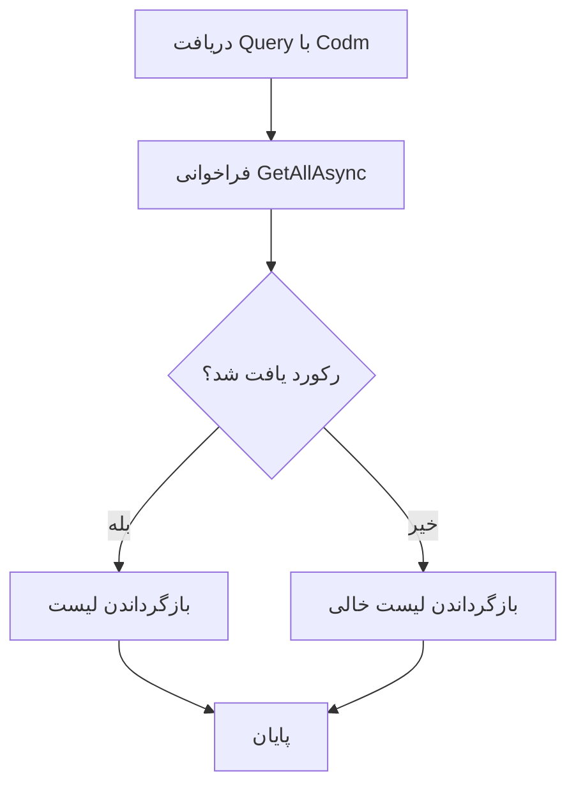

# GetIdentifyStudentEmploymentQuery.cs

**مسیر**: `Csis.Admission.Application/Features/Employments/Queries/GetIdentifyStudentEmploymentQuery.cs`

**نوع**: Query (CQRS Read Operation)

---

## 1. هدف (Purpose)

این Query برای **دریافت لیست شناسایی‌های موردی اشتغال یک دانشجو** استفاده می‌شود. هدف اصلی، بازگردان تمام رکوردهای `EmployeeIdentification` مرتبط با یک `Codm` خاص است که نمایانگر شناسایی‌های اشتغال دانشجو می‌باشد.

**کاربرد اصلی**:
- نمایش لیست تمام موارد شناسایی شده اشتغال دانشجو
- Tracking شناسایی‌های موردی برای هر دانشجو
- پشتیبانی از فرآیند تایید اشتغال دانشجو

---

## 2. ساختار کد (Code Structure)

```csharp
public record GetIdentifyStudentEmploymentQuery(int Codm) 
    : IRequest<List<EmployeeIdentificationDto>>;

internal sealed class IdentifyStudentEmploymentQueryHandler(
    IRepository<EmployeeIdentification> employeeIdentificationRepository)
    : IRequestHandler<GetIdentifyStudentEmploymentQuery, List<EmployeeIdentificationDto>>
{
    public async Task<List<EmployeeIdentificationDto>> Handle(
        GetIdentifyStudentEmploymentQuery request, 
        CancellationToken cancellationToken)
    {
        var result = await employeeIdentificationRepository
            .GetAllAsync<EmployeeIdentificationDto>(
                x => x.Codm == request.Codm, 
                cancellationToken: cancellationToken);
        return result;
    }
}
```

---

## 3. ورودی‌ها (Inputs)

### Query Parameters:

| پارامتر | نوع | توضیحات | الزامی |
|---------|-----|---------|--------|
| `Codm` | `int` | کد دانشجو | ✅ بله |

**نمونه استفاده**:
```csharp
var query = new GetIdentifyStudentEmploymentQuery(Codm: 123456);
var identifications = await mediator.Send(query);
```

---

## 4. خروجی (Output)

**نوع خروجی**: `List<EmployeeIdentificationDto>`

**توضیحات**:
- لیستی از تمام شناسایی‌های موردی اشتغال دانشجو
- ممکن است خالی باشد (اگر دانشجو شناسایی نداشته باشد)
- هر آیتم حاوی اطلاعات کامل شناسایی

---

## 5. فلوی اجرا (Execution Flow)



### مراحل اجرا:
1. دریافت `Codm` از Query
2. استعلام تمام رکوردهای `EmployeeIdentification` با فیلتر `Codm`
3. پروجکت کردن به `EmployeeIdentificationDto` (توسط AutoMapper)
4. بازگرداندن لیست

---

## 6. قوانین کسب‌وکار (Business Rules)

### BR-1: فیلتر بر اساس Codm
تنها شناسایی‌های مرتبط با `Codm` مشخص شده بازگردانده می‌شوند.

```csharp
x => x.Codm == request.Codm
```

### BR-2: عدم محدودیت تعداد
این Query هیچ محدودیتی در تعداد رکوردهای بازگشتی ندارد و تمام موارد را برمی‌گرداند.

---

## 7. وابستگی‌ها (Dependencies)

| وابستگی | نوع | هدف |
|---------|-----|-----|
| `IRepository<EmployeeIdentification>` | Repository | دسترسی به داده‌های شناسایی اشتغال |
| `EmployeeIdentificationDto` | DTO | مدل خروجی |

---

## 8. استثناها (Exceptions)

### عدم وجود استثنای صریح
این Query هیچ Exception صریحی پرتاب نمی‌کند:
- اگر `Codm` یافت نشود، لیست خالی برمی‌گردد
- استثناهای احتمالی فقط از لایه Database (مثل connection error)

⚠️ **نکته امنیتی**: فقدان Authorization check - هر کسی می‌تواند شناسایی‌های هر دانشجویی را مشاهده کند.

---

## 9. ملاحظات امنیتی (Security Considerations)

### ⚠️ مشکل امنیتی شناسایی شده:

**1. فقدان Authorization**
```csharp
// ❌ مشکل: هیچ بررسی دسترسی وجود ندارد
public async Task<List<EmployeeIdentificationDto>> Handle(...)
{
    // هر کسی می‌تواند Codm دیگران را استعلام کند
    var result = await employeeIdentificationRepository...
}
```

**راه‌حل پیشنهادی**:
```csharp
// ✅ راه‌حل: افزودن Authorization
public async Task<List<EmployeeIdentificationDto>> Handle(...)
{
    // بررسی دسترسی: فقط خود دانشجو یا مدیران
    if (!await authorizationService.CanAccessEmploymentData(request.Codm))
        throw new UnauthorizedException();
    
    var result = await employeeIdentificationRepository...
}
```

---

## 10. عملکرد و بهینه‌سازی (Performance)

### ✅ نقاط قوت:
1. **Projection به DTO**: استفاده از `GetAllAsync<EmployeeIdentificationDto>` - فقط فیلدهای موردنیاز از DB بارگذاری می‌شوند
2. **فیلتر در سطح Database**: شرط `x.Codm == request.Codm` در SQL اعمال می‌شود
3. **CancellationToken**: پشتیبانی از لغو عملیات

### ⚠️ نقاط قابل بهبود:
1. **عدم Pagination**: اگر یک دانشجو تعداد زیادی شناسایی داشته باشد، تمام آن‌ها یکجا بارگذاری می‌شوند

**بهینه‌سازی پیشنهادی**:
```csharp
// افزودن Pagination
public record GetIdentifyStudentEmploymentQuery(
    int Codm, 
    int Page = 1, 
    int PageSize = 20) 
    : IRequest<PagedResult<EmployeeIdentificationDto>>;

// در Handler:
var result = await employeeIdentificationRepository
    .GetPagedAsync<EmployeeIdentificationDto>(
        x => x.Codm == request.Codm,
        page: request.Page,
        pageSize: request.PageSize,
        cancellationToken: cancellationToken);
```

---

## 11. الگوهای طراحی (Design Patterns)

### 1. **CQRS (Query Pattern)**
جداسازی عملیات خواندن از نوشتن.

### 2. **Repository Pattern**
استفاده از `IRepository` برای دسترسی به داده‌ها.

### 3. **DTO Pattern**
پروجکت کردن مستقیم به `EmployeeIdentificationDto` برای کاهش حجم داده.

### 4. **Primary Constructor (C# 12)**
استفاده از Primary Constructor در Handler برای تزریق وابستگی‌ها.

---

## 12. تست‌پذیری (Testability)

### Unit Test نمونه:

```csharp
[Fact]
public async Task Handle_WithExistingCodm_ReturnsIdentifications()
{
    // Arrange
    var codm = 123456;
    var identifications = new List<EmployeeIdentificationDto>
    {
        new() { Id = 1, Codm = codm, /* ... */ },
        new() { Id = 2, Codm = codm, /* ... */ }
    };
    
    _repositoryMock
        .Setup(r => r.GetAllAsync<EmployeeIdentificationDto>(
            It.IsAny<Expression<Func<EmployeeIdentification, bool>>>(),
            It.IsAny<CancellationToken>()))
        .ReturnsAsync(identifications);
    
    var query = new GetIdentifyStudentEmploymentQuery(codm);
    
    // Act
    var result = await _handler.Handle(query, CancellationToken.None);
    
    // Assert
    Assert.Equal(2, result.Count);
    Assert.All(result, item => Assert.Equal(codm, item.Codm));
}

[Fact]
public async Task Handle_WithNonExistingCodm_ReturnsEmptyList()
{
    // Arrange
    var codm = 999999;
    _repositoryMock
        .Setup(r => r.GetAllAsync<EmployeeIdentificationDto>(
            It.IsAny<Expression<Func<EmployeeIdentification, bool>>>(),
            It.IsAny<CancellationToken>()))
        .ReturnsAsync(new List<EmployeeIdentificationDto>());
    
    var query = new GetIdentifyStudentEmploymentQuery(codm);
    
    // Act
    var result = await _handler.Handle(query, CancellationToken.None);
    
    // Assert
    Assert.Empty(result);
}
```

---

## 13. نمونه استفاده (Usage Example)

### در Controller:

```csharp
[HttpGet("identify/{codm}")]
public async Task<ActionResult<List<EmployeeIdentificationDto>>> GetIdentifications(int codm)
{
    var query = new GetIdentifyStudentEmploymentQuery(codm);
    var identifications = await _mediator.Send(query);
    
    return Ok(identifications);
}
```

### در Service:

```csharp
public async Task<EmploymentSummary> GetEmploymentSummary(int codm)
{
    // دریافت شناسایی‌ها
    var identifications = await _mediator.Send(
        new GetIdentifyStudentEmploymentQuery(codm));
    
    // دریافت اطلاعات اشتغال
    var employment = await _mediator.Send(
        new GetStudentEmploymentByCodmQuery(codm));
    
    return new EmploymentSummary
    {
        Identifications = identifications,
        CurrentEmployment = employment
    };
}
```

---

## 14. Commands/Queries مرتبط

| نام | نوع | توضیحات |
|-----|-----|---------|
| `GetStudentEmploymentByCodmQuery` | Query | دریافت اطلاعات اشتغال فعلی دانشجو |
| `IdentifyStudentEmploymentCommand` | Command | ثبت شناسایی جدید برای اشتغال دانشجو |
| `GetDecileByCodmQuery` | Query | دریافت دهک درآمدی دانشجو |

---

## 15. نکات مهم (Important Notes)

### ✅ نقاط قوت:
1. **ساده و واضح**: Query بسیار ساده و قابل فهم
2. **Type-Safe**: استفاده از Record با پارامتر صریح
3. **Projection**: استفاده از DTO در سطح Repository

### ⚠️ نقاط ضعف:
1. **فقدان Authorization**: هیچ بررسی دسترسی وجود ندارد
2. **عدم Pagination**: بدون محدودیت تعداد رکورد
3. **عدم Logging**: هیچ Log ثبت نمی‌شود
4. **عدم Caching**: داده‌ها هر بار از Database خوانده می‌شوند

---

## 16. تغییرات پیشنهادی (Suggested Improvements)

### 1. افزودن Authorization

```diff
internal sealed class IdentifyStudentEmploymentQueryHandler(
    IRepository<EmployeeIdentification> employeeIdentificationRepository,
+   IAuthorizationService authorizationService,
+   ICurrentUserService currentUserService)
    : IRequestHandler<GetIdentifyStudentEmploymentQuery, List<EmployeeIdentificationDto>>
{
    public async Task<List<EmployeeIdentificationDto>> Handle(
        GetIdentifyStudentEmploymentQuery request, 
        CancellationToken cancellationToken)
    {
+       // بررسی دسترسی
+       var currentCodm = await currentUserService.GetCodmAsync();
+       if (currentCodm != request.Codm && 
+           !await authorizationService.HasRole("Admin"))
+       {
+           throw new UnauthorizedException("دسترسی به اطلاعات دیگران مجاز نیست");
+       }
+
        var result = await employeeIdentificationRepository
            .GetAllAsync<EmployeeIdentificationDto>(
                x => x.Codm == request.Codm, 
                cancellationToken: cancellationToken);
        return result;
    }
}
```

### 2. افزودن Pagination

```diff
-public record GetIdentifyStudentEmploymentQuery(int Codm) 
+public record GetIdentifyStudentEmploymentQuery(
+   int Codm, 
+   int Page = 1, 
+   int PageSize = 20) 
-   : IRequest<List<EmployeeIdentificationDto>>;
+   : IRequest<PagedResult<EmployeeIdentificationDto>>;
```

### 3. افزودن Logging و Caching

```diff
internal sealed class IdentifyStudentEmploymentQueryHandler(
    IRepository<EmployeeIdentification> employeeIdentificationRepository,
+   ILogger<IdentifyStudentEmploymentQueryHandler> logger,
+   IDistributedCache cache)
    : IRequestHandler<GetIdentifyStudentEmploymentQuery, List<EmployeeIdentificationDto>>
{
    public async Task<List<EmployeeIdentificationDto>> Handle(
        GetIdentifyStudentEmploymentQuery request, 
        CancellationToken cancellationToken)
    {
+       logger.LogInformation(
+           "Fetching employee identifications for Codm: {Codm}", 
+           request.Codm);
+
+       // بررسی Cache
+       var cacheKey = $"identify-employment:{request.Codm}";
+       var cached = await cache.GetStringAsync(cacheKey, cancellationToken);
+       if (cached != null)
+       {
+           logger.LogDebug("Cache hit for {CacheKey}", cacheKey);
+           return JsonSerializer.Deserialize<List<EmployeeIdentificationDto>>(cached);
+       }
+
        var result = await employeeIdentificationRepository
            .GetAllAsync<EmployeeIdentificationDto>(
                x => x.Codm == request.Codm, 
                cancellationToken: cancellationToken);
+
+       // ذخیره در Cache
+       await cache.SetStringAsync(
+           cacheKey,
+           JsonSerializer.Serialize(result),
+           new DistributedCacheEntryOptions { AbsoluteExpirationRelativeToNow = TimeSpan.FromMinutes(5) },
+           cancellationToken);
+
+       logger.LogInformation(
+           "Found {Count} identifications for Codm: {Codm}", 
+           result.Count, 
+           request.Codm);
+
        return result;
    }
}
```

### 4. افزودن Ordering

```diff
var result = await employeeIdentificationRepository
    .GetAllAsync<EmployeeIdentificationDto>(
        x => x.Codm == request.Codm,
+       orderBy: q => q.OrderByDescending(x => x.CreatedAt),
        cancellationToken: cancellationToken);
```

---

**تاریخ بررسی**: 2024-12-24  
**نسخه**: 1.0  
**وضعیت**: ✅ Query ساده اما نیازمند بهبودهای امنیتی و عملکردی
