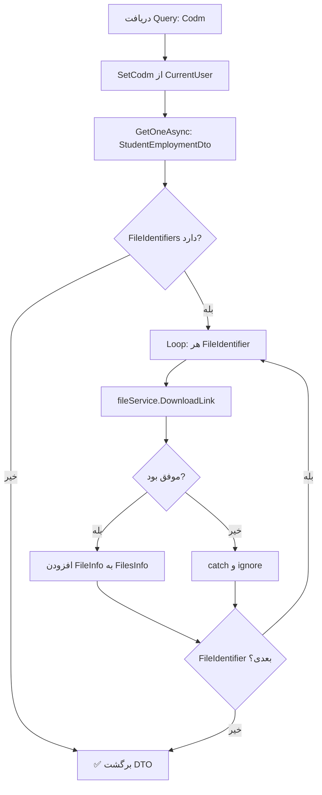

<div dir="rtl">

# GetStudentEmploymentByCodmQuery.cs

**مسیر**: `Csis.Admission.Application/Features/Employments/Queries/GetStudentEmploymentByCodmQuery.cs`

---

## 1. Purpose (هدف)

Query دریافت اطلاعات کامل اشتغال دانشجو به همراه **لینک دانلود فایل‌های پیوست**. این Query اطلاعات اشتغال و مدارک مربوطه را با جزئیات کامل برمی‌گرداند.

---

## 2. مستندات XML موجود

```csharp
/// <summary>دریافت اشتغال طلبه</summary>
/// <param name="Codm"></param>
```

**کامل**: Query دریافت اطلاعات اشتغال دانشجو با فایل‌های پیوست و لینک دانلود.

---

## 3. خلاصه اتفاقات

**جریان اصلی**:
```
1. Set Codm از CurrentUser (اگر null باشد)
2. دریافت StudentEmploymentDto از دیتابیس
3. برای هر FileIdentifier:
   - دریافت DownloadLink از FileManagement Service
   - افزودن FileInfo به DTO
4. برگشت StudentEmploymentDto با FilesInfo
```

---

## 4. اجزای اصلی

### Query:
```csharp
sealed record GetStudentEmploymentByCodmQuery(int? Codm) : IRequest<StudentEmploymentDto>
{
    int? Codm   // کد مرکز خدمات (اختیاری - از Token می‌آید)
}
```

### Handler Dependencies:
- **IRepository<StudentEmployment>**: دریافت اطلاعات اشتغال
- **ICurrentUserService**: دریافت Codm از Token
- **ICsisFileManagementService**: دریافت لینک دانلود فایل‌ها

---

## 5. Flow



---

## 6. Business Rules

### BR-1: Codm از Token
- اگر `Codm == null` → از Token کاربر دریافت می‌شود
- دانشجو فقط اطلاعات خودش را می‌بیند

### BR-2: Projection به DTO
- استفاده از `GetOneAsync<StudentEmploymentDto>` برای بهینه‌سازی
- فقط فیلدهای مورد نیاز SELECT می‌شوند

### BR-3: File Handling
- برای هر فایل پیوست، لینک دانلود از سرویس FileManagement دریافت می‌شود
- اگر فایلی یافت نشد یا خطا داشت → ignore و ادامه

---

## 7. Dependencies

### Internal:
- `IRepository<StudentEmployment>`: دریافت اطلاعات اشتغال
- `ICurrentUserService`: احراز هویت

### External:
- **FileManagement Service**: دریافت لینک دانلود فایل‌ها

---

## 8. Input/Output

### Input:
```csharp
int? Codm   // اختیاری - اگر null باشد از Token می‌آید
```

### Output:
```csharp
StudentEmploymentDto {
    int Id
    int Codm
    bool HasIncome
    bool IsEmployee
    string EmployeeName
    string EmployeeAddress
    bool HasSufficientIncome
    // ... سایر فیلدها
    List<Guid> FileIdentifiers
    List<FileModelDto> FilesInfo {
        string Link             // لینک دانلود
        string FullName         // نام فایل
        string FileType         // نوع فایل
        Guid Guid               // شناسه فایل
    }
}
```

### Exceptions:
- **RecordNotFoundException**: اگر Employment وجود نداشته باشد
- **UnauthorizedException**: اگر Codm معتبر نباشد

---

## 9. Side Effects

- **هیچ**: این Query فقط خواندن است (Read-Only)
- **External API Call**: فراخوانی FileManagement Service برای هر فایل

---

## 10. الگوهای استفاده شده

### ✅ Projection Pattern
```csharp
GetOneAsync<StudentEmploymentDto>(...)
```
- بهینه‌سازی Query با SELECT فقط فیلدهای مورد نیاز

### ✅ Graceful Error Handling
```csharp
try {
    downloadLink = await fileService.DownloadLink(fileIdentifier);
} catch (Exception) {
    // ignore - اگر فایل یافت نشد، ادامه بده
}
```

### ✅ Enrichment Pattern
- DTO اولیه از DB می‌آید
- سپس با اطلاعات فایل‌ها غنی‌سازی می‌شود

---

## 11. Performance

- **Database Queries**: 1 SELECT با Projection
- **External API Calls**: N (تعداد FileIdentifiers)
- ⚠️ **Potential Bottleneck**: اگر فایل‌های زیاد باشد، N+1 Problem

**پیشنهاد بهینه‌سازی**:
```csharp
// بجای Loop تک تک
var downloadLinks = await fileService.DownloadLinks(fileIdentifiers);
```

---

## 12. Security

- ✅ **Authorization**: استفاده از Codm از Token
- ✅ **File Access**: لینک‌های دانلود از سرویس مجزا
- ⚠️ **Sensitive Data**: ممکن است اطلاعات حساس شامل شود

---

## 13. نکات مهم

### 💡 Error Handling برای Files
- اگر یک فایل خطا دهد، کل Query fail نمی‌شود
- فقط آن فایل skip می‌شود
- UX بهتر: کاربر سایر فایل‌ها را می‌بیند

### ⚠️ N+1 Problem
```csharp
// فعلی: N فراخوانی
foreach (var fileId in fileIdentifiers) {
    await fileService.DownloadLink(fileId);
}

// بهتر: 1 فراخوانی
await fileService.DownloadLinks(fileIdentifiers);
```

### 🎯 DTO Structure
- `FileIdentifiers`: لیست Guid های فایل‌ها
- `FilesInfo`: اطلاعات کامل با لینک دانلود
- دو لیست جداگانه برای مدیریت بهتر

---

## 14. مثال استفاده

### سناریو 1: دانشجو مشاهده اطلاعات خودش
```csharp
// دانشجو با Codm=12345 لاگین کرده
var query = new GetStudentEmploymentByCodmQuery(Codm: null);  // از Token
var employment = await mediator.Send(query);

// نتیجه:
// employment.Codm = 12345
// employment.IsEmployee = true
// employment.FilesInfo.Count = 2
// employment.FilesInfo[0].Link = "https://file.../download/..."
```

### سناریو 2: کارمند مشاهده اطلاعات دانشجو
```csharp
var query = new GetStudentEmploymentByCodmQuery(Codm: 12345);
var employment = await mediator.Send(query);
```

---

## 15. Related Queries

- **GetDecileByCodmQuery**: دریافت دهک درآمدی
- **GetIdentifyStudentEmploymentQuery**: دریافت شناسایی‌های اشتغال

---

## 16. تغییرات پیشنهادی

### 1. بهینه‌سازی File Fetching
```csharp
private async Task SetFilesInfoAsync(StudentEmploymentDto dto) {
    if (dto?.FileIdentifiers?.Any() != true) return;
    
    // Bulk fetch بجای loop
    var downloadLinks = await fileService.DownloadLinks(dto.FileIdentifiers);
    
    dto.FilesInfo = downloadLinks.Select(dl => new FileModelDto {
        Link = dl.Link,
        FullName = dl.FullName,
        FileType = dl.Type,
        Guid = dl.Identifier
    }).ToList();
}
```

### 2. افزودن Caching
```csharp
var cacheKey = $"employment:{query.Codm}";
var cached = await cache.GetAsync<StudentEmploymentDto>(cacheKey);
if (cached != null) return cached;

var result = await employmentRepo.GetOneAsync<StudentEmploymentDto>(...);
await cache.SetAsync(cacheKey, result, TimeSpan.FromMinutes(10));
```

### 3. بهبود Exception Handling
```csharp
try {
    downloadLink = await fileService.DownloadLink(fileIdentifier);
} catch (FileNotFoundException) {
    logger.LogWarning("File {FileId} not found", fileIdentifier);
} catch (Exception ex) {
    logger.LogError(ex, "Error fetching file {FileId}", fileIdentifier);
}
```

---

</div>
