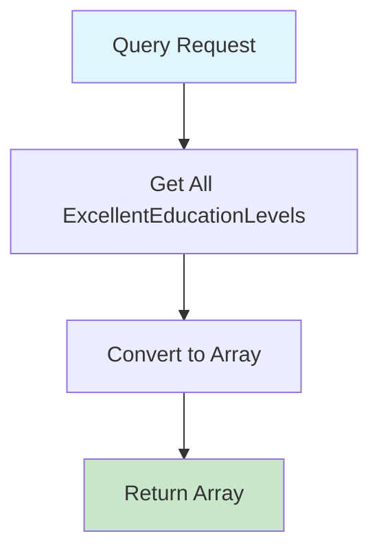

# GetExcellentEducationLevelsQuery.cs

**مسیر**: `Csis.Admission.Application/Features/ExcellentEducationLevels/Queries/GetExcellentEducationLevelsQuery.cs`

## 1. هدف (Purpose)

این Query برای **دریافت لیست سطوح تحصیلی برتری** از دیتابیس استفاده می‌شود.

### کاربرد اصلی:
- Populate کردن Dropdown سطوح تحصیلی برتری
- ثبت برتری تحصیلی دانشجویان
- فیلتر بر اساس سطح تحصیلی

---

## 2. ورودی (Input)

```csharp
public sealed record GetExcellentEducationLevelsQuery : IRequest<ExcellentEducationLevelDto[]>;
```

### پارامترها:
این Query **هیچ پارامتر ورودی ندارد** و تمام سطوح تحصیلی برتری را برمی‌گرداند.

---

## 3. خروجی (Output)

```csharp
ExcellentEducationLevelDto[]
```

---

## 4. وابستگی‌ها (Dependencies)

**Dependencies:**
1. **IRepository<ExcellentEducationLevel,short>**: دسترسی به جدول سطوح تحصیلی برتری

---

## 5. جریان اجرا (Execution Flow)



---

## 6. الگوهای طراحی (Design Patterns)

1. **CQRS Pattern**
2. **Repository Pattern**
3. **DTO Pattern**

---

## 7. عملکرد و بهینه‌سازی (Performance)

### پیشنهاد: Caching
```csharp
// داده‌های Master Data نادراً تغییر می‌کنند
return await _cache.GetOrCreateAsync("excellent_education_levels", async entry => 
{
    entry.AbsoluteExpirationRelativeToNow = TimeSpan.FromHours(24);
    return await _repo.GetAllAsync<ExcellentEducationLevelDto>();
});
```

---

## نتیجه‌گیری

Query ساده **Master Data** برای سطوح تحصیلی برتری.

### نقاط قوت:
✅ ساده و مستقیم  
✅ بدون پارامتر  

### پیشنهاد:
⚠️ افزودن Caching برای بهبود Performance
