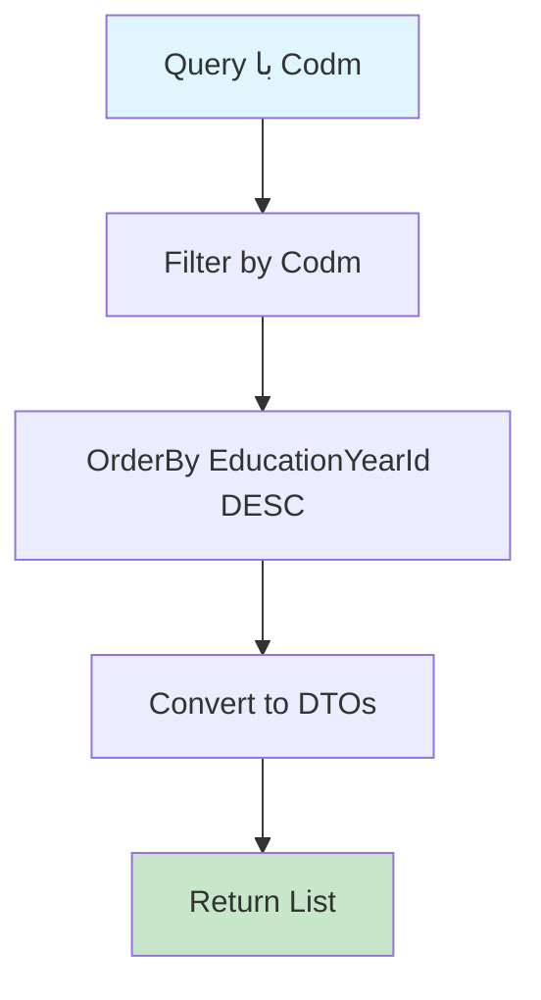

# GetExcellentsByCodmQuery.cs

**مسیر**: `Csis.Admission.Application/Features/Excellents/Queries/GetExcellentsByCodmQuery.cs`

## 1. هدف (Purpose)

این Query برای **دریافت سوابق برتری تحصیلی** دانشجو استفاده می‌شود.

### کاربرد اصلی:
- نمایش برتری‌های تحصیلی دانشجو (رتبه‌های برتر)
- سطح تحصیلی و سال کسب برتری
- محاسبه امتیاز در هدفمندی یارانه
- گزارش‌گیری عملکرد تحصیلی

---

## 2. ورودی (Input)

```csharp
public sealed record GetExcellentsByCodmQuery(int Codm) : IRequest<List<ExcellentDto>>;
```

### پارامترها:
| پارامتر | نوع | اجباری | توضیحات |
|---------|-----|--------|---------|
| `Codm` | `int` | بله | کد ملی دانشجو |

---

## 3. خروجی (Output)

```csharp
List<ExcellentDto>
```

### نمونه:
```json
[
  {
    "id": 1,
    "codm": 123456,
    "educationYearId": 1401,
    "excellentEducationLevelId": 3,
    "rank": 1
  }
]
```

---

## 4. وابستگی‌ها (Dependencies)

**Dependencies:**
1. **IRepository<Excellent>**: دسترسی به جدول برتری‌ها

---

## 5. جریان اجرا (Execution Flow)



---

## 6. قوانین کسب‌وکار (Business Rules)

### BR-1: مرتب‌سازی
- نتایج بر اساس `EducationYearId` به صورت **نزولی** (جدیدترین ابتدا)

### BR-2: فیلتر
- فقط برتری‌های مربوط به Codm دانشجو

---

## 7. الگوهای طراحی (Design Patterns)

1. **CQRS Pattern**
2. **Repository Pattern**
3. **Collection Expressions** (C# 12)
4. **DTO Pattern**

---

## 8. عملکرد و بهینه‌سازی (Performance)

### پیشنهاد:
```csharp
// Index بر روی (Codm, EducationYearId) برای جستجوی سریع
```

---

## 9. Use Cases مرتبط

- **UC-TargetedScores**: محاسبه امتیازات هدفمندی
- نمایش پروفایل دانشجو
- گزارش عملکرد تحصیلی

---

## نتیجه‌گیری

Query برای **مدیریت برترین‌های تحصیلی**.

### نقاط قوت:
✅ لیست رتبه‌های برتر  
✅ مرتب‌سازی بر اساس سال (جدیدترین ابتدا)  
✅ استفاده در امتیازدهی  

### یادآوری:
این سوابق در محاسبه **GetTargetedScoresInfoByCodmQuery** تأثیرگذار هستند.
