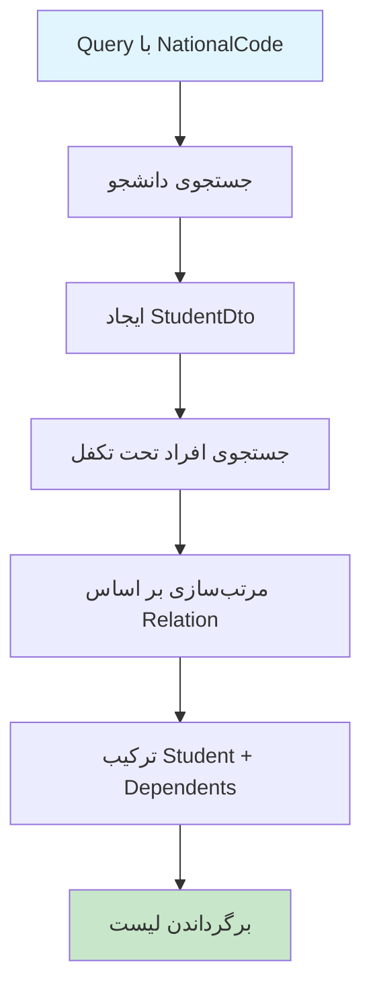

# GetFamilyByNationalCodeQuery.cs

**مسیر**: `Csis.Admission.Application/Features/Family/Queries/GetFamilyByNationalCodeQuery.cs`

## 1. هدف (Purpose)

این Query برای **دریافت اطلاعات خانواده (دانشجو و افراد تحت تکفل)** بر اساس کد ملی استفاده می‌شود. این Query برای سرویس بیمه سلامت استفاده می‌شود.

### کاربرد اصلی:
- دریافت اطلاعات خانواده برای بیمه سلامت
- لیست دانشجو + همسر + فرزندان
- نمایش وضعیت فعال/غیرفعال هر فرد

---

## 2. ورودی (Input)

```csharp
public sealed record GetFamilyByNationalCodeQuery(string NationalCode) : IRequest<List<HealthInsuranceFamilyDto>>;
```

### پارامترها:
| پارامتر | نوع | اجباری | توضیحات |
|---------|-----|--------|---------|
| `NationalCode` | `string` | بله | کد ملی دانشجو (10 رقم) |

---

## 3. خروجی (Output)

```csharp
List<HealthInsuranceFamilyDto>
```

### ساختار DTO:
- `Codm` - کد ملی دانشجو
- `DependentId` - شناسه تکفل (null برای دانشجو)
- `Relation` - نسبت (همسر، فرزند، ...)
- `NationalCode`, `FirstName`, `LastName`, `FatherName`
- `IsActive` - فعال/غیرفعال

---

## 4. جریان اجرا (Execution Flow)



---

## 5. قوانین کسب‌وکار (Business Rules)

### BR-1: دانشجو در ابتدای لیست
- دانشجو با `DependentId = null` در ابتدا

### BR-2: مرتب‌سازی
- بر اساس `Relation` و `RelationOrder`

### BR-3: وضعیت فعال
- دانشجو: `IsActive = !IsBlock`
- افراد تحت تکفل: از جدول

---

## 6. الگوهای طراحی (Design Patterns)

1. **CQRS Pattern**
2. **Repository Pattern**
3. **DTO Pattern**
4. **Collection Expressions** (C# 12): `[.. studentDto, .. dependentDto]`

---

## 7. مثال استفاده (Usage Example)

### از Controller:
```csharp
[HttpGet("family/{nationalCode}")]
public async Task<ActionResult<List<HealthInsuranceFamilyDto>>> GetFamily(string nationalCode)
{
    var query = new GetFamilyByNationalCodeQuery(nationalCode);
    var family = await _mediator.Send(query);
    return Ok(family);
}
```

---

## 8. Command/Query های مرتبط

- `GetFamilyByYektaCodeQuery`: برای غیرایرانیان
- `GetStudentDependentsByStudentCodmQuery`

---

## نتیجه‌گیری

این Query برای **سرویس بیمه سلامت** طراحی شده.

### نقاط قوت:
✅ ترکیب دانشجو و افراد تحت تکفل  
✅ مرتب‌سازی منطقی  
✅ Collection Expressions (C# 12)
