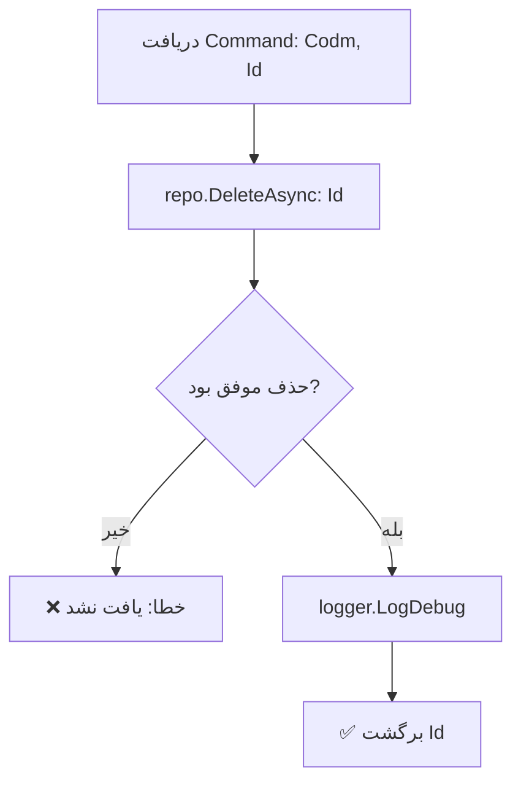

<div dir="rtl">

# DeleteFamousCommand.cs

**مسیر**: `Csis.Admission.Application/Features/Famouses/Commands/DeleteFamousCommand.cs`

---

## 1. Purpose (هدف)

Command **حذف** رکورد طلبه مشهور. این Command برای حذف یک طلبه از لیست مشاهیر استفاده می‌شود.

---

## 2. مستندات XML موجود

```csharp
/// <summary>
/// حذف مشهور با شناسه
/// </summary>
/// <param name="Id">شناسه مشهور</param>
```

**کامل**: توضیح واضح با پارامترها

---

## 3. خلاصه اتفاقات

**جریان اصلی**:
```
1. دریافت Codm و Id
2. حذف رکورد از Repository
3. اگر حذف موفق نبود → خطا
4. Log و برگشت Id
```

---

## 4. اجزای اصلی

### Command:
```csharp
sealed record DeleteFamousCommand(int Codm, int Id) : IRequest<int>
{
    int Codm    // کد مرکز خدمات
    int Id      // شناسه Famous
}
```

### Handler Dependencies:
- **IRepository<Famous>**: دسترسی به داده‌های مشاهیر
- **ILogger**: ثبت لاگ

---

## 5. Flow



---

## 6. Business Rules

### BR-1: حذف فیزیکی
- رکورد به طور **کامل** از دیتابیس حذف می‌شود

### BR-2: Validation در Delete
- بررسی می‌شود که رکورد وجود داشته باشد
- اگر وجود نداشت → Exception واضح

### BR-3: Logging
- حذف موفق در سطح Debug لاگ می‌شود

---

## 7. Dependencies

### Internal:
- `IRepository<Famous>`: عملیات حذف
- `ILogger<DeleteFamousCommandHandler>`: لاگ

---

## 8. Input/Output

### Input:
```csharp
int Codm    // کد مرکز خدمات (استفاده نمی‌شود)
int Id      // شناسه Famous
```

### Output:
```csharp
int Id      // شناسه رکورد حذف شده
```

### Exceptions:
- **CommandValidationException**: "طلبه مشهور با شناسه {Id} یافت نشد."

---

## 9. Side Effects

1. **حذف کامل**: رکورد Famous حذف می‌شود
2. **Logging**: ثبت در لاگ

---

## 10. الگوهای استفاده شده

### ✅ Delete with Validation
```csharp
if (!await repo.DeleteAsync(id)) {
    throw new CommandValidationException("یافت نشد");
}
```

### ✅ Proper Logging
```csharp
logger.LogDebug("Famous with id {id} deleted.", id);
```

---

## 11. Performance

- **Database Operations**: 1 DELETE
- عملیات بسیار ساده و سریع

---

## 12. Security

- ⚠️ **Codm Validation**: `Codm` در Command وجود دارد اما استفاده نمی‌شود
  - بهتر است قبل از حذف، بررسی شود که `Famous.Codm == request.Codm`
- ✅ **Logger استفاده می‌شود**: برخلاف DeleteHouseCommand

---

## 13. نکات مهم

### 💡 بهتر از DeleteHouseCommand
این Command **بهتر** از DeleteHouseCommand است چون:
1. ✅ بررسی می‌کند که رکورد وجود دارد
2. ✅ از Logger استفاده می‌کند
3. ✅ Exception واضح و مفید

### ⚠️ اما هنوز Codm استفاده نمی‌شود
```csharp
// مشکل مشابه:
await repo.DeleteAsync(request.Id)  // Codm بررسی نمی‌شود
```

**پیشنهاد**:
```csharp
var famous = await repo.GetByIdAsync(request.Id);
if (famous == null)
    throw new CommandValidationException($"طلبه مشهور با شناسه {request.Id} یافت نشد");
if (famous.Codm != request.Codm)
    throw new UnauthorizedException();
await repo.DeleteAsync(request.Id);
```

### 🎯 Famous Feature
- Famous احتمالاً برای ثبت طلاب مشهور (معروف) استفاده می‌شود
- دارای Area (محدوده): محلی، ملی، بین‌المللی
- دارای Role (نقش): فقهی، سیاسی، علمی، ...
- دارای Type (نوع): ...

---

## 14. مثال استفاده

```csharp
var cmd = new DeleteFamousCommand(
    Codm: 12345,
    Id: 456
);
var deletedId = await mediator.Send(cmd);
// Output: 456
// Log: "Famous with id 456 deleted."
```

---

## 15. Related Commands

- **CreateFamousCommand**: ایجاد Famous
- **UpdateFamousCommand**: بروزرسانی Famous
- **DeleteFamousRequestCommand**: حذف از طریق Request System

---

## 16. تغییرات پیشنهادی

### 1. افزودن Codm Validation
```csharp
public async Task<int> Handle(DeleteFamousCommand request, CancellationToken cancellationToken)
{
    var famous = await famousRepo.GetByIdAsync(request.Id, cancellationToken);
    
    if (famous == null)
        throw new CommandValidationException($"طلبه مشهور با شناسه {request.Id} یافت نشد");
    
    // بررسی Ownership
    if (famous.Codm != request.Codm)
        throw new UnauthorizedException("شما مجاز به حذف این رکورد نیستید");
    
    await famousRepo.DeleteAsync(request.Id, cancellationToken);
    
    logger.LogDebug("Famous with id {id} deleted for Codm {Codm}", request.Id, request.Codm);
    
    return request.Id;
}
```

### 2. بهبود Log Level
```csharp
// بجای Debug
logger.LogInformation("Famous {Id} deleted for Codm {Codm}", request.Id, request.Codm);
```

---

</div>
