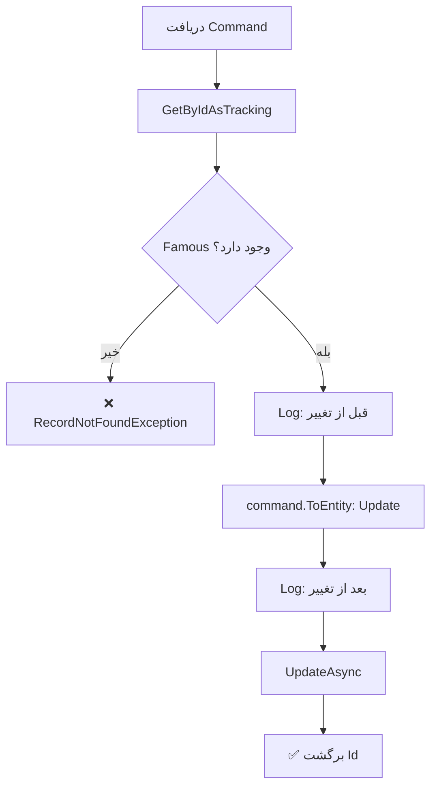

<div dir="rtl">

# UpdateFamousCommand.cs

**مسیر**: `Csis.Admission.Application/Features/Famouses/Commands/UpdateFamousCommand.cs`

---

## 1. Purpose (هدف)

Command **ویرایش** اطلاعات طلبه مشهور. این Command برای بروزرسانی اطلاعات یک طلبه در لیست مشاهیر استفاده می‌شود.

---

## 2. مستندات XML موجود

```csharp
/// <summary>
/// ویرایش مشهور
/// </summary>
```

**کامل**: توضیح واضح

---

## 3. خلاصه اتفاقات

**جریان اصلی**:
```
1. دریافت رکورد Famous بر اساس Id
2. اگر وجود نداشت → خطا
3. Log قبل از تغییر
4. بروزرسانی با اطلاعات جدید
5. Log بعد از تغییر
6. ذخیره در دیتابیس
7. برگشت Id
```

---

## 4. اجزای اصلی

### Command:
```csharp
sealed record UpdateFamousCommand : IRequest<int>
{
    int Id                      // شناسه Famous
    int Codm                    // کد مرکز خدمات
    AreaEnum Area               // محدوده (محلی، ملی، بین‌المللی)
    RoleEnum? Role              // نقش (فقهی، سیاسی، علمی، ...)
    TypeEnum Type               // نوع
}
```

### Handler Dependencies:
- **IRepository<Famous>**: دسترسی به داده‌های مشاهیر
- **ILogger**: ثبت لاگ

---

## 5. Flow



---

## 6. Business Rules

### BR-1: فیلدهای قابل ویرایش
- **Area**: محدوده مشهوریت
- **Role**: نقش (اختیاری)
- **Type**: نوع
- سایر فیلدها (مثل Codm) غیرقابل تغییر در این Command

### BR-2: Detailed Logging
- لاگ کامل قبل و بعد از تغییر
- استفاده از `{@object}` برای Structured Logging
- مفید برای Audit و Debug

### BR-3: Role اختیاری
- `Role` nullable است
- می‌تواند null باشد

---

## 7. Dependencies

### Internal:
- `IRepository<Famous>`: CRUD operations
- `ILogger<UpdateFamousCommandHandler>`: لاگ

---

## 8. Input/Output

### Input:
```csharp
int Id          // شناسه Famous
int Codm        // کد مرکز خدمات
AreaEnum Area   // محدوده
RoleEnum? Role  // نقش (اختیاری)
TypeEnum Type   // نوع
```

### Output:
```csharp
int Id      // شناسه رکورد بروزرسانی شده
```

### Exceptions:
- **RecordNotFoundException<Famous>**: رکورد با Id یافت نشد

---

## 9. Side Effects

1. **Update Famous**: بروزرسانی فیلدها
2. **Audit Log**: ثبت کامل تغییرات در لاگ

---

## 10. الگوهای استفاده شده

### ✅ Detailed Audit Logging
```csharp
logger.LogDebug("Famous with id {id} before update: {@before}", id, famous);
// ... update ...
logger.LogDebug("Famous with id {id} after update: {@after}", id, famous);
```

### ✅ Get-Update Pattern
```csharp
var entity = await repo.GetByIdAsTrackingAsync(id) ?? throw new Exception();
entity = command.ToEntity(entity);
await repo.UpdateAsync(entity);
```

---

## 11. Performance

- **Database Queries**: 1 SELECT + 1 UPDATE
- **Logging**: 2 Debug logs با structured data
- عملیات ساده

---

## 12. Security

- ⚠️ **Codm Validation**: `Codm` در Command هست اما بررسی نمی‌شود
  - آیا Famous.Codm == request.Codm؟
- ✅ **RecordNotFoundException**: استفاده از Generic Exception با Type
- ✅ **Detailed Logging**: برای Audit

---

## 13. نکات مهم

### 💡 Excellent Logging Practice
این Command **نمونه عالی** از Logging است:
```csharp
logger.LogDebug("Famous with id {id} before update: {@before}", id, famous);
logger.LogDebug("Famous with id {id} after update: {@after}", id, famous);
```

مزایا:
- Structured Logging با `{@object}`
- قبل و بعد از تغییر
- مفید برای Debug و Audit
- می‌توان در Serilog/ELK جستجو کرد

### ⚠️ اما Codm بررسی نمی‌شود
```csharp
// مشکل:
var famous = await repo.GetByIdAsTrackingAsync(request.Id);
// بررسی نمی‌شود: famous.Codm == request.Codm
```

### 🎯 Enums Usage
- `AreaEnum`: محلی، ملی، بین‌المللی
- `RoleEnum`: فقهی، سیاسی، علمی، فرهنگی، ...
- `TypeEnum`: ...

---

## 14. مثال استفاده

```csharp
var cmd = new UpdateFamousCommand {
    Id = 123,
    Codm = 12345,
    Area = AreaEnum.National,      // تغییر از محلی به ملی
    Role = RoleEnum.Scientific,
    Type = TypeEnum.Author
};

var id = await mediator.Send(cmd);

// Log:
// "Famous with id 123 before update: { Area: 'Local', ... }"
// "Famous with id 123 after update: { Area: 'National', ... }"
```

---

## 15. Related Commands

- **CreateFamousCommand**: ایجاد Famous
- **DeleteFamousCommand**: حذف Famous
- **UpdateFamousRequestCommand**: بروزرسانی از طریق Request System

---

## 16. تغییرات پیشنهادی

### 1. افزودن Codm Validation
```csharp
public async Task<int> Handle(UpdateFamousCommand request, CancellationToken cancellationToken)
{
    var famous = await famousRepo.GetByIdAsTrackingAsync(request.Id, cancellationToken)
        ?? throw new RecordNotFoundException<Famous>(request.Id);
    
    // بررسی Ownership
    if (famous.Codm != request.Codm)
        throw new UnauthorizedException("شما مجاز به ویرایش این رکورد نیستید");
    
    logger.LogDebug("Famous with id {id} before update: {@before}", request.Id, famous);
    
    famous = request.ToEntity(famous);
    
    logger.LogDebug("Famous with id {id} after update: {@after}", request.Id, famous);
    
    await famousRepo.UpdateAsync(famous, cancellationToken);
    return famous.Id;
}
```

### 2. بهبود Log Level برای Production
```csharp
// برای Production:
logger.LogInformation("Updating Famous {Id} for Codm {Codm}", request.Id, request.Codm);

// Debug logs فقط در Development:
#if DEBUG
logger.LogDebug("Famous before: {@before}", famous);
logger.LogDebug("Famous after: {@after}", famous);
#endif
```

### 3. افزودن Validation
```csharp
if (request.Area == AreaEnum.International && request.Role == null)
    throw new CommandValidationException("برای سطح بین‌المللی، نقش الزامی است");
```

---

</div>
