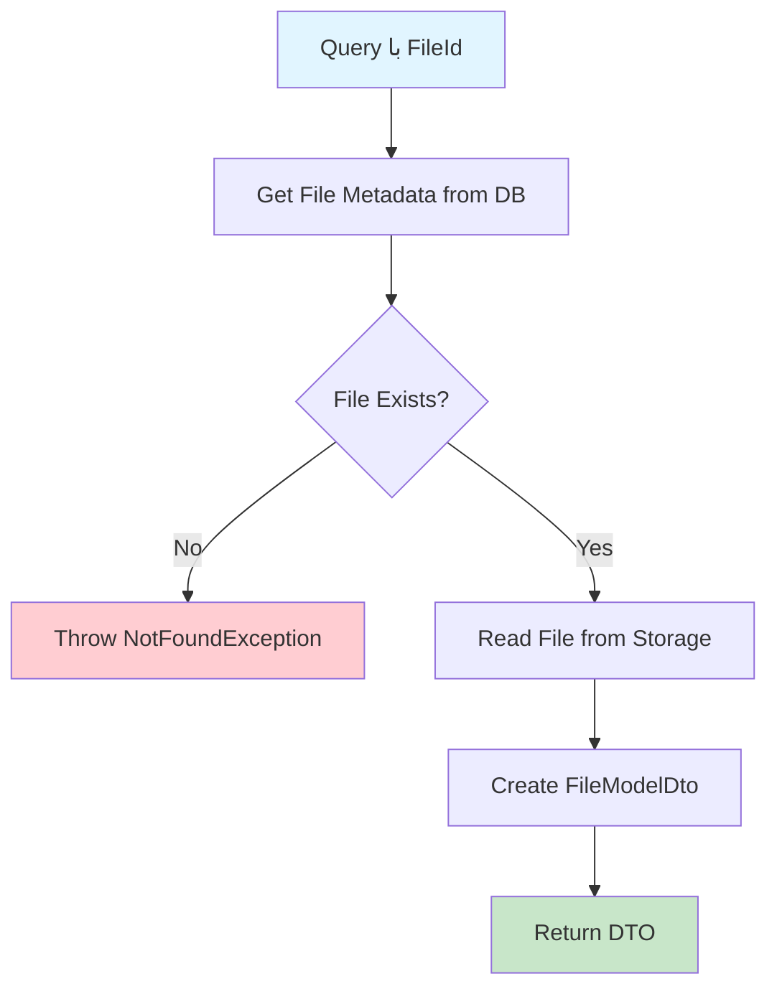

# GetFileQuery.cs

**مسیر**: `Csis.Admission.Application/Features/Files/Queries/GetFileQuery.cs`

## 1. هدف (Purpose)

این Query برای **دریافت محتوای فایل** از سیستم File Storage استفاده می‌شود.

### کاربرد اصلی:
- دانلود فایل‌های آپلود شده
- نمایش تصاویر و مدارک
- دریافت اسناد برای Preview
- Download فایل‌های ضمیمه

---

## 2. ورودی (Input)

```csharp
public sealed record GetFileQuery(Guid FileId) : IRequest<FileModelDto>;
```

### پارامترها:
| پارامتر | نوع | اجباری | توضیحات |
|---------|-----|--------|---------|
| `FileId` | `Guid` | بله | شناسه یکتای فایل |

---

## 3. خروجی (Output)

```csharp
FileModelDto
{
    byte[] Content,
    string FileName,
    string ContentType  // MIME Type
}
```

### نمونه:
```json
{
  "content": "base64_encoded_data...",
  "fileName": "document.pdf",
  "contentType": "application/pdf"
}
```

---

## 4. وابستگی‌ها (Dependencies)

**Dependencies:**
1. **IFileStorageService**: سرویس دسترسی به File Storage
2. **IRepository<FileMetadata>**: متادیتای فایل‌ها

---

## 5. جریان اجرا (Execution Flow)



---

## 6. قوانین کسب‌وکار (Business Rules)

### BR-1: فایل موجود
- اگر FileId وجود نداشته باشد، NotFoundException

### BR-2: دسترسی
- بررسی مجوز دسترسی به فایل (بر اساس Owner)

---

## 7. الگوهای طراحی (Design Patterns)

1. **CQRS Pattern**
2. **Repository Pattern**
3. **File Storage Pattern**

---

## 8. عملکرد و بهینه‌سازی (Performance)

### توجه به حجم:
```csharp
// برای فایل‌های بزرگ از Streaming استفاده شود
// محدودیت حداکثر حجم فایل
```

---

## 9. امنیت (Security)

⚠️ **مهم**: بررسی مجوز دسترسی کاربر به فایل  
⚠️ اعتبارسنجی FileId برای جلوگیری از Path Traversal

---

## 10. Use Cases مرتبط

- دانلود مدارک دانشجویی
- نمایش تصویر پروفایل
- Preview اسناد

---

## نتیجه‌گیری

Query **دریافت فایل از Storage**.

### نقاط قوت:
✅ دریافت Binary Content  
✅ شامل MIME Type  

### امنیت:
⚠️ بررسی مجوز دسترسی ضروری است
