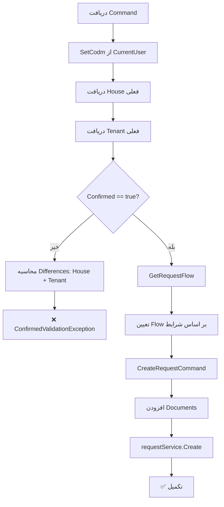

<div dir="rtl">

# CreateOrUpdateHouseRequestCommand.cs

**مسیر**: `Csis.Admission.Application/Features/Houses/Commands/CreateOrUpdateHouseRequestCommand.cs`

---

## 1. Purpose (هدف)

Command **ایجاد/بروزرسانی درخواست** اطلاعات مسکن دانشجو از طریق سیستم درخواست‌ها. این Command برای ثبت یا تغییر اطلاعات مسکن با گذراندن فرآیند تایید استفاده می‌شود.

---

## 2. مستندات XML موجود

```csharp
/// <summary>
/// ایجاد درخواست مسکن طلبه
/// </summary>
```

**کامل**: توضیح واضح

---

## 3. خلاصه اتفاقات

**جریان اصلی**:
```
1. Set Codm از CurrentUser
2. دریافت House و Tenant فعلی
3. اگر Confirmed != true:
   - محاسبه تفاوت‌ها (House + Tenant)
   - پرتاب ConfirmedValidationException
4. اگر Confirmed == true:
   - تعیین RequestFlow بر اساس شرایط
   - ایجاد CreateRequestCommand
   - افزودن Documents
   - ثبت درخواست
```

---

## 4. اجزای اصلی

### Command:
```csharp
sealed record CreateOrUpdateHouseRequestCommand : IRequest
{
    int Codm                                    // کد مرکز خدمات
    HouseStatus HouseStatus                     // وضعیت سکونت
    HouseStatusItem? HouseStatusItem            // جزئیات وضعیت
    string HouseStatusItemDesc                  // توضیح سایر
    bool? HasHouse                              // خانه شخصی
    bool? HasLand                               // زمین شخصی
    bool? LiveInCell                            // حجره/خوابگاه
    TenantDto? Tenant                           // اطلاعات اجاره
    RequestDocumentDto[] Documents              // مدارک پیوست
    bool? Confirmed                             // تایید کاربر
}
```

### Handler Dependencies:
- **IRepository<House>**: دسترسی به داده‌های مسکن
- **IRepository<Tenant>**: دسترسی به داده‌های اجاره
- **IRequestService**: سرویس مدیریت درخواست‌ها
- **ICurrentUserService**: اطلاعات کاربر جاری

---

## 5. Flow



---

## 6. Business Rules

### BR-1: Two-Step Confirmation
- کاربر ابتدا با `Confirmed=false/null` فراخوانی می‌کند
- سیستم تفاوت‌های House و Tenant را نمایش می‌دهد
- کاربر با مشاهده تفاوت‌ها، با `Confirmed=true` تایید می‌کند

### BR-2: Complex Request Flow
- جریان درخواست توسط `RequestFlowHelper.DetermineRequestFlowAsync` تعیین می‌شود
- بر اساس موارد زیر:
  - `HouseStatus` جدید
  - `HouseStatus` قدیمی (اگر وجود داشته باشد)
  - نقش کاربر (Student, Employee, Senior)
  - نوع مدارک آپلود شده

### BR-3: Dual Entity Management
- هم **House** و هم **Tenant** مدیریت می‌شوند
- تفاوت‌های هر دو محاسبه و نمایش داده می‌شود

### BR-4: Document Attachment
- مدارک می‌توانند به درخواست پیوست شوند
- نوع مدارک در تعیین Flow تأثیر دارد

---

## 7. Dependencies

### Internal:
- `IRepository<House>`: مدیریت مسکن
- `IRepository<Tenant>`: مدیریت اجاره
- `IRequestService`: مدیریت درخواست‌ها
- `ICurrentUserService`: احراز هویت

### External:
- **RequestFlowHelper**: تعیین جریان درخواست
- **Request System**: سیستم مدیریت درخواست‌ها

---

## 8. Input/Output

### Input:
```csharp
int Codm
HouseStatus HouseStatus             // Personal, Supportive, Rental
HouseStatusItem? HouseStatusItem    // Organizational, Paternal, Spouse's, Other
string HouseStatusItemDesc
bool? HasHouse
bool? HasLand
bool? LiveInCell
TenantDto? Tenant {
    // اطلاعات اجاره
}
RequestDocumentDto[] Documents
bool? Confirmed
```

### Output:
```csharp
void (Task)
```

### Exceptions:
- **ConfirmedValidationException**: کاربر باید تفاوت‌ها را تایید کند

---

## 9. Side Effects

1. **ایجاد درخواست**: در جدول Requests
2. **پیوست مدارک**: اگر Documents داشته باشد
3. **تغییر House و Tenant**: پس از تایید درخواست

---

## 10. الگوهای استفاده شده

### ✅ Two-Step Confirmation Pattern
```csharp
if (Confirmed != true) {
    var differences = GetDifferences(old, new);
    throw new ConfirmedValidationException(differences);
}
```

### ✅ Complex Request Flow Determination
```csharp
var flow = await RequestFlowHelper.DetermineRequestFlowAsync(
    newStatus, oldStatus, isStudent, isEmployee, isSenior, fileTypes);
```

### ✅ Dual Entity Management
- محاسبه تفاوت برای هر دو House و Tenant
- مدیریت همزمان دو Entity مرتبط

---

## 11. Performance

- **Database Queries**: 2 SELECT (House + Tenant)
- **Request Creation**: 1 INSERT در جدول Requests
- عملیات نسبتاً سریع

---

## 12. Security

- ✅ **Authorization**: استفاده از Codm از CurrentUser
- ✅ **Two-Step Confirmation**: جلوگیری از تغییرات ناخواسته
- ✅ **Document Validation**: نوع مدارک در Flow تأثیر دارد
- ⚠️ **File Validation**: نیاز به بررسی اعتبار Documents

---

## 13. نکات مهم

### 💡 Sophisticated Flow Determination
```csharp
await RequestFlowHelper.DetermineRequestFlowAsync(
    request.HouseStatus, 
    house?.HouseStatus, 
    isStudent, 
    isEmployee, 
    isSeniorPersonnel, 
    fileUploadTypes
);
```
- منطق پیچیده برای تعیین جریان
- بر اساس 6 پارامتر مختلف
- احتمالاً شامل قوانین کسب‌وکار متعدد

### ⚠️ Tenant Management
- `Tenant` می‌تواند null باشد (برای مسکن شخصی)
- تفاوت‌های Tenant هم محاسبه می‌شود
```csharp
differences.AddRange(GetDifferences(tenant, command.Tenant?.ToEntity()));
```

### 🎯 Complex Use Case
این Command یکی از پیچیده‌ترین Command های سیستم است چون:
1. دو Entity را مدیریت می‌کند (House + Tenant)
2. جریان پیچیده‌ای دارد
3. مدارک پیوست دارد
4. Two-Step Confirmation

---

## 14. مثال استفاده

### سناریو 1: تغییر از شخصی به اجاره‌ای
```csharp
// Step 1: دریافت تفاوت‌ها
var cmd = new CreateOrUpdateHouseRequestCommand {
    Codm = 12345,
    HouseStatus = HouseStatus.Rental,  // قبلاً Personal بود
    Tenant = new TenantDto {
        MonthlyRent = 5000000,
        RentalPeriod = 12,
        // ...
    },
    Documents = [ /* مدارک اجاره */ ],
    Confirmed = null
};
// Exception: ConfirmedValidationException با لیست تفاوت‌ها

// Step 2: تایید
cmd.Confirmed = true;
await mediator.Send(cmd);
```

### سناریو 2: Senior مستقیم ثبت می‌کند
```csharp
var cmd = new CreateOrUpdateHouseRequestCommand {
    Codm = 12345,
    HouseStatus = HouseStatus.Supportive,
    HouseStatusItem = HouseStatusItem.Organizational,
    Confirmed = true
};
await mediator.Send(cmd);  // Direct Registration (احتمالاً)
```

---

## 15. Related Commands

- **CreateOrUpdateHouseCommand**: ثبت مستقیم (بدون Request System)
- **DeleteHouseRequestCommand**: حذف از طریق Request
- **CreateOrUpdateHouseEmployeeRequestCommand**: نسخه کارمند

---

## 16. تغییرات پیشنهادی

### 1. افزودن Validation
```csharp
if (command.HouseStatus == HouseStatus.Rental && command.Tenant == null)
    throw new CommandValidationException("برای مسکن اجاره‌ای، اطلاعات اجاره الزامی است");

if (command.HouseStatusItem == HouseStatusItem.Other && 
    string.IsNullOrWhiteSpace(command.HouseStatusItemDesc))
    throw new CommandValidationException("برای سایر، توضیحات الزامی است");
```

### 2. بهبود Document Validation
```csharp
foreach (var doc in command.Documents) {
    if (!await fileService.ValidateFile(doc.FileId))
        throw new CommandValidationException($"فایل {doc.FileId} نامعتبر است");
}
```

### 3. Extract Complex Logic
```csharp
// منطق GetRequestFlow بسیار پیچیده است
// بهتر است در یک Service جداگانه باشد
private readonly IHousingRequestFlowService _flowService;

var flow = await _flowService.DetermineFlow(command, house, currentUser);
```

### 4. افزودن Logging
```csharp
logger.LogInformation(
    "House request created: Codm={Codm}, Status={Status}, Flow={Flow}",
    command.Codm, command.HouseStatus, flow
);
```

---

</div>
