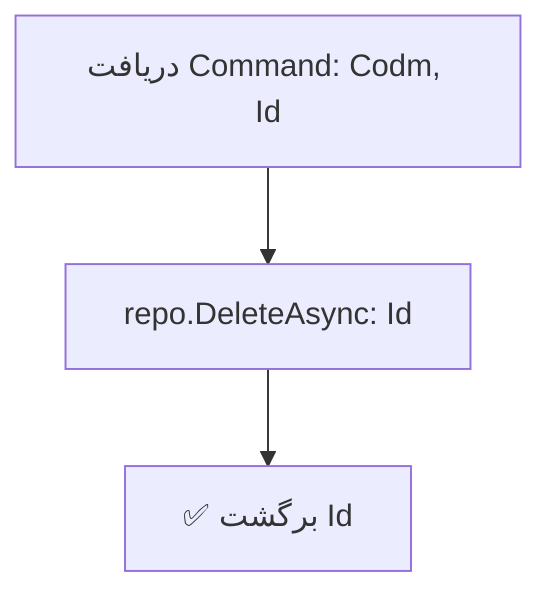

<div dir="rtl">

# DeleteHouseCommand.cs

**مسیر**: `Csis.Admission.Application/Features/Houses/Commands/DeleteHouseCommand.cs`

---

## 1. Purpose (هدف)

Command **حذف** اطلاعات مسکن دانشجو. این Command برای حذف کامل یک رکورد مسکن از سیستم استفاده می‌شود.

---

## 2. مستندات XML موجود

```csharp
/// <summary>
/// حذف اطلاعات مسکن
/// </summary>
/// <param name="Codm">کد مرکز خدمات</param>
/// <param name="Id">شناسه مسکن</param>
```

**کامل**: توضیح واضح با پارامترها

---

## 3. خلاصه اتفاقات

**جریان اصلی**:
```
1. دریافت Codm و Id
2. حذف رکورد از Repository
3. برگشت Id حذف شده
```

---

## 4. اجزای اصلی

### Command:
```csharp
sealed record DeleteHouseCommand(int Codm, int Id) : IRequest<int>
{
    int Codm    // کد مرکز خدمات
    int Id      // شناسه مسکن
}
```

### Handler Dependencies:
- **IRepository<House>**: دسترسی به داده‌های مسکن
- **ILogger**: ثبت لاگ

---

## 5. Flow



---

## 6. Business Rules

### BR-1: حذف فیزیکی
- رکورد به طور **کامل** از دیتابیس حذف می‌شود
- **نه** Soft Delete

### BR-2: شناسه محوری
- حذف بر اساس `Id` انجام می‌شود
- `Codm` در Command وجود دارد اما در حذف استفاده نمی‌شود ⚠️

---

## 7. Dependencies

### Internal:
- `IRepository<House>`: عملیات حذف
- `ILogger<DeleteHouseCommandHandler>`: لاگ

---

## 8. Input/Output

### Input:
```csharp
int Codm    // کد مرکز خدمات (استفاده نمی‌شود)
int Id      // شناسه مسکن
```

### Output:
```csharp
int Id      // شناسه رکورد حذف شده
```

### Exceptions:
- **RecordNotFoundException**: اگر Id وجود نداشته باشد (از Repository)

---

## 9. Side Effects

1. **حذف کامل**: رکورد House حذف می‌شود
2. **Cascade**: اگر FK Constraints داشته باشد، ممکن است خطا دهد یا رکوردهای مرتبط حذف شوند

---

## 10. الگوهای استفاده شده

### ✅ Simple Delete Pattern
```csharp
await repo.DeleteAsync(id, cancellationToken);
```

---

## 11. Performance

- **Database Operations**: 1 DELETE
- عملیات بسیار ساده و سریع

---

## 12. Security

- ⚠️ **Authorization**: نیاز به بررسی اینکه آیا کاربر مجاز به حذف این رکورد است
- ⚠️ **Codm Validation**: `Codm` در Command وجود دارد اما استفاده نمی‌شود
  - بهتر است قبل از حذف، بررسی شود که `House.Codm == request.Codm`
- ⚠️ **Logger استفاده نشده**: Logger تزریق شده اما استفاده نمی‌شود

---

## 13. نکات مهم

### ⚠️ مشکل امنیتی بالقوه (مشابه DeleteStudentEmploymentCommand)
```csharp
// کد فعلی:
await repo.DeleteAsync(request.Id, ...)

// پیشنهاد:
var house = await repo.GetByIdAsync(request.Id);
if (house == null)
    throw new RecordNotFoundException("مسکن یافت نشد");
if (house.Codm != request.Codm)
    throw new UnauthorizedException();
await repo.DeleteAsync(request.Id);
```

### 💡 Codm استفاده نمی‌شود
- `Codm` در Command تعریف شده اما در Handler استفاده نشده
- احتمالاً برای Authorization در Controller استفاده می‌شود

### 🎯 Hard Delete
- این Command حذف فیزیکی انجام می‌دهد
- اگر نیاز به Audit Trail است، باید Soft Delete پیاده شود

### ⚠️ Logger بی‌استفاده
- Logger تزریق شده اما هیچگاه فراخوانی نمی‌شود
- یا باید استفاده شود یا حذف شود

---

## 14. مثال استفاده

```csharp
var cmd = new DeleteHouseCommand(
    Codm: 12345,
    Id: 789
);
var deletedId = await mediator.Send(cmd);
// Output: 789
```

---

## 15. Related Commands

- **CreateOrUpdateHouseCommand**: ایجاد/بروزرسانی
- **DeleteHouseRequestCommand**: حذف از طریق Request System
- **CreateOrUpdateHouseRequestCommand**: درخواست تغییر مسکن

---

## 16. تغییرات پیشنهادی

### 1. ⚠️ بحرانی: افزودن Validation
```csharp
public async Task<int> Handle(DeleteHouseCommand request, CancellationToken cancellationToken)
{
    var house = await houseRepository.GetByIdAsync(request.Id, cancellationToken);
    
    if (house == null)
        throw new RecordNotFoundException("مسکن یافت نشد");
    
    // بررسی تطابق Codm
    if (house.Codm != request.Codm)
        throw new UnauthorizedException("شما مجاز به حذف این رکورد نیستید");
    
    await houseRepository.DeleteAsync(request.Id, cancellationToken);
    
    logger.LogInformation("House {Id} deleted for Codm {Codm}", 
        request.Id, request.Codm);
    
    return request.Id;
}
```

### 2. استفاده از Logger یا حذف آن
```csharp
// اگر استفاده می‌شود:
logger.LogInformation("Deleting house {Id} for Codm {Codm}", request.Id, request.Codm);
await repo.DeleteAsync(request.Id);
logger.LogInformation("House {Id} deleted successfully", request.Id);

// یا اگر استفاده نمی‌شود:
internal sealed class DeleteHouseCommandHandler(
    IRepository<House> houseRepository)  // حذف ILogger
    : IRequestHandler<DeleteHouseCommand, int>
```

### 3. Soft Delete (اختیاری)
```csharp
// برای حفظ Audit Trail
house.IsDeleted = true;
house.DeletedOn = DateTime.Now;
house.DeletedBy = currentUserId;
await repo.UpdateAsync(house);
```

---

</div>
