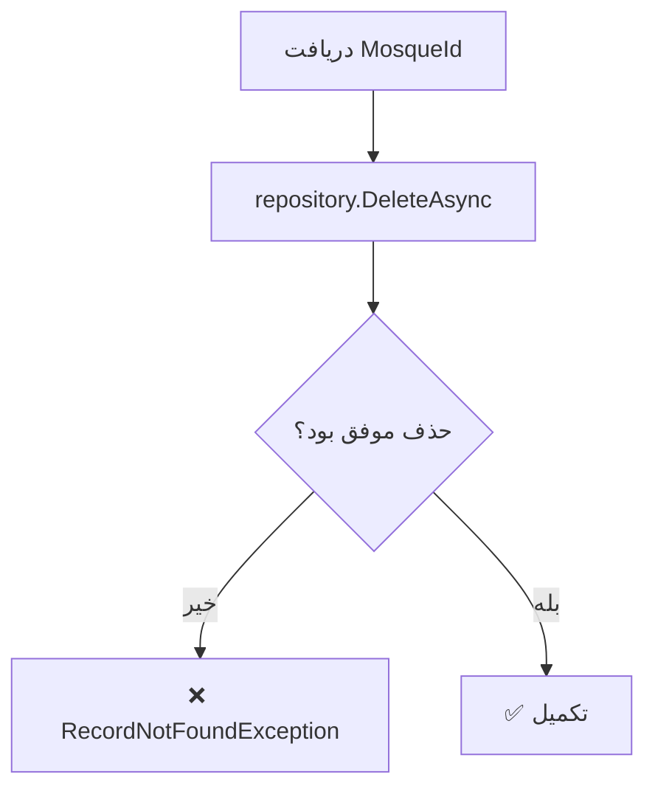

<div dir="rtl">

# DeleteMosqueCommand.cs

**مسیر**: `Csis.Admission.Application/Features/ImamJamaat/Commands/DeleteMosqueCommand.cs`

---

## 1. Purpose (هدف)

Command **حذف مسجد**. این Command برای حذف اطلاعات مسجد از سیستم استفاده می‌شود.

---

## 2. مستندات XML موجود

**فقدان**: هیچ XML documentation موجود نیست

---

## 3. خلاصه اتفاقات

**جریان اصلی**:
```
1. دریافت MosqueId
2. حذف رکورد از Repository
3. اگر حذف موفق نبود → خطا
4. تکمیل
```

---

## 4. اجزای اصلی

### Command:
```csharp
sealed record DeleteMosqueCommand(int MosqueId) : IRequest
{
    int MosqueId    // شناسه مسجد
}
```

### Handler Dependencies:
- **IRepository<Mosque>**: دسترسی به داده‌های مسجد

---

## 5. Flow



---

## 6. Business Rules

### BR-1: حذف فیزیکی
- رکورد **به طور کامل** از دیتابیس حذف می‌شود
- نه Soft Delete

### BR-2: Validation
- بررسی می‌شود رکورد وجود داشته باشد
- اگر وجود نداشت → Exception

---

## 7. Dependencies

### Internal:
- `IRepository<Mosque>`: عملیات حذف

---

## 8. Input/Output

### Input:
```csharp
int MosqueId    // شناسه مسجد
```

### Output:
```csharp
void (Task)
```

### Exceptions:
- **RecordNotFoundException<Mosque>**: رکورد با MosqueId یافت نشد

---

## 9. Side Effects

1. **حذف کامل**: رکورد Mosque از دیتابیس حذف می‌شود
2. **Cascade Delete**: احتمالاً رکوردهای مرتبط (ImamJamaat) هم حذف می‌شوند

---

## 10. الگوهای استفاده شده

### ✅ Delete with Validation
```csharp
if (!await repository.DeleteAsync(id)) {
    throw new RecordNotFoundException<Mosque>(id);
}
```
- بررسی موفقیت Delete
- Exception واضح

### ✅ Record-based Command
```csharp
public sealed record DeleteMosqueCommand(int MosqueId) : IRequest;
```
- استفاده از Primary Constructor

---

## 11. Performance

- **Database Operations**: 1 DELETE (احتمالاً با Cascade)
- عملیات ساده

---

## 12. Security

- ⚠️ **فقدان Authorization**: هیچ بررسی Ownership نمی‌شود
- ⚠️ **فقدان Logging**: حذف لاگ نمی‌شود
- ✅ **Validation**: بررسی وجود رکورد

---

## 13. نکات مهم

### 💡 الگوی خوب Delete
این Command از الگوی خوب Delete استفاده می‌کند:
- ✅ بررسی موفقیت
- ✅ Exception واضح
- ✅ Generic RecordNotFoundException

### ⚠️ مشکل: فقدان Authorization
```csharp
// مشکل: هیچ بررسی نمی‌شود
await repository.DeleteAsync(request.MosqueId);
// کسی می‌تواند هر مسجدی را حذف کند
```

### ⚠️ Cascade Delete Risk
- احتمالاً رکوردهای ImamJamaat مرتبط هم حذف می‌شوند
- ممکن است غیرمنتظره باشد

### 🎯 ImamJamaat Feature
- برای مدیریت امامت جماعت طلاب
- مساجدی که طلاب در آن امامت دارند
- احتمالاً امتیاز و مزایا دارد

---

## 14. مثال استفاده

```csharp
var cmd = new DeleteMosqueCommand(MosqueId: 123);

await mediator.Send(cmd);
// اگر موفق → void
// اگر ناموفق → RecordNotFoundException<Mosque>
```

---

## 15. Related Commands

- **CreateMosqueWithDetailsCommand**: ایجاد مسجد
- **UpdateMosqueWithDetailsCommand**: بروزرسانی مسجد
- **CreateMosqueWithDetailsStudentCommand**: ایجاد مسجد برای طلبه

---

## 16. تغییرات پیشنهادی

### 1. افزودن Authorization
```csharp
public async Task Handle(DeleteMosqueCommand request, ...)
{
    var mosque = await _repository.GetByIdAsync(request.MosqueId, ...);
    
    if (mosque == null)
        throw new RecordNotFoundException<Mosque>(request.MosqueId);
    
    // بررسی Ownership
    if (mosque.CreatedBy != currentUserId && !currentUser.IsAdmin)
        throw new UnauthorizedException("شما مجاز به حذف این مسجد نیستید");
    
    await _repository.DeleteAsync(request.MosqueId, cancellationToken);
}
```

### 2. افزودن Logging
```csharp
private readonly ILogger<DeleteMosqueCommandHandler> _logger;

public async Task Handle(...)
{
    if (!await _repository.DeleteAsync(request.MosqueId, ...)) {
        throw new RecordNotFoundException<Mosque>(request.MosqueId);
    }
    
    _logger.LogInformation("Mosque {MosqueId} deleted", request.MosqueId);
}
```

### 3. افزودن XML Documentation
```csharp
/// <summary>
/// حذف اطلاعات مسجد
/// </summary>
/// <param name="MosqueId">شناسه مسجد</param>
public sealed record DeleteMosqueCommand(int MosqueId) : IRequest;
```

### 4. بررسی ImamJamaat های مرتبط
```csharp
public async Task Handle(...)
{
    var mosque = await _repository.GetByIdAsync(...);
    if (mosque == null)
        throw new RecordNotFoundException<Mosque>(...);
    
    // بررسی وجود ImamJamaat مرتبط
    var hasActiveImamJamaat = await _imamJamaatRepo
        .AnyAsync(x => x.MosqueId == request.MosqueId && x.IsActive);
    
    if (hasActiveImamJamaat)
        throw new CommandValidationException(
            "این مسجد دارای امامت جماعت فعال است و نمی‌توان آن را حذف کرد");
    
    await _repository.DeleteAsync(request.MosqueId, ...);
}
```

---

</div>
