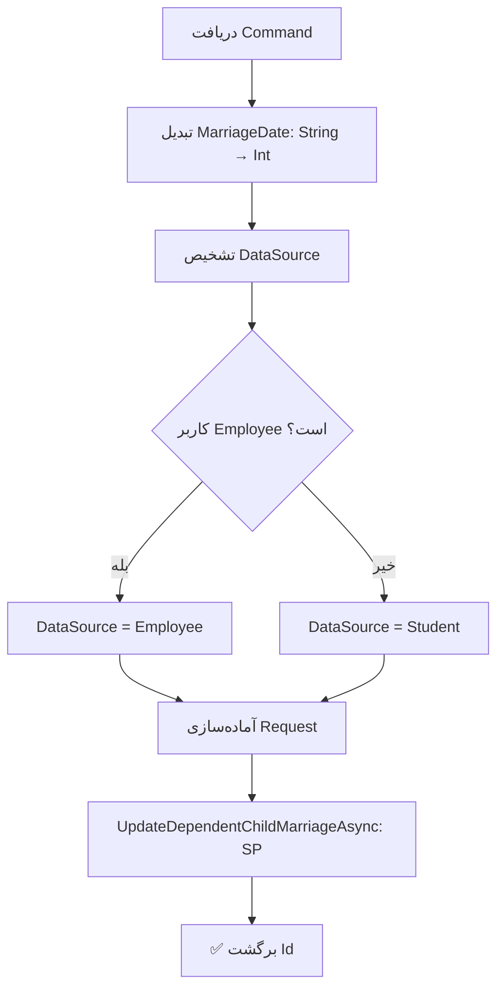

<div dir="rtl">

# UpdateChildMarriageCommand.cs

**مسیر**: `Csis.Admission.Application/Features/Marriages/Commands/UpdateChildMarriageCommand.cs`

---

## 1. Purpose (هدف)

Command **ثبت ازدواج فرزند** (فرد تحت تکفل) دانشجو. این Command برای ثبت رویداد ازدواج فرزندان دانشجو استفاده می‌شود که می‌تواند تأثیری بر وضعیت تکفل و خدمات داشته باشد.

---

## 2. مستندات XML موجود

```csharp
/// <summary>
/// ثبت ازدواج تکفل
/// </summary>
```

**کامل**: توضیحات کافی دارد

---

## 3. خلاصه اتفاقات

**جریان اصلی**:
```
1. دریافت اطلاعات ازدواج (Codm, DependentId, MarriageDate)
2. تبدیل MarriageDate از String به Int
3. تشخیص DataSource (Employee یا Student)
4. فراخوانی Stored Procedure برای ثبت ازدواج
5. برگشت Id
```

---

## 4. اجزای اصلی

### Command:
```csharp
sealed record UpdateChildMarriageCommand : IRequest<long>
{
    int Codm                // کد مرکز خدمات
    long DependentId        // شناسه فرد تحت تکفل
    string MarriageDate     // تاریخ ازدواج (فرمت String)
}
```

### Handler Dependencies:
- **IStudentDependentRepository**: دسترسی به Stored Procedure
- **ICurrentUserService**: تشخیص نوع کاربر

---

## 5. Flow



---

## 6. Business Rules

### BR-1: ثبت از طریق Stored Procedure
- منطق کامل ثبت ازدواج در **SP** پیاده‌سازی شده
- Command فقط wrapper است

### BR-2: DataSource
- اگر کاربر کارمند باشد → `DataSource.Employee`
- اگر کاربر دانشجو باشد → `DataSource.Student`
- این اطلاعات برای Audit و تشخیص منبع تغییر استفاده می‌شود

### BR-3: Date Format
- `MarriageDate` به فرمت String دریافت می‌شود
- با `StringDateToInt()` به Int تبدیل می‌شود (احتمالاً YYYYMMDD)

---

## 7. Dependencies

### Internal:
- `IStudentDependentRepository`: فراخوانی SP
- `ICurrentUserService`: اطلاعات کاربر

### External:
- **Stored Procedure**: `UpdateDependentChildMarriage`

---

## 8. Input/Output

### Input:
```csharp
int Codm                // کد مرکز خدمات
long DependentId        // شناسه فرزند
string MarriageDate     // تاریخ ازدواج (مثلاً "1402/10/15")
```

### Output:
```csharp
long Id     // شناسه رکورد ازدواج ثبت شده
```

### Exceptions:
- Exception ها از SP می‌آیند (مثلاً Invalid DependentId)

---

## 9. Side Effects

1. **ثبت رویداد ازدواج**: در جدول مربوطه
2. **تغییر وضعیت تکفل**: ممکن است فرزند دیگر تحت تکفل نباشد
3. **تأثیر بر خدمات**: احتمال تغییر خدمات قابل دریافت

---

## 10. الگوهای استفاده شده

### ✅ Stored Procedure Pattern
```csharp
var request = new UpdateDependentMarriagePrcRequest { ... };
var result = await repo.UpdateDependentChildMarriageAsync(request);
```

### ✅ DataSource Tracking
- ثبت اینکه تغییر توسط کارمند یا دانشجو انجام شده

---

## 11. Performance

- **Database Operations**: 1 SP Call
- SP احتمالاً شامل چندین Query/Update است

---

## 12. Security

- ⚠️ **Authorization**: بررسی نمی‌شود که آیا Dependent متعلق به Codm است
- ⚠️ **Validation**: فاقد Validation برای DependentId و MarriageDate

---

## 13. نکات مهم

### ⚠️ UserId همیشه 1
```csharp
UserId = 1,  // ⚠️ هاردکد شده
```
- باید از `currentUserService.GetUserIdAsync()` استفاده شود
- این یک **باگ** احتمالی است

### 💡 Stored Procedure محوری
- تمام منطق کسب‌وکار در SP است
- این Command فقط یک wrapper ساده است
- برای درک کامل، باید SP مطالعه شود

### 🎯 Use Case
- فرزند دانشجو ازدواج می‌کند
- دانشجو یا کارمند این اطلاعات را ثبت می‌کند
- سیستم ممکن است:
  - فرزند را از لیست تکفل خارج کند
  - خدمات مربوط به فرزند را قطع کند
  - اعلان ارسال کند

---

## 14. مثال استفاده

```csharp
// ثبت ازدواج فرزند دانشجو
var cmd = new UpdateChildMarriageCommand {
    Codm = 12345,
    DependentId = 999,
    MarriageDate = "1402/10/15"
};
var marriageId = await mediator.Send(cmd);

// نتیجه: رویداد ازدواج برای فرزند 999 ثبت می‌شود
```

---

## 15. Related Commands

- **UpdateStudentSisterMarriageCommand**: ازدواج خواهر طلبه (مرد)
- **CreatePersonMarriageCommand**: ایجاد ازدواج عمومی
- **Divorce Commands**: ثبت طلاق

---

## 16. تغییرات پیشنهادی

### 1. رفع باگ UserId
```csharp
var userId = await currentUserService.GetUserIdAsync();
var marriageRequest = new UpdateDependentMarriagePrcRequest {
    Codm = command.Codm,
    DependentId = command.DependentId,
    MarriageDate = command.MarriageDate.StringDateToInt().Value,
    UserId = userId ?? 1,  // بجای هاردکد 1
    DataSource = userId != null ? DataSource.Employee : DataSource.Student
};
```

### 2. افزودن Validation
```csharp
// بررسی معتبر بودن DependentId
var dependent = await dependentRepo.GetByIdAsync(command.DependentId)
    ?? throw new CommandValidationException("فرد تحت تکفل یافت نشد");

// بررسی Ownership
if (dependent.Codm != command.Codm)
    throw new UnauthorizedException();

// بررسی نوع رابطه (فقط فرزند)
if (dependent.Relation != DependentRelation.Child)
    throw new CommandValidationException("فقط برای فرزندان قابل ثبت است");
```

### 3. بهبود Date Handling
```csharp
// بجای string
public DateOnly MarriageDate { get; init; }
```

### 4. استفاده از Request System
- برای تغییرات مهم مانند ازدواج، بهتر است از Request System استفاده شود
- تا فرآیند تایید انجام شود

---

</div>
