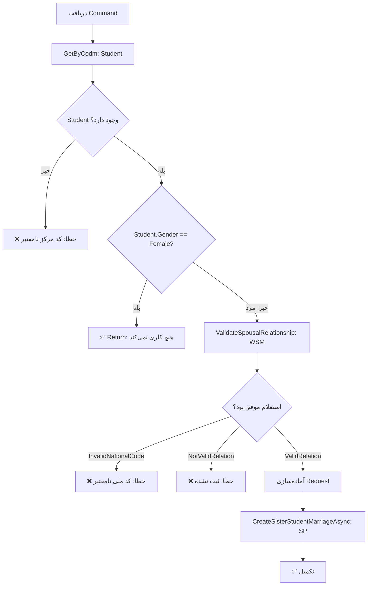

<div dir="rtl">

# UpdateStudentSisterMarriageCommand.cs

**مسیر**: `Csis.Admission.Application/Features/Marriages/Commands/UpdateStudentSisterMarriageCommand.cs`

---

## 1. Purpose (هدف)

Command **ثبت ازدواج خواهر طلبه** (دانشجوی مرد). این Command برای ثبت رویداد ازدواج خواهر دانشجو که ممکن است تأثیری بر وضعیت تکفل و خدمات داشته باشد، استفاده می‌شود.

---

## 2. مستندات XML موجود

```csharp
/// <summary>ثبت ازدواج طلبه خواهر</summary>
```

**کامل**: واضح و مختصر

---

## 3. خلاصه اتفاقات

**جریان اصلی**:
```
1. دریافت اطلاعات دانشجو
2. بررسی جنسیت:
   - اگر زن باشد → هیچ کاری نمی‌کند (فقط برای مردان)
   - اگر مرد باشد:
     - استعلام از ثبت احوال برای اعتبارسنجی ازدواج
     - فراخوانی SP برای ثبت ازدواج خواهر
```

---

## 4. اجزای اصلی

### Command:
```csharp
sealed record UpdateStudentSisterMarriageCommand : IRequest
{
    int Codm                        // کد مرکز خدمات
    string MarriageDate             // تاریخ ازدواج
    string SpouseNationalCode       // کد ملی همسر
    string SpouseBirthDate          // تاریخ تولد همسر
}
```

### Handler Dependencies:
- **ICsisWsmService**: استعلام از ثبت احوال
- **IStudentRepository**: دریافت اطلاعات دانشجو
- **IStudentDependentRepository**: فراخوانی SP
- **IRepository<DependentSummary>**: (تزریق شده اما استفاده نشده)

---

## 5. Flow



---

## 6. Business Rules

### BR-1: فقط برای طلبه مرد
- این Command **فقط** برای دانشجویان **مرد** قابل اجرا است
- برای دانشجویان زن هیچ عملی انجام نمی‌شود

### BR-2: اعتبارسنجی از ثبت احوال
- قبل از ثبت، **الزاماً** باید از ثبت احوال استعلام شود
- اطلاعات زیر بررسی می‌شود:
  - کد ملی همسر
  - تاریخ تولد همسر
  - تاریخ ازدواج
  - نوع رابطه (Marriage)

### BR-3: Validation Responses
- `InvalidNationalCode`: کد ملی همسر نامعتبر است
- `ValidRelation`: ازدواج در ثبت احوال تأیید شد
- سایر موارد: ثبت نشده است

---

## 7. Dependencies

### Internal:
- `IStudentRepository`: دریافت اطلاعات دانشجو
- `IStudentDependentRepository`: فراخوانی SP

### External:
- **Web Service ثبت احوال**: `ICsisWsmService.ValidateSpousalRelationship`
- **Stored Procedure**: `CreateSisterStudentMarriage`

---

## 8. Input/Output

### Input:
```csharp
int Codm                        // کد مرکز خدمات
string MarriageDate             // تاریخ ازدواج (مثلاً "1402/10/15")
string SpouseNationalCode       // کد ملی همسر خواهر
string SpouseBirthDate          // تاریخ تولد همسر
```

### Output:
```csharp
void (Task)
```

### Exceptions:
- **CommandValidationException**: 
  - "کد مرکز خدمات نامعتبر می باشد."
  - "شماره ملی همسر نامعتبر می باشد."
  - "اطلاعات ازدواج در ثبت احوال ثبت نشده است."

---

## 9. Side Effects

1. **ثبت رویداد ازدواج**: برای خواهر دانشجو
2. **تأثیر بر تکفل**: ممکن است وضعیت تکفل خواهر تغییر کند
3. **External API Call**: فراخوانی ثبت احوال

---

## 10. الگوهای استفاده شده

### ✅ External Validation Pattern
```csharp
var response = await wsm.ValidateSpousalRelationship(request);
if (response is not Valid)
    throw new Exception();
```

### ✅ Gender Check
- ابتدا جنسیت بررسی می‌شود
- فقط برای مردان ادامه می‌یابد

### ✅ Stored Procedure Call
- منطق کسب‌وکار در SP است

---

## 11. Performance

- **Database Queries**: 1 SELECT (Student)
- **External API Call**: 1 (ثبت احوال)
- **SP Call**: 1
- ⚠️ **Latency**: استعلام از ثبت احوال می‌تواند کند باشد

---

## 12. Security

- ✅ **External Validation**: استفاده از ثبت احوال برای اعتبارسنجی
- ✅ **Data Integrity**: جلوگیری از ثبت اطلاعات نادرست
- ⚠️ **Authorization**: بررسی نمی‌شود که آیا کاربر مجاز به ثبت است

---

## 13. نکات مهم

### 💡 فقط برای طلبه مرد
- این Business Rule جالب است
- احتمالاً به این دلیل که:
  - خواهر طلبه مرد ممکن است تحت تکفل او باشد
  - ازدواج خواهر می‌تواند تأثیری بر وضعیت تکفل داشته باشد

### ⚠️ Dependency تزریق شده اما استفاده نشده
```csharp
IRepository<DependentSummary, long> repository  // استفاده نشده
```
- این dependency باید حذف شود

### 🎯 استعلام از ثبت احوال
- برای جلوگیری از ثبت اطلاعات غلط
- اطمینان از صحت داده‌ها
- Pattern خوبی برای Validation

### ⚠️ Date Format
- تمام تاریخ‌ها String هستند
- بهتر است از `DateOnly` یا `DateTime` استفاده شود

---

## 14. مثال استفاده

```csharp
// طلبه مرد می‌خواهد ازدواج خواهرش را ثبت کند
var cmd = new UpdateStudentSisterMarriageCommand {
    Codm = 12345,
    MarriageDate = "1402/10/15",
    SpouseNationalCode = "1234567890",
    SpouseBirthDate = "1375/05/10"
};

await mediator.Send(cmd);

// نتیجه:
// 1. از ثبت احوال استعلام می‌شود
// 2. اگر تأیید شد، ازدواج خواهر ثبت می‌شود
// 3. ممکن است وضعیت تکفل خواهر تغییر کند
```

---

## 15. Related Commands

- **UpdateChildMarriageCommand**: ازدواج فرزند
- **CreatePersonMarriageCommand**: ازدواج عمومی
- **UpdateStudentSisterMarriageRequestCommand**: نسخه درخواستی (از طریق Request System)

---

## 16. تغییرات پیشنهادی

### 1. حذف Dependency استفاده نشده
```csharp
internal sealed class UpdateStudentSisterMarriageCommandHandler(
    ICsisWsmService csisWsmService,
    IStudentRepository studentRepository,
    IStudentDependentRepository studentDependentRepository
    // IRepository<DependentSummary, long> repository ❌ حذف شود
)
```

### 2. بهبود Date Handling
```csharp
public DateOnly MarriageDate { get; init; }
public DateOnly SpouseBirthDate { get; init; }
```

### 3. افزودن Authorization
```csharp
if (!await currentUser.CanRegisterSisterMarriage(command.Codm))
    throw new UnauthorizedException();
```

### 4. بهتر کردن Exception Handling
```csharp
try {
    var response = await csisWsmService.ValidateSpousalRelationship(request);
    // ...
} catch (WebServiceException ex) {
    logger.LogError(ex, "خطا در استعلام از ثبت احوال");
    throw new CommandValidationException("خطا در اتصال به ثبت احوال");
}
```

### 5. افزودن Logging
```csharp
logger.LogInformation(
    "Registering sister marriage for student {Codm}, spouse: {NationalCode}",
    command.Codm, command.SpouseNationalCode);
```

---

</div>
