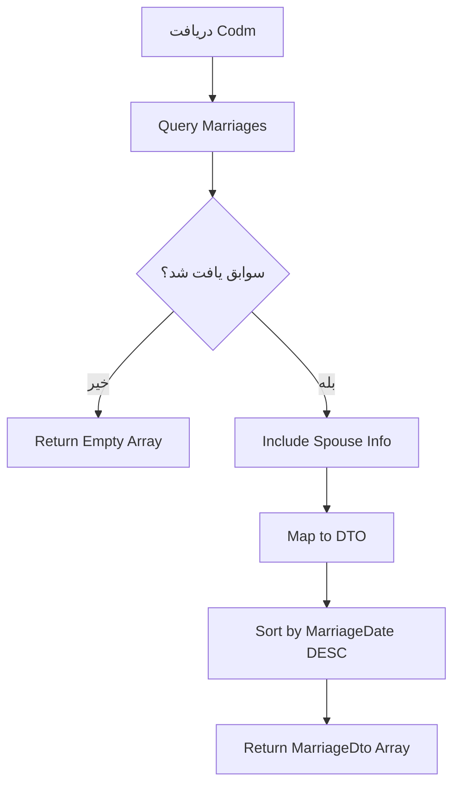

# GetMarriagesByCodmQuery.cs

**مسیر**: `Csis.Admission.Application/Features/Marriages/Queries/GetMarriagesByCodmQuery.cs`

## 1. هدف (Purpose)

این Query برای **دریافت لیست سوابق ازدواج دانشجو** استفاده می‌شود.

### کاربرد اصلی:
- نمایش تاریخچه ازدواج دانشجو
- مدیریت افراد تحت تکفل
- احتساب امتیازات یارانه

---

## 2. ورودی (Input)

```csharp
public sealed record GetMarriagesByCodmQuery(int Codm) : IRequest<MarriageDto[]>;
```

| پارامتر | نوع | توضیحات |
|---------|-----|---------|
| `Codm` | `int` | کد ملی دانشجو |

---

## 3. خروجی (Output)

```csharp
MarriageDto[] // آرایه سوابق ازدواج
```

### MarriageDto:
```csharp
{
    Id: int,
    SpouseNationalCode: string,
    SpouseName: string,
    MarriageDate: DateTime,
    DivorceDate: DateTime?,
    IsActive: bool,
    MarriageContractNumber: string,
    ChildrenCount: int
}
```

---

## 4. وابستگی‌ها (Dependencies)

```csharp
- IApplicationDbContext
- IMapper
- ICurrentUserService
```

---

## 5. جریان اجرا (Execution Flow)



---

## 6. قوانین کسب‌وکار (Business Rules)

### BR-1: ازدواج فعال
- فقط یک ازدواج فعال (بدون تاریخ طلاق) مجاز است

### BR-2: مرتب‌سازی
- از جدیدترین به قدیمی‌ترین

### BR-3: محاسبه فرزندان
- تعداد فرزندان از جدول Pregnancies محاسبه می‌شود

---

## 7. الگوهای طراحی (Design Patterns)

1. **CQRS Pattern** - Query Side
2. **Repository Pattern**
3. **DTO Pattern**
4. **Aggregate Pattern** (Marriage + Spouse + Children)

---

## 8. عملکرد و بهینه‌سازی (Performance)

### Caching:
```csharp
CacheKey: $"marriages:codm:{Codm}"
Duration: 10 minutes
Invalidation: On Create/Update/Delete Marriage
```

### Query Optimization:
- ✅ Eager Loading برای Spouse
- ✅ پیشنهاد Index: (Codm, IsActive)

---

## 9. Use Cases مرتبط

- **UC-013**: ثبت/ویرایش ازدواج
- **UC-014**: مدیریت طلاق
- **UC-Dependents**: مدیریت افراد تحت تکفل

---

## 10. نتیجه‌گیری

Query اصلی برای **مدیریت سوابق ازدواج** دانشجو.

✅ اطلاعات کامل همسر  
✅ محاسبه تعداد فرزندان  
✅ پشتیبانی از ازدواج‌های متعدد
