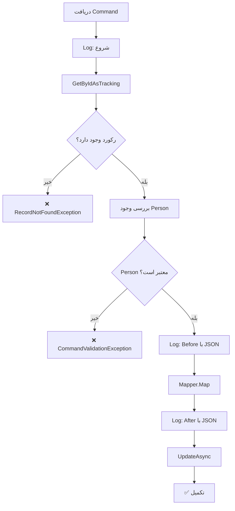

<div dir="rtl">

# UpdateNonStudentDependantCommand.cs

**مسیر**: `Csis.Admission.Application/Features/NonStudentDependants/Commands/UpdateNonStudentDependantCommand.cs`

---

## 1. Purpose (هدف)

Command **ویرایش** تکفل‌های غیر طلبه. این Command برای بروزرسانی اطلاعات افرادی که تحت تکفل غیر طلبه (Non-Student) هستند استفاده می‌شود.

---

## 2. مستندات XML موجود

```csharp
/// <summary>
/// ویرایش موجودیت تکفل های غیرطلبه
/// </summary>
```

**کامل**: توضیح واضح

---

## 3. خلاصه اتفاقات

**جریان اصلی**:
```
1. Log: شروع بروزرسانی
2. دریافت رکورد NonStudentDependant بر اساس Id
3. اگر وجود نداشت → خطا
4. بررسی وجود Person
5. اگر Person نامعتبر → خطا
6. Log: قبل از تغییر (با JSON)
7. Map کردن اطلاعات جدید
8. Log: بعد از تغییر (با JSON)
9. ذخیره در دیتابیس
```

---

## 4. اجزای اصلی

### Command:
```csharp
sealed record UpdateNonStudentDependantCommand : IRequest
{
    int Id                              // شناسه
    int PersonId                        // شناسه شخص
    long NonStudentCodm                 // کد غیرطلبه
    bool IsActive                       // فعال بودن
    DependentRelation Relationship      // نسبت
    byte? Branch                        // شعبه
    DateOnly CaseCreateDate             // تاریخ ایجاد پرونده
    DateOnly? CaseDeactiveDate          // تاریخ غیرفعال سازی
    byte RelationshipOrder              // ترتیب نسبت (0 برای والدین)
    byte? StatusReason                  // دلیل وضعیت
}
```

### Handler Dependencies:
- **INonStudentDependantRepository**: دسترسی به تکفل‌های غیرطلبه
- **IPersonRepository**: بررسی وجود Person
- **IMapper**: نگاشت
- **ILogger**: لاگ

---

## 5. Flow



---

## 6. Business Rules

### BR-1: تکفل‌های غیرطلبه
- این Command برای افرادی است که توسط **غیرطلبه** تحت تکفل هستند
- تفاوت با StudentDependents: کفیل غیرطلبه است

### BR-2: RelationshipOrder
- **0**: برای والدین
- **>0**: برای سایر نسبت‌ها (فرزند، همسر، ...)

### BR-3: وضعیت فعال/غیرفعال
- **IsActive**: وضعیت فعلی
- **CaseDeactiveDate**: تاریخ غیرفعال شدن
- **StatusReason**: دلیل تغییر وضعیت

### BR-4: اعتبارسنجی Person
- قبل از بروزرسانی، بررسی می‌شود Person معتبر باشد
- جلوگیری از ارجاع به Person حذف شده

---

## 7. Dependencies

### Internal:
- `INonStudentDependantRepository`: CRUD
- `IPersonRepository`: Validation
- `IMapper`: AutoMapper
- `ILogger<UpdateNonStudentDependantCommandHandler>`: لاگ

---

## 8. Input/Output

### Input:
```csharp
int Id
int PersonId
long NonStudentCodm
bool IsActive
DependentRelation Relationship      // Father, Mother, Child, Spouse, ...
byte? Branch                        // شعبه پرداخت
DateOnly CaseCreateDate
DateOnly? CaseDeactiveDate
byte RelationshipOrder              // 0 = والدین، بقیه بر اساس ترتیب
byte? StatusReason
```

### Output:
```csharp
void (Task)
```

### Exceptions:
- **RecordNotFoundException<NonStudentDependant>**: رکورد با Id یافت نشد
- **CommandValidationException**: شخص انتخاب شده نامعتبر است

---

## 9. Side Effects

1. **Update NonStudentDependant**: بروزرسانی تکفل
2. **Audit Log**: ثبت کامل Before/After

---

## 10. الگوهای استفاده شده

### ⭐ Excellent Audit Logging
```csharp
_logger.LogDebug("NonStudentDependant with id {id} before update: {before}", 
    request.Id, nonStudentDependant.ToJson());

// ... update ...

_logger.LogDebug("NonStudentDependant with id {id} after update: {after}", 
    request.Id, nonStudentDependant.ToJson());
```
- استفاده از `ToJson()` برای Serialization
- لاگ کامل قبل و بعد

### ✅ Person Validation
```csharp
if (!await _personRepo.ExistsAsync(x => x.Id == request.PersonId, ...)) {
    throw new CommandValidationException(nameof(request.PersonId), 
        "شخص انتخاب شده نامعتبر است");
}
```
- اعتبارسنجی قبل از Update
- پیام خطای واضح

### ✅ DateOnly Usage
```csharp
public DateOnly CaseCreateDate { get; init; }
public DateOnly? CaseDeactiveDate { get; init; }
```
- استفاده از `DateOnly` بجای `string` یا `DateTime`
- Type-safe و بهتر

---

## 11. Performance

- **Database Queries**: 1 SELECT + 1 EXISTS + 1 UPDATE
- **Logging**: 3 Debug logs
- عملیات نسبتاً ساده

---

## 12. Security

- ⚠️ **NonStudentCodm Validation**: بررسی نمی‌شود
- ✅ **Person Validation**: اعتبارسنجی کامل
- ✅ **Audit Logging**: ثبت کامل تغییرات
- ✅ **RecordNotFoundException**: Exception مناسب

---

## 13. نکات مهم

### ⭐ نمونه عالی Logging
این Command یکی از **بهترین** نمونه‌ها برای Logging است:
- ✅ Log شروع عملیات
- ✅ Log قبل از تغییر با JSON
- ✅ Log بعد از تغییر با JSON
- ✅ استفاده از Structured Logging

### 💡 DateOnly Best Practice
استفاده از `DateOnly` بجای `string` یا `DateTime`:
```csharp
public DateOnly CaseCreateDate { get; init; }
```
- Type-safe
- واضح‌تر
- بهتر از `string` یا `int`

### 🎯 NonStudentDependant
- برای افرادی که **توسط غیرطلبه** تکفل می‌شوند
- مثلاً: کارمندان حوزه که فرزند یا والدین دارند
- مشابه StudentDependents اما برای Non-Students

### ⚠️ NonStudentCodm بررسی نمی‌شود
```csharp
// مشکل:
var entity = await repo.GetByIdAsTrackingAsync(request.Id);
// بررسی نمی‌شود: entity.NonStudentCodm == request.NonStudentCodm
```

---

## 14. مثال استفاده

```csharp
var cmd = new UpdateNonStudentDependantCommand {
    Id = 123,
    PersonId = 456,
    NonStudentCodm = 78901,
    IsActive = true,
    Relationship = DependentRelation.Child,
    Branch = 1,
    CaseCreateDate = new DateOnly(1402, 10, 1),
    CaseDeactiveDate = null,
    RelationshipOrder = 1,              // فرزند اول
    StatusReason = null
};

await mediator.Send(cmd);

// Log:
// "Updating nonStudentDependant with id 123"
// "NonStudentDependant with id 123 before update: {...}"
// "NonStudentDependant with id 123 after update: {...}"
```

---

## 15. Related Commands

- **CreateNonStudentDependantCommand**: ایجاد تکفل غیرطلبه
- **DeleteNonStudentDependantCommand**: حذف تکفل غیرطلبه
- **StudentDependents Commands**: نسخه طلبه (مشابه)

---

## 16. تغییرات پیشنهادی

### 1. افزودن NonStudentCodm Validation
```csharp
public async Task Handle(UpdateNonStudentDependantCommand request, ...)
{
    _logger.LogDebug("Updating nonStudentDependant with id {id}", request.Id);
    
    var entity = await _nonStudentDependantRepo.GetByIdAsTrackingAsync(...)
        ?? throw new RecordNotFoundException<NonStudentDependant>(request.Id);
    
    // بررسی Ownership
    if (entity.NonStudentCodm != request.NonStudentCodm)
        throw new UnauthorizedException();
    
    if (!await _personRepo.ExistsAsync(...))
        throw new CommandValidationException(...);
    
    _logger.LogDebug("Before update: {before}", entity.ToJson());
    
    entity = _mapper.Map(request, entity);
    
    _logger.LogDebug("After update: {after}", entity.ToJson());
    
    await _nonStudentDependantRepo.UpdateAsync(entity, cancellationToken);
}
```

### 2. افزودن Validation منطقی
```csharp
// بررسی تاریخ‌ها
if (request.CaseDeactiveDate.HasValue && 
    request.CaseDeactiveDate < request.CaseCreateDate)
    throw new CommandValidationException("تاریخ غیرفعال سازی نمی‌تواند قبل از تاریخ ایجاد باشد");

// بررسی IsActive و CaseDeactiveDate
if (!request.IsActive && !request.CaseDeactiveDate.HasValue)
    throw new CommandValidationException("برای غیرفعال سازی، تاریخ الزامی است");
```

### 3. بهبود Log Level برای Production
```csharp
// بجای همه Debug
_logger.LogInformation("Updating NonStudentDependant {Id} for Codm {Codm}", 
    request.Id, request.NonStudentCodm);

// Debug logs فقط در Development
#if DEBUG
_logger.LogDebug("Before: {before}", entity.ToJson());
_logger.LogDebug("After: {after}", entity.ToJson());
#endif
```

---

</div>
