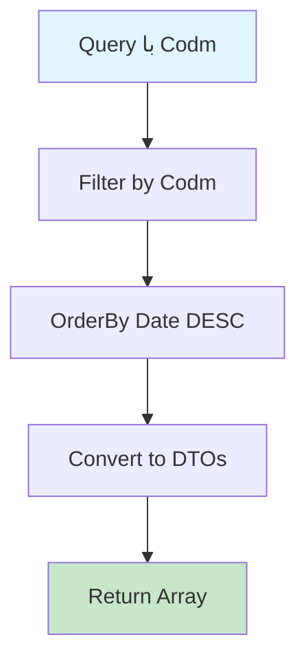

# GetPictureHistoriesByCodmQuery.cs

**مسیر**: `Csis.Admission.Application/Features/PictureHistories/Queries/GetPictureHistoriesByCodmQuery.cs`

## 1. هدف (Purpose)

این Query برای **دریافت تاریخچه تصاویر پروفایل** دانشجو استفاده می‌شود.

### کاربرد اصلی:
- مشاهده تاریخچه تغییرات تصویر
- Audit Trail برای تصاویر
- مدیریت عکس‌های پروفایل
- بررسی تغییرات تصویر در گذر زمان

---

## 2. ورودی (Input)

```csharp
public sealed record GetPictureHistoriesByCodmQuery(int Codm) : IRequest<PictureHistoryDto[]>;
```

### پارامترها:
| پارامتر | نوع | اجباری | توضیحات |
|---------|-----|--------|---------|
| `Codm` | `int` | بله | کد ملی دانشجو |

---

## 3. خروجی (Output)

```csharp
PictureHistoryDto[]
```

### شامل:
- تاریخ تغییر
- تصویر قبلی
- تصویر جدید
- کاربر تغییردهنده

---

## 4. وابستگی‌ها (Dependencies)

**Dependencies:**
1. **IRepository<PictureHistory>**: دسترسی به جدول تاریخچه تصاویر

---

## 5. جریان اجرا (Execution Flow)



---

## 6. قوانین کسب‌وکار (Business Rules)

### BR-1: مرتب‌سازی
- تاریخچه به ترتیب **تاریخ نزولی** (جدیدترین ابتدا)

### BR-2: Audit Trail
- هر تغییر تصویر باید ثبت شود
- شامل اطلاعات کاربر تغییردهنده

---

## 7. الگوهای طراحی (Design Patterns)

1. **CQRS Pattern**
2. **Repository Pattern**
3. **Audit Trail Pattern**
4. **History Tracking Pattern**

---

## 8. امنیت و Privacy (Security)

### نکات امنیتی:
⚠️ بررسی مجوز دسترسی به تاریخچه  
⚠️ تصاویر حساس - رعایت Privacy  
⚠️ لاگ دسترسی به تاریخچه تصاویر

---

## 9. Use Cases مرتبط

- **UC-Audit**: Audit Trail و Compliance
- بررسی تغییرات پروفایل
- مدیریت تصاویر

---

## نتیجه‌گیری

Query **Audit Trail** برای تصاویر دانشجو.

### نقاط قوت:
✅ تاریخچه کامل تغییرات  
✅ مرتب‌سازی زمانی  
✅ Compliance و Audit  

### امنیت:
⚠️ رعایت Privacy و بررسی مجوز دسترسی ضروری است
