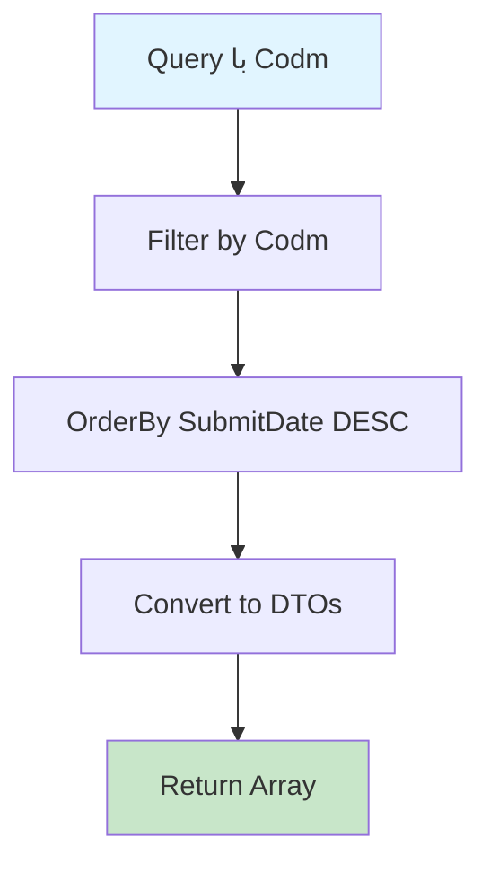

# GetProtestByCodmQuery.cs

**مسیر**: `Csis.Admission.Application/Features/Protests/Queries/GetProtestByCodmQuery.cs`

## 1. هدف (Purpose)

این Query برای **دریافت لیست اعتراضات** ثبت شده توسط دانشجو استفاده می‌شود.

### کاربرد اصلی:
- لیست اعتراضات ثبت شده دانشجو
- پیگیری وضعیت اعتراض
- بررسی درخواست‌های اعتراض
- تاریخچه اعتراضات

---

## 2. ورودی (Input)

```csharp
public sealed record GetProtestByCodmQuery(int Codm) : IRequest<ProtestDto[]>;
```

### پارامترها:
| پارامتر | نوع | اجباری | توضیحات |
|---------|-----|--------|---------|
| `Codm` | `int` | بله | کد ملی دانشجو |

---

## 3. خروجی (Output)

```csharp
ProtestDto[]
```

### شامل:
- عنوان اعتراض
- تاریخ ثبت
- وضعیت (در حال بررسی، تأیید، رد)
- پاسخ

---

## 4. وابستگی‌ها (Dependencies)

**Dependencies:**
1. **IRepository<Protest>**: دسترسی به جدول اعتراضات

---

## 5. جریان اجرا (Execution Flow)



---

## 6. قوانین کسب‌وکار (Business Rules)

### BR-1: مرتب‌سازی
- اعتراضات به ترتیب **تاریخ ثبت نزولی** (جدیدترین ابتدا)

### BR-2: وضعیت
- شامل تمام وضعیت‌ها (در حال بررسی، تأیید شده، رد شده)

---

## 7. الگوهای طراحی (Design Patterns)

1. **CQRS Pattern**
2. **Repository Pattern**
3. **DTO Pattern**

---

## 8. عملکرد و بهینه‌سازی (Performance)

### پیشنهاد:
```csharp
// Index بر روی (Codm, SubmitDate) برای جستجوی سریع
```

---

## 9. Use Cases مرتبط

- ثبت اعتراض دانشجو
- بررسی و پاسخ اعتراضات
- گزارش‌گیری اعتراضات

---

## نتیجه‌گیری

Query برای **مدیریت اعتراضات دانشجویی**.

### نقاط قوت:
✅ لیست کامل اعتراضات  
✅ شامل وضعیت و پاسخ  
✅ مرتب‌سازی زمانی  

### کاربرد:
مدیریت ارتباطات و بازخورد دانشجویان
