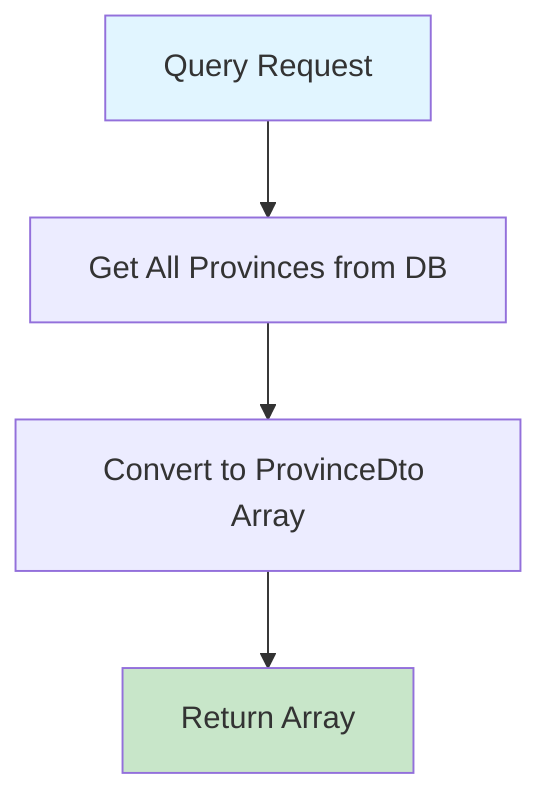

# GetProvincesQuery.cs

**مسیر**: `Csis.Admission.Application/Features/Provinces/Queries/GetProvincesQuery.cs`

## 1. هدف (Purpose)

این Query برای **دریافت لیست کامل استان‌ها** از دیتابیس استفاده می‌شود و یک آرایه از `ProvinceDto` را برمی‌گرداند.

### کاربرد اصلی:
- Populate کردن Dropdown ها در فرم‌های ثبت آدرس
- انتخاب استان در Profile Editing
- فیلتر استان در Search Forms
- انتخاب استان برای لیست شهرها

---

## 2. ورودی (Input)

```csharp
public sealed record GetProvincesQuery() : IRequest<ProvinceDto[]>;
```

### پارامترها:
این Query **هیچ پارامتر ورودی ندارد** و تمام استان‌ها را برمی‌گرداند.

---

## 3. خروجی (Output)

```csharp
ProvinceDto[]
```

### نمونه خروجی:
```json
[
  { "id": 1, "name": "تهران" },
  { "id": 2, "name": "اصفهان" },
  { "id": 3, "name": "خراسان رضوی" }
]
```

---

## 4. وابستگی‌ها (Dependencies)

**Dependencies:**
1. **IRepository<Province,short>**: برای خواندن از جدول Provinces

---

## 5. جریان اجرا (Execution Flow)



### مراحل:
1. **دریافت تمام رکوردها** از جدول `Provinces` با AutoMapper projection
2. **تبدیل به آرایه** و Return

---

## 6. قوانین کسب‌وکار (Business Rules)

### BR-1: دریافت همه استان‌ها
- **قانون**: تمام استان‌های ایران (31 استان) بدون محدودیت برگردانده می‌شوند

---

## 7. عملکرد و بهینه‌سازی (Performance)

### ✅ **مزایا:**
1. **GetAllAsync** با AutoMapper projection
2. **تبدیل مستقیم به آرایه**

### پیشنهاد بهبود: افزودن Caching
```csharp
// استان‌ها نادراً تغییر می‌کنند - مناسب برای Caching
return await _cache.GetOrCreateAsync("provinces", async entry => 
{
    entry.AbsoluteExpirationRelativeToNow = TimeSpan.FromHours(24);
    var result = await _repo.GetAllAsync<ProvinceDto>();
    return result.ToArray();
}) ?? Array.Empty<ProvinceDto>();
```

---

## 8. الگوهای طراحی (Design Patterns)

### الگوهای استفاده شده:
1. **CQRS Pattern**: Query جدا از Command
2. **Repository Pattern**: دسترسی به داده از طریق Repository
3. **DTO Pattern**: استفاده از Data Transfer Object

---

## 9. مثال استفاده (Usage Example)

### از Controller:
```csharp
[HttpGet("provinces")]
public async Task<ActionResult<ProvinceDto[]>> GetProvinces()
{
    var query = new GetProvincesQuery();
    var provinces = await _mediator.Send(query);
    return Ok(provinces);
}
```

### از Frontend:
```javascript
const response = await fetch('/api/provinces');
const provinces = await response.json();

// Populate dropdown
const select = document.getElementById('provinceSelect');
provinces.forEach(province => {
    const option = document.createElement('option');
    option.value = province.id;
    option.text = province.name;
    select.add(option);
});
```

---

## 10. Command/Query های مرتبط

### Queries مشابه:
- `GetCountriesQuery`: دریافت لیست کشورها
- `GetCitiesQuery`: دریافت لیست شهرها (بر اساس استان)
- `GetBranchesQuery`: دریافت لیست شعب

---

## نتیجه‌گیری

این Query بسیار **ساده و کارآمد** است برای دریافت لیست 31 استان ایران. با توجه به تعداد محدود و ثابت استان‌ها، **Caching** می‌تواند عملکرد را بهبود دهد.

### نقاط قوت:
✅ کد تمیز و ساده  
✅ استفاده از Repository Pattern  
✅ Projection در DB  

### نقاط ضعف:
⚠️ فقدان Caching (پیشنهاد می‌شود)
