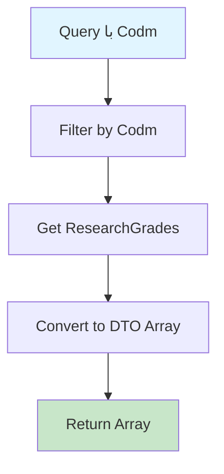

# GetResearchGradesByCodmQuery.cs

**مسیر**: `Csis.Admission.Application/Features/ResearchGrades/Queries/GetResearchGradesByCodmQuery.cs`

## 1. هدف (Purpose)

این Query برای **دریافت نمرات و امتیازات فعالیت‌های پژوهشی** دانشجو استفاده می‌شود.

### کاربرد اصلی:
- نمایش امتیازات پژوهشی دانشجو
- محاسبه امتیاز کل برای هدفمندی یارانه
- گزارش‌گیری فعالیت‌های پژوهشی

---

## 2. ورودی (Input)

```csharp
public sealed record GetResearchGradesByCodmQuery(int Codm) : IRequest<ResearchGradeDto[]>;
```

### پارامترها:
| پارامتر | نوع | اجباری | توضیحات |
|---------|-----|--------|---------|
| `Codm` | `int` | بله | کد ملی دانشجو |

---

## 3. خروجی (Output)

```csharp
ResearchGradeDto[]
```

---

## 4. وابستگی‌ها (Dependencies)

**Dependencies:**
1. **IRepository<ResearchGrade>**: دسترسی به جدول نمرات پژوهش

---

## 5. جریان اجرا (Execution Flow)



---

## 6. قوانین کسب‌وکار (Business Rules)

### BR-1: فیلتر بر اساس دانشجو
- فقط نمرات پژوهشی مرتبط با Codm دانشجو برگردانده می‌شوند

---

## 7. الگوهای طراحی (Design Patterns)

1. **CQRS Pattern**
2. **Repository Pattern**
3. **DTO Pattern**

---

## 8. Use Cases مرتبط

- **UC-TargetedScores**: محاسبه امتیازات هدفمندی یارانه
- نمایش سوابق فعالیت پژوهشی

---

## نتیجه‌گیری

Query برای **امتیازدهی فعالیت‌های پژوهشی**.

### نقاط قوت:
✅ فیلتر بر اساس دانشجو  
✅ استفاده در سیستم هدفمندی یارانه  

### یادآوری:
این امتیازات در محاسبه **GetTargetedScoresInfoByCodmQuery** استفاده می‌شوند.
