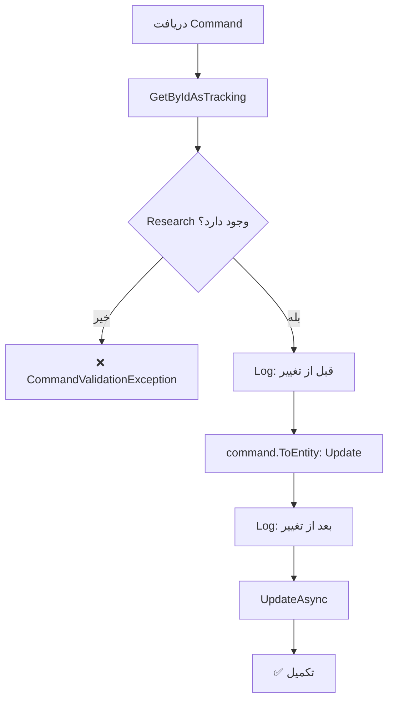

<div dir="rtl">

# UpdateResearchCommand.cs

**مسیر**: `Csis.Admission.Application/Features/Researches/Commands/UpdateResearchCommand.cs`

---

## 1. Purpose (هدف)

Command **ویرایش** اطلاعات پژوهش طلبه. این Command برای بروزرسانی اطلاعات پژوهش‌های علمی، مقالات، کتاب‌ها و پروژه‌های تحقیقاتی دانشجویان استفاده می‌شود.

---

## 2. مستندات XML موجود

```csharp
/// <summary>
/// ویرایش پژوهش
/// </summary>
```

**کامل**: توضیح واضح و مختصر

---

## 3. خلاصه اتفاقات

**جریان اصلی**:
```
1. دریافت رکورد Research بر اساس Id
2. اگر وجود نداشت → خطا
3. Log قبل از تغییر (Debug)
4. بروزرسانی با اطلاعات جدید
5. Log بعد از تغییر (Debug)
6. ذخیره در دیتابیس
```

---

## 4. اجزای اصلی

### Command:
```csharp
sealed record UpdateResearchCommand : IRequest
{
    int Id                              // شناسه پژوهش
    int Codm                            // کد مرکز خدمات
    string ArticlePublication           // نشریه مقاله
    string BookPublisher                // ناشر کتاب
    string BookShabak                   // شابک کتاب
    string ProjectEmployer              // کارفرمای پروژه
    string Title                        // عنوان
    short? SubjectId                    // شناسه موضوع
    short? Year                         // سال
    ResearchLanguage? Language          // زبان
    ResearchType? Type                  // نوع پژوهش
}
```

### Handler Dependencies:
- **IRepository<Research>**: دسترسی به داده‌های پژوهش
- **ILogger**: ثبت لاگ

---

## 5. Flow



---

## 6. Business Rules

### BR-1: نوع‌های مختلف پژوهش
- **مقاله** (Article): ArticlePublication
- **کتاب** (Book): BookPublisher, BookShabak
- **پروژه** (Project): ProjectEmployer
- بسته به نوع، فیلدهای مختلف پر می‌شود

### BR-2: String Trimming و Conversion
```csharp
[JsonConverter(typeof(TrimAndToPersianConverter))]
```
- تمام رشته‌ها Trim می‌شوند
- حروف به فارسی تبدیل می‌شوند

### BR-3: Audit Logging
- لاگ کامل قبل و بعد از تغییر
- استفاده از Structured Logging با `{@object}`

---

## 7. Dependencies

### Internal:
- `IRepository<Research>`: CRUD operations
- `ILogger<UpdateResearchCommandHandler>`: لاگ

---

## 8. Input/Output

### Input:
```csharp
int Id
int Codm
string Title                        // عنوان پژوهش
ResearchType? Type                  // Article, Book, Project
ResearchLanguage? Language          // Farsi, Arabic, English, ...
short? Year                         // سال انتشار
// بسته به Type:
string ArticlePublication           // برای مقاله
string BookPublisher                // برای کتاب
string BookShabak                   // برای کتاب
string ProjectEmployer              // برای پروژه
short? SubjectId                    // موضوع پژوهشی
```

### Output:
```csharp
void (Task)
```

### Exceptions:
- **CommandValidationException**: "پژوهش با شناسه {Id} یافت نشد."

---

## 9. Side Effects

1. **Update Research**: بروزرسانی اطلاعات پژوهش
2. **Audit Log**: ثبت کامل تغییرات

---

## 10. الگوهای استفاده شده

### ✅ Excellent Audit Logging (مشابه UpdateFamousCommand)
```csharp
logger.LogDebug("Research with id {id} before update: {@before}", id, research);
// ... update ...
logger.LogDebug("Research with id {id} after update: {@after}", id, research);
```

### ✅ Custom JSON Converters
```csharp
[JsonConverter(typeof(TrimAndToPersianConverter))]
```
- خودکار Trim و Persian Conversion
- Data Quality بهتر

### ✅ Get-Update Pattern
```csharp
var entity = await repo.GetByIdAsTrackingAsync(id) ?? throw new Exception();
entity = command.ToEntity(entity);
await repo.UpdateAsync(entity);
```

---

## 11. Performance

- **Database Queries**: 1 SELECT + 1 UPDATE
- **Logging**: 2 Debug logs با structured data
- عملیات ساده و سریع

---

## 12. Security

- ⚠️ **Codm Validation**: `Codm` در Command هست اما بررسی نمی‌شود
- ✅ **Exception واضح**: پیام خطای مناسب
- ✅ **Audit Logging**: ثبت کامل تغییرات

---

## 13. نکات مهم

### 💡 TrimAndToPersianConverter
این Converter خیلی مفید است:
- حذف فاصله‌های اضافی
- تبدیل اعداد انگلیسی به فارسی
- تبدیل حروف عربی به فارسی
- Data Quality بهتر

### ⚠️ Codm بررسی نمی‌شود (مشکل متداول)
```csharp
// مشکل:
var research = await repo.GetByIdAsTrackingAsync(request.Id);
// بررسی نمی‌شود: research.Codm == request.Codm
```

### 🎯 Research Types
- **Article**: مقاله در نشریه
- **Book**: کتاب منتشر شده
- **Project**: پروژه تحقیقاتی

### 💡 مشابه UpdateFamousCommand
این Command از همان الگوی عالی Logging استفاده می‌کند

---

## 14. مثال استفاده

### سناریو 1: بروزرسانی مقاله
```csharp
var cmd = new UpdateResearchCommand {
    Id = 456,
    Codm = 12345,
    Type = ResearchType.Article,
    Title = "بررسی روش‌های نوین...",
    ArticlePublication = "نشریه علمی...",
    Year = 1402,
    Language = ResearchLanguage.Farsi,
    SubjectId = 5
};
await mediator.Send(cmd);

// Log:
// "Research with id 456 before update: { Type: 'Article', ... }"
// "Research with id 456 after update: { Title: 'بررسی...', ... }"
```

### سناریو 2: بروزرسانی کتاب
```csharp
var cmd = new UpdateResearchCommand {
    Id = 789,
    Codm = 12345,
    Type = ResearchType.Book,
    Title = "فقه و اصول",
    BookPublisher = "انتشارات...",
    BookShabak = "978-600-...",
    Year = 1401
};
await mediator.Send(cmd);
```

---

## 15. Related Commands

- **CreateResearchCommand**: ایجاد پژوهش
- **DeleteResearchCommand**: حذف پژوهش
- **UpdateResearchRequestCommand**: بروزرسانی از طریق Request System

---

## 16. تغییرات پیشنهادی

### 1. افزودن Codm Validation
```csharp
public async Task Handle(UpdateResearchCommand request, CancellationToken cancellationToken)
{
    var research = await researchRepo.GetByIdAsTrackingAsync(request.Id, cancellationToken)
        ?? throw new CommandValidationException($"پژوهش با شناسه {request.Id} یافت نشد");
    
    // بررسی Ownership
    if (research.Codm != request.Codm)
        throw new UnauthorizedException("شما مجاز به ویرایش این پژوهش نیستید");
    
    logger.LogDebug("Research with id {id} before update: {@before}", request.Id, research);
    
    research = request.ToEntity(research);
    
    logger.LogDebug("Research with id {id} after update: {@after}", request.Id, research);
    
    await researchRepo.UpdateAsync(research, cancellationToken);
}
```

### 2. افزودن Validation بر اساس Type
```csharp
// قبل از Update
if (request.Type == ResearchType.Article && string.IsNullOrWhiteSpace(request.ArticlePublication))
    throw new CommandValidationException("برای مقاله، نشریه الزامی است");

if (request.Type == ResearchType.Book && string.IsNullOrWhiteSpace(request.BookShabak))
    throw new CommandValidationException("برای کتاب، شابک الزامی است");

if (request.Type == ResearchType.Project && string.IsNullOrWhiteSpace(request.ProjectEmployer))
    throw new CommandValidationException("برای پروژه، کارفرما الزامی است");
```

### 3. بهبود Exception Type
```csharp
// بجای CommandValidationException
throw new RecordNotFoundException<Research>(request.Id);
```

---

</div>
