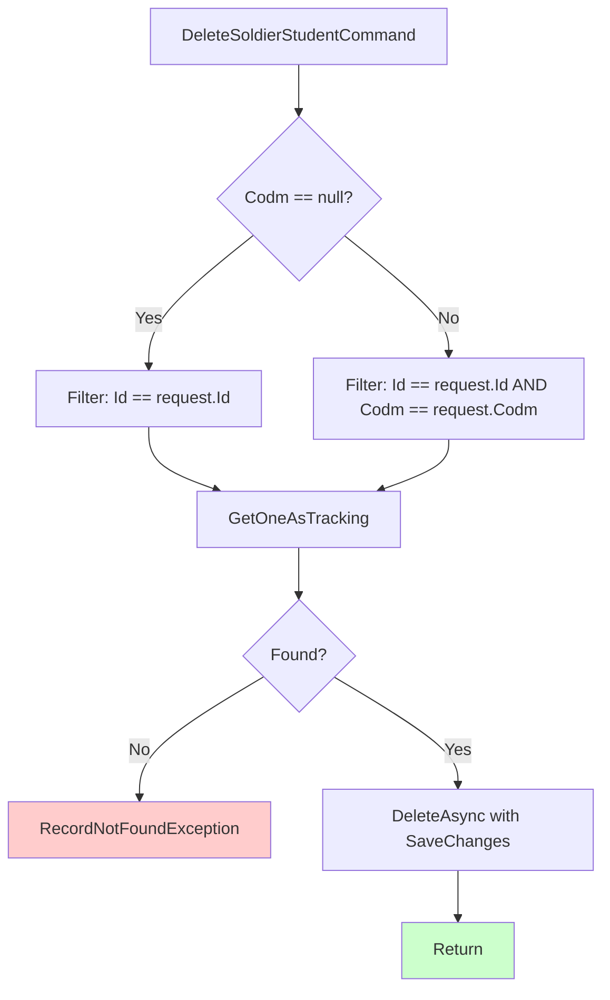

# DeleteSoldierStudentCommand.cs

**مسیر**: `Csis.Admission.Application/Features/SoldierStudents/Commands/DeleteSoldierStudentCommand.cs`

## 1. هدف (Purpose)

این Command برای **حذف اطلاعات سرباز** استفاده می‌شود. این Command یکی از معدود Delete Commands است که **Codm را به صورت Nullable** دریافت می‌کند.

**ویژگی‌ها**:
- Delete با Validation
- **Codm Nullable**: اگر null باشد، فقط با Id حذف می‌شود
- ⚠️ **Typo**: `pridacate` باید `predicate` باشد
- استفاده از Expression برای Composite Filter
- ⚠️ فقدان Logger

## 2. ساختار کلی (Structure)

```csharp
public sealed record DeleteSoldierStudentCommand(int Id, int? Codm = null) : IRequest;

internal sealed class DeleteSoldierStudentCommandHandler : IRequestHandler<DeleteSoldierStudentCommand>
{
    private readonly IRepository<SoldierStudent> _repo;
}
```

## 3. جریان اجرا (Execution Flow)



## 4. قوانین کسب‌وکار (Business Rules)

### BR-1: Composite Filter با Codm Nullable
```csharp
Expression<Func<SoldierStudent, bool>> pridacate =  // ⚠️ Typo: باید predicate باشد
    x=> (request.Codm == null && x.Id == request.Id) || 
        (x.Id == request.Id && x.Codm == request.Codm);
```

**منطق**:
- اگر `Codm == null` → فقط بر اساس `Id`
- اگر `Codm != null` → بر اساس `Id` و `Codm`

### BR-2: Validation وجود رکورد
```csharp
var entity = await _repo.GetOneAsTrackingAsync(pridacate, false, cancellationToken) 
    ?? throw new RecordNotFoundException<SoldierStudent>(request.Id);
```

## 5. ملاحظات امنیتی (Security Considerations)

### 🔴 مشکلات امنیتی:

#### 1. Codm Nullable
```csharp
public sealed record DeleteSoldierStudentCommand(int Id, int? Codm = null) : IRequest;
```

**خطر**: اگر `Codm = null` ارسال شود، هر کسی می‌تواند هر سربازی را حذف کند!

#### 2. فقدان Logger
- هیچ log ثبت نمی‌شود
- امکان Audit Trail وجود ندارد

## 6. الگوهای طراحی (Design Patterns)

### 1. **Composite Filter Pattern**
```csharp
Expression<Func<SoldierStudent, bool>> predicate = 
    x => (condition1) || (condition2);
```

### 2. **Optional Parameter Pattern**
```csharp
int? Codm = null
```

### 3. **Delete with Validation**
```csharp
var entity = await _repo.GetOneAsTrackingAsync(...) 
    ?? throw new RecordNotFoundException<...>(...);
```

## 7. یادداشت‌های توسعه (Development Notes)

### 🟢 نکات مثبت:
1. ✅ Validation وجود رکورد
2. ✅ استفاده از Expression
3. ✅ استفاده از Record Type

### 🔴 نکات منفی:
1. ❌ **Typo**: `pridacate` باید `predicate` باشد
2. ❌ **Codm Nullable**: خطر امنیتی
3. ❌ **فقدان Logger**
4. ❌ **منطق پیچیده**: OR condition قابلیت خواندن را کاهش می‌دهد

## 8. مثال استفاده (Usage Example)

```csharp
// حذف با Codm (امن)
var command1 = new DeleteSoldierStudentCommand(Id: 123, Codm: 1001);
await mediator.Send(command1);

// حذف بدون Codm (خطرناک!)
var command2 = new DeleteSoldierStudentCommand(Id: 123, Codm: null);
await mediator.Send(command2);  // ⚠️ هر کسی می‌تواند حذف کند!
```

## 9. تغییرات پیشنهادی (Suggested Improvements)

### 1. رفع Typo
```diff
- Expression<Func<SoldierStudent, bool>> pridacate = ...
+ Expression<Func<SoldierStudent, bool>> predicate = ...
```

### 2. حذف Nullable از Codm
```diff
- public sealed record DeleteSoldierStudentCommand(int Id, int? Codm = null) : IRequest;
+ public sealed record DeleteSoldierStudentCommand(int Id, int Codm) : IRequest;
```

### 3. ساده‌سازی منطق
```diff
- Expression<Func<SoldierStudent, bool>> predicate = 
-     x=> (request.Codm == null && x.Id == request.Id) || 
-         (x.Id == request.Id && x.Codm == request.Codm);
+ Expression<Func<SoldierStudent, bool>> predicate = 
+     x => x.Id == request.Id && x.Codm == request.Codm;
```

### 4. افزودن Logger
```diff
+ private readonly ILogger<DeleteSoldierStudentCommandHandler> _logger;
  
- public DeleteSoldierStudentCommandHandler(IRepository<SoldierStudent> repo) {
+ public DeleteSoldierStudentCommandHandler(
+     IRepository<SoldierStudent> repo,
+     ILogger<DeleteSoldierStudentCommandHandler> logger) {
      _repo = repo;
+     _logger = logger;
  }

  public async Task Handle(DeleteSoldierStudentCommand request, CancellationToken cancellationToken) {
+     _logger.LogInformation("حذف سرباز {Id} توسط {Codm}", request.Id, request.Codm);
      
      // ... existing code ...
      
+     _logger.LogWarning("سرباز {Id} حذف شد", request.Id);
  }
```

---

**نتیجه‌گیری**: DeleteSoldierStudentCommand یک Delete Command است که دارای **Typo** و **Codm Nullable** با خطر امنیتی است. منطق Composite Filter نیز قابلیت خواندن کد را کاهش می‌دهد.
