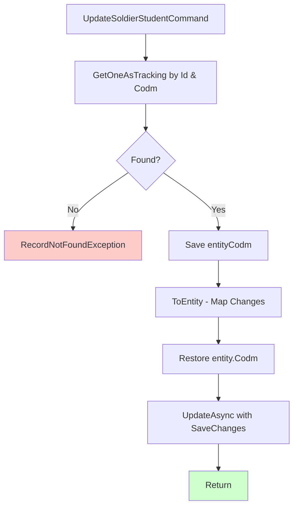

# UpdateSoldierStudentCommand.cs

**مسیر**: `Csis.Admission.Application/Features/SoldierStudents/Commands/UpdateSoldierStudentCommand.cs`

## 1. هدف (Purpose)

این Command برای **بروزرسانی اطلاعات سربازی طلبه** استفاده می‌شود.

**ویژگی‌ها**:
- Update با BaseCommandDto
- Custom date mapping (String to Int)
- ✅ **Codm Protection**: Codm حفظ می‌شود
- استفاده از GetOneAsTracking
- ⚠️ فقدان Logger

## 2. ساختار کلی (Structure)

```csharp
public sealed record UpdateSoldierStudentCommand : 
    BaseCommandDto<UpdateSoldierStudentCommand, SoldierStudent>, 
    IRequest
{
    public int Id { get; init; }
    public int Codm { get. set; }
    public string StartDate { get. set; }  // تاریخ شروع خدمت
    public string EndDate { get. set; }    // تاریخ پایان خدمت
    public string Place { get. set; }      // محل خدمت
}
```

## 3. جریان اجرا (Execution Flow)



## 4. قوانین کسب‌وکار (Business Rules)

### BR-1: Composite Filter (Id + Codm)
```csharp
var entity = await _repo.GetOneAsTrackingAsync(
    x=>x.Id == request.Id && x.Codm == request.Codm, 
    false, 
    cancellationToken) 
    ?? throw new RecordNotFoundException<SoldierStudent>(request.Id);
```

- باید هم `Id` و هم `Codm` مطابقت داشته باشد
- **Authorization implicit**: فقط صاحب رکورد می‌تواند بروز کند

### BR-2: Codm Protection
```csharp
var entityCodm = entity.Codm;

request.ToEntity(entity);
entity.Codm=entityCodm;  // ⚠️ فاصله‌گذاری اشتباه: باید entity.Codm = entityCodm باشد
```

**هدف**: جلوگیری از تغییر `Codm` توسط کاربر

### BR-3: Custom Date Mapping
```csharp
public override void ReverseCustomMappings(IMappingExpression<UpdateSoldierStudentCommand, SoldierStudent> mapping) {
    mapping.ForMember(model => model.StartDate, config => config.MapFrom(dto => dto.StartDate.StringDateToInt()));
    mapping.ForMember(model => model.EndDate, config => config.MapFrom(dto => dto.EndDate.StringDateToInt()));
}
```

- تاریخ‌ها از String به Int تبدیل می‌شوند

## 5. ملاحظات امنیتی (Security Considerations)

### 🟢 امنیت خوب:

#### 1. Codm Validation
```csharp
x=>x.Id == request.Id && x.Codm == request.Codm
```
✅ فقط صاحب رکورد می‌تواند بروز کند

#### 2. Codm Protection
```csharp
var entityCodm = entity.Codm;
// ... mapping ...
entity.Codm=entityCodm;
```
✅ Codm قابل تغییر نیست

### 🔴 مشکلات:

#### 1. فقدان Logger
- هیچ log ثبت نمی‌شود

## 6. الگوهای طراحی (Design Patterns)

### 1. **Immutable Field Protection Pattern**
```csharp
var savedValue = entity.Field;
// ... mapping ...
entity.Field = savedValue;
```

### 2. **Composite Key Validation**
```csharp
x => x.Id == id && x.Codm == codm
```

### 3. **Custom Date Mapping**
```csharp
StringDateToInt()
```

## 7. یادداشت‌های توسعه (Development Notes)

### 🟢 نکات مثبت:
1. ✅ Codm Protection (فیلد immutable)
2. ✅ Composite Filter (Id + Codm)
3. ✅ Custom date mapping
4. ✅ Validation وجود رکورد

### 🔴 نکات منفی:
1. ❌ **فقدان Logger**
2. ❌ **Spacing Issue**: `entity.Codm=entityCodm` باید `entity.Codm = entityCodm` باشد
3. ❌ **فقدان Date Validation**: StartDate باید قبل از EndDate باشد

## 8. مثال استفاده (Usage Example)

```csharp
var command = new UpdateSoldierStudentCommand
{
    Id = 10,
    Codm = 1001,
    StartDate = "1400/05/01",
    EndDate = "1401/05/01",
    Place = "پایگاه شهید لشکری - تهران"
};

try
{
    await mediator.Send(command);
    Console.WriteLine("اطلاعات سربازی بروز شد.");
}
catch (RecordNotFoundException<SoldierStudent> ex)
{
    Console.WriteLine($"خطا: {ex.Message}");
}
```

## 9. تغییرات پیشنهادی (Suggested Improvements)

### 1. رفع Spacing Issue
```diff
- entity.Codm=entityCodm;
+ entity.Codm = entityCodm;
```

### 2. افزودن Logger
```diff
+ private readonly ILogger<UpdateSoldierStudentCommandHandler> _logger;
  
- public UpdateSoldierStudentCommandHandler(IRepository<SoldierStudent> repo) {
+ public UpdateSoldierStudentCommandHandler(
+     IRepository<SoldierStudent> repo,
+     ILogger<UpdateSoldierStudentCommandHandler> logger) {
      _repo = repo;
+     _logger = logger;
  }

  public async Task Handle(UpdateSoldierStudentCommand request, CancellationToken cancellationToken) {
+     _logger.LogInformation("بروز اطلاعات سربازی {Id} توسط {Codm}", request.Id, request.Codm);
      
      // ... existing code ...
      
      await _repo.UpdateAsync(entity, true,cancellationToken);
+     _logger.LogInformation("اطلاعات سربازی {Id} بروز شد", request.Id);
  }
```

### 3. افزودن Date Validation
```diff
+ public override void Validate() {
+     if (!string.IsNullOrEmpty(StartDate) && !string.IsNullOrEmpty(EndDate)) {
+         var start = StartDate.StringDateToInt();
+         var end = EndDate.StringDateToInt();
+         if (start > end) {
+             throw new ValidationException("تاریخ شروع خدمت باید قبل از تاریخ پایان باشد.");
+         }
+     }
+ }
```

### 4. بهبود Codm Protection (اختیاری)
```diff
- var entityCodm = entity.Codm;
- request.ToEntity(entity);
- entity.Codm=entityCodm;
+ request.ToEntity(entity);
+ // Codm را از Mapping حذف کنید تا نیازی به بازیابی نباشد
+ // یا در ReverseCustomMappings:
+ mapping.ForMember(m => m.Codm, cfg => cfg.Ignore());
```

---

**نتیجه‌گیری**: UpdateSoldierStudentCommand یک Command خوب است که از **Codm Protection** استفاده می‌کند تا Codm قابل تغییر نباشد. یک **Spacing Issue** کوچک و **فقدان Logger** دارد.
