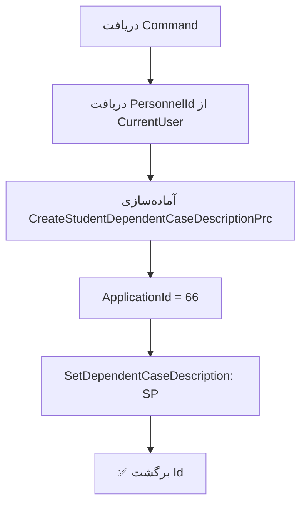

<div dir="rtl">

# CreateStudentDependentCaseDescriptionCommand.cs

**مسیر**: `Csis.Admission.Application/Features/StudentDependents/Commands/CreateStudentDependentCaseDescriptionCommand.cs`

---

## 1. Purpose (هدف)

Command **تغییر/ثبت توضیحات پرونده‌ای** برای فرد تحت تکفل. این Command برای ثبت یا بروزرسانی توضیحات و ملاحظات مربوط به پرونده یک فرد تحت تکفل استفاده می‌شود.

---

## 2. مستندات XML موجود

```csharp
/// <summary>
/// تغییر مشخصات پرونده ای تکفل
/// </summary>
/// <param name="Codm"></param>
/// <param name="DependentId"></param>
/// <param name="CaseDescription"></param>
```

**کامل**: توضیح واضح با پارامترها

---

## 3. خلاصه اتفاقات

**جریان اصلی**:
```
1. دریافت Codm, DependentId, CaseDescription
2. دریافت PersonnelId از CurrentUser
3. آماده‌سازی Request با ApplicationId=66
4. فراخوانی Stored Procedure
5. برگشت Id
```

---

## 4. اجزای اصلی

### Command:
```csharp
sealed record CreateStudentDependentCaseDescriptionCommand(
    int Codm, 
    long DependentId, 
    string CaseDescription
) : IRequest<long>
```

### Handler Dependencies:
- **IStudentRepository**: دسترسی به SP
- **ICurrentUserService**: دریافت PersonnelId

---

## 5. Flow



---

## 6. Business Rules

### BR-1: فقط توسط کارمند
- `PersonnelId` از CurrentUser دریافت می‌شود
- این Command احتمالاً **فقط** توسط کارمندان قابل اجرا است

### BR-2: ApplicationId ثابت
```csharp
ApplicationId = 66
```
- مقدار **هاردکد** شده
- احتمالاً شناسه سامانه پذیرش است
- برای Audit و تشخیص منبع

### BR-3: PersonnelId پیش‌فرض
```csharp
PersonnelId = await currentUserService.PersonnelId() ?? 0
```
- اگر PersonnelId null باشد → 0
- ⚠️ این می‌تواند مشکل‌ساز باشد

---

## 7. Dependencies

### Internal:
- `IStudentRepository`: فراخوانی SP
- `ICurrentUserService`: اطلاعات کاربر

### External:
- **Stored Procedure**: `SetDependentCaseDescription`

---

## 8. Input/Output

### Input:
```csharp
int Codm                    // کد مرکز خدمات
long DependentId            // شناسه فرد تحت تکفل
string CaseDescription      // توضیحات پرونده
```

### Output:
```csharp
long Id     // شناسه رکورد ثبت شده
```

### Exceptions:
- Exception ها از SP می‌آیند

---

## 9. Side Effects

1. **ثبت/بروزرسانی توضیحات**: در جدول مربوطه
2. **Audit Trail**: ثبت PersonnelId و ApplicationId

---

## 10. الگوهای استفاده شده

### ✅ SP Wrapper Pattern
```csharp
var request = new PrcRequest { ... };
var result = await repo.StoredProcedure(request);
return result.Id;
```

### ⚠️ Hardcoded Value
```csharp
ApplicationId = 66  // هاردکد
```

### ⚠️ Null Coalescing with Default
```csharp
PersonnelId = await currentUserService.PersonnelId() ?? 0
```

---

## 11. Performance

- **Database Operations**: 1 SP Call
- عملیات ساده و سریع

---

## 12. Security

- ⚠️ **PersonnelId = 0**: اگر کاربر Personnel نباشد، 0 ثبت می‌شود
  - بهتر است Exception پرتاب شود
- ⚠️ **Authorization**: بررسی نمی‌شود که آیا Dependent متعلق به Codm است
- ✅ **Audit Trail**: PersonnelId و ApplicationId ثبت می‌شود

---

## 13. نکات مهم

### ⚠️ PersonnelId = 0 مشکل‌ساز
```csharp
PersonnelId = await currentUserService.PersonnelId() ?? 0
```

**مشکل**: اگر کاربر کارمند نباشد، PersonnelId=0 ثبت می‌شود که:
- Audit Trail نادرست
- نمی‌دانیم چه کسی این توضیحات را ثبت کرده

**راه حل بهتر**:
```csharp
var personnelId = await currentUserService.PersonnelId();
if (!personnelId.HasValue)
    throw new UnauthorizedException("فقط کارمندان مجاز به ثبت توضیحات هستند");

PersonnelId = personnelId.Value
```

### 💡 ApplicationId = 66
- این مقدار احتمالاً در کل سیستم یکسان است
- می‌توان از Configuration یا Constant استفاده کرد:
```csharp
ApplicationId = ApplicationIds.Admission  // 66
```

### 🎯 Use Case
- کارمند هنگام بررسی پرونده تحت تکفل
- ملاحظات، توضیحات یا یادداشت می‌نویسد
- این توضیحات در پرونده ثبت می‌شود

---

## 14. مثال استفاده

```csharp
// کارمند یادداشت می‌نویسد
var cmd = new CreateStudentDependentCaseDescriptionCommand(
    Codm: 12345,
    DependentId: 999,
    CaseDescription: "نیاز به بررسی بیشتر مدارک شناسایی"
);

var recordId = await mediator.Send(cmd);

// نتیجه: توضیحات ثبت می‌شود با PersonnelId کارمند
```

---

## 15. Related Commands

- **CreateStudentDependentCaseDescriptionRequestCommand**: نسخه با Request System
- **StudentSpouseRegistryCommand**: ثبت همسر
- **StudentChildRegistryCommand**: ثبت فرزند

---

## 16. تغییرات پیشنهادی

### 1. رفع مشکل PersonnelId = 0
```csharp
public async Task<long> Handle(CreateStudentDependentCaseDescriptionCommand command, ...) {
    var personnelId = await currentUserService.PersonnelId();
    
    if (!personnelId.HasValue || personnelId.Value == 0)
        throw new UnauthorizedException("فقط کارمندان مجاز به ثبت توضیحات پرونده هستند");
    
    var request = new CreateStudentDependentCaseDescriptionPrc {
        Codm = command.Codm,
        DependentId = command.DependentId,
        CaseDescription = command.CaseDescription,
        PersonnelId = personnelId.Value,
        ApplicationId = ApplicationIds.Admission,  // 66
    };
    
    var result = await studentRepository.SetDependentCaseDescription(request);
    return result.Id;
}
```

### 2. استفاده از Constant برای ApplicationId
```csharp
public static class ApplicationIds {
    public const int Admission = 66;
    public const int FileManagement = 67;
    // ...
}
```

### 3. افزودن Validation
```csharp
if (string.IsNullOrWhiteSpace(command.CaseDescription))
    throw new CommandValidationException("توضیحات پرونده الزامی است");

if (command.CaseDescription.Length > 1000)
    throw new CommandValidationException("توضیحات نباید بیش از 1000 کاراکتر باشد");
```

### 4. بررسی وجود Dependent
```csharp
var dependent = await dependentRepo.GetByIdAsync(command.DependentId)
    ?? throw new RecordNotFoundException("فرد تحت تکفل یافت نشد");

if (dependent.Codm != command.Codm)
    throw new UnauthorizedException();
```

---

</div>
