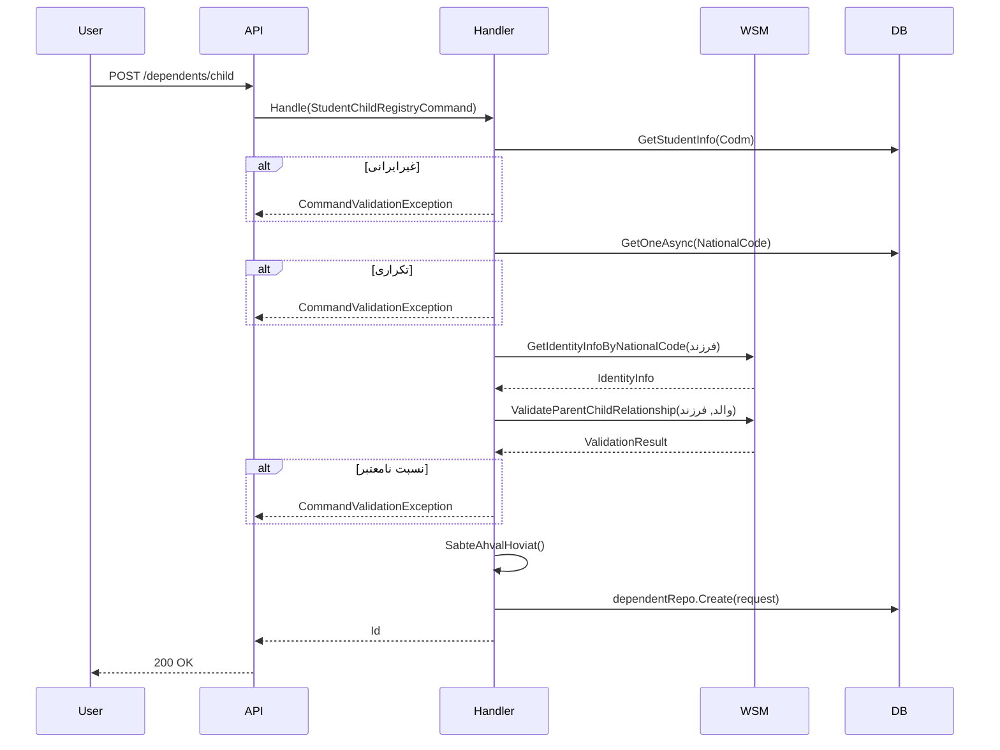

<div dir="rtl">

# StudentChildRegistryCommand.cs

**مسیر**: `Csis.Admission.Application/Features/StudentDependents/Commands/StudentChildRegistryCommand.cs`

---

## 1. Purpose (هدف)

**ثبت فرزند** برای دانشجو به عنوان تکفل با **اعتبارسنجی کامل نسبت فرزندی در ثبت احوال**. این Command از API ثبت احوال برای تأیید رابطه پدر/مادر-فرزند استفاده می‌کند.

---

## 2. مستندات XML موجود

```csharp
/// <inheritdoc/>
```

**تکمیل شده**: ثبت فرزند با اعتبارسنجی نسبت از ثبت احوال.

---

## 3. خلاصه اتفاقات

```
1. بررسی دانشجو ایرانی باشد
2. بررسی تکراری نبودن کد ملی فرزند
3. اعتبارسنجی نسبت پدر/مادر-فرزند با ثبت احوال
4. دریافت اطلاعات هویتی فرزند
5. ثبت در سیستم
```

---

## 4. اجزای اصلی

### Command:
```csharp
record StudentChildRegistryCommand(
    string NationalCode,              // کد ملی فرزند
    string BirthDate,                 // تاریخ تولد
    DependentChildRelation Relation,  // نوع نسبت (Son/Daughter)
    int? Codm = null                  // کد مرکز (اختیاری - از Token)
) : IRequest<long>
```

### Handler Dependencies:
- `ICsisWsmService` - اعتبارسنجی ثبت احوال
- `IStudentRepository` - اطلاعات دانشجو
- `ICurrentUserService` - Codm از Token
- `IStudentDependentRepository` - ثبت تکفل
- `IRepository<StudentSummary>`
- `IRepository<DependentSummary, long>` - بررسی تکراری

---

## 5. Flow

```
1. تنظیم Codm (از Token یا پارامتر)
   └─> currentUser.SetCodm(command)

2. بررسی تابعیت
   if (Citizenship != Iranian)
       └─> CommandValidationException

3. بررسی تکراری
   ├─> GetOneAsync(NationalCode)
   ├─> if (exists && Codm != student.Codm) → "تکفل طلبه دیگر"
   └─> if (exists) → "پیش از این ثبت شده"

4. اعتبارسنجی نسبت (SabteAhvalRelation)
   ├─> GetIdentityInfoByNationalCode(فرزند)
   ├─> ValidateParentChildRelationship(والد, فرزند)
   └─> if (!ValidRelation) → Exception

5. ساخت Request (SabteAhvalHoviat)
   └─> StudentDependentRegistryPrcRequest از اطلاعات ثبت احوال

6. ثبت
   └─> dependentRepo.Create(request)
```

---

## 6. Business Rules

### BR-1: Iranian Only
- فقط برای دانشجویان ایرانی
- پیام: "در سامانه سخا امکان ثبت اعضای خانواده برای طلاب غیر ایرانی وجود ندارد."

### BR-2: Uniqueness
- کد ملی فرزند نباید تکراری باشد (نه برای این دانشجو، نه برای دانشجوی دیگر)

### BR-3: Parent-Child Relationship Validation ⭐
- **API ویژه**: `ValidateParentChildRelationship`
- بررسی رابطه واقعی در ثبت احوال
- نوع رابطه بر اساس جنسیت والد:
  - **مرد**: `FatherChild`
  - **زن**: `MotherChild`

### BR-4: Auto-Fill از ثبت احوال
- تمام اطلاعات فرزند از ثبت احوال دریافت می‌شود
- مذهب و سادات بودن از والد کپی می‌شود

---

## 7. Error Handling

| Exception | شرط | پیام |
|-----------|------|------|
| `CommandValidationException` | غیرایرانی | "در سامانه سخا امکان ثبت اعضای خانواده برای طلاب غیر ایرانی وجود ندارد." |
| `CommandValidationException` | تکراری (طلبه دیگر) | "این کد ملی به عنوان تکفل برای طلبه دیگری ثبت شده است." |
| `CommandValidationException` | تکراری (همین طلبه) | "این کد ملی پیش از این به عنوان تکفل برای طلبه ثبت شده است." |
| `CommandValidationException` | کد ملی نامعتبر | "کد ملی یا تاریخ تولد وارد شده در ثبت احوال یافت نشد." |
| `CommandValidationException` | نسبت نامعتبر | "اطلاعات نسبت فرزندی در ثبت احوال ثبت نشده است." |

---

## 8. Risks & Notes

### امنیت:
- ✅ **Parent-Child Validation**: جلوگیری از ثبت فرزند غیرواقعی
- ✅ **Civil Registry API**: اعتبارسنجی قوی

### کارایی:
- ⚠️ **2 درخواست به WSM**:
  1. GetIdentityInfo (فرزند)
  2. ValidateParentChildRelationship
- می‌تواند کند باشد

### Code Quality:
- ✅ **Helper Methods**: `SabteAhvalRelation`, `SabteAhvalHoviat`
- ✅ جداسازی Concerns

### Business Logic:
- ⚠️ **Copy Parent Attributes**: `Religion`, `IsSadat` از والد
  - آیا همیشه صحیح است؟

---

## 9. Use Case های مرتبط

- **UC-040**: ثبت تکفل جدید (فرزند)
- **Validation**: نسبت فرزندی در ثبت احوال

---

## 10. نمودار جریان



---

## 11. خلاصه نکات کلیدی

| نکته | توضیح |
|------|-------|
| **نقش** | ثبت فرزند با اعتبارسنجی نسبت |
| **ورودی** | NationalCode + BirthDate + Relation + Codm? |
| **خروجی** | Id (long) |
| **Validation** | ⭐ Parent-Child Relationship API |
| **Iranian Only** | ✅ |
| **Uniqueness** | ✅ |
| **Civil Registry** | 2 API Calls |
| **Auto-Fill** | ✅ اطلاعات از ثبت احوال |

</div>
