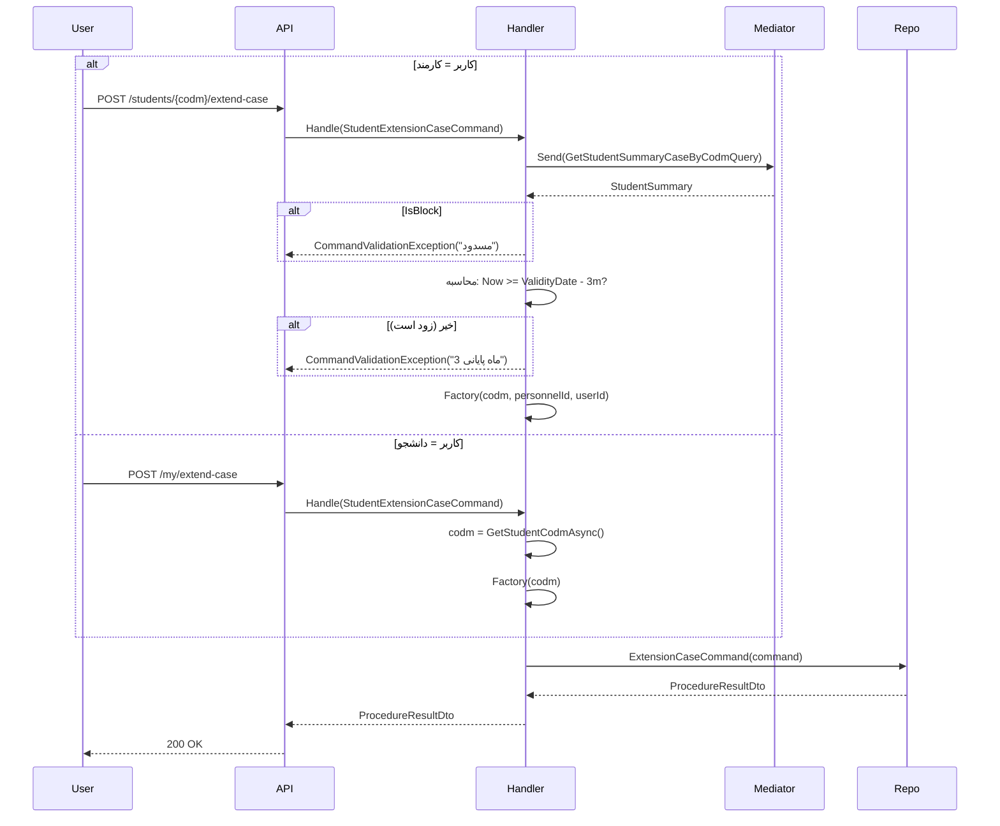

<div dir="rtl">

# StudentExtensionCaseCommand.cs

**مسیر**: `Csis.Admission.Application/Features/Students/Iranian/Commands/StudentExtensionCaseCommand.cs`

---

## 1. Purpose (هدف)

**تمدید پرونده دانشجو**. این Command امکان تمدید اعتبار پرونده را برای دانشجویان (خود یا توسط کارمند) فراهم می‌کند. تمدید فقط در **3 ماه پایانی** اعتبار پرونده امکان‌پذیر است.

---

## 2. مستندات XML موجود

```csharp
/// <summary>
/// تمدید پرونده
/// </summary>
```

**کامل**: تمدید زمان اعتبار پرونده دانشجو با محدودیت زمانی و بررسی وضعیت مسدودی.

---

## 3. خلاصه اتفاقات

```
1. تشخیص نوع کاربر (کارمند یا دانشجو)
2. برای کارمند: بررسی امکان تمدید (3 ماه پایانی + غیرمسدود)
3. ساخت Command مناسب
4. اجرای Stored Procedure تمدید
```

---

## 4. اجزای اصلی

### Command:
```csharp
sealed record StudentExtensionCaseCommand(int? Codm = null) : IRequest<ProcedureResultDto>
```

**یادداشت**: 
- برای **کارمند**: Codm ارسال می‌شود
- برای **دانشجو**: Codm از Token استخراج می‌شود

### Handler Dependencies:
- `IStudentRepository` - اجرای SP تمدید
- `IMediator` - Query برای بررسی شرایط
- `ICsisAuthenticatedUserService` - تشخیص نوع کاربر

---

## 5. Flow

```
1. تشخیص نوع کاربر
   isEmployee = IsEmployeeLoggedInAsync()

2. switch (isEmployee)
   
   case true (کارمند):
       ├─> بررسی امکان تمدید: CalcCanExtensionCase(Codm)
       │   ├─> GetStudentSummaryCaseByCodmQuery(Codm)
       │   ├─> if (IsBlock) → Exception
       │   ├─> محاسبه: Now >= (ValidityDate - 3 months)
       │   └─> if (خیر) → Exception
       └─> StudentExtensionCaseFactory(Codm, personnelId, userId)
   
   case false (دانشجو):
       ├─> codm = GetStudentCodmAsync() از Token
       └─> StudentExtensionCaseFactory(codm)

3. اجرای SP
   └─> repo.ExtensionCaseCommand(command)
```

---

## 6. Business Rules

### BR-1: Timing Restriction
- تمدید فقط در **3 ماه پایانی** اعتبار پرونده امکان‌پذیر است
- فرمول: `DateTime.Now >= (CaseValidityDate - 00000300)`
- `00000300` = 3 ماه به فرمت عددی (PersianInteger)

### BR-2: Block Status
- اگر پرونده مسدود باشد → تمدید امکان‌پذیر نیست

### BR-3: Data Source
- **کارمند**: `DataSource = Employee`
- **دانشجو**: `DataSource = Student`

### BR-4: User Context
- **کارمند**: `UserId` + `PersonnelId` ثبت می‌شود
- **دانشجو**: `UserId = Codm`

---

## 7. Error Handling

| Exception | شرط | پیام |
|-----------|------|------|
| `CommandValidationException` | پرونده مسدود | "پرونده شما مسدود می باشد. جهت رفع مسدودی با پشتیبانی تماس بگیرید." |
| `CommandValidationException` | زودتر از 3 ماه | "تمدید پرونده تنها در سه ماه پایانی اعتبار پرونده امکان پذیر می باشد." |

---

## 8. Risks & Notes

### Business Logic:
- ✅ **محدودیت زمانی منطقی**: 3 ماه قبل از انقضا
- ✅ بررسی وضعیت مسدودی
- ⚠️ **Hardcoded**: `00000300` (3 ماه) باید در تنظیمات باشد

### Code Quality:
- ✅ استفاده از Factory Pattern
- ✅ جداسازی کاربر/کارمند
- ❌ **Hardcoded Magic Number**: `00000300`
- ❌ **Hardcoded ApplicationId**: `66`

### کارایی:
- ⚠️ برای کارمند: یک Query اضافی (GetStudentSummaryCaseByCodmQuery)
- برای دانشجو: بدون Query اضافی (بررسی در SP)

---

## 9. Use Case های مرتبط

- **UC-014**: تمدید پرونده دانشجو
- **Actors**: دانشجو (خود) یا کارمند (برای دانشجو)
- **Precondition**: 
  - 3 ماه یا کمتر تا انقضا
  - پرونده غیرمسدود

---

## 10. نمودار جریان



---

## 11. خلاصه نکات کلیدی

| نکته | توضیح |
|------|-------|
| **نقش** | تمدید اعتبار پرونده دانشجو |
| **ورودی** | Codm (optional) |
| **خروجی** | ProcedureResultDto |
| **محدودیت زمانی** | 3 ماه پایانی اعتبار |
| **Actors** | دانشجو یا کارمند |
| **Validation** | مسدودی + زمان |
| **Hardcoded** | ⚠️ `00000300`, `ApplicationId = 66` |
| **Factory Pattern** | ✅ جداسازی کاربر/کارمند |

---

**پیشنهاد بهبود**:
1. انتقال `00000300` (3 ماه) به تنظیمات
2. انتقال `ApplicationId = 66` به Configuration
3. یکپارچه‌سازی بررسی مسدودی (در SP یا همه جا در Application)

</div>
