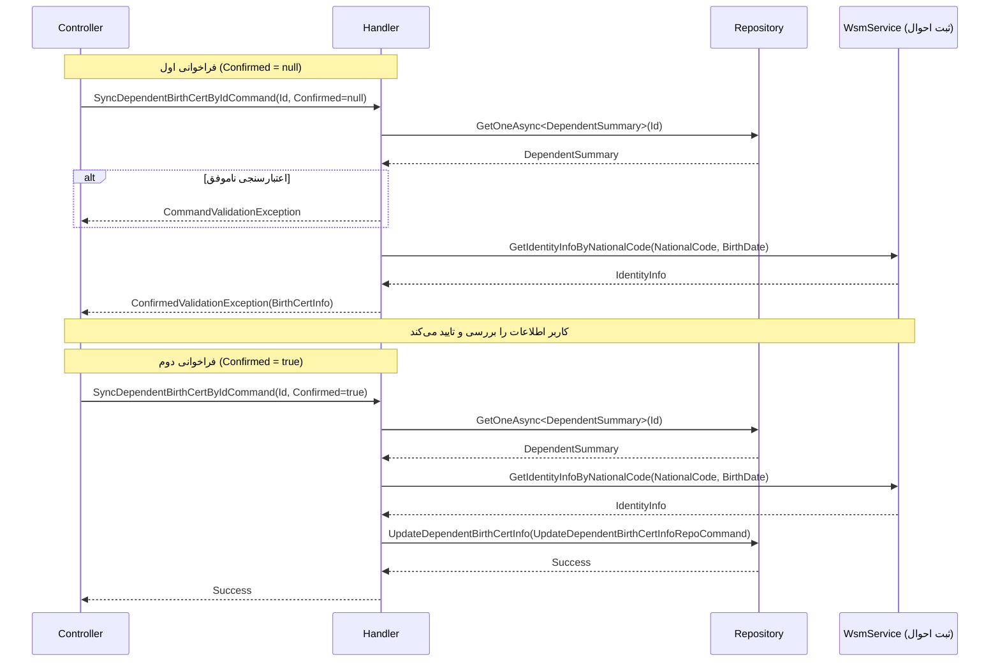

<div dir="rtl">

# SyncDependentBirthCertByIdCommand

## 📄 اطلاعات کلی

**مسیر فایل:**
```
Csis.Admission.Application/Features/Students/Iranian/Commands/SyncDependentBirthCertByIdCommand.cs
```

**Feature:** Students  
**نوع:** Command  
**هدف:** همگام‌سازی اطلاعات شناسنامه‌ای فرد تحت تکفل با ثبت احوال بر اساس شناسه

---

## 🎯 هدف (Purpose)

این Command برای **همگام‌سازی اطلاعات شناسنامه‌ای یک فرد تحت تکفل** از وب سرویس ثبت احوال استفاده می‌شود. برخلاف `SyncDependentBirthCertCommand` که بر اساس `Codm` عمل می‌کند، این Command بر اساس **شناسه منحصر به فرد** (`Id`) فرد تحت تکفل کار می‌کند.

**تفاوت کلیدی:**
- این Command با `Id` تحت تکفل کار می‌کند، نه `Codm`
- برای موارد خاص که نیاز به همگام‌سازی مستقیم یک رکورد تحت تکفل است
- عملیاتی موردی و تخصصی‌تر نسبت به Sync کلی

---

## 📝 ساختار Command

### ورودی (Request)

```csharp
public sealed record SyncDependentBirthCertByIdCommand : IRequest
{
    /// <summary>شناسه فرد تحت تکفل</summary>
    public long Id { get; init; }
    
    /// <summary>تایید</summary>
    [JsonIgnore]
    public bool? Confirmed { get; set; }
}
```

**پارامترها:**
- `Id`: شناسه منحصر به فرد رکورد در جدول `DependentSummary`
- `Confirmed`: تایید کاربر برای اعمال تغییرات (الگوی Two-Step Confirmation)

### خروجی (Response)

```csharp
void  // هیچ خروجی ندارد (یا ConfirmedValidationException)
```

---

## 🔄 جریان اجرا (Execution Flow)

### مراحل:

```
1. دریافت اطلاعات فرد تحت تکفل
   ├─> GetOneAsync<DependentSummary>(Id)
   └─> شامل: NationalCode, BirthDate, Codm

2. اعتبارسنجی اولیه
   ├─> بررسی NationalCode (نباید خالی باشد)
   ├─> بررسی BirthDate (نباید 0 یا null باشد)
   └─> در صورت خطا: پرتاب CommandValidationException

3. آماده‌سازی درخواست ثبت احوال
   ├─> تبدیل BirthDate به String
   ├─> حذف "/" از تاریخ
   └─> ایجاد GetIdentityInfoByNationalCodeRequestApiM

4. استعلام از ثبت احوال
   ├─> فراخوانی wsmService.GetIdentityInfoByNationalCode
   ├─> دریافت IdentityInfo
   └─> اعتبارسنجی Nin (نباید خالی باشد)

5. استخراج اطلاعات شناسنامه
   ├─> فراخوانی BirthCertInfo()
   └─> شامل: NationalCode, FirstName, LastName, FatherName, IsSadat, BirthDate, ...

6. بررسی Confirmation
   ├─> اگر Confirmed != true
   └──> پرتاب ConfirmedValidationException (نمایش اطلاعات برای تایید)

7. بروزرسانی اطلاعات (Confirmed == true)
   ├─> ایجاد UpdateDependentBirthCertInfoRepoCommand
   ├─> تنظیم DataSource = WebService
   ├─> تنظیم PersonnelId و UserId
   └─> اجرای studentRepo.UpdateDependentBirthCertInfo()
```

### نمودار توالی (Sequence Diagram)



---

## 📦 وابستگی‌ها (Dependencies)

### Repository ها
- `IStudentRepository`: برای بروزرسانی اطلاعات تحت تکفل
  - متد: `UpdateDependentBirthCertInfo(UpdateDependentBirthCertInfoRepoCommand)`
- `IRepository<DependentSummary, long>`: دسترسی سریع به خلاصه اطلاعات فرد تحت تکفل

### سرویس‌ها
- `ICsisWsmService`: وب سرویس ثبت احوال
  - متد: `GetIdentityInfoByNationalCode(request, cancellation)`
- `ICsisAuthenticatedUserService`: اطلاعات کاربر احراز هویت شده
  - `GetPersonnelIdAsync()`: شناسه کارمند
  - `GetUserIdAsync()`: شناسه کاربر

### DTO ها
- `UpdateDependentBirthCertInfoRepoCommand`: دستور بروزرسانی Repository
- `GetIdentityInfoByNationalCodeRequestApiM`: درخواست API ثبت احوال

### Enums
- `DataSource`: منبع داده (WebService)

### Exceptions
- `CommandValidationException`: اعتبارسنجی ناموفق
- `ConfirmedValidationException`: نیاز به تایید کاربر

---

## ⚙️ قوانین کسب‌وکار (Business Rules)

### اعتبارسنجی‌ها (Validations)

1. **کد ملی اجباری:**
   - NationalCode نباید null یا empty باشد
   - پیام خطا: "کد ملی فرد تحت تکفل یا نامعتبر است یا وجود ندارد."

2. **تاریخ تولد اجباری:**
   - BirthDate نباید 0 یا null باشد
   - پیام خطا: "تاریخ تولد فرد تحت تکفل یا نامعتبر است یا وجود ندارد."

3. **اعتبارسنجی پاسخ ثبت احوال:**
   - Nin (شناسه ملی) نباید خالی باشد
   - پیام خطا: "اطلاعات در ثبت احوال یافت نشد/ کد ملی و تاریخ تولد اشتباه وارد شده‌اند."

### الگوی Two-Step Confirmation

این Command از **الگوی تایید دو مرحله‌ای** استفاده می‌کند:

**مرحله 1 (نمایش):**
- پارامتر `Confirmed` برابر `null` یا `false` است
- اطلاعات از ثبت احوال دریافت می‌شود
- `ConfirmedValidationException` پرتاب می‌شود
- اطلاعات در Response به کاربر نمایش داده می‌شود

**مرحله 2 (اجرا):**
- کاربر اطلاعات را بررسی و تایید می‌کند
- پارامتر `Confirmed` برابر `true` ارسال می‌شود
- اطلاعات در دیتابیس ذخیره می‌شوند

### فیلدهای بروزرسانی شده

```csharp
- BirthDate: از ثبت احوال
- IsSadat: از ثبت احوال
- NationalCode: از ثبت احوال (تایید)
- Religion: از رکورد فعلی (بدون تغییر)
- YektaCode: null
- BirthCertDescription: null
- DataSource: WebService
- ApplicationId: 66
- PersonnelId: کاربر جاری
- UserId: کاربر جاری
```

---

## 🔍 نکات پیاده‌سازی (Implementation Notes)

### 1. تفاوت با SyncDependentBirthCertCommand

| ویژگی | SyncDependentBirthCertByIdCommand | SyncDependentBirthCertCommand |
|------|----------------------------------|-------------------------------|
| **پارامتر ورودی** | `Id` (شناسه رکورد) | `Codm` (کد دانشجو) |
| **کاربرد** | همگام‌سازی یک رکورد خاص | همگام‌سازی همه افراد تحت تکفل |
| **دامنه** | تک رکورد | چند رکورد |

### 2. تبدیل تاریخ

```csharp
var birthDateString = dependent.BirthDate.ToString();
// تبدیل به فرمت مورد نیاز ثبت احوال
birthDateString.Replace("/", "")
```

- تاریخ باید بدون "/" برای ثبت احوال ارسال شود
- فرمت: `13720515` بجای `1372/05/15`

### 3. Hardcoded ApplicationId

```csharp
ApplicationId = 66
```

⚠️ **نکته امنیتی:**
- ApplicationId به صورت Hardcoded است
- بهتر است از Configuration یا Enum خوانده شود

### 4. مدیریت خطا

```csharp
if (string.IsNullOrEmpty(identityInfo.Nin))
{
    throw new CommandValidationException(nameof(identityInfo), "...");
}
```

- استفاده از `nameof` برای مشخص کردن فیلد خطا
- پیام‌های خطای واضح و کاربرپسند

---

## 🎯 Use Cases

### UC-DependentSync-ById: همگام‌سازی فرد تحت تکفل با شناسه

**Actor:** کارمند یا سیستم

**Preconditions:**
- فرد تحت تکفل در سیستم موجود باشد
- کد ملی و تاریخ تولد معتبر باشند

**Main Flow:**
1. کاربر شناسه (`Id`) فرد تحت تکفل را وارد می‌کند
2. سیستم اطلاعات فعلی را دریافت می‌کند
3. سیستم از ثبت احوال استعلام می‌کند
4. سیستم اطلاعات جدید را نمایش می‌دهد
5. کاربر اطلاعات را بررسی و تایید می‌کند
6. سیستم اطلاعات را بروزرسانی می‌کند

**Postconditions:**
- اطلاعات شناسنامه‌ای فرد تحت تکفل با ثبت احوال همگام است
- `DataSource` برابر `WebService` است

---

## ⚠️ ریسک‌ها و نکات (Risks & Notes)

### امنیتی (Security)

1. ✅ **Authorization:** 
   - استفاده از `ICsisAuthenticatedUserService` برای شناسایی کاربر
   - ثبت PersonnelId و UserId در هر تراکنش

2. ⚠️ **Data Validation:**
   - اعتبارسنجی کد ملی فقط بررسی خالی بودن است
   - بهتر است اعتبارسنجی فرمت و checksum کد ملی نیز انجام شود

### عملکردی (Performance)

1. ⚠️ **External Service Dependency:**
   - وابستگی کامل به وب سرویس ثبت احوال
   - در صورت عدم دسترسی، Command شکست می‌خورد
   - نیاز به مکانیزم Retry یا Fallback

2. ✅ **Query Optimization:**
   - استفاده از `GetOneAsync` با Index بر روی `Id`
   - کوئری تک رکورد و سریع

### کیفیت کد (Code Quality)

1. ✅ **Separation of Concerns:**
   - منطق Business در Handler
   - عملیات Repository جدا

2. ⚠️ **Magic Numbers:**
   ```csharp
   ApplicationId = 66
   ```
   - بهتر است از Constant یا Configuration استفاده شود

3. ✅ **Error Messages:**
   - پیام‌های خطا واضح و به فارسی
   - کمک به debugging

---

## 📊 خلاصه نکات کلیدی

| جنبه | توضیح |
|------|-------|
| **الگوی طراحی** | CQRS + MediatR + Two-Step Confirmation |
| **منبع داده** | Web Service (ثبت احوال) |
| **استفاده** | همگام‌سازی موردی فرد تحت تکفل |
| **تفاوت با Sync عمومی** | کار با `Id` بجای `Codm` |
| **Authorization** | ✅ دارد (PersonnelId, UserId) |
| **Validation** | ✅ NationalCode, BirthDate, Nin |
| **External Dependency** | ⚠️ وابستگی کامل به ثبت احوال |
| **Audit** | ✅ ثبت PersonnelId و UserId |
| **مستندات XML** | ✅ موجود |

---

## 🔗 لینک‌های مرتبط

### Commands مرتبط
- [SyncDependentBirthCertCommand.md](./SyncDependentBirthCertCommand.md) - همگام‌سازی عمومی افراد تحت تکفل
- [UpdateDependentBirthCertCommand.md](./UpdateDependentBirthCertCommand.md) - بروزرسانی دستی اطلاعات شناسنامه‌ای

### Services
- [BirthCertService.md](../../../../Services/BirthCertService.md) - سرویس دریافت اطلاعات شناسنامه‌ای
- [WsmService.md](../../../../Services/WsmService.md) - وب سرویس ثبت احوال

---

**نسخه مستندات:** 1.0  
**تاریخ ایجاد:** 2026-01-03

</div>
