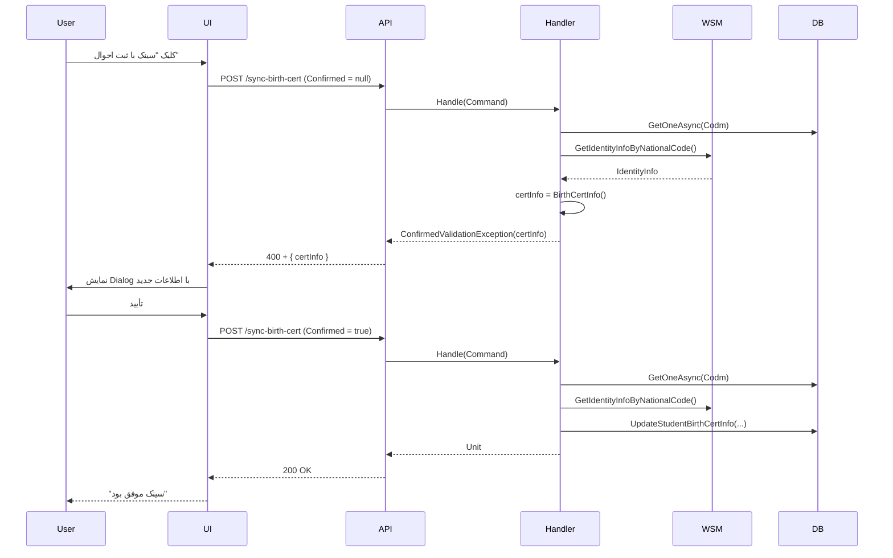

<div dir="rtl">

# SyncStudentBirthCertByCodmCommand.cs

**مسیر**: `Csis.Admission.Application/Features/Students/Iranian/Commands/SyncStudentBirthCertByCodmCommand.cs`

---

## 1. Purpose (هدف)

**سینک کردن (همگام‌سازی) اطلاعات شناسنامه‌ای دانشجو با ثبت احوال**. این Command اطلاعات جدید را از سرویس ثبت احوال دریافت کرده و **پس از تأیید کاربر** در سیستم ذخیره می‌کند.

---

## 2. مستندات XML موجود

```csharp
/// <summary>همگام سازی اطلاعات شناسنامه‌ای با ثبت احوال - پایان فلو با تایید یا رد شما</summary>
```

**یادداشت**: XML Comment دارای مشکل encoding است (نویسه‌های فارسی خراب شده).

---

## 3. خلاصه اتفاقات

```
1. دریافت اطلاعات دانشجو از دیتابیس
2. اعتبارسنجی کد ملی و تاریخ تولد (نباید خالی باشد)
3. دریافت اطلاعات جدید از ثبت احوال
4. اگر کاربر تأیید نکرده → پرتاب ConfirmedValidationException با اطلاعات جدید
5. اگر تأیید کرده → بروزرسانی در دیتابیس
```

---

## 4. اجزای اصلی

### Command:
```csharp
sealed record SyncStudentBirthCertByCodmCommand : IRequest
{
    int Codm               // کد مرکز خدمات
    
    [JsonIgnore]
    bool? Confirmed        // تأیید کاربر (از UI)
}
```

**یادداشت**: `Confirmed` با `JsonIgnore` مشخص شده - احتمالاً از QueryString یا Header می‌آید.

### Handler Dependencies:
- `IStudentRepository` - بروزرسانی
- `IRepository<StudentSummary>` - بازیابی دانشجو
- `ICsisWsmService` - دریافت از ثبت احوال
- `ICsisAuthenticatedUserService` - اطلاعات کاربر جاری

---

## 5. Flow

```
1. دریافت دانشجو
   └─> studentSummaryRpo.GetOneAsync(Codm)

2. Validation
   if (NationalCode خالی)
       └─> CommandValidationException
   if (BirthDate خالی یا 0)
       └─> CommandValidationException

3. دریافت از ثبت احوال
   └─> wsmService.GetIdentityInfoByNationalCode(NationalCode, BirthDate)
   └─> if (Nin خالی) → Exception

4. Parse اطلاعات
   └─> certInfo = identityInfo.BirthCertInfo()

5. بررسی تأیید کاربر
   if (Confirmed != true)
       └─> throw ConfirmedValidationException({
             NationalCode, FirstName, LastName, FatherName,
             IsSadat, BirthDate, BirthCertNumber, ...
           })

6. بروزرسانی (اگر تأیید شده)
   └─> studentRepo.UpdateStudentBirthCertInfo(...)
```

---

## 6. Business Rules

### BR-1: Two-Phase Confirmation
این Command با **الگوی Two-Phase** کار می‌کند:
- **Phase 1** (`Confirmed = null/false`): دریافت اطلاعات + نمایش به کاربر → ConfirmedValidationException
- **Phase 2** (`Confirmed = true`): بروزرسانی واقعی

### BR-2: Prerequisites
- دانشجو باید `NationalCode` و `BirthDate` داشته باشد

### BR-3: Data Source
- `DataSource = WebService` (برخلاف بروزرسانی دستی که `Employee` یا `Student` است)

### BR-4: Audit Fields
- `UserId`, `PersonnelId`, `ApplicationId` ثبت می‌شود

---

## 7. Error Handling

| Exception | شرط | پیام |
|-----------|------|------|
| `CommandValidationException` | NationalCode خالی | "این کد ملی در سیستم ثبت نشده است." |
| `CommandValidationException` | BirthDate خالی | "تاریخ تولد دانشجو در سیستم ثبت نشده است." |
| `CommandValidationException` | ثبت احوال نامعتبر | "اطلاعات از ثبت احوال یافت نشد/ کد ملی و تاریخ تولد اشتباه است." |
| `ConfirmedValidationException` | کاربر تأیید نکرده | (شامل اطلاعات جدید برای نمایش) |

---

## 8. Risks & Notes

### امنیت:
- ✅ اعتبارسنجی با ثبت احوال
- ✅ Two-Phase Confirmation (کاربر باید تأیید کند)

### UX:
- ✅ **الگوی Confirmation عالی**: کاربر قبل از ذخیره، اطلاعات جدید را می‌بیند
- این الگو از خطاهای ناخواسته جلوگیری می‌کند

### Code Quality:
- ⚠️ **XML Comment Encoding Issue**: باید اصلاح شود
- ✅ استفاده از `ConfirmedValidationException` برای Confirmation Flow

### Concurrency:
- ⚠️ اگر دو کاربر همزمان سینک کنند، ممکن است مشکل ایجاد شود
- **پیشنهاد**: Optimistic Locking

---

## 9. Use Case های مرتبط

- **UC-012**: سینک با ثبت احوال
- **Flow**: 
  1. کاربر کلیک "سینک با ثبت احوال"
  2. API Call با `Confirmed = null`
  3. Frontend دریافت ConfirmedValidationException → نمایش Dialog
  4. کاربر تأیید می‌کند
  5. API Call با `Confirmed = true`
  6. بروزرسانی

مرتبط با:
- [UpdateStudentBirthCertCommand.md](./UpdateStudentBirthCertCommand.md)

---

## 10. نمودار جریان (Two-Phase)



---

## 11. خلاصه نکات کلیدی

| نکته | توضیح |
|------|-------|
| **نقش** | سینک اطلاعات شناسنامه با ثبت احوال |
| **ورودی** | Codm + Confirmed (optional) |
| **خروجی** | Unit یا ConfirmedValidationException |
| **الگو** | Two-Phase Confirmation ⭐ |
| **UX** | ✅ کاربر قبل از ذخیره، اطلاعات را می‌بیند |
| **Data Source** | WebService (خودکار) |
| **Audit** | ✅ UserId, PersonnelId ثبت می‌شود |
| **XML Comment** | ⚠️ Encoding Issue |

---

**نکته مهم**: این الگوی Two-Phase Confirmation یک **Best Practice** عالی است که از خطاهای ناخواسته جلوگیری می‌کند.

</div>
