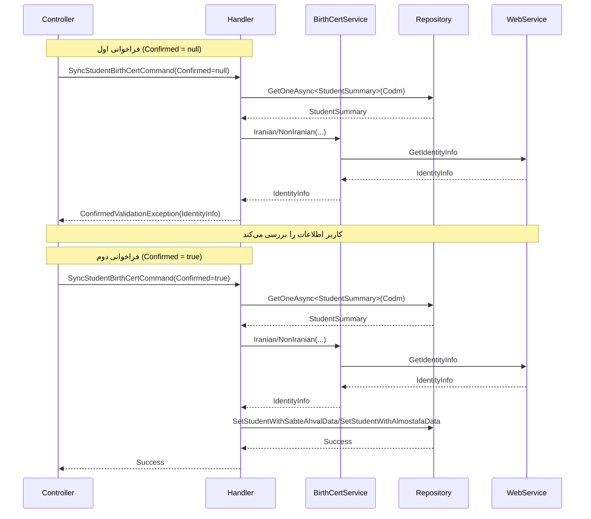

<div dir="rtl">

# SyncStudentBirthCertCommand

## 📄 اطلاعات کلی

**مسیر فایل:**
```
Csis.Admission.Application/Features/Students/Iranian/Commands/SyncStudentBirthCertCommand.cs
```

**Feature:** Students  
**نوع:** Command  
**هدف:** همگام‌سازی اطلاعات شناسنامه‌ای دانشجو با وب سرویس‌های خارجی

---

## 🎯 هدف (Purpose)

این Command برای **همگام‌سازی خودکار اطلاعات شناسنامه‌ای** دانشجو از منابع معتبر استفاده می‌شود:
- **دانشجویان ایرانی**: از وب سرویس **ثبت احوال**
- **دانشجویان غیرایرانی**: از وب سرویس **المصطفی** (Almostafa)

این فرآیند اطمینان می‌دهد که اطلاعات دانشجو با منابع رسمی همخوانی دارد.

---

## 📝 ساختار Command

### ورودی (Request)

```csharp
public sealed record SyncStudentBirthCertCommand : IRequest
{
    /// <summary>کد مرکز خدمات</summary>
    public int Codm { get; init; }

    /// <summary>تایید</summary>
    [JsonIgnore]
    public bool? Confirmed { get; set; }
}
```

**پارامترها:**
- `Codm`: کد یکتای دانشجو در سیستم
- `Confirmed`: تایید کاربر برای اعمال تغییرات (الگوی Two-Step Confirmation)

**توضیح `[JsonIgnore]`:**
- این فیلد در API نمایش داده نمی‌شود
- فقط برای لاجیک داخلی استفاده می‌شود
- در فراخوانی اول `null` است، در فراخوانی دوم `true`

### خروجی (Response)

```csharp
void  // هیچ خروجی ندارد (یا ConfirmedValidationException)
```

---

## 🔄 جریان اجرا (Execution Flow)

### مراحل:

```
1. دریافت خلاصه اطلاعات دانشجو
   ├─> GetOneAsync<StudentSummary>(Codm)
   └─> شامل: NationalCode, BirthDate, Citizenship, YektaCode
   
2. بررسی Confirmation
   ├─> اگر Confirmed != true
   ├──> دریافت اطلاعات از وب سرویس
   └──> پرتاب ConfirmedValidationException (نمایش به کاربر)
   
3. اگر Confirmed == true
   ├─> بر اساس Citizenship:
   │   ├─> Iranian → SyncIranian()
   │   └─> NonIranian → SyncNonIranian()
   
4. SyncIranian:
   ├─> دریافت اطلاعات از ثبت احوال
   ├─> دریافت اطلاعات کاربر جاری
   └─> اجرای SP: SetStudentWithSabteAhvalData
   
5. SyncNonIranian:
   ├─> دریافت اطلاعات از المصطفی
   ├─> دریافت اطلاعات کاربر جاری
   └─> اجرای SP: SetStudentWithAlmostafaData
```

### نمودار توالی (Sequence Diagram)



---

## 📦 وابستگی‌ها (Dependencies)

### سرویس‌ها
- `IStudentRepository`: عملیات مربوط به دانشجو
- `IRepository<StudentSummary>`: دسترسی سریع به خلاصه اطلاعات دانشجو
- `IBirthCertService`: سرویس دریافت اطلاعات شناسنامه‌ای از وب سرویس‌ها
  - `Iranian(nationalCode, birthDate)`: برای دانشجویان ایرانی
  - `NonIranian(yektaCode)`: برای دانشجویان غیرایرانی
- `ICurrentUserService`: اطلاعات کاربر جاری

### DTO ها
- `SetStudentWithSabteAhvalDataRepoCommand`: Command مخزن برای دانشجویان ایرانی
- `SetStudentWithAlmostafaDataRepoCommand`: Command مخزن برای دانشجویان غیرایرانی
- `IdentityInfo` (از BirthCertService): اطلاعات دریافتی از وب سرویس

### Enums
- `Citizenship`: Iranian, NonIranian
- `DataSource`: WebService (همیشه)

### Exceptions
- `ConfirmedValidationException`: استثنای خاص برای الگوی Two-Step Confirmation

---

## ⚙️ قوانین کسب‌وکار (Business Rules)

### BR-1: الگوی Two-Step Confirmation
این Command از الگوی **تایید دو مرحله‌ای** استفاده می‌کند:

**مرحله 1 (Confirmed = null):**
1. دریافت اطلاعات از وب سرویس
2. نمایش اطلاعات به کاربر
3. پرتاب `ConfirmedValidationException` با اطلاعات دریافتی
4. کاربر تغییرات را بررسی می‌کند

**مرحله 2 (Confirmed = true):**
1. دریافت مجدد اطلاعات از وب سرویس
2. اعمال تغییرات در پایگاه داده
3. بازگشت موفقیت

**منطق:**
- جلوگیری از تغییرات ناخواسته
- کاربر می‌تواند قبل از اعمال، تغییرات را ببیند
- افزایش اعتماد کاربر

### BR-2: دانشجویان ایرانی
- استفاده از کد ملی و تاریخ تولد
- اطلاعات از وب سرویس **ثبت احوال**
- فیلدهای دریافتی:
  - نام، نام خانوادگی، نام پدر
  - شماره شناسنامه، سری، سریال
  - جنسیت
  - وضعیت سادات (IsSadat)
  - وضعیت فوت (IsDead, DeathDate)

### BR-3: دانشجویان غیرایرانی
- استفاده از کد یکتا (YektaCode)
- اطلاعات از وب سرویس **المصطفی**
- فیلدهای دریافتی:
  - نام، نام خانوادگی، نام پدر
  - شماره پاسپورت (⚠️ هاردکد شده: "!!!")
  - ملیت
  - تاریخ انقضای اقامت (⚠️ هاردکد شده: 0)
  - جنسیت
  - وضعیت فوت

### BR-4: Audit Trail
- ثبت `UserId` و `PersonnelId` کاربر انجام دهنده
- ثبت `ApplicationId` (66)
- ثبت `DataSource` (همیشه WebService)

---

## 🐛 مدیریت خطا (Error Handling)

### استثناها

1. **ConfirmedValidationException**
   - در فراخوانی اول (Confirmed != true)
   - شامل اطلاعات دریافتی از وب سرویس
   - کاربر اطلاعات را می‌بیند و تصمیم می‌گیرد

2. **دانشجو یافت نشد**
   - `Codm` نامعتبر

3. **خطای وب سرویس**
   - اتصال به ثبت احوال/المصطفی قطع است
   - کد ملی/یکتا نامعتبر
   - دانشجو در سیستم خارجی یافت نشد

4. **خطای Stored Procedure**
   - مشکل در ذخیره اطلاعات

---

## 🔒 امنیت و اعتبارسنجی (Security & Validation)

### اعتبارسنجی
- ⚠️ **هیچ Validator صریحی وجود ندارد**
- باید اضافه شود:
  - `Codm > 0`

### احراز هویت
- نیاز به احراز هویت دارد
- استفاده از `ICurrentUserService` برای `UserId` و `PersonnelId`

### مجوز
- باید چک شود کاربر مجاز به همگام‌سازی اطلاعات است
- دانشجو: فقط اطلاعات خودش
- کارمند: با مجوز مناسب

---

## 🚨 مشکلات و نکات (Issues & Notes)

### ⚠️ مشکل 1: مقادیر هاردکد شده برای غیرایرانیان
```csharp
PassportNumber: "!!!",
ResidenceExpireDate: 0,
```
- شماره پاسپورت همیشه "!!!" است ❌
- تاریخ انقضای اقامت همیشه 0 است ❌
- **این مقادیر باید از وب سرویس دریافت شوند**

### ⚠️ مشکل 2: فراخوانی دوباره وب سرویس
در هر دو مرحله (Confirmation و Execute) وب سرویس فراخوانی می‌شود:
```csharp
// مرحله 1
var info = await birthCertService.Iranian(...);  // فراخوانی اول
throw new ConfirmedValidationException(info);

// مرحله 2
var info = await birthCertService.Iranian(...);  // فراخوانی دوم
await studentRepo.SetStudentWithSabteAhvalData(sync);
```
**مشکل:**
- افزایش تعداد فراخوانی‌های وب سرویس (2 بار به جای 1 بار)
- احتمال تغییر داده بین دو فراخوانی
- افزایش زمان پاسخ

**راه حل:**
- Cache کردن اطلاعات مرحله اول
- استفاده از اطلاعات Cache شده در مرحله دوم

### ✅ نکته مثبت 1: استفاده از StudentSummary
```csharp
var student = await studentSummaryRpo.GetOneAsync(x => x.Codm == command.Codm, false, cancellation);
```
- بهینه: فقط فیلدهای لازم دریافت می‌شود
- سریع: جدول Summary معمولاً Index شده است

### ✅ نکته مثبت 2: الگوی Two-Step Confirmation
- جلوگیری از تغییرات اشتباهی
- کاربر کنترل کامل دارد
- افزایش اعتماد

### 💡 پیشنهاد بهبود 1: Cache کردن نتیجه وب سرویس
```csharp
public sealed record SyncStudentBirthCertCommand : IRequest
{
    public int Codm { get; init; }
    
    [JsonIgnore]
    public bool? Confirmed { get; set; }
    
    // اضافه کردن Cache
    [JsonIgnore]
    public IdentityInfo? CachedInfo { get; set; }
}

private async Task NotConfirmed(bool? confirmed, StudentSummary student, CancellationToken cancellation) {
    if (confirmed == true) { return; }

    IdentityInfo info;
    if (student.Citizenship == Citizenship.Iranian) {
        info = await birthCertService.Iranian(student.NationalCode, student.BirthDate.IntDateToString(), cancellation);
    } else {
        info = await birthCertService.NonIranian(student.YektaCode, cancellation);
    }
    
    // ذخیره در Cache
    var exception = new ConfirmedValidationException(info);
    exception.Data["CachedInfo"] = info;
    throw exception;
}

private async Task SyncIranian(StudentSummary student, IdentityInfo cachedInfo, CancellationToken cancellation) {
    // استفاده از cachedInfo به جای فراخوانی مجدد
    var info = cachedInfo ?? await birthCertService.Iranian(...);
    // ...
}
```

### 💡 پیشنهاد بهبود 2: رفع مقادیر هاردکد
```csharp
var sync = new SetStudentWithAlmostafaDataRepoCommand(
    student.Codm, 
    info.FirstName, 
    info.LastName,
    info.FatherName, 
    PassportNumber: info.PassportNumber ?? "N/A",  // اصلاح
    info.Nationality, 
    ResidenceExpireDate: info.ResidenceExpireDate ?? 0,  // اصلاح
    info.Gender,
    info.IsDead, 
    info.DeathDate.StringDateToInt(), 
    userId, 
    personnelId, 
    ApplicationId: 66, 
    0, 
    DataSource.WebService
);
```

### 💡 پیشنهاد بهبود 3: افزودن Validator
```csharp
public class SyncStudentBirthCertCommandValidator 
    : AbstractValidator<SyncStudentBirthCertCommand>
{
    public SyncStudentBirthCertCommandValidator()
    {
        RuleFor(x => x.Codm)
            .GreaterThan(0)
            .WithMessage("کد دانشجو نامعتبر است");
    }
}
```

---

## 🧪 Use Cases

### UC-012: همگام‌سازی اطلاعات شناسنامه‌ای با ثبت احوال

**Actor**: دانشجو / کارمند

**Preconditions**:
- دانشجو در سیستم موجود است
- اتصال به وب سرویس ثبت احوال/المصطفی برقرار است
- کد ملی/یکتا معتبر است

**Main Flow (دانشجوی ایرانی)**:
1. کاربر درخواست همگام‌سازی می‌دهد
2. سیستم اطلاعات را از ثبت احوال دریافت می‌کند
3. سیستم تغییرات را به کاربر نمایش می‌دهد (ConfirmedValidationException)
4. کاربر تغییرات را بررسی می‌کند
5. کاربر تغییرات را تایید می‌کند (Confirmed = true)
6. سیستم اطلاعات را مجدداً از ثبت احوال دریافت می‌کند
7. سیستم اطلاعات دانشجو را بروزرسانی می‌کند
8. تاریخچه تغییر ثبت می‌شود

**Postconditions**:
- اطلاعات دانشجو با ثبت احوال همگام است
- تاریخچه تغییر ثبت شده

**Alternative Flows**:
- A1: کاربر در مرحله 5 تایید نمی‌کند → عملیات لغو
- A2: اطلاعات در ثبت احوال یافت نشد → خطا
- A3: اتصال به وب سرویس قطع است → خطا

---

## 📚 مستندات مرتبط

### Commands مرتبط
- `UpdateStudentBirthCertCommand`: بروزرسانی دستی اطلاعات شناسنامه‌ای
- `SyncStudentBirthCertByCodmCommand`: نسخه دیگری از این Command
- `SyncDependentBirthCertCommand`: همگام‌سازی اطلاعات تحت تکفل

### Services مرتبط
- `IBirthCertService`: سرویس اصلی دریافت اطلاعات شناسنامه‌ای
  - `Iranian(nationalCode, birthDate)`: برای ایرانیان
  - `NonIranian(yektaCode)`: برای غیرایرانیان

### Stored Procedures
- `SetStudentWithSabteAhvalData`: بروزرسانی اطلاعات دانشجوی ایرانی
- `SetStudentWithAlmostafaData`: بروزرسانی اطلاعات دانشجوی غیرایرانی

---

## 📊 خلاصه

| جنبه | وضعیت | نمره |
|------|-------|------|
| **عملکرد** | متوسط (فراخوانی دوباره WS) | 6/10 |
| **امنیت** | متوسط (بدون Validator) | 6/10 |
| **کیفیت کد** | متوسط (مقادیر هاردکد) | 5/10 |
| **Maintainability** | نیاز به بهبود | 6/10 |
| **Business Logic** | خوب (الگوی Confirmation عالی) | 8/10 |
| **User Experience** | عالی (تایید دو مرحله‌ای) | 9/10 |

**توصیه کلی**: این Command از الگوی UX خوبی استفاده می‌کند اما نیاز به بهبودهای فنی دارد (Cache, رفع هاردکد, Validator).

</div>
