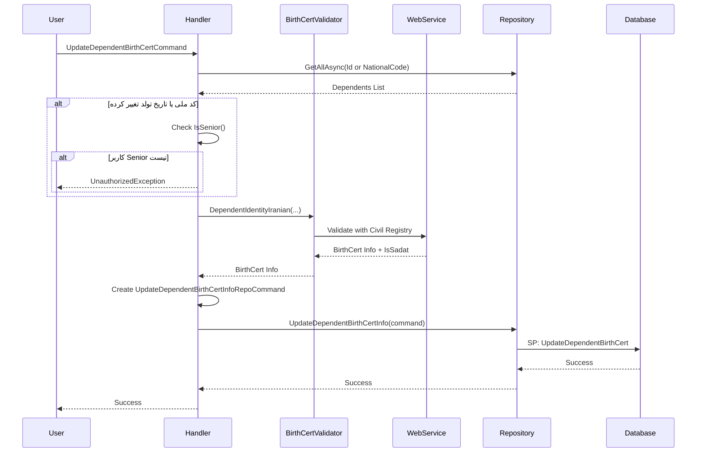

<div dir="rtl">

# UpdateDependentBirthCertCommand

## 📄 اطلاعات کلی

**مسیر فایل:**
```
Csis.Admission.Application/Features/Students/Iranian/Commands/UpdateDependentBirthCertCommand.cs
```

**Feature:** Students (Dependents)  
**نوع:** Command  
**هدف:** بروزرسانی اطلاعات شناسنامه‌ای افراد تحت تکفل دانشجو

---

## 🎯 هدف (Purpose)

این Command برای **بروزرسانی اطلاعات شناسنامه‌ای افراد تحت تکفل** (همسر، فرزندان) استفاده می‌شود. این Command:
1. اطلاعات را از **وب سرویس ثبت احوال** اعتبارسنجی می‌کند
2. **تغییر کد ملی و تاریخ تولد** فقط توسط کاربران ارشد (Senior) مجاز است
3. اطلاعات سادات (IsSadat) از وب سرویس دریافت می‌شود

**تفاوت با UpdateStudentBirthCertCommand:**
- برای افراد تحت تکفل (نه خود دانشجو)
- شناسه `Id` (long) به جای `Codm` (int)
- محدودیت دسترسی برای تغییر کد ملی/تاریخ تولد

---

## 📝 ساختار Command

### ورودی (Request)

```csharp
public sealed record UpdateDependentBirthCertCommand : IRequest
{
    public long Id { get; init; }              // شناسه تحت تکفل
    public string NationalCode { get; init; }  // کد ملی جدید
    public string BirthDate { get; init; }     // تاریخ تولد (string: 1380/01/01)
    public Religion Religion { get; init; }    // مذهب
    public string Description { get; init; }   // توضیحات
}
```

### خروجی (Response)

```csharp
void  // هیچ خروجی ندارد
```

---

## 🔄 جریان اجرا (Execution Flow)

### مراحل:

```
1. بررسی وجود تحت تکفل
   ├─> GetAllAsync(Id == Id OR NationalCode == NationalCode)
   ├─> بررسی تکراری نبودن کد ملی در دیگر افراد تحت تکفل
   └─> بررسی عدم وجود دانشجو با همین کد ملی
   
2. بررسی مجوز تغییر
   ├─> اگر کد ملی یا تاریخ تولد تغییر کرده
   ├──> بررسی IsSenior()
   └──> اگر Senior نیست → خطا
   
3. اعتبارسنجی با ثبت احوال
   ├─> birthCertValidator.DependentIdentityIranian(...)
   ├─> دریافت اطلاعات از وب سرویس
   └─> دریافت IsSadat
   
4. بروزرسانی اطلاعات
   ├─> UpdateDependentBirthCertInfoRepoCommand
   ├─> شامل: اطلاعات جدید + IsSadat + اطلاعات کاربر
   └─> اجرای SP
```

### نمودار توالی (Sequence Diagram)



---

## 📦 وابستگی‌ها (Dependencies)

### سرویس‌ها
- `IStudentRepository`: عملیات مربوط به تحت تکفل
- `ICurrentUserService`: اطلاعات کاربر جاری و بررسی IsSenior
- `IRepository<StudentSummary>`: بررسی عدم تکرار با دانشجویان
- `IRepository<DependentSummary, long>`: دسترسی به اطلاعات افراد تحت تکفل
- `BirthCertValidator`: اعتبارسنجی هویت با ثبت احوال

### DTO ها
- `UpdateDependentBirthCertInfoRepoCommand`: Command مخزن برای SP

### Entities
- `DependentSummary`: خلاصه اطلاعات افراد تحت تکفل
- `StudentSummary`: برای بررسی تکرار

### Enums
- `Religion`: شیعه، سنی، سایر ادیان
- `DataSource`: Employee (همیشه)

---

## ⚙️ قوانین کسب‌وکار (Business Rules)

### BR-1: محدودیت تغییر کد ملی و تاریخ تولد
```csharp
if (!isSenior && (command.NationalCode != dependent.NationalCode || 
                  command.BirthDate != dependent.BirthDate)) {
    throw new CommandValidationException("شما مجوز لازم برای تغییر کد ملی و تاریخ تولد را ندارید.");
}
```
- فقط کاربران **ارشد (Senior)** می‌توانند کد ملی و تاریخ تولد را تغییر دهند
- سایر کاربران فقط می‌توانند سایر فیلدها (مذهب، توضیحات) را تغییر دهند
- **دلیل**: جلوگیری از خطاهای جدی در اطلاعات هویتی

### BR-2: عدم تکرار کد ملی
```csharp
var dependents = await dependentSummaryRpo.GetAllAsync(
    x => x.Id == command.Id || x.NationalCode == command.NationalCode, ...);
var student = await studentSummaryRpo.ExistsAsync(
    x => x.NationalCode == command.NationalCode, ...);
```
- کد ملی نباید در سایر افراد تحت تکفل تکرار شود
- کد ملی نباید با کد ملی دانشجویان تکرار شود
- **توجه**: کد فعلی این بررسی را پیاده نکرده (⚠️ باگ احتمالی)

### BR-3: اعتبارسنجی با ثبت احوال
- تمام اطلاعات باید با **وب سرویس ثبت احوال** تایید شوند
- `IsSadat` از وب سرویس دریافت می‌شود (نه از ورودی کاربر)

### BR-4: Audit Trail
- ثبت `UserId` و `PersonnelId` کاربر
- ثبت `DataSource = Employee` (همیشه)
- ثبت `ApplicationId = 66`

---

## 🐛 مدیریت خطا (Error Handling)

### استثناها

1. **CommandValidationException (عدم مجوز)**
   ```csharp
   throw new CommandValidationException("شما مجوز لازم برای تغییر کد ملی و تاریخ تولد را ندارید.");
   ```

2. **استثنای Validator**
   - کد ملی نامعتبر
   - تاریخ تولد نامعتبر
   - عدم تطابق با ثبت احوال

3. **تحت تکفل یافت نشد**
   - `Id` نامعتبر

---

## 🔒 امنیت و اعتبارسنجی (Security & Validation)

### اعتبارسنجی
- ✅ استفاده از `BirthCertValidator` برای اعتبارسنجی کامل
- ⚠️ عدم بررسی تکرار کد ملی (باگ)

### احراز هویت
- نیاز به احراز هویت دارد
- استفاده از `ICurrentUserService`

### مجوز
- ✅ **Senior Check** برای تغییر کد ملی/تاریخ تولد
- کاربران معمولی: فقط مذهب و توضیحات

---

## 🚨 مشکلات و نکات (Issues & Notes)

### ⚠️ باگ: عدم بررسی تکرار کد ملی
```csharp
var dependents = await dependentSummaryRpo.GetAllAsync(
    x => x.Id == command.Id || x.NationalCode == command.NationalCode, false, cancellation);
var student = await studentSummaryRpo.ExistsAsync(
    x => x.NationalCode == command.NationalCode, false, cancellation);

// ⚠️ هیچ بررسی روی dependents.Count یا student نمی‌شود!
```

**مشکل:**
- دو Query اجرا می‌شود اما نتیجه استفاده نمی‌شود
- کد ملی تکراری تشخیص داده نمی‌شود

**راه حل:**
```csharp
// بررسی تکرار در افراد تحت تکفل
if (dependents.Count(x => x.Id != command.Id && x.NationalCode == command.NationalCode) > 0)
{
    throw new CommandValidationException("این کد ملی قبلاً برای فرد دیگری تحت تکفل ثبت شده است.");
}

// بررسی تکرار با دانشجویان
if (student)
{
    throw new CommandValidationException("این کد ملی متعلق به یک دانشجوست و نمی‌تواند برای تحت تکفل استفاده شود.");
}
```

### ✅ نکته مثبت: Senior Check
- جلوگیری از تغییرات غیرمجاز در فیلدهای حساس
- امنیت بالا

### 💡 پیشنهاد بهبود: یکسان‌سازی با UpdateStudentBirthCertCommand
- الگوی مشابه با `UpdateStudentBirthCertCommand`
- می‌توان کد مشترک را Extract کرد

---

## 🧪 Use Cases

### UC-041: بروزرسانی اطلاعات شناسنامه‌ای تحت تکفل

**Actor**: کارمند

**Preconditions**:
- کارمند احراز هویت شده
- تحت تکفل در سیستم موجود است
- اتصال به وب سرویس ثبت احوال برقرار است

**Main Flow**:
1. کارمند اطلاعات جدید را وارد می‌کند
2. سیستم بررسی می‌کند آیا کد ملی یا تاریخ تولد تغییر کرده
3. اگر تغییر کرده، سیستم بررسی می‌کند کاربر Senior است یا نه
4. سیستم اطلاعات را با ثبت احوال اعتبارسنجی می‌کند
5. سیستم `IsSadat` را از وب سرویس دریافت می‌کند
6. سیستم اطلاعات را بروزرسانی می‌کند

**Postconditions**:
- اطلاعات تحت تکفل بروز شده
- تاریخچه تغییر ثبت شده

**Alternative Flows**:
- A1: کاربر Senior نیست و کد ملی/تاریخ تولد تغییر کرده → خطای مجوز
- A2: کد ملی تکراری است → خطا (⚠️ فعلاً کار نمی‌کند)
- A3: اطلاعات در ثبت احوال یافت نشد → خطا

---

## 📚 مستندات مرتبط

### Commands مرتبط
- `UpdateStudentBirthCertCommand`: نسخه دانشجو (مشابه)
- `SyncDependentBirthCertCommand`: همگام‌سازی خودکار

### Services
- `BirthCertValidator`: اعتبارسنجی هویت
- `IBirthCertService`: سرویس وب ثبت احوال

---

## 📊 خلاصه

| جنبه | وضعیت | نمره |
|------|-------|------|
| **عملکرد** | خوب (اعتبارسنجی WS) | 7/10 |
| **امنیت** | خوب (Senior Check) | 8/10 |
| **کیفیت کد** | ضعیف (باگ تکرار) | 4/10 |
| **Business Logic** | خوب (قوانین واضح) | 8/10 |

**توصیه کلی**: Command به خوبی طراحی شده اما باگ بررسی تکرار کد ملی باید سریعاً رفع شود.

</div>
