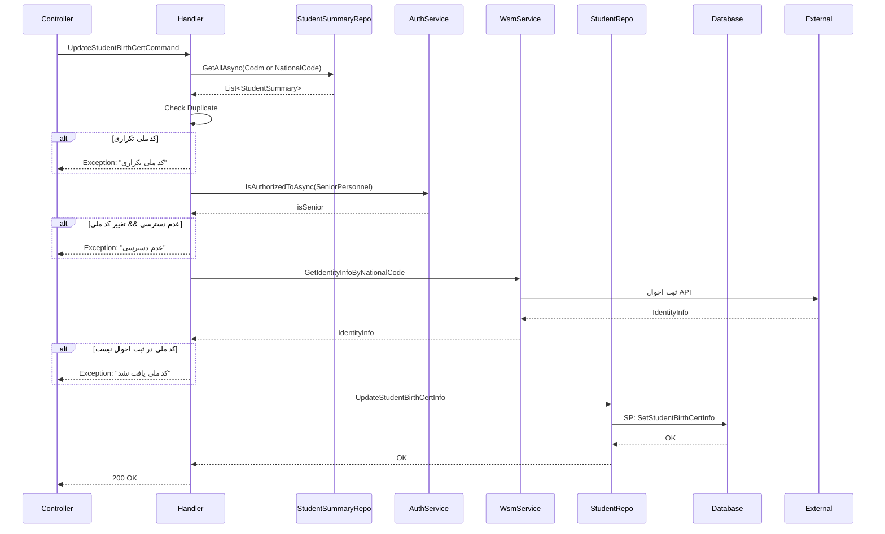

<div dir="rtl">

# UpdateStudentBirthCertCommand.cs

## 1. عنوان و مسیر

**نام فایل**: `UpdateStudentBirthCertCommand.cs`

**مسیر کامل**: `/Csis.Admission.Application/Features/Students/Commands/UpdateStudentBirthCertCommand.cs`

---

## 2. Purpose (نقش فایل)

این فایل شامل **Command و Handler** برای بروزرسانی اطلاعات شناسنامه‌ای دانشجو است. این عملیات شامل تغییر کد ملی، تاریخ تولد و مذهب با **اعتبارسنجی از ثبت احوال** می‌باشد.

---

## 3. مستندات XML موجود

```csharp
/// <summary>بروز رسانی اطلاعات شناسنامه ای</summary>
public sealed record UpdateStudentBirthCertCommand : IRequest
```

**استنباط از کد**: این Command اطلاعات حیاتی هویتی دانشجو را بروزرسانی می‌کند و نیازمند سطح دسترسی بالا (Senior Personnel) برای تغییر کد ملی و تاریخ تولد است.

---

## 4. اجزای اصلی

### 4.1. Command (Record)

```csharp
public sealed record UpdateStudentBirthCertCommand : IRequest
{
    /// <summary>کد مرکز خدمات</summary>
    public int Codm { get; init; }

    /// <summary>کد ملی</summary>
    public string NationalCode { get; init; }

    /// <summary>تاریخ تولد</summary>
    public string BirthDate { get; init; }

    /// <summary>مذهب</summary>
    public Religion Religion { get; init; }

    /// <summary>توضیحات</summary>
    public string Description { get; init; }
}
```

**نکات**:
- استفاده از `record` برای Immutability
- `IRequest` بدون Generic → بدون Return Value (void)
- تمام Properties دارای XML Comment فارسی

---

### 4.2. Handler (Class)

```csharp
internal sealed class UpdateStudentBirthCertCommandHandler : IRequestHandler<UpdateStudentBirthCertCommand>
{
    private readonly IStudentRepository studentRepo;
    private readonly IRepository<StudentSummary> studentSummaryRepo;
    private readonly IRepository<DependentSummary, long> dependentSummaryRepo;
    private readonly ICsisAuthenticatedUserService authenticatedUser;
    private readonly ICsisWsmService wsmService;
    
    // Constructor با DI
    public UpdateStudentBirthCertCommandHandler(...) { }
    
    // Handler Method
    public async Task Handle(UpdateStudentBirthCertCommand command, CancellationToken cancellation) { }
    
    // Private Validation Method
    private async Task ValidateIdentityInfo(UpdateStudentBirthCertCommand command, CancellationToken cancellation) { }
}
```

---

## 5. Flow داخل فایل

### مرحله به مرحله:

#### Step 1: بررسی تکراری نبودن کد ملی

```csharp
var students = await studentSummaryRepo.GetAllAsync(
    x => x.Codm == command.Codm || x.NationalCode == command.NationalCode,
    false,
    cancellation
);

if (students.Count > 1) {
    throw new CommandValidationException("این کد ملی قبلاً در سامانه ثبت شده است.");
}
```

**Business Rule**: کد ملی باید منحصر به فرد باشد.

---

#### Step 2: بررسی دسترسی کاربر

```csharp
var isSenior = await authenticatedUser.IsAuthorizedToAsync(PermissionsEnum.SeniorPersonnel);

if (!isSenior && (command.NationalCode != student.NationalCode || command.BirthDate.StringDateToInt() != student.BirthDate)) {
    throw new CommandValidationException("شما مجوز لازم برای تغییر کد ملی و تاریخ تولد را ندارید.");
}
```

**Business Rule**: فقط کارمندان ارشد (Senior Personnel) می‌توانند کد ملی و تاریخ تولد را تغییر دهند.

---

#### Step 3: اعتبارسنجی از ثبت احوال

```csharp
await ValidateIdentityInfo(command, cancellation);

// ValidateIdentityInfo Implementation:
private async Task ValidateIdentityInfo(UpdateStudentBirthCertCommand command, CancellationToken cancellation) {
    var identityRequest = new GetIdentityInfoByNationalCodeRequestApiM(
        command.NationalCode,
        command.BirthDate.Replace("/", "")
    );
    
    var identityInfo = await wsmService.GetIdentityInfoByNationalCode(identityRequest, cancellation);
    
    if (string.IsNullOrEmpty(identityInfo.Nin)) {
        throw new CommandValidationException("کد ملی یا تاریخ تولد وارد شده در ثبت احوال یافت نشد.");
    }
}
```

**External Integration**: فراخوانی WSM Service برای اعتبارسنجی از **ثبت احوال ایران**.

---

#### Step 4: بروزرسانی در دیتابیس

```csharp
var birthCertInfo = new UpdateStudentBirthCertInfoRepoCommand {
    Codm = command.Codm,
    NationalCode = command.NationalCode,
    YektaCode = null,
    BirthDate = command.BirthDate.StringDateToInt().Value,
    Religion = command.Religion,
    IsSadat = student.IsSadat,
    BirthCertDescription = command.Description
};

await studentRepo.UpdateStudentBirthCertInfo(birthCertInfo);
```

**Data Access**: فراخوانی Repository که از **Dapper SP** استفاده می‌کند.

---

## 6. Dependencies

### Callees (چه چیزهایی را صدا می‌زند):

| Dependency | Type | Purpose |
|-----------|------|---------|
| `IStudentRepository` | Repository | بروزرسانی اطلاعات دانشجو |
| `IRepository<StudentSummary>` | Generic Repo | بررسی تکراری کد ملی |
| `ICsisAuthenticatedUserService` | Service | بررسی دسترسی کاربر |
| `ICsisWsmService` | External Service | اعتبارسنجی ثبت احوال |

### Callers (کجاها استفاده می‌شود):

- Controller: احتمالاً `StudentsController` یا `PeopleController`
- Endpoint: `PUT /api/students/{codm}/birth-certificate`

**یافتن Callers** (با جستجو):
```bash
grep -r "UpdateStudentBirthCertCommand" --include="*.cs"
```

---

## 7. Business Rules

### Rule 1: تکراری نبودن کد ملی

**قانون**: کد ملی باید در سیستم منحصر به فرد باشد.

**محل پیاده‌سازی**: خطوط 36-39

**چرایی**: جلوگیری از ثبت چندباره یک فرد.

---

### Rule 2: محدودیت دسترسی

**قانون**: فقط کارمندان ارشد می‌توانند کد ملی و تاریخ تولد را تغییر دهند.

**محل پیاده‌سازی**: خطوط 44-47

**چرایی**: جلوگیری از تغییرات غیرمجاز در اطلاعات حیاتی هویتی.

---

### Rule 3: اعتبارسنجی ثبت احوال

**قانون**: کد ملی و تاریخ تولد باید با ثبت احوال تطابق داشته باشد.

**محل پیاده‌سازی**: متد `ValidateIdentityInfo`، خطوط 64-71

**چرایی**: اطمینان از صحت اطلاعات هویتی.

---

## 8. Data Access

### EF Core:
- **Entity**: `StudentSummary`
- **Operation**: `GetAllAsync` با فیلتر (کد مرکز یا کد ملی)
- **Tracking**: `false` (NoTracking)

### Dapper:
- **Stored Procedure**: `SetStudentBirthCertInfo`
- **Parameters**:
  - `Codm` (int)
  - `NationalCode` (string)
  - `BirthDate` (int - YYYYMMDD)
  - `Religion` (enum)
  - `BirthCertDescription` (string)

**محل فراخوانی SP**: `StudentRepository.UpdateStudentBirthCertInfo`

---

## 9. Error Handling

### Exceptions:

| Exception | شرایط | پیام |
|-----------|-------|------|
| `CommandValidationException` | کد ملی تکراری | "این کد ملی قبلاً در سامانه ثبت شده است." |
| `CommandValidationException` | عدم دسترسی | "شما مجوز لازم برای تغییر کد ملی و تاریخ تولد را ندارید." |
| `CommandValidationException` | عدم تطابق با ثبت احوال | "کد ملی یا تاریخ تولد وارد شده در ثبت احوال یافت نشد." |

### Status Mapping:
- موفق → `200 OK` (احتمالاً `204 No Content`)
- خطا → `400 Bad Request`

---

## 10. Observability

### Logging:
- احتمالاً لاگ در `StudentRepository` هنگام فراخوانی SP
- لاگ در `WsmService` برای External API Call

### Audit:
- تغییرات در جدول `AdmissionAuditLog` ثبت می‌شود (از طریق Interceptor)

---

## 11. Use Cases مرتبط

- **UC-011**: بروزرسانی اطلاعات شناسنامه‌ای دانشجو
- **UC-012**: سینک اطلاعات با ثبت احوال

**لینک**: [UC-011 در UseCases.md](/docs/index/UseCases.md#uc-011)

---

## 12. Risks & Notes

### Performance:
- ✅ NoTracking در Query بررسی تکراری
- ⚠️ دو Query جدا: یکی EF، یکی Dapper
- 💡 پیشنهاد: می‌توان بررسی تکراری را در SP انجام داد

### Concurrency:
- ⚠️ احتمال Race Condition: دو کاربر همزمان کد ملی یکسان ثبت کنند
- 💡 پیشنهاد: Unique Index روی `NationalCode` در Database

### Security:
- ✅ بررسی دسترسی (Authorization)
- ✅ اعتبارسنجی از منبع خارجی (ثبت احوال)
- ✅ استفاده از Parameterization (عدم SQL Injection)

---

## 13. Test Ideas

### Happy Path:
1. کارمند ارشد بروزرسانی کد ملی معتبر
2. کارمند عادی بروزرسانی مذهب (بدون تغییر کد ملی)

### Edge Cases:
1. کد ملی تکراری
2. کارمند عادی تلاش برای تغییر کد ملی (عدم دسترسی)
3. کد ملی نامعتبر در ثبت احوال
4. تاریخ تولد نامعتبر (فرمت اشتباه)

### Security:
1. تست Authorization با User های مختلف
2. تست Validation برای همه فیلدها

---

## 14. نمودار Sequence



---

## 15. خلاصه

این فایل یکی از **بحرانی‌ترین** Command های سیستم است که:
- ✅ اطلاعات حیاتی هویتی را تغییر می‌دهد
- ✅ اعتبارسنجی از **ثبت احوال** دارد
- ✅ محدودیت دسترسی دارد (Authorization)
- ✅ بررسی تکراری دارد
- ⚠️ نیاز به دقت بالا در تست و استفاده

**اولویت مستندسازی**: 🔴 بحرانی

**آخرین بروزرسانی**: 2024-12-22

</div>
