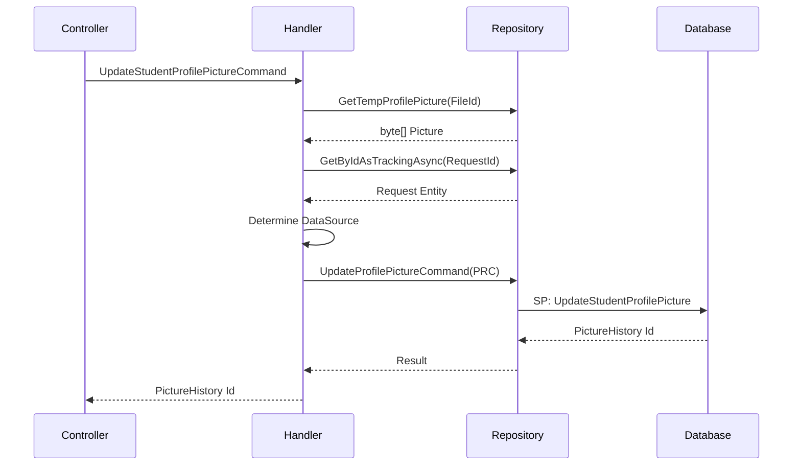

<div dir="rtl">

# UpdateStudentProfilePictureCommand

## 📄 اطلاعات کلی

**مسیر فایل:**
```
Csis.Admission.Application/Features/Students/Iranian/Commands/UpdateStudentProfilePictureCommand.cs
```

**Feature:** Students  
**نوع:** Command  
**هدف:** بروزرسانی تصویر پروفایل دانشجو (پس از تحلیل AI)

---

## 🎯 هدف (Purpose)

این Command برای **بروزرسانی نهایی تصویر پروفایل** دانشجو استفاده می‌شود. این Command پس از:
1. آپلود تصویر توسط کاربر
2. **تحلیل تصویر توسط AI** (تشخیص چهره)
3. تایید نتیجه تحلیل AI

فراخوانی می‌شود و تصویر را در سیستم ثبت می‌کند.

---

## 📝 ساختار Command

### ورودی (Request)

```csharp
public sealed record UpdateStudentProfilePictureCommand(
    int Codm,                                    // کد مرکز خدمات دانشجو
    ImageAnalysisResultDto ImageAnalysisResultDto, // نتیجه تحلیل AI
    Guid FileId,                                 // شناسه فایل موقت
    long RequestId                               // شناسه درخواست
) : IRequest<long>;
```

**پارامترها:**
- `Codm`: کد یکتای دانشجو در سیستم
- `ImageAnalysisResultDto`: نتیجه تحلیل تصویر توسط سرویس AI (شامل Confidence Score)
- `FileId`: شناسه فایل تصویر موقت که قبلاً آپلود شده
- `RequestId`: شناسه درخواست تغییر (برای Audit Trail)

### خروجی (Response)

```csharp
long  // شناسه رکورد تاریخچه تصویر (PictureHistory Id)
```

---

## 🔄 جریان اجرا (Execution Flow)

### مراحل:

```
1. دریافت فایل تصویر موقت
   ├─> GetTempProfilePicture(FileId)
   └─> دریافت byte[] تصویر
   
2. دریافت اطلاعات درخواست
   ├─> GetByIdAsTrackingAsync(RequestId)
   └─> تشخیص منبع درخواست (Student/Employee)
   
3. تعیین منبع داده (DataSource)
   ├─> اگر Request.Source موجود باشد → DataSource.Employee
   └─> در غیر این صورت → DataSource.Student
   
4. ایجاد Command مخزن
   ├─> UpdateStudentProfilePicturePrc
   ├─> شامل: Codm, Picture, RequestId, DataSource
   └─> PersonnelId و UserId = null/0 (چرا؟ باید اصلاح شود)
   
5. اجرای Stored Procedure
   ├─> UpdateProfilePictureCommand
   └─> ثبت تصویر + تاریخچه
   
6. بازگشت شناسه تاریخچه
   └─> result.Id
```

### نمودار توالی (Sequence Diagram)



---

## 📦 وابستگی‌ها (Dependencies)

### سرویس‌ها
- `IStudentRepository`: دسترسی به داده‌های دانشجو و عملیات مرتبط
- `IRepository<Request, long>`: دسترسی به جدول درخواست‌ها
- `ICsisAuthenticatedUserService`: اطلاعات کاربر احراز هویت شده (تعریف شده اما استفاده نشده ⚠️)

### DTO ها
- `ImageAnalysisResultDto`: نتیجه تحلیل AI از سرویس `Csis.CompareImageAi`
- `UpdateStudentProfilePicturePrc`: Command مخزن برای Stored Procedure

### Entities
- `Request`: جدول درخواست‌های تغییر
- تصویر در جدول `PictureHistories` ذخیره می‌شود

---

## ⚙️ قوانین کسب‌وکار (Business Rules)

### BR-1: تحلیل AI
- تصویر باید قبلاً توسط سرویس AI تحلیل شده باشد
- `ImageAnalysisResultDto` شامل Confidence Score و نتایج تشخیص چهره
- الگوی استفاده:
  1. آپلود تصویر → فایل موقت
  2. تحلیل AI → ImageAnalysisResultDto
  3. بررسی Confidence
  4. اگر قبول → UpdateStudentProfilePictureCommand

### BR-2: تاریخچه تصویر
- هر تغییر تصویر در جدول `PictureHistories` ثبت می‌شود
- امکان بازگشت به تصویر قبلی
- Audit Trail کامل

### BR-3: منبع داده
- تشخیص اینکه تغییر توسط دانشجو یا کارمند انجام شده
- بر اساس `Request.Source`

---

## 🐛 مدیریت خطا (Error Handling)

### استثناها

1. **تصویر موقت یافت نشد**
   - زمانی که `FileId` معتبر نیست
   - یا فایل موقت منقضی شده

2. **درخواست یافت نشد**
   - `RequestId` نامعتبر

3. **خطای Stored Procedure**
   - مشکل در ذخیره تصویر

---

## 🔒 امنیت و اعتبارسنجی (Security & Validation)

### اعتبارسنجی
- ⚠️ **هیچ Validator صریحی وجود ندارد**
- باید اضافه شود:
  - `Codm > 0`
  - `FileId != Guid.Empty`
  - `RequestId > 0`
  - `ImageAnalysisResultDto != null`

### احراز هویت
- نیاز به احراز هویت دارد
- اما `ICsisAuthenticatedUserService` تعریف شده ولی استفاده نشده ❌

### مجوز
- باید چک شود کاربر مجاز به تغییر تصویر این دانشجو است
- دانشجو فقط تصویر خودش را تغییر دهد
- کارمند با مجوز می‌تواند تصویر سایر دانشجویان را تغییر دهد

---

## 📊 عملکرد (Performance)

### بهینه‌سازی‌ها
✅ استفاده از Stored Procedure (سریع)  
✅ دریافت فقط یک Request (SelectById)

### نکات
- تصویر به صورت `byte[]` ذخیره می‌شود
- اگر تصاویر بزرگ باشند، ممکن است Memory مشکل ایجاد کند
- پیشنهاد: محدودیت حجم فایل (مثلاً 2MB)

---

## 🧪 Use Cases

### UC-013: بروزرسانی تصویر پروفایل دانشجو

**Actor**: دانشجو / کارمند

**Preconditions**:
- دانشجو/کارمند احراز هویت شده
- تصویر جدید آپلود شده (FileId موجود)
- تصویر توسط AI تحلیل شده
- Confidence Score قابل قبول

**Main Flow**:
1. کاربر تصویر جدید را آپلود می‌کند
2. سیستم تصویر را توسط AI تحلیل می‌کند
3. در صورت تایید، کاربر تغییر را تایید می‌کند
4. سیستم این Command را اجرا می‌کند
5. تصویر در پایگاه داده ذخیره می‌شود
6. تاریخچه تصویر ثبت می‌شود

**Postconditions**:
- تصویر پروفایل دانشجو بروز شده
- تاریخچه ثبت شده

---

## 🚨 مشکلات و نکات (Issues & Notes)

### ⚠️ مشکل 1: TODO در کد
```csharp
//TODO: اصلاح شود
DataSource = requestCommand?.Source != null ? DataSource.Employee : DataSource.Student,
```
- منطق تشخیص DataSource ناقص است
- باید بر اساس `currentUser` تشخیص داده شود

### ⚠️ مشکل 2: PersonnelId و UserId
```csharp
PersonnelId = null,
UserId = 0,
```
- این مقادیر باید از `ICsisAuthenticatedUserService` دریافت شوند
- در حال حاضر همیشه null/0 هستند
- باعث از دست رفتن اطلاعات Audit می‌شود

### ⚠️ مشکل 3: عدم استفاده از `authenticatedUserService`
- این سرویس در Constructor تزریق شده اما استفاده نمی‌شود
- باید حذف شود یا استفاده شود

### 💡 پیشنهاد بهبود 1: اصلاح DataSource
```csharp
var userId = await authenticatedUserService.GetUserIdAsync();
var personnelId = await authenticatedUserService.PersonnelId();

var command = new UpdateStudentProfilePicturePrc {
    Codm = request.Codm,
    Picture = file,
    RequestId = request.RequestId,
    PersonnelId = personnelId,
    UserId = userId ?? 0,
    DataSource = personnelId.HasValue ? DataSource.Employee : DataSource.Student,
};
```

### 💡 پیشنهاد بهبود 2: افزودن Validator
```csharp
public class UpdateStudentProfilePictureCommandValidator 
    : AbstractValidator<UpdateStudentProfilePictureCommand>
{
    public UpdateStudentProfilePictureCommandValidator()
    {
        RuleFor(x => x.Codm)
            .GreaterThan(0).WithMessage("کد دانشجو نامعتبر است");
            
        RuleFor(x => x.FileId)
            .NotEqual(Guid.Empty).WithMessage("شناسه فایل نامعتبر است");
            
        RuleFor(x => x.RequestId)
            .GreaterThan(0).WithMessage("شناسه درخواست نامعتبر است");
            
        RuleFor(x => x.ImageAnalysisResultDto)
            .NotNull().WithMessage("نتیجه تحلیل تصویر الزامی است");
    }
}
```

---

## 📚 مستندات مرتبط

### Commands مرتبط
- `UpdateStudentProfilePictureFromCivilRegistryCommand`: بروزرسانی تصویر از ثبت احوال
- `UpdateStudentProfilePictureRequestCommand`: ایجاد درخواست تغییر تصویر
- `CreateAdmissionCaseStep06ConfirmStudentProfilePictureRequestCommand`: تایید تصویر در Wizard

### Queries مرتبط
- `GetStudentProfileImageByCodmQuery`: دریافت تصویر فعلی دانشجو

### سرویس‌های خارجی
- `Csis.CompareImageAi`: سرویس تحلیل تصویر با AI
  - `ImageAnalysisResultDto`: نتیجه تحلیل
  - شامل: Confidence Score, Face Detection, Face Matching

---

## 📊 خلاصه

| جنبه | وضعیت | نمره |
|------|-------|------|
| **عملکرد** | خوب (استفاده از SP) | 8/10 |
| **امنیت** | ضعیف (بدون Validator، مشکل Authentication) | 4/10 |
| **کیفیت کد** | متوسط (TODO، استفاده نشده از سرویس) | 6/10 |
| **Maintainability** | نیاز به بهبود | 6/10 |
| **Business Logic** | صحیح اما ناقص | 7/10 |

**توصیه کلی**: این Command نیاز به refactoring دارد تا مشکلات Authentication و Validation رفع شود.

</div>
