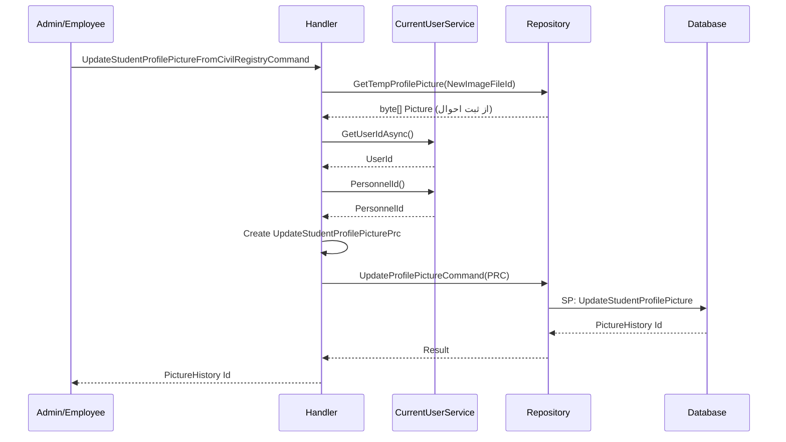

<div dir="rtl">

# UpdateStudentProfilePictureFromCivilRegistryCommand

## 📄 اطلاعات کلی

**مسیر فایل:**
```
Csis.Admission.Application/Features/Students/Iranian/Commands/UpdateStudentProfilePictureFromCivilRegistryCommand.cs
```

**Feature:** Students  
**نوع:** Command  
**هدف:** بروزرسانی تصویر پروفایل از ثبت احوال (پس از تایید ادمین)

---

## 🎯 هدف (Purpose)

این Command برای **بروزرسانی تصویر پروفایل دانشجو از سرویس ثبت احوال** استفاده می‌شود. این فرآیند:
1. توسط **ادمین/کارمند** انجام می‌شود
2. تصویر از **وب سرویس ثبت احوال** دریافت می‌شود
3. **بدون نیاز به تحلیل AI** (چون از منبع معتبر است)
4. تصویر قدیمی نیز نگهداری می‌شود (تاریخچه)

---

## 📝 ساختار Command

### ورودی (Request)

```csharp
public sealed record UpdateStudentProfilePictureFromCivilRegistryCommand(
    int Codm,               // کد مرکز خدمات دانشجو
    Guid NewImageFileId,    // شناسه فایل تصویر جدید
    Guid? OldImageFileId,   // شناسه فایل تصویر قدیمی (اختیاری)
    long RequestId          // شناسه درخواست
) : IRequest<long>;
```

**پارامترها:**
- `Codm`: کد یکتای دانشجو
- `NewImageFileId`: شناسه فایل تصویر جدید دریافت شده از ثبت احوال
- `OldImageFileId`: شناسه تصویر قبلی (برای تاریخچه)
- `RequestId`: شناسه درخواست (برای Audit Trail)

### خروجی (Response)

```csharp
long  // شناسه رکورد تاریخچه تصویر (PictureHistory Id)
```

---

## 🔄 جریان اجرا (Execution Flow)

### مراحل:

```
1. دریافت فایل تصویر جدید
   ├─> GetTempProfilePicture(NewImageFileId)
   └─> دریافت byte[] تصویر از ثبت احوال
   
2. دریافت اطلاعات کاربر فعلی
   ├─> currentUserService.PersonnelId()
   ├─> currentUserService.GetUserIdAsync()
   └─> شناسایی کارمند انجام دهنده
   
3. ایجاد Command مخزن
   ├─> UpdateStudentProfilePicturePrc
   ├─> شامل: Codm, Picture, RequestId
   ├─> PersonnelId و UserId کارمند
   └─> DataSource = Employee (حتماً توسط کارمند)
   
4. اجرای Stored Procedure
   ├─> UpdateProfilePictureCommand
   └─> ثبت تصویر + تاریخچه
   
5. بازگشت شناسه تاریخچه
   └─> result.Id
```

### نمودار توالی (Sequence Diagram)



---

## 📦 وابستگی‌ها (Dependencies)

### سرویس‌ها
- `IStudentRepository`: عملیات مربوط به دانشجو و تصویر
- `ICurrentUserService`: اطلاعات کاربر جاری (کارمند)

### DTO ها
- `UpdateStudentProfilePicturePrc`: Command مخزن برای Stored Procedure

### Entities
- تصویر در جدول `PictureHistories` ذخیره می‌شود
- ارتباط با `Students` برای به‌روزرسانی تصویر فعال

---

## ⚙️ قوانین کسب‌وکار (Business Rules)

### BR-1: منبع تصویر معتبر
- تصویر از **وب سرویس ثبت احوال** دریافت می‌شود
- بنابراین نیازی به تحلیل AI ندارد (منبع معتبر)
- مستقیماً قابل استفاده است

### BR-2: فقط کارمند
- این عملیات **فقط توسط کارمندان** قابل انجام است
- `DataSource = Employee` همیشه
- دانشجو نمی‌تواند مستقیماً از این Command استفاده کند

### BR-3: تاریخچه کامل
- تصویر قدیمی نگهداری می‌شود (`OldImageFileId`)
- تصویر جدید با شناسه جدید ذخیره می‌شود
- امکان بازگشت به تصویر قبلی

### BR-4: Audit Trail
- شناسایی کارمند انجام دهنده (`PersonnelId`, `UserId`)
- ثبت زمان تغییر
- ثبت منبع داده (Employee)

---

## 🔄 مقایسه با Command مشابه

### UpdateStudentProfilePictureCommand vs UpdateStudentProfilePictureFromCivilRegistryCommand

| جنبه | UpdateStudentProfilePictureCommand | UpdateStudentProfilePictureFromCivilRegistryCommand |
|------|-----------------------------------|---------------------------------------------------|
| **Actor** | دانشجو / کارمند | فقط کارمند |
| **منبع تصویر** | آپلود توسط کاربر | وب سرویس ثبت احوال |
| **نیاز به AI** | بله (تحلیل تصویر) | خیر (منبع معتبر) |
| **ImageAnalysisResultDto** | دارد | ندارد |
| **DataSource** | Student/Employee | فقط Employee |
| **احراز کاربر** | ⚠️ مشکل دارد | ✅ صحیح |

---

## 🐛 مدیریت خطا (Error Handling)

### استثناها

1. **تصویر موقت یافت نشد**
   - `NewImageFileId` نامعتبر
   - فایل موقت منقضی شده

2. **کاربر احراز نشده**
   - `PersonnelId` null است
   - کاربر جاری کارمند نیست

3. **درخواست یافت نشد**
   - `RequestId` نامعتبر

4. **خطای Stored Procedure**
   - مشکل در ذخیره تصویر

---

## 🔒 امنیت و اعتبارسنجی (Security & Validation)

### اعتبارسنجی
- ⚠️ **هیچ Validator صریحی وجود ندارد**
- باید اضافه شود:
  - `Codm > 0`
  - `NewImageFileId != Guid.Empty`
  - `RequestId > 0`

### احراز هویت
- ✅ استفاده صحیح از `ICurrentUserService`
- دریافت `PersonnelId` و `UserId`

### مجوز
- باید چک شود کارمند مجاز به تغییر تصویر است
- نیاز به Permission مشخص (مثل "UpdateStudentPicture")

---

## 📊 عملکرد (Performance)

### بهینه‌سازی‌ها
✅ استفاده از Stored Procedure  
✅ دریافت فقط اطلاعات لازم  
✅ عدم نیاز به تحلیل AI (سریع‌تر)

### نکات
- تصویر به صورت `byte[]` ذخیره می‌شود
- نگهداری تصویر قدیمی (افزایش فضا)
- پیشنهاد: Cleanup تصاویر قدیمی پس از مدتی

---

## 🧪 Use Cases

### UC-014: به‌روزرسانی تصویر دانشجو از ثبت احوال

**Actor**: کارمند

**Preconditions**:
- کارمند احراز هویت شده و دارای مجوز
- `Codm` دانشجو معتبر است
- اتصال به وب سرویس ثبت احوال برقرار است

**Main Flow**:
1. کارمند درخواست به‌روزرسانی تصویر از ثبت احوال را انتخاب می‌کند
2. سیستم تصویر را از وب سرویس ثبت احوال دریافت می‌کند
3. تصویر در فایل موقت ذخیره می‌شود (`NewImageFileId`)
4. کارمند تصویر را بررسی و تایید می‌کند
5. سیستم این Command را اجرا می‌کند
6. تصویر در پایگاه داده ثبت می‌شود
7. تاریخچه تغییر ثبت می‌شود (شامل کارمند انجام دهنده)

**Postconditions**:
- تصویر پروفایل دانشجو از ثبت احوال بروز شده
- تاریخچه با اطلاعات کارمند ثبت شده

**Alternative Flows**:
- A1: اگر تصویر در ثبت احوال یافت نشد → خطا
- A2: اگر کاربر مجوز نداشت → خطای دسترسی

---

## 🚨 مشکلات و نکات (Issues & Notes)

### ✅ نکته مثبت 1: استفاده صحیح از CurrentUserService
```csharp
PersonnelId = await currentUserService.PersonnelId() ?? 0,
UserId = await currentUserService.GetUserIdAsync() ?? 0,
```
- برخلاف `UpdateStudentProfilePictureCommand`, این Command به درستی از `currentUserService` استفاده می‌کند

### ✅ نکته مثبت 2: DataSource ثابت
```csharp
DataSource = DataSource.Employee,
```
- چون این Command فقط توسط کارمند فراخوانی می‌شود، `DataSource` همیشه Employee است

### 💡 پیشنهاد بهبود 1: افزودن Validator
```csharp
public class UpdateStudentProfilePictureFromCivilRegistryCommandValidator 
    : AbstractValidator<UpdateStudentProfilePictureFromCivilRegistryCommand>
{
    public UpdateStudentProfilePictureFromCivilRegistryCommandValidator()
    {
        RuleFor(x => x.Codm)
            .GreaterThan(0)
            .WithMessage("کد دانشجو نامعتبر است");
            
        RuleFor(x => x.NewImageFileId)
            .NotEqual(Guid.Empty)
            .WithMessage("شناسه فایل جدید نامعتبر است");
            
        RuleFor(x => x.RequestId)
            .GreaterThan(0)
            .WithMessage("شناسه درخواست نامعتبر است");
    }
}
```

### 💡 پیشنهاد بهبود 2: چک کردن PersonnelId
```csharp
var personnelId = await currentUserService.PersonnelId();
if (!personnelId.HasValue)
{
    throw new UnauthorizedException("این عملیات فقط توسط کارمندان قابل انجام است");
}
```

### 💡 پیشنهاد بهبود 3: Cleanup تصاویر قدیمی
- اگر `OldImageFileId` موجود باشد، می‌توان آن را پس از مدتی حذف کرد
- پیشنهاد: Background Job برای Cleanup تصاویر قدیمی‌تر از 6 ماه

---

## 📚 مستندات مرتبط

### Commands مرتبط
- `UpdateStudentProfilePictureCommand`: بروزرسانی تصویر (آپلود کاربر)
- `UpdateStudentProfilePictureRequestCommand`: ایجاد درخواست تغییر تصویر
- `UpdateStudentProfilePictureFromCivilRegistryRequestCommand`: ایجاد درخواست تغییر از ثبت احوال

### Queries مرتبط
- `GetStudentProfileImageByCodmQuery`: دریافت تصویر فعلی دانشجو

### سرویس‌های خارجی
- وب سرویس ثبت احوال:
  - `GetIranianImageFromSabteAhval`: دریافت تصویر از ثبت احوال

---

## 📊 خلاصه

| جنبه | وضعیت | نمره |
|------|-------|------|
| **عملکرد** | عالی (بدون نیاز به AI) | 9/10 |
| **امنیت** | خوب (استفاده صحیح از CurrentUser) | 8/10 |
| **کیفیت کد** | خوب (تمیز و واضح) | 8/10 |
| **Maintainability** | خوب | 8/10 |
| **Business Logic** | صحیح | 9/10 |

**توصیه کلی**: این Command به خوبی پیاده‌سازی شده است. فقط نیاز به افزودن Validator دارد.

</div>
