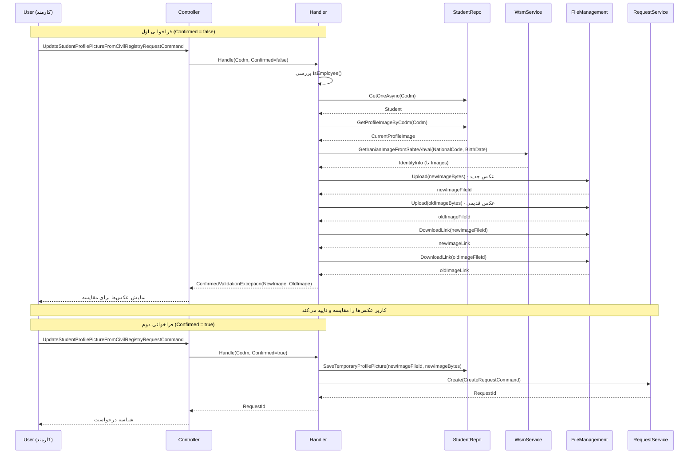

<div dir="rtl">

# UpdateStudentProfilePictureFromCivilRegistryRequestCommand

## 📄 اطلاعات کلی

**مسیر فایل:**
```
Csis.Admission.Application/Features/Students/Iranian/Commands/UpdateStudentProfilePictureFromCivilRegistryRequestCommand.cs
```

**Feature:** Students  
**نوع:** Command  
**هدف:** ایجاد درخواست بروزرسانی عکس پروفایل دانشجو از ثبت احوال

---

## 🎯 هدف (Purpose)

این Command برای **ایجاد درخواست بروزرسانی تصویر پروفایل دانشجو** با استفاده از آخرین عکس موجود در سیستم ثبت احوال استفاده می‌شود. این فرآیند مطمئن می‌کند که:

1. تصویر دانشجو با تصویر رسمی ثبت احوال همخوان است
2. کاربر (کارمند) قبل از اعمال تغییرات، عکس قدیم و جدید را مقایسه می‌کند
3. تغییرات از طریق سیستم درخواست (Request System) مدیریت می‌شوند

**ویژگی‌های کلیدی:**
- ✅ محدود به کارمندان و مدیران
- ✅ الگوی Two-Step Confirmation (مقایسه عکس‌ها)
- ✅ یکپارچه‌سازی با Request System
- ✅ آپلود خودکار به File Management Service

---

## 📝 ساختار Command

### ورودی (Request)

```csharp
public sealed record UpdateStudentProfilePictureFromCivilRegistryRequestCommand(
    int Codm, 
    bool Confirmed
) : IRequest<long>;
```

**پارامترها:**
- `Codm`: کد مرکز خدمات دانشجو
- `Confirmed`: تایید کاربر پس از مشاهده عکس‌ها

### خروجی (Response)

```csharp
long  // شناسه درخواست ایجاد شده (RequestId)
```

---

## 🔄 جریان اجرا (Execution Flow)

### مراحل:

```
1. بررسی دسترسی
   ├─> currentUser.IsEmployee()
   └─> فقط کارمندان و مدیران مجاز

2. دریافت اطلاعات دانشجو
   ├─> studentRepo.GetOneAsync(Codm)
   ├─> بررسی وجود دانشجو
   └─> بررسی وجود تاریخ تولد

3. دریافت عکس فعلی دانشجو
   ├─> repo.GetProfileImageByCodm(Codm)
   └─> شامل: Image (byte[])

4. استعلام عکس از ثبت احوال
   ├─> csisWsmService.GetIranianImageFromSabteAhval(
   │   NationalCode, BirthDate)
   ├─> دریافت IdentityInfo
   ├─> استخراج آخرین عکس از Images
   └─> تبدیل Base64 به byte[]

5. آپلود عکس جدید به File Management
   ├─> تولید نام فایل: civil_registry_{NationalCode}_{Timestamp}.jpg
   ├─> fileManagementService.Upload(newImageBytes)
   └─> دریافت newImageFileId

6. آپلود عکس قدیمی (در صورت وجود)
   ├─> تولید نام فایل: old_profile_{NationalCode}_{Timestamp}.jpg
   ├─> fileManagementService.Upload(oldImageBytes)
   └─> دریافت oldImageFileId

7. بررسی Confirmation
   ├─> اگر Confirmed == false
   ├──> دریافت لینک دانلود عکس‌ها
   ├──> ایجاد JSON شامل NewImage و OldImage
   └──> پرتاب ConfirmedValidationException

8. ذخیره موقت عکس جدید (Confirmed == true)
   ├─> repo.SaveTemporaryProfilePicture(newImageFileId, newImageBytes)
   └─> برای استفاده در Handler اصلی

9. ایجاد Command اصلی
   ├─> UpdateStudentProfilePictureFromCivilRegistryCommand(
   │   Codm, newImageFileId, oldImageFileId, -1)
   └─> تعیین RequestFlow = DirectRegistration

10. ایجاد درخواست
    ├─> CreateRequestCommand(
    │   updatePictureCommand, 
    │   RequestFlow.DirectRegistration,
    │   RequestType.UpdateStudentProfilePictureFromCivilRegistry)
    ├─> اضافه کردن مستندات (newImageFileId)
    └─> requestService.Create() → RequestId
```

### نمودار توالی (Sequence Diagram)



---

## 📦 وابستگی‌ها (Dependencies)

### Repository ها
- `IStudentRepository`: عملیات مربوط به دانشجو
  - `GetProfileImageByCodm(Codm)`: دریافت عکس فعلی
  - `SaveTemporaryProfilePicture(fileId, bytes)`: ذخیره موقت عکس جدید
- `IRepository<StudentSummary>`: دسترسی سریع به اطلاعات دانشجو

### سرویس‌ها
- `ICurrentUserService`: مدیریت کاربر جاری
  - `IsEmployee()`: بررسی نقش کاربر
- `ICsisWsmService`: وب سرویس ثبت احوال
  - `GetIranianImageFromSabteAhval(nationalCode, birthDate)`: دریافت عکس
- `ICsisFileManagementService`: مدیریت فایل‌ها
  - `Upload(fileName, bytes)`: آپلود فایل
  - `DownloadLink(fileId)`: دریافت لینک دانلود
- `IRequestService`: مدیریت درخواست‌ها
  - `Create(CreateRequestCommand)`: ایجاد درخواست

### Commands
- `UpdateStudentProfilePictureFromCivilRegistryCommand`: Command اصلی اعمال تغییرات
- `CreateRequestCommand`: Command ایجاد درخواست

### Enums
- `RequestFlow`: DirectRegistration (ثبت مستقیم بدون نیاز به تایید)
- `RequestType`: UpdateStudentProfilePictureFromCivilRegistry

---

## ⚙️ قوانین کسب‌وکار (Business Rules)

### اعتبارسنجی‌ها (Validations)

1. **محدودیت دسترسی:**
   ```csharp
   if (!isEmployee)
       throw new CommandValidationException(
           "فقط کارمندان و مدیران مجاز به انجام این عملیات هستند.");
   ```
   - فقط کارمندان مجاز هستند
   - دانشجویان نمی‌توانند عکس خود را از ثبت احوال بروزرسانی کنند

2. **وجود دانشجو:**
   ```csharp
   if (student == null)
       throw new CommandValidationException(
           "طلبه با این کد مرکز خدمات یافت نشد.");
   ```

3. **تاریخ تولد اجباری:**
   ```csharp
   if (!student.BirthDate.HasValue)
       throw new CommandValidationException(
           "تاریخ تولد طلبه در سیستم ثبت نشده است.");
   ```
   - بدون تاریخ تولد نمی‌توان از ثبت احوال استعلام کرد

4. **وجود عکس در ثبت احوال:**
   ```csharp
   if (string.IsNullOrEmpty(civilRegistryImage))
       throw new CommandValidationException(
           "تصویری از ثبت احوال برای این طلبه یافت نشد.");
   ```

### الگوی Two-Step Confirmation

**مرحله 1 (نمایش):**
```json
{
  "NewImage": {
    "FileId": "guid",
    "Link": "https://...",
    "Title": "عکس جدید از ثبت احوال"
  },
  "OldImage": {
    "FileId": "guid",
    "Link": "https://...",
    "Title": "عکس فعلی"
  }
}
```

**مرحله 2 (اجرا):**
- کاربر عکس‌ها را مقایسه می‌کند
- در صورت تایید، `Confirmed=true` ارسال می‌شود
- درخواست در سیستم ثبت می‌شود

### Request Flow

```csharp
var requestFlow = RequestFlow.DirectRegistration;
```

- **DirectRegistration**: اعمال مستقیم بدون نیاز به تایید اضافی
- تغییرات بلافاصله اعمال می‌شوند
- برای عملیات توسط کارمندان

---

## 🔍 نکات پیاده‌سازی (Implementation Notes)

### 1. نام‌گذاری فایل‌ها

```csharp
// عکس جدید
$"civil_registry_{NationalCode}_{DateTime.Now:yyyyMMddHHmmss}.jpg"

// عکس قدیمی
$"old_profile_{NationalCode}_{DateTime.Now:yyyyMMddHHmmss}.jpg"
```

- استفاده از Timestamp برای یکتایی نام فایل
- قابل ردیابی با NationalCode
- فرمت: `civil_registry_1234567890_20260103142530.jpg`

### 2. استخراج آخرین عکس

```csharp
var civilRegistryImage = identityInfo?.Images?
    .LastOrDefault(x => !string.IsNullOrEmpty(x.Image))?.Image;
```

- از آخرین عکس معتبر استفاده می‌شود
- عکس‌های خالی نادیده گرفته می‌شوند
- فرض: جدیدترین عکس آخرین عکس است

### 3. ذخیره موقت

```csharp
await repo.SaveTemporaryProfilePicture(newImageFileId, newImageBytes);
```

⚠️ **هدف:**
- عکس جدید موقتاً ذخیره می‌شود
- Handler اصلی (`UpdateStudentProfilePictureFromCivilRegistryCommand`) عکس را اعمال می‌کند
- جلوگیری از آپلود مجدد فایل

### 4. مدیریت عکس قدیمی

```csharp
Guid? oldImageFileId = null;
if (currentProfileImage?.Image != null && currentProfileImage.Image.Length > 0)
{
    oldImageFileId = await fileManagementService.Upload(...);
}
```

- در صورت نداشتن عکس قدیمی، `null` ارسال می‌شود
- عکس قدیمی فقط برای مقایسه آپلود می‌شود

### 5. Hardcoded UserId

```csharp
var updatePictureCommand = new UpdateStudentProfilePictureFromCivilRegistryCommand(
    request.Codm,
    newImageFileId,
    oldImageFileId,
    -1);  // UserId = -1
```

⚠️ **نکته:**
- UserId به صورت `-1` Hardcoded است
- احتمالاً در Handler اصلی به مقدار واقعی تغییر می‌کند

---

## 🎯 Use Cases

### UC-UpdateProfilePicture-CivilRegistry: بروزرسانی عکس از ثبت احوال

**Actor:** کارمند

**Preconditions:**
- کارمند احراز هویت شده باشد
- دانشجو در سیستم موجود باشد
- تاریخ تولد دانشجو ثبت شده باشد
- عکس در ثبت احوال موجود باشد

**Main Flow:**
1. کارمند کد مرکز خدمات دانشجو را وارد می‌کند
2. سیستم عکس فعلی و عکس ثبت احوال را دریافت می‌کند
3. سیستم هر دو عکس را آپلود می‌کند
4. سیستم لینک‌های دانلود را برای کاربر نمایش می‌دهد
5. کارمند عکس‌ها را مقایسه می‌کند
6. کارمند تایید می‌کند
7. سیستم درخواست بروزرسانی ایجاد می‌کند
8. سیستم شناسه درخواست را برمی‌گرداند

**Postconditions:**
- درخواست بروزرسانی عکس در سیستم ثبت شده
- عکس جدید موقتاً ذخیره شده
- عکس‌های قدیم و جدید در File Management موجود

**Alternative Flows:**
- A1: دانشجو در سیستم موجود نیست → خطا
- A2: تاریخ تولد ثبت نشده → خطا
- A3: عکس در ثبت احوال موجود نیست → خطا
- A4: کاربر تایید نمی‌کند → عملیات لغو

---

## ⚠️ ریسک‌ها و نکات (Risks & Notes)

### امنیتی (Security)

1. ✅ **Authorization:**
   ```csharp
   var isEmployee = await currentUser.IsEmployee();
   if (!isEmployee) throw new CommandValidationException(...);
   ```
   - محدودیت دسترسی به کارمندان
   - جلوگیری از تغییر توسط دانشجویان

2. ✅ **Audit Trail:**
   - عکس قدیم و جدید هر دو ذخیره می‌شوند
   - قابل ردیابی با UserId و PersonnelId (در Handler اصلی)

3. ⚠️ **File Access:**
   - لینک‌های دانلود عمومی هستند؟
   - نیاز به بررسی سیاست دسترسی File Management

### عملکردی (Performance)

1. ⚠️ **External Service Dependency:**
   - وابستگی به ثبت احوال
   - وابستگی به File Management Service
   - در صورت Timeout یکی از سرویس‌ها، عملیات شکست می‌خورد

2. ⚠️ **Double Upload:**
   ```csharp
   // آپلود عکس جدید
   newImageFileId = await fileManagementService.Upload(...);
   
   // آپلود عکس قدیمی
   oldImageFileId = await fileManagementService.Upload(...);
   
   // دریافت لینک عکس جدید
   newImageDownloadInfo = await fileManagementService.DownloadLink(...);
   
   // دریافت لینک عکس قدیمی
   oldImageDownloadInfo = await fileManagementService.DownloadLink(...);
   ```
   - 4 فراخوانی به File Management در یک Request
   - می‌توان Upload و DownloadLink را Batch کرد

3. ⚠️ **Large Images:**
   - تبدیل Base64 به Byte[] برای عکس‌های بزرگ زمان‌بر است
   - نیاز به Compression یا Resize

### کیفیت کد (Code Quality)

1. ⚠️ **Magic Values:**
   ```csharp
   UserId = -1
   ```
   - بهتر است از Constant استفاده شود

2. ✅ **Error Handling:**
   - پیام‌های خطای واضح و کاربرپسند
   - اعتبارسنجی کامل

3. ✅ **Separation of Concerns:**
   - Request Handler: ایجاد درخواست و مدیریت فایل‌ها
   - Main Handler: اعمال تغییرات
   - خوانایی و نگهداری بالا

---

## 📊 خلاصه نکات کلیدی

| جنبه | توضیح |
|------|-------|
| **الگوی طراحی** | CQRS + Request System + Two-Step Confirmation |
| **Authorization** | ✅ فقط کارمندان |
| **منبع تصویر** | ثبت احوال (آخرین عکس) |
| **File Management** | ✅ آپلود خودکار عکس قدیم و جدید |
| **Request Flow** | DirectRegistration (بدون تایید اضافی) |
| **Validation** | ✅ دانشجو، تاریخ تولد، عکس ثبت احوال |
| **Audit** | ✅ ذخیره عکس قدیم برای مقایسه |
| **Performance** | ⚠️ 4 فراخوانی به File Management |
| **External Dependencies** | ⚠️ ثبت احوال + File Management |
| **مستندات XML** | ✅ موجود |

---

## 🔗 لینک‌های مرتبط

### Commands مرتبط
- [UpdateStudentProfilePictureFromCivilRegistryCommand.md](./UpdateStudentProfilePictureFromCivilRegistryCommand.md) - Command اصلی اعمال تغییرات
- [UpdateStudentProfilePictureCommand.md](./UpdateStudentProfilePictureCommand.md) - بروزرسانی عکس توسط دانشجو
- [UpdateStudentProfilePictureRequestCommand.md](./UpdateStudentProfilePictureRequestCommand.md) - درخواست بروزرسانی عکس توسط دانشجو

### Services
- [FileManagementService.md](../../../../Services/FileManagementService.md) - سرویس مدیریت فایل‌ها
- [WsmService.md](../../../../Services/WsmService.md) - وب سرویس ثبت احوال
- [RequestService.md](../../../../Services/RequestService.md) - سیستم مدیریت درخواست‌ها

---

**نسخه مستندات:** 1.0  
**تاریخ ایجاد:** 2026-01-03

</div>
