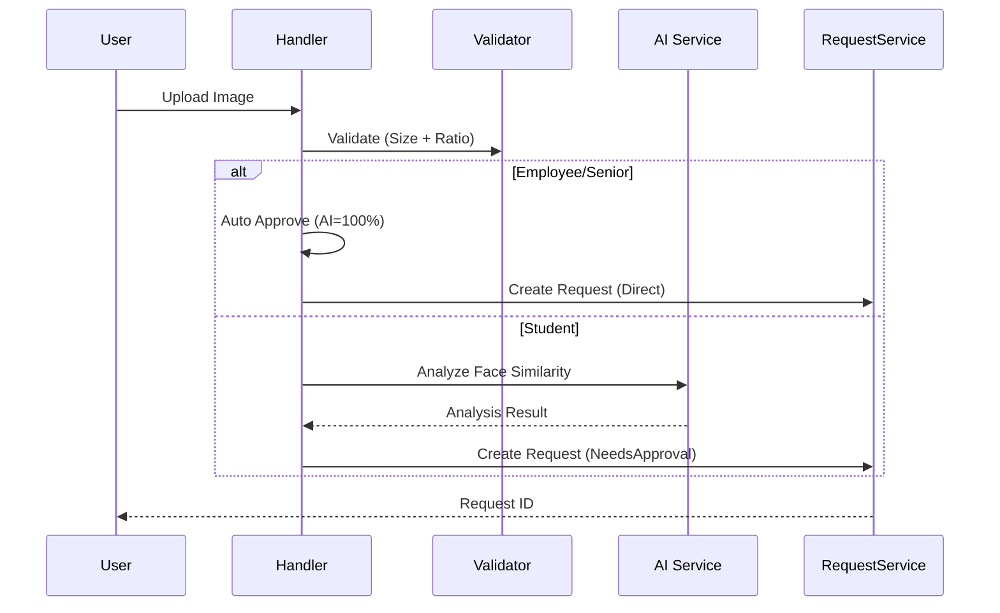

<div dir="rtl">

# UpdateStudentProfilePictureRequestCommand

## 📄 اطلاعات کلی

**مسیر:** `Features/Students/Commands/UpdateStudentProfilePictureRequestCommand.cs`  
**نوع:** Command (Request Handler)  
**هدف:** ایجاد درخواست بروزرسانی تصویر پروفایل دانشجو

---

## 🎯 هدف

این Command **نقطه ورودی** برای بروزرسانی تصویر پروفایل است که:
1. فایل تصویر را دریافت و آپلود می‌کند
2. بر اساس نوع کاربر (کارمند/دانشجو) فرآیند متفاوت دارد
3. **AI Face Recognition** برای دانشجویان اجرا می‌شود
4. درخواست تغییر (Request) ایجاد می‌کند

---

## 📝 ساختار

**ورودی:**
```csharp
public sealed record UpdateStudentProfilePictureRequestCommand(
    int Codm, 
    IFormFile File, 
    bool? UserConfirmed
) : IRequest<long>;
```

**خروجی:** `long` (شناسه Request)

---

## 🔄 جریان اجرا

### تفکیک بر اساس نوع کاربر:

```
1. اعتبارسنجی فایل
   ├─> حجم: حداکثر 20KB
   └─> نسبت ابعاد: 3×4 (با تلورانس 0.3)

2. شناسایی کاربر
   ├─> Senior/Employee → مسیر A
   └─> Student → مسیر B

مسیر A (کارمند/Senior):
3. آپلود فایل
4. تأیید خودکار (بدون AI)
5. ایجاد Request با DirectRegistration

مسیر B (دانشجو):
3. آپلود فایل
4. دریافت تصویر قبلی
5. تحلیل AI (Face Compare)
6. ایجاد Request با StudentToEmployee
```

---

## ⚙️ قوانین کسب‌وکار

### BR-1: اعتبارسنجی فایل
```csharp
// حجم فایل
if (file.Length / 1024.0 > 20)  // بیش از 20KB
    throw new CommandValidationException();

// نسبت ابعاد 3×4
aspectRatio = width / height;
expectedRatio = 3.0 / 4.0;
tolerance = 0.3;
```

### BR-2: تفکیک مسیر بر اساس کاربر

**کارمند/Senior:**
- ✅ تأیید خودکار (AiPercent = 100)
- ✅ بدون نیاز به تحلیل AI
- ✅ RequestFlow.DirectRegistration

**دانشجو:**
- 🔍 تحلیل AI اجباری
- 📊 مقایسه با تصویر قبلی
- 📝 RequestFlow.StudentToEmployee (نیاز به تأیید)

### BR-3: AI Face Recognition
```csharp
var analysisResult = await compareImageClient.AnalyzeWithBase64Async(
    new Base64UploadRequest {
        Codm = codm,
        OldImageBase64 = oldImage,
        NewImageBase64 = newImage
    }
);
```

**شامل:**
- Similarity Score
- Face Quality (Old/New)
- AiPercent
- Fail/Success

---

## 🔒 امنیت

### Authorization
```csharp
if (isSenior || isEmployee) { ... }
else if (isStudent) { ... }
else throw new CommandValidationException("کاربر مجوز ندارد");
```

### Validation
- ✅ حجم فایل (20KB)
- ✅ نسبت ابعاد (3×4)
- ⚠️ نوع فایل چک نمی‌شود (مشکل امنیتی)

---

## 💡 نکات ویژه

### ✅ الگوی خوب: تفکیک مسیر
- کارمند: سریع و بدون تأخیر AI
- دانشجو: امنیت بالا با AI

### ✅ Temporary Storage
```csharp
await repo.SaveTemporaryProfilePicture(fileId, imageBytes);
```
- فایل موقت ذخیره می‌شود
- بعد از تأیید، به صورت دائم ذخیره می‌شود

### ⚠️ مشکل: File Type Validation
```csharp
// فقط حجم و ابعاد چک می‌شود
// نوع فایل (MIME type) چک نمی‌شود!
```

**خطر:** امکان آپلود فایل‌های غیر تصویری

**راه حل:**
```csharp
var allowedTypes = new[] { "image/jpeg", "image/png" };
if (!allowedTypes.Contains(file.ContentType))
    throw new CommandValidationException("فقط تصاویر JPG و PNG مجاز است");
```

### ⚠️ Console.WriteLine در Production
```csharp
Console.WriteLine($"AnalyzeRequest: {analyzeRequest.ToJson()}");
Console.WriteLine($"SimilarityJson: {analysisResult.ToJson()}");
```
- باید با Logger جایگزین شود
- حاوی اطلاعات حساس است

---

## 📊 Flow Diagram



---

## 📚 مستندات مرتبط

- `UpdateStudentProfilePictureCommand`: اعمال نهایی تصویر
- `IFaceCompareImageClient`: سرویس AI
- `RequestService`: مدیریت درخواست‌ها

---

## 📊 خلاصه

| جنبه | نمره |
|------|------|
| **Business Logic** | 9/10 |
| **Security** | 6/10 (فاقد MIME check) |
| **Performance** | 8/10 |
| **Code Quality** | 7/10 (Console.WriteLine) |

**نکته برجسته:** تفکیک هوشمند مسیر کارمند/دانشجو 👍

</div>
