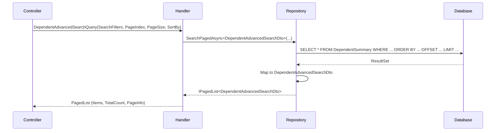

<div dir="rtl">

# DependentAdvancedSearchQuery

## 📄 اطلاعات کلی

**مسیر فایل:**
```
Csis.Admission.Application/Features/Students/Iranian/Queries/DependentAdvancedSearchQuery.cs
```

**Feature:** Students  
**نوع:** Query  
**هدف:** جستجوی پیشرفته افراد تحت تکفل با امکان فیلتر، مرتب‌سازی و صفحه‌بندی

---

## 🎯 هدف (Purpose)

این Query برای **جستجوی پیشرفته در لیست افراد تحت تکفل** استفاده می‌شود. این Query از الگوی **Generic Search** استفاده می‌کند که امکان فیلتر پویا، مرتب‌سازی و صفحه‌بندی را فراهم می‌کند.

**ویژگی‌های کلیدی:**
- ✅ جستجوی پویا با فیلترهای قابل تنظیم
- ✅ صفحه‌بندی (Paging)
- ✅ مرتب‌سازی (Sorting)
- ✅ استفاده از Generic Repository Pattern
- ✅ نتایج Projection شده (DTO)

---

## 📝 ساختار Query

### ورودی (Request)

```csharp
public sealed record DependentAdvancedSearchQuery 
    : BaseSearchQuery, 
      IRequest<IPagedList<DependentAdvancedSearchDto>>;
```

**ارث‌بری از BaseSearchQuery:**
```csharp
public abstract record BaseSearchQuery
{
    public List<SearchFilter> SearchFilters { get; init; }
    public int PageIndex { get; init; }
    public int PageSize { get; init; }
    public string SortBy { get; init; }
}
```

**پارامترها:**
- `SearchFilters`: لیست فیلترهای جستجو (فیلدها و مقادیر)
- `PageIndex`: شماره صفحه (شروع از 1)
- `PageSize`: تعداد نتایج در هر صفحه
- `SortBy`: فیلد مرتب‌سازی (مثلاً: `"FirstName ASC"` یا `"BirthDate DESC"`)

### خروجی (Response)

```csharp
IPagedList<DependentAdvancedSearchDto>
```

**ساختار IPagedList:**
```csharp
{
    "items": [...],           // لیست نتایج
    "pageIndex": 1,           // صفحه فعلی
    "pageSize": 20,           // اندازه صفحه
    "totalCount": 150,        // تعداد کل نتایج
    "totalPages": 8,          // تعداد کل صفحات
    "hasPreviousPage": false, // وجود صفحه قبلی
    "hasNextPage": true       // وجود صفحه بعدی
}
```

**فیلدهای DependentAdvancedSearchDto:**
- اطلاعات شناسنامه‌ای فرد تحت تکفل
- رابطه با دانشجو
- وضعیت فعال/غیرفعال
- تاریخ ایجاد و بروزرسانی

---

## 🔄 جریان اجرا (Execution Flow)

### مراحل:

```
1. دریافت پارامترهای جستجو
   ├─> SearchFilters: فیلترهای پویا
   ├─> PageIndex: شماره صفحه
   ├─> PageSize: تعداد نتایج
   └─> SortBy: ترتیب مرتب‌سازی

2. اجرای Generic Search
   ├─> repo.SearchPagedAsync<DependentAdvancedSearchDto>()
   ├─> پارامترها: SearchFilters, PageIndex, PageSize, SortBy
   └─> Projection به DTO

3. برگشت نتایج صفحه‌بندی شده
   └─> IPagedList<DependentAdvancedSearchDto>
```

### نمودار توالی (Sequence Diagram)



---

## 📦 وابستگی‌ها (Dependencies)

### Repository ها
- `IRepository<DependentSummary, long>`: Generic Repository با امکان جستجوی پیشرفته
  - متد: `SearchPagedAsync<TDto>(searchFilters, pageIndex, pageSize, sortBy, cancellationToken)`

### DTO ها
- `DependentAdvancedSearchDto`: DTO نتایج جستجو

### پکیج‌ها
- `Csis.Paging`: پکیج صفحه‌بندی
  - `IPagedList<T>`: اینترفیس نتایج صفحه‌بندی شده
  - `BaseSearchQuery`: کلاس پایه جستجو

### Entities
- `DependentSummary`: Entity خلاصه اطلاعات افراد تحت تکفل

---

## ⚙️ قوانین کسب‌وکار (Business Rules)

### فیلترهای قابل استفاده

فیلترهای محتمل در `SearchFilters`:

```json
[
  {
    "field": "NationalCode",
    "operator": "Contains",
    "value": "123"
  },
  {
    "field": "FirstName",
    "operator": "StartsWith",
    "value": "محمد"
  },
  {
    "field": "Codm",
    "operator": "Equals",
    "value": "1001"
  },
  {
    "field": "IsActive",
    "operator": "Equals",
    "value": "true"
  },
  {
    "field": "BirthDate",
    "operator": "GreaterThan",
    "value": "13800101"
  }
]
```

**Operators رایج:**
- `Equals`: برابر
- `NotEquals`: نابرابر
- `Contains`: شامل (برای رشته‌ها)
- `StartsWith`: شروع با (برای رشته‌ها)
- `EndsWith`: پایان با (برای رشته‌ها)
- `GreaterThan`: بزرگتر از
- `LessThan`: کوچکتر از
- `GreaterThanOrEqual`: بزرگتر یا مساوی
- `LessThanOrEqual`: کوچکتر یا مساوی

### صفحه‌بندی

```csharp
PageIndex: شماره صفحه (1, 2, 3, ...)
PageSize: تعداد نتایج (معمولاً 10, 20, 50, 100)
```

**محدودیت‌ها:**
- PageIndex >= 1
- PageSize معمولاً بین 10 تا 100
- بیشتر از 100 نتیجه در یک صفحه Performance Issue ایجاد می‌کند

### مرتب‌سازی

```csharp
SortBy: "FieldName [ASC|DESC]"
```

**مثال‌ها:**
- `"FirstName ASC"`: مرتب‌سازی صعودی بر اساس نام
- `"BirthDate DESC"`: مرتب‌سازی نزولی بر اساس تاریخ تولد
- `"Codm"`: مرتب‌سازی صعودی (پیش‌فرض ASC)

---

## 🔍 نکات پیاده‌سازی (Implementation Notes)

### 1. Generic Repository Pattern

```csharp
await _repo.SearchPagedAsync<DependentAdvancedSearchDto>(
    request.SearchFilters,
    request.PageIndex,
    request.PageSize,
    request.SortBy,
    cancellationToken: cancellationToken);
```

**مزایا:**
- ✅ کد تمیز و خوانا
- ✅ قابل استفاده مجدد برای Entity های دیگر
- ✅ جداسازی منطق جستجو از Query Handler

### 2. Projection به DTO

```csharp
SearchPagedAsync<DependentAdvancedSearchDto>()
```

- داده‌ها مستقیماً به DTO تبدیل می‌شوند
- فقط فیلدهای مورد نیاز از DB دریافت می‌شوند
- بهینه‌سازی شده با `SELECT` کوچک

### 3. استفاده از DependentSummary

- **DependentSummary** یک View یا Table خلاصه است
- شامل اطلاعات پرکاربرد بدون Join
- عملکرد بهتر نسبت به Join های سنگین

### 4. عدم Validation

⚠️ **نکته:**
```csharp
public async Task<IPagedList<DependentAdvancedSearchDto>> Handle(...)
{
    return await _repo.SearchPagedAsync<DependentAdvancedSearchDto>(...);
}
```

- بدون Validation
- فرض بر صحت پارامترهای ورودی
- بهتر است Validator اضافه شود

**Validation پیشنهادی:**
```csharp
public class DependentAdvancedSearchQueryValidator : AbstractValidator<DependentAdvancedSearchQuery>
{
    public DependentAdvancedSearchQueryValidator()
    {
        RuleFor(x => x.PageIndex).GreaterThan(0);
        RuleFor(x => x.PageSize).InclusiveBetween(1, 100);
    }
}
```

---

## 🎯 Use Cases

### UC-SearchDependents: جستجوی پیشرفته افراد تحت تکفل

**Actor:** کارمند، مدیر

**Preconditions:**
- کاربر احراز هویت شده باشد

**Main Flow:**
1. کاربر فیلترهای جستجو را وارد می‌کند
   - کد ملی، نام، نام خانوادگی، کد دانشجو، ...
2. کاربر شماره صفحه و تعداد نتایج را انتخاب می‌کند
3. سیستم جستجو را انجام می‌دهد
4. سیستم نتایج صفحه‌بندی شده را نمایش می‌دهد

**Postconditions:**
- لیست افراد تحت تکفل مطابق با فیلترها نمایش داده می‌شود
- اطلاعات صفحه‌بندی (تعداد کل، صفحات) در دسترس است

**Use Cases مرتبط:**
- Export نتایج به Excel
- نمایش جزئیات فرد تحت تکفل

---

## ⚠️ ریسک‌ها و نکات (Risks & Notes)

### امنیتی (Security)

1. ⚠️ **Authorization:**
   - بدون بررسی دسترسی
   - همه کاربران می‌توانند تمام افراد تحت تکفل را جستجو کنند
   - نیاز به محدود کردن بر اساس نقش یا سازمان

2. ⚠️ **SQL Injection:**
   - اگر `SearchPagedAsync` از Dynamic SQL استفاده کند، ریسک SQL Injection وجود دارد
   - باید Parameterized Query استفاده شود

### عملکردی (Performance)

1. ✅ **Paging:**
   - استفاده از صفحه‌بندی برای جلوگیری از بارگذاری حجم زیاد داده

2. ⚠️ **Missing Indexes:**
   - فیلدهای پرکاربرد در جستجو باید Index داشته باشند
   - مثلاً: NationalCode, Codm, FirstName, LastName

3. ⚠️ **Projection:**
   - استفاده از DTO به جای Entity کامل
   - کاهش حجم داده منتقل شده

4. ⚠️ **Large Result Sets:**
   - اگر TotalCount خیلی بزرگ باشد، محاسبه آن کند است
   - می‌توان از تخمین یا Cache استفاده کرد

### کیفیت کد (Code Quality)

1. ✅ **Simplicity:**
   - کد بسیار ساده و خوانا
   - استفاده از Generic Repository

2. ⚠️ **Missing Validation:**
   - بدون Validator
   - ممکن است پارامترهای نامعتبر ارسال شوند

3. ✅ **Separation of Concerns:**
   - Handler فقط Repository را فراخوانی می‌کند
   - منطق جستجو در Repository است

---

## 📊 خلاصه نکات کلیدی

| جنبه | توضیح |
|------|-------|
| **الگوی طراحی** | CQRS + Generic Repository + Paging |
| **Entity** | DependentSummary (View یا Table خلاصه) |
| **Projection** | ✅ به DTO |
| **Paging** | ✅ دارد |
| **Sorting** | ✅ دارد |
| **Filtering** | ✅ پویا (Dynamic) |
| **Authorization** | ⚠️ ندارد |
| **Validation** | ⚠️ ندارد |
| **Performance** | ✅ بهینه (با صفحه‌بندی) |
| **مستندات XML** | ✅ موجود |

---

## 🔗 لینک‌های مرتبط

### Queries مرتبط
- [StudentAdvancedSearchQuery.md](./StudentAdvancedSearchQuery.md) - جستجوی پیشرفته دانشجویان
- [GetStudentDependentsByStudentCodmQuery.md](./GetStudentDependentsByStudentCodmQuery.md) - لیست افراد تحت تکفل یک دانشجو

### DTOs
- DependentAdvancedSearchDto - DTO نتایج جستجو

### Repositories
- IRepository<DependentSummary, long> - Generic Repository

---

**نسخه مستندات:** 1.0  
**تاریخ ایجاد:** 2026-01-03

</div>
