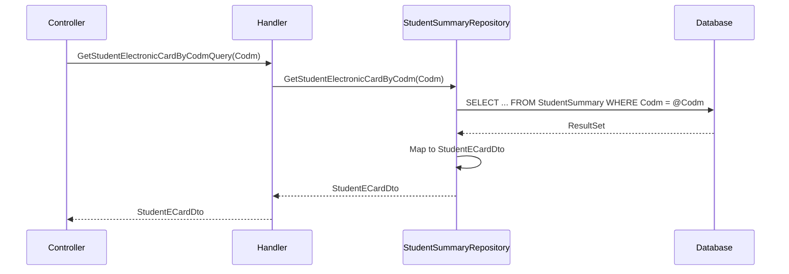

<div dir="rtl">

# GetStudentElectronicCardByCodmQuery

## 📄 اطلاعات کلی

**مسیر فایل:**
```
Csis.Admission.Application/Features/Students/Iranian/Queries/GetStudentElectronicCardByCodmQuery.cs
```

**Feature:** Students  
**نوع:** Query  
**هدف:** دریافت اطلاعات کارت الکترونیکی دانشجو

---

## 🎯 هدف (Purpose)

این Query برای **دریافت اطلاعات کارت الکترونیکی (E-Card) دانشجو** استفاده می‌شود. کارت الکترونیکی شامل اطلاعات کامل دانشجو برای نمایش در قالب کارت دیجیتال است.

**ویژگی‌های کلیدی:**
- ✅ اطلاعات جامع برای نمایش کارت
- ✅ استفاده از Repository تخصصی
- ✅ Projection به DTO
- ✅ سبک و سریع

**کاربردها:**
- نمایش کارت دانشجویی دیجیتال
- چاپ کارت دانشجویی
- نمایش اطلاعات خلاصه دانشجو در UI

---

## 📝 ساختار Query

### ورودی (Request)

```csharp
public sealed record GetStudentElectronicCardByCodmQuery(int Codm) 
    : IRequest<StudentECardDto>;
```

**پارامترها:**
- `Codm`: کد مرکز خدمات دانشجو

### خروجی (Response)

```csharp
StudentECardDto
```

**فیلدهای احتمالی StudentECardDto:**
```csharp
{
    "Codm": 1001,
    "NationalCode": "1234567890",
    "FirstName": "محمد",
    "LastName": "احمدی",
    "FatherName": "علی",
    "BirthDate": "1370/05/15",
    "BirthPlace": "تهران",
    "ProfileImage": "data:image/jpg;base64,...",
    "StudentNumber": "95123456",
    "FieldOfStudy": "فقه و اصول",
    "EducationLevel": "سطح 3",
    "Branch": "قم",
    "School": "معصومیه",
    "IssueDate": "1400/01/01",
    "ExpiryDate": "1401/12/29",
    "BloodType": "A+",
    "PhoneNumber": "09123456789",
    "Address": "قم، خیابان...",
    "IsActive": true
}
```

---

## 🔄 جریان اجرا (Execution Flow)

### مراحل:

```
1. فراخوانی Repository
   ├─> studentSummaryRepository.GetStudentElectronicCardByCodm(Codm)
   └─> Projection مستقیم به StudentECardDto

2. بازگشت DTO
   └─> StudentECardDto
```

### نمودار توالی (Sequence Diagram)



---

## 📦 وابستگی‌ها (Dependencies)

### Repository ها
- `IStudentSummaryRepository`: Repository تخصصی برای خلاصه اطلاعات دانشجو
  - متد: `GetStudentElectronicCardByCodm(Codm)`: دریافت اطلاعات کارت الکترونیکی

### DTO ها
- `StudentECardDto`: DTO اطلاعات کارت الکترونیکی

### پکیج‌ها
- `AutoMapper` (در Handler تزریق شده اما استفاده نشده)

---

## ⚙️ قوانین کسب‌وکار (Business Rules)

### اطلاعات کارت الکترونیکی

کارت الکترونیکی معمولاً شامل اطلاعات زیر است:

**اطلاعات شناسایی:**
- نام و نام خانوادگی
- کد ملی
- شماره دانشجویی
- تصویر پروفایل

**اطلاعات تحصیلی:**
- رشته تحصیلی
- مقطع تحصیلی
- شعبه
- مدرسه

**اطلاعات تماس:**
- شماره تلفن
- آدرس

**اطلاعات کارت:**
- تاریخ صدور
- تاریخ انقضا
- وضعیت فعال/غیرفعال

**اطلاعات اضافی:**
- گروه خونی
- محل تولد
- تاریخ تولد

---

## 🔍 نکات پیاده‌سازی (Implementation Notes)

### 1. Unused Dependency

```csharp
public GetStudentElectronicCardByCodmQueryHandler(
    IMapper mapper,  // ⚠️ تزریق شده اما استفاده نشده
    IStudentSummaryRepository studentSummaryRepository)
{
    _studentSummaryRepository = studentSummaryRepository;
}
```

⚠️ **نکته:**
- `IMapper` تزریق شده اما هیچ جا استفاده نمی‌شود
- احتمالاً Mapping در Repository انجام می‌شود
- بهتر است Dependency زائد حذف شود

**پیشنهاد:**
```csharp
public GetStudentElectronicCardByCodmQueryHandler(
    IStudentSummaryRepository studentSummaryRepository)
{
    _studentSummaryRepository = studentSummaryRepository;
}
```

### 2. Direct Repository Call

```csharp
var result = await _studentSummaryRepository.GetStudentElectronicCardByCodm(request.Codm);
return result;
```

- بدون پردازش اضافی
- Projection در Repository انجام می‌شود
- Handler بسیار ساده و خوانا

### 3. StudentSummaryRepository vs StudentRepository

- استفاده از `IStudentSummaryRepository` بجای `IStudentRepository`
- احتمالاً `StudentSummary` یک View یا Table خلاصه است
- عملکرد بهتر برای Query های خواندنی

### 4. Missing Validation

⚠️ **عدم Validation:**
- بدون بررسی Codm
- اگر دانشجو موجود نباشد چه می‌شود؟
- آیا `null` برگردانده می‌شود یا Exception؟

**پیشنهاد Validator:**
```csharp
public class GetStudentElectronicCardByCodmQueryValidator 
    : AbstractValidator<GetStudentElectronicCardByCodmQuery>
{
    public GetStudentElectronicCardByCodmQueryValidator()
    {
        RuleFor(x => x.Codm).GreaterThan(0);
    }
}
```

---

## 🎯 Use Cases

### UC-ViewECard: نمایش کارت الکترونیکی

**Actor:** دانشجو، کارمند

**Preconditions:**
- کاربر احراز هویت شده باشد
- دانشجو در سیستم موجود باشد

**Main Flow:**
1. کاربر درخواست مشاهده کارت الکترونیکی دانشجو را ارسال می‌کند
2. سیستم اطلاعات کارت را از دیتابیس دریافت می‌کند
3. سیستم DTO را برمی‌گرداند
4. UI کارت الکترونیکی را نمایش می‌دهد

**Postconditions:**
- کارت الکترونیکی دانشجو نمایش داده می‌شود

**Alternative Flows:**
- A1: دانشجو موجود نیست → خطا یا `null`

### UC-PrintECard: چاپ کارت الکترونیکی

**Actor:** کارمند

**Preconditions:**
- کارمند مجوز چاپ کارت داشته باشد
- اطلاعات کارت کامل باشد

**Main Flow:**
1. کارمند درخواست چاپ کارت را ارسال می‌کند
2. سیستم اطلاعات کارت را دریافت می‌کند
3. سیستم قالب چاپ را آماده می‌کند
4. کارت چاپ می‌شود

**Postconditions:**
- کارت دانشجویی چاپ شده

---

## ⚠️ ریسک‌ها و نکات (Risks & Notes)

### امنیتی (Security)

1. ⚠️ **No Authorization:**
   - بدون بررسی دسترسی
   - همه کاربران می‌توانند کارت هر دانشجویی را ببینند
   - نیاز به محدودیت:
     - دانشجو فقط کارت خودش
     - کارمند با مجوز خاص

2. ⚠️ **Privacy Concerns:**
   - اطلاعات حساس (آدرس، تلفن، ...)
   - بدون Mask یا Filtering
   - نیاز به سیاست دسترسی

### عملکردی (Performance)

1. ✅ **Single Query:**
   - یک Query ساده
   - بدون Join های پیچیده
   - عملکرد خوب

2. ✅ **Projection:**
   - Mapping مستقیم به DTO
   - فقط فیلدهای لازم

3. ⚠️ **No Caching:**
   - اطلاعات کارت نسبتاً ثابت است
   - می‌توان کش کرد (مثلاً 1 ساعت)

   **پیشنهاد:**
   ```csharp
   [CachedQuery(ExpirationSeconds = 3600)]
   public sealed record GetStudentElectronicCardByCodmQuery(int Codm) 
       : IRequest<StudentECardDto>;
   ```

### کیفیت کد (Code Quality)

1. ⚠️ **Unused Dependency:**
   ```csharp
   IMapper mapper  // استفاده نشده
   ```
   - Dependency زائد
   - کاهش خوانایی

2. ✅ **Simplicity:**
   - کد بسیار ساده
   - فقط یک فراخوانی Repository

3. ✅ **Separation of Concerns:**
   - Handler فقط هماهنگ‌کننده است
   - منطق در Repository

---

## 📊 خلاصه نکات کلیدی

| جنبه | توضیح |
|------|-------|
| **الگوی طراحی** | CQRS + Repository Pattern |
| **Entity** | StudentSummary (Table/View) |
| **Projection** | ✅ به DTO در Repository |
| **Authorization** | ⚠️ ندارد |
| **Validation** | ⚠️ ندارد |
| **Caching** | ⚠️ ندارد (پیشنهادی) |
| **Performance** | ✅ خوب (Query ساده) |
| **Unused Dependency** | ⚠️ IMapper |
| **مستندات XML** | ✅ موجود |

---

## 🔗 لینک‌های مرتبط

### Queries مرتبط
- [GetStudentInfoByCodmQuery.md](./GetStudentInfoByCodmQuery.md) - اطلاعات کامل دانشجو
- [GetStudentSummaryCaseByCodmQuery.md](./GetStudentSummaryCaseByCodmQuery.md) - خلاصه پرونده دانشجو
- [GetStudentProfileImageByCodmQuery.md](./GetStudentProfileImageByCodmQuery.md) - تصویر پروفایل

### DTOs
- StudentECardDto - DTO کارت الکترونیکی

### Repositories
- [IStudentSummaryRepository](../../../../Persistence/StudentSummaryRepository.md) - Repository خلاصه دانشجو

---

**نسخه مستندات:** 1.0  
**تاریخ ایجاد:** 2026-01-03

</div>
