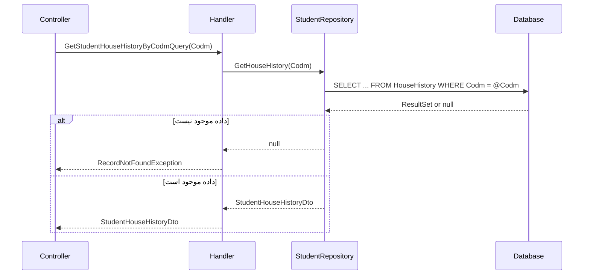

<div dir="rtl">

# GetStudentHouseHistoryByCodmQuery

## 📄 اطلاعات کلی

**مسیر فایل:**
```
Csis.Admission.Application/Features/Students/Iranian/Queries/GetStudentHouseHistoryByCodmQuery.cs
```

**Feature:** Students  
**نوع:** Query  
**هدف:** دریافت تاریخچه مسکن دانشجو

---

## 🎯 هدف (Purpose)

این Query برای **دریافت تاریخچه کامل مسکن دانشجو** استفاده می‌شود که شامل:
- سوابق مسکن در طول زمان
- تغییرات وضعیت مسکن
- اطلاعات ملک (خودی/استیجاری/...)
- تاریخچه امتیاز مسکن

این اطلاعات برای ارزیابی نیاز به کمک مسکن و امتیازدهی استفاده می‌شود.

**ویژگی‌های کلیدی:**
- ✅ تاریخچه کامل مسکن
- ✅ Exception در صورت عدم وجود
- ✅ استفاده از Repository تخصصی

---

## 📝 ساختار Query

### ورودی (Request)

```csharp
public sealed record GetStudentHouseHistoryByCodmQuery(int Codm) 
    : IRequest<StudentHouseHistoryDto>;
```

**پارامترها:**
- `Codm`: کد مرکز خدمات دانشجو

### خروجی (Response)

```csharp
StudentHouseHistoryDto  // یا RecordNotFoundException
```

**فیلدهای احتمالی StudentHouseHistoryDto:**
```csharp
{
    "History": [
        {
            "Date": "1400/01/01",
            "HousingType": "Rental",      // استیجاری
            "MonthlyRent": 5000000,
            "City": "قم",
            "Address": "...",
            "Score": 150
        },
        {
            "Date": "1401/05/15",
            "HousingType": "Personal",    // ملکی
            "MortgageAmount": 200000000,
            "City": "قم",
            "Score": 80
        }
    ],
    "CurrentHousing": {
        "Type": "Personal",
        "Since": "1401/05/15",
        "Score": 80
    }
}
```

---

## 🔄 جریان اجرا (Execution Flow)

### مراحل:

```
1. فراخوانی Repository
   ├─> studentRepo.GetHouseHistory(Codm)
   └─> دریافت تاریخچه مسکن

2. بررسی نتیجه
   ├─> اگر null
   └──> پرتاب RecordNotFoundException

3. بازگشت DTO
   └─> StudentHouseHistoryDto
```

### نمودار توالی (Sequence Diagram)



---

## 📦 وابستگی‌ها (Dependencies)

### Repository ها
- `IStudentRepository`: Repository تخصصی برای دانشجو
  - متد: `GetHouseHistory(Codm)`: دریافت تاریخچه مسکن

### DTO ها
- `StudentHouseHistoryDto`: DTO تاریخچه مسکن

### Exceptions
- `RecordNotFoundException<GetStudentHouseHistoryByCodmQuery>`: رکورد موجود نیست

---

## ⚙️ قوانین کسب‌وکار (Business Rules)

### Exception Handling

```csharp
return await _studentRepo.GetHouseHistory(request.Codm)
    ?? throw new RecordNotFoundException<GetStudentHouseHistoryByCodmQuery>(request.Codm);
```

**منطق:**
- اگر تاریخچه مسکن موجود نباشد → Exception
- Exception شامل Codm برای debugging

**دلایل null:**
1. دانشجو وجود ندارد
2. دانشجو هیچ سابقه مسکن ثبت نکرده
3. داده‌ها حذف شده‌اند

### تاریخچه مسکن

تاریخچه معمولاً شامل:
- **تغییرات در طول زمان**: هر بار که دانشجو مسکن عوض می‌کند
- **انواع مسکن**: ملکی، استیجاری، خوابگاه، منزل خانواده
- **امتیازات**: امتیاز مسکن بر اساس نوع و شرایط
- **مدارک**: فایل‌های مربوط به هر رکورد مسکن

---

## 🔍 نکات پیاده‌سازی (Implementation Notes)

### 1. Null-Coalescing with Exception

```csharp
?? throw new RecordNotFoundException<GetStudentHouseHistoryByCodmQuery>(request.Codm)
```

✅ **مزایا:**
- کد تمیز و خوانا
- یک خط کد بجای چندین خط if-else
- Pattern رایج در C# 9+

### 2. Generic Exception

```csharp
RecordNotFoundException<GetStudentHouseHistoryByCodmQuery>
```

- Type-safe Exception
- شامل اطلاعات Query برای Logging
- کمک به Debugging

### 3. Repository Method Name

`GetHouseHistory` نشان‌دهنده:
- دریافت تاریخچه (نه فقط وضعیت فعلی)
- احتمالاً چند رکورد مسکن

### 4. No Validation

⚠️ **نکته:**
- بدون بررسی Codm
- اگر Codm نامعتبر باشد (مثلاً 0 یا منفی)
- Exception از Repository می‌آید

---

## 🎯 Use Cases

### UC-ViewHouseHistory: مشاهده تاریخچه مسکن

**Actor:** کارمند، دانشجو

**Preconditions:**
- دانشجو در سیستم موجود باشد
- حداقل یک رکورد مسکن ثبت شده باشد

**Main Flow:**
1. کاربر درخواست تاریخچه مسکن را ارسال می‌کند
2. سیستم تاریخچه را از دیتابیس دریافت می‌کند
3. سیستم DTO را برمی‌گرداند
4. UI تاریخچه را نمایش می‌دهد

**Postconditions:**
- تاریخچه کامل مسکن دانشجو نمایش داده می‌شود

**Alternative Flows:**
- A1: تاریخچه موجود نیست → RecordNotFoundException

**Use Cases مرتبط:**
- ارزیابی نیاز به کمک مسکن
- محاسبه امتیاز معیشت
- تایید اطلاعات مسکن

---

## ⚠️ ریسک‌ها و نکات (Risks & Notes)

### امنیتی (Security)

1. ⚠️ **No Authorization:**
   - بدون بررسی دسترسی
   - اطلاعات مسکن شخصی است
   - دانشجو باید فقط تاریخچه خودش را ببیند
   - کارمند نیاز به Permission دارد

2. ⚠️ **Sensitive Data:**
   - آدرس، مبلغ اجاره، مبلغ رهن
   - نیاز به محافظت در Log ها

### عملکردی (Performance)

1. ✅ **Simple Query:**
   - Query ساده
   - عملکرد خوب

2. ⚠️ **No Caching:**
   - تاریخچه نسبتاً ثابت است
   - می‌توان کش کرد

3. ⚠️ **Large History:**
   - اگر تاریخچه خیلی طولانی باشد
   - نیاز به Paging یا محدودیت

### کیفیت کد (Code Quality)

1. ✅ **Clean Code:**
   - کد بسیار ساده و خوانا
   - استفاده از Pattern های جدید C#

2. ✅ **Proper Exception:**
   - RecordNotFoundException واضح و مفید

3. ⚠️ **Missing Validation:**
   - بدون Validator

---

## 📊 خلاصه نکات کلیدی

| جنبه | توضیح |
|------|-------|
| **الگوی طراحی** | CQRS + Repository Pattern |
| **Exception Handling** | ✅ RecordNotFoundException |
| **Authorization** | ⚠️ ندارد |
| **Validation** | ⚠️ ندارد |
| **Caching** | ⚠️ ندارد (پیشنهادی) |
| **Performance** | ✅ خوب |
| **Privacy** | ⚠️ نیاز به محافظت |
| **مستندات XML** | ✅ موجود |

---

## 🔗 لینک‌های مرتبط

### Queries مرتبط
- GetStudentInfoByCodmQuery - اطلاعات کامل دانشجو

### Commands مرتبط
- Houses Feature Commands - مدیریت مسکن

---

**نسخه مستندات:** 1.0  
**تاریخ ایجاد:** 2026-01-03

</div>
