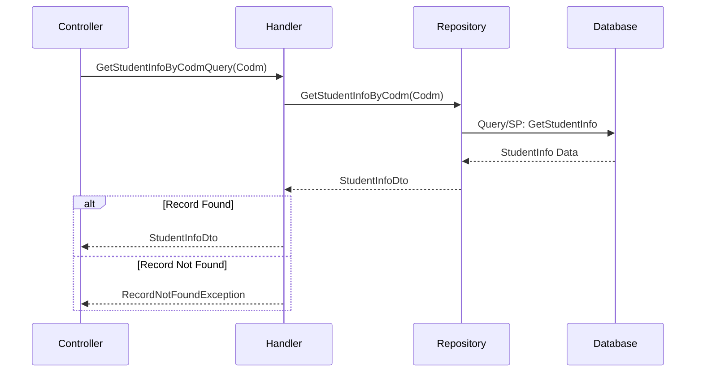

<div dir="rtl">

# GetStudentInfoByCodmQuery

## 📄 اطلاعات کلی

**مسیر فایل:**
```
Csis.Admission.Application/Features/Students/Iranian/Queries/GetStudentInfoByCodmQuery.cs
```

**Feature:** Students  
**نوع:** Query  
**هدف:** دریافت اطلاعات کامل دانشجو بر اساس کد مرکز خدمات (Codm)

---

## 🎯 هدف (Purpose)

این Query برای **دریافت اطلاعات جامع دانشجو** استفاده می‌شود. این اطلاعات شامل تمامی جزئیات شناسنامه‌ای، تماس، آدرس و سایر اطلاعات مهم دانشجو است.

---

## 📝 ساختار Query

### ورودی (Request)

```csharp
public sealed record GetStudentInfoByCodmQuery(int Codm) : IRequest<StudentInfoDto>;
```

**پارامترها:**
- `Codm`: کد مرکز خدمات دانشجو (شناسه یکتا)

### خروجی (Response)

```csharp
StudentInfoDto  // اطلاعات کامل دانشجو
```

**ساختار `StudentInfoDto`** (تخمینی):
```csharp
public class StudentInfoDto
{
    // اطلاعات شناسنامه‌ای
    public int Codm { get; set; }
    public string? NationalCode { get; set; }
    public string? FirstName { get; set; }
    public string? LastName { get; set; }
    public string? FatherName { get; set; }
    public int BirthDate { get; set; }
    public string? BirthCertNumber { get; set; }
    public Gender Gender { get; set; }
    
    // اطلاعات تماس
    public string? Mobile { get; set; }
    public string? Email { get; set; }
    
    // اطلاعات آدرس
    public string? Address { get; set; }
    public string? PostalCode { get; set; }
    
    // اطلاعات پرونده
    public int? CaseStatus { get; set; }
    public int? CaseExpireDate { get; set; }
    
    // و سایر فیلدها...
}
```

---

## 🔄 جریان اجرا (Execution Flow)

### مراحل:

```
1. دریافت Codm از Request
   
2. فراخوانی Repository
   ├─> GetStudentInfoByCodm(Codm)
   └─> احتمالاً استفاده از Stored Procedure یا Query پیچیده
   
3. بررسی نتیجه
   ├─> اگر null → RecordNotFoundException
   └─> اگر موجود → بازگشت StudentInfoDto
```

### نمودار توالی (Sequence Diagram)



---

## 📦 وابستگی‌ها (Dependencies)

### سرویس‌ها
- `IStudentRepository`: دسترسی به داده‌های دانشجو

### DTO ها
- `StudentInfoDto`: DTO شامل اطلاعات کامل دانشجو

### Exceptions
- `RecordNotFoundException<StudentInfoDto>`: زمانی که دانشجو یافت نشود

---

## ⚙️ قوانین کسب‌وکار (Business Rules)

### BR-1: یافت نشدن دانشجو
- اگر `Codm` نامعتبر باشد یا دانشجو حذف شده باشد
- استثنای `RecordNotFoundException` پرتاب می‌شود
- پیام خطا شامل `Codm` است (برای لاگ و دیباگ)

### BR-2: دسترسی به اطلاعات
- دانشجو: فقط اطلاعات خودش
- کارمند: با مجوز مناسب می‌تواند اطلاعات سایر دانشجویان را ببیند

---

## 🐛 مدیریت خطا (Error Handling)

### استثناها

1. **RecordNotFoundException**
   ```csharp
   throw new RecordNotFoundException<StudentInfoDto>(request.Codm);
   ```
   - زمانی که دانشجو با `Codm` مشخص یافت نشود
   - شامل `Codm` برای دیباگ

2. **خطای پایگاه داده**
   - مشکل در اتصال
   - خطای Query/SP

---

## 🔒 امنیت و اعتبارسنجی (Security & Validation)

### اعتبارسنجی
- ⚠️ **هیچ Validator صریحی وجود ندارد**
- باید اضافه شود:
  - `Codm > 0`

### احراز هویت
- نیاز به احراز هویت دارد
- کاربر باید وارد سیستم شده باشد

### مجوز
- **دانشجو**: فقط `Codm` خودش را می‌تواند ببیند
- **کارمند**: با مجوز "ViewStudentInfo" می‌تواند هر دانشجویی را ببیند

---

## 📊 عملکرد (Performance)

### بهینه‌سازی‌ها
- احتمالاً استفاده از Stored Procedure (سریع)
- یا Query بهینه شده با Indexes مناسب

### نکات
- این Query احتمالاً شامل Join های متعدد است:
  - Students
  - People
  - Addresses
  - StudentMobiles
  - و غیره
- پیشنهاد: استفاده از View یا Materialized View برای عملکرد بهتر

### Caching
- این Query کاندید خوبی برای Cache است
- می‌توان برای مدت کوتاه (مثلاً 5 دقیقه) Cache کرد
- Invalidate هنگام تغییر اطلاعات دانشجو

---

## 🧪 Use Cases

### UC-010: مشاهده اطلاعات کامل دانشجو

**Actor**: دانشجو / کارمند

**Preconditions**:
- کاربر احراز هویت شده
- `Codm` معتبر است
- دانشجو در سیستم موجود است

**Main Flow**:
1. کاربر درخواست مشاهده اطلاعات دانشجو را می‌دهد
2. سیستم این Query را اجرا می‌کند
3. اطلاعات کامل دانشجو بازگردانده می‌شود
4. اطلاعات به کاربر نمایش داده می‌شود

**Postconditions**:
- اطلاعات دانشجو نمایش داده شده

**Alternative Flows**:
- A1: دانشجو یافت نشد → خطای 404
- A2: کاربر مجوز ندارد → خطای 403

---

## 💡 پیشنهادات بهبود

### پیشنهاد 1: افزودن Validator
```csharp
public class GetStudentInfoByCodmQueryValidator 
    : AbstractValidator<GetStudentInfoByCodmQuery>
{
    public GetStudentInfoByCodmQueryValidator()
    {
        RuleFor(x => x.Codm)
            .GreaterThan(0)
            .WithMessage("کد دانشجو نامعتبر است");
    }
}
```

### پیشنهاد 2: افزودن Caching
```csharp
public async Task<StudentInfoDto> Handle(
    GetStudentInfoByCodmQuery request, 
    CancellationToken cancellationToken)
{
    var cacheKey = $"StudentInfo_{request.Codm}";
    
    var cached = await _cacheService.GetAsync<StudentInfoDto>(cacheKey);
    if (cached != null)
        return cached;
    
    var result = await _studentRepo.GetStudentInfoByCodm(request.Codm)
        ?? throw new RecordNotFoundException<StudentInfoDto>(request.Codm);
    
    await _cacheService.SetAsync(cacheKey, result, TimeSpan.FromMinutes(5));
    
    return result;
}
```

### پیشنهاد 3: افزودن Authorization
```csharp
[Authorize(Policy = "ViewStudentInfo")]
public async Task<StudentInfoDto> Handle(...)
{
    // بررسی دسترسی
    var currentCodm = await _currentUserService.GetCodm();
    if (!await _currentUserService.IsEmployee() && currentCodm != request.Codm)
    {
        throw new UnauthorizedException("شما فقط می‌توانید اطلاعات خود را مشاهده کنید");
    }
    
    // ...
}
```

---

## 📚 مستندات مرتبط

### Queries مرتبط
- `GetStudentByCodmQuery`: دریافت entity کامل دانشجو
- `GetStudentSummaryCaseByCodmQuery`: دریافت خلاصه اطلاعات پرونده
- `GetStudentAddressByCodmQuery`: فقط آدرس
- `GetStudentPhoneByCodmQuery`: فقط شماره تماس

### Commands مرتبط
- `UpdateStudentBirthCertCommand`: بروزرسانی اطلاعات شناسنامه‌ای
- `SyncStudentBirthCertCommand`: همگام‌سازی با ثبت احوال

---

## 📊 خلاصه

| جنبه | وضعیت | نمره |
|------|-------|------|
| **سادگی** | عالی (Query ساده) | 10/10 |
| **عملکرد** | خوب (نیاز به Cache) | 7/10 |
| **امنیت** | ضعیف (بدون Validator/Authorization) | 4/10 |
| **کیفیت کد** | خوب (تمیز و واضح) | 8/10 |
| **خطاپردازی** | خوب (RecordNotFoundException) | 8/10 |

**توصیه کلی**: Query ساده و خوانا است اما نیاز به Validator, Authorization و Caching دارد.

</div>
