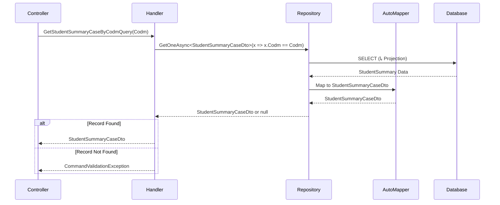

<div dir="rtl">

# GetStudentSummaryCaseByCodmQuery

## 📄 اطلاعات کلی

**مسیر فایل:**
```
Csis.Admission.Application/Features/Students/Iranian/Queries/GetStudentSummaryCaseByCodmQuery.cs
```

**Feature:** Students  
**نوع:** Query  
**هدف:** دریافت خلاصه اطلاعات پرونده دانشجو بر اساس کد مرکز خدمات (Codm)

---

## 🎯 هدف (Purpose)

این Query برای **دریافت خلاصه اطلاعات پرونده** دانشجو استفاده می‌شود. این Query سبک‌تر از `GetStudentInfoByCodmQuery` است و فقط اطلاعات کلیدی پرونده را برمی‌گرداند.

**تفاوت با GetStudentInfoByCodmQuery:**
- خلاصه‌تر و سریع‌تر
- فقط اطلاعات پرونده (نه جزئیات کامل)
- مناسب برای لیست‌ها و داشبورد

---

## 📝 ساختار Query

### ورودی (Request)

```csharp
public sealed record GetStudentSummaryCaseByCodmQuery(int Codm) : IRequest<StudentSummaryCaseDto>;
```

**پارامترها:**
- `Codm`: کد مرکز خدمات دانشجو

### خروجی (Response)

```csharp
StudentSummaryCaseDto  // خلاصه اطلاعات پرونده
```

**ساختار `StudentSummaryCaseDto`** (تخمینی):
```csharp
public class StudentSummaryCaseDto
{
    public int Codm { get; set; }
    public string? FullName { get; set; }
    public string? NationalCode { get; set; }
    
    // اطلاعات پرونده
    public int? CaseStatus { get; set; }
    public string? CaseStatusTitle { get; set; }
    public int? CaseExpireDate { get; set; }
    public bool IsActive { get; set; }
    public bool IsBlocked { get; set; }
    
    // اطلاعات مرکز
    public int? BranchId { get; set; }
    public string? BranchName { get; set; }
    
    // تاریخ‌ها
    public int? RegisterDate { get; set; }
    public int? LastUpdateDate { get; set; }
}
```

---

## 🔄 جریان اجرا (Execution Flow)

### مراحل:

```
1. دریافت Codm از Request
   
2. فراخوانی Repository با Projection
   ├─> IRepository<StudentSummary>
   ├─> GetOneAsync<StudentSummaryCaseDto>
   └─> استفاده از AutoMapper برای Projection
   
3. بررسی نتیجه
   ├─> اگر null → CommandValidationException
   └─> اگر موجود → بازگشت StudentSummaryCaseDto
```

### نمودار توالی (Sequence Diagram)



---

## 📦 وابستگی‌ها (Dependencies)

### سرویس‌ها
- `IRepository<StudentSummary>`: دسترسی به جدول StudentSummary (View یا Table)

### DTO ها
- `StudentSummaryCaseDto`: خلاصه اطلاعات پرونده

### Entity
- `StudentSummary`: احتمالاً یک View یا Table خلاصه اطلاعات دانشجویان

### Exceptions
- `CommandValidationException`: با پیام "پرونده ای با این مشخصات یافت نشد."

---

## ⚙️ قوانین کسب‌وکار (Business Rules)

### BR-1: استفاده از StudentSummary
- این Query از جدول/View `StudentSummary` استفاده می‌کند
- `StudentSummary` احتمالاً یک View بهینه شده است که:
  - اطلاعات پرتکرار را Pre-join کرده
  - Indexed است
  - برای Query های سریع طراحی شده

### BR-2: Projection
- استفاده از Generic Method با Projection:
  ```csharp
  GetOneAsync<StudentSummaryCaseDto>(...)
  ```
- فقط فیلدهای مورد نیاز از DB دریافت می‌شود (SELECT کوچک)
- AutoMapper به صورت خودکار Projection می‌کند

### BR-3: خطای سفارشی
- به جای `RecordNotFoundException`, از `CommandValidationException` استفاده می‌شود
- پیام: "پرونده ای با این مشخصات یافت نشد."
- احتمالاً برای User Experience بهتر (پیام فارسی)

---

## 🔄 مقایسه با Query مشابه

### GetStudentInfoByCodmQuery vs GetStudentSummaryCaseByCodmQuery

| جنبه | GetStudentInfoByCodmQuery | GetStudentSummaryCaseByCodmQuery |
|------|--------------------------|--------------------------------|
| **منبع داده** | احتمالاً SP یا Join پیچیده | جدول/View StudentSummary |
| **حجم داده** | کامل و جزئی | خلاصه |
| **سرعت** | کندتر | سریع‌تر |
| **استفاده** | صفحه جزئیات | لیست، داشبورد |
| **Exception** | RecordNotFoundException | CommandValidationException |
| **Repository** | IStudentRepository | IRepository<StudentSummary> |

---

## 🐛 مدیریت خطا (Error Handling)

### استثناها

1. **CommandValidationException**
   ```csharp
   throw new CommandValidationException("پرونده ای با این مشخصات یافت نشد.");
   ```
   - زمانی که دانشجو یافت نشود
   - پیام فارسی برای کاربر

2. **خطای پایگاه داده**
   - مشکل در اتصال
   - خطای Query

---

## 🔒 امنیت و اعتبارسنجی (Security & Validation)

### اعتبارسنجی
- ⚠️ **هیچ Validator صریحی وجود ندارد**
- باید اضافه شود:
  - `Codm > 0`

### احراز هویت
- نیاز به احراز هویت دارد

### مجوز
- دانشجو: فقط `Codm` خودش
- کارمند: با مجوز مناسب

---

## 📊 عملکرد (Performance)

### بهینه‌سازی‌ها
✅ استفاده از `StudentSummary` (بهینه)  
✅ Projection (SELECT فقط فیلدهای لازم)  
✅ Generic Method (کد تمیز)

### نکات
- `StudentSummary` باید Index مناسب روی `Codm` داشته باشد
- اگر `StudentSummary` یک View است، باید Materialized باشد برای عملکرد بهتر

### Benchmark تخمینی
- Query Time: < 10ms (با Index)
- Projection Overhead: negligible
- Memory: کم (فقط یک رکورد خلاصه)

---

## 🧪 Use Cases

### UC-010-Summary: مشاهده خلاصه پرونده دانشجو

**Actor**: دانشجو / کارمند

**Preconditions**:
- کاربر احراز هویت شده
- `Codm` معتبر است

**Main Flow**:
1. کاربر وارد داشبورد می‌شود
2. سیستم این Query را اجرا می‌کند
3. خلاصه اطلاعات پرونده نمایش داده می‌شود:
   - نام کامل
   - وضعیت پرونده
   - تاریخ انقضا
   - وضعیت مسدودی

**Postconditions**:
- خلاصه پرونده نمایش داده شده

---

## 💡 پیشنهادات بهبود

### پیشنهاد 1: افزودن Validator
```csharp
public class GetStudentSummaryCaseByCodmQueryValidator 
    : AbstractValidator<GetStudentSummaryCaseByCodmQuery>
{
    public GetStudentSummaryCaseByCodmQueryValidator()
    {
        RuleFor(x => x.Codm)
            .GreaterThan(0)
            .WithMessage("کد دانشجو نامعتبر است");
    }
}
```

### پیشنهاد 2: افزودن Caching
```csharp
public async Task<StudentSummaryCaseDto> Handle(
    GetStudentSummaryCaseByCodmQuery request, 
    CancellationToken cancellationToken)
{
    var cacheKey = $"StudentSummaryCase_{request.Codm}";
    
    var cached = await _cacheService.GetAsync<StudentSummaryCaseDto>(cacheKey);
    if (cached != null)
        return cached;
    
    var result = await studentRepo.GetOneAsync<StudentSummaryCaseDto>(
        x => x.Codm == request.Codm, 
        cancellationToken: cancellationToken)
        ?? throw new CommandValidationException("پرونده ای با این مشخصات یافت نشد.");
    
    // Cache برای 10 دقیقه
    await _cacheService.SetAsync(cacheKey, result, TimeSpan.FromMinutes(10));
    
    return result;
}
```

### پیشنهاد 3: یکسان‌سازی Exception
```csharp
// به جای CommandValidationException
throw new RecordNotFoundException<StudentSummaryCaseDto>(request.Codm);
```
- سازگاری با سایر Query ها
- Exception Handling یکپارچه

---

## 🔍 نکات ویژه

### ✅ نکته مثبت 1: استفاده از Projection
```csharp
GetOneAsync<StudentSummaryCaseDto>(x => x.Codm == request.Codm, ...)
```
- AutoMapper به صورت خودکار فقط فیلدهای مورد نیاز را SELECT می‌کند
- کاهش حجم داده منتقل شده

### ✅ نکته مثبت 2: استفاده از StudentSummary
- جدول/View بهینه شده برای Query های سریع
- Pre-aggregated data

### ⚠️ نکته منفی: Exception متفاوت
- سایر Query ها از `RecordNotFoundException` استفاده می‌کنند
- این Query از `CommandValidationException` استفاده می‌کند
- ناسازگاری در Exception Handling

---

## 📚 مستندات مرتبط

### Queries مرتبط
- `GetStudentInfoByCodmQuery`: اطلاعات کامل (جزئی‌تر)
- `GetStudentByCodmQuery`: Entity کامل
- `GetStudentCaseByCodmQuery`: فقط اطلاعات Case

### Entities/Views
- `StudentSummary`: Entity/View خلاصه اطلاعات دانشجویان

---

## 📊 خلاصه

| جنبه | وضعیت | نمره |
|------|-------|------|
| **سادگی** | عالی (بسیار ساده) | 10/10 |
| **عملکرد** | عالی (Projection + Summary) | 9/10 |
| **امنیت** | ضعیف (بدون Validator) | 4/10 |
| **کیفیت کد** | عالی (تمیز و کوتاه) | 10/10 |
| **خطاپردازی** | خوب (پیام فارسی) | 8/10 |
| **سازگاری** | متوسط (Exception متفاوت) | 6/10 |

**توصیه کلی**: Query بسیار خوب و بهینه است. فقط نیاز به Validator و یکسان‌سازی Exception دارد.

</div>
