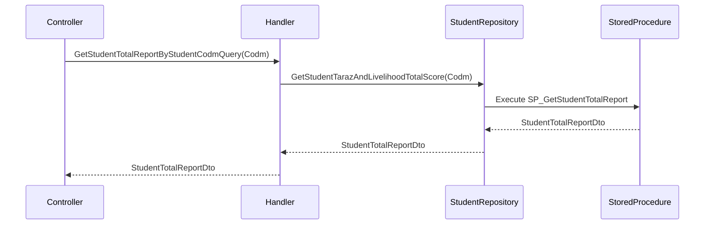

<div dir="rtl">

# GetStudentTotalReportByStudentCodmQuery

## 📄 اطلاعات کلی

**مسیر فایل:**
```
Csis.Admission.Application/Features/Students/Iranian/Queries/GetStudentTotalReportByStudentCodmQuery.cs
```

**Feature:** Students  
**نوع:** Query  
**هدف:** دریافت گزارش جامع تراز، هدفمندی و معیشت دانشجو

---

## 🎯 هدف (Purpose)

این Query برای **دریافت گزارش جامع امتیازات و وضعیت مالی دانشجو** استفاده می‌شود که شامل:

1. **تراز (Taraz)**: امتیاز کلی دانشجو
2. **هدفمندی**: وضعیت یارانه‌های هدفمندی
3. **معیشت (Livelihood)**: امتیاز معیشت و شرایط اقتصادی

این اطلاعات برای تصمیم‌گیری در مورد کمک‌های مالی و خدمات رفاهی استفاده می‌شود.

**ویژگی‌های کلیدی:**
- ✅ گزارش جامع امتیازات
- ✅ استفاده از Repository تخصصی
- ✅ Projection به DTO
- ✅ Exception در صورت عدم وجود

---

## 📝 ساختار Query

### ورودی (Request)

```csharp
public sealed record GetStudentTotalReportByStudentCodmQuery(int Codm) 
    : IRequest<StudentTotalReportDto>;
```

**پارامترها:**
- `Codm`: کد مرکز خدمات دانشجو

### خروجی (Response)

```csharp
StudentTotalReportDto
```

**فیلدهای احتمالی StudentTotalReportDto:**
```csharp
{
    "TarazScore": 850,              // امتیاز تراز
    "TargetingScore": 120,          // امتیاز هدفمندی
    "LivelihoodScore": 300,         // امتیاز معیشت
    "TotalScore": 1270,             // مجموع امتیازات
    "IncomeLevel": "Low",           // سطح درآمد
    "HousingStatus": "Rental",      // وضعیت مسکن
    "FamilySize": 5,                // تعداد افراد خانواده
    "HasTargetingSubsidy": true,    // وضعیت یارانه هدفمندی
    "CalculationDate": "1402/10/15" // تاریخ محاسبه
}
```

---

## 🔄 جریان اجرا (Execution Flow)

### مراحل:

```
1. فراخوانی Repository
   ├─> repository.GetStudentTarazAndLivelihoodTotalScore(Codm)
   └─> محاسبه یا دریافت امتیازات از Stored Procedure

2. بازگشت DTO
   └─> StudentTotalReportDto
```

### نمودار توالی (Sequence Diagram)



---

## 📦 وابستگی‌ها (Dependencies)

### Repository ها
- `IStudentRepository`: Repository تخصصی برای دانشجو
  - متد: `GetStudentTarazAndLivelihoodTotalScore(Codm)`: دریافت گزارش جامع امتیازات

### DTO ها
- `StudentTotalReportDto`: DTO گزارش جامع امتیازات

### پکیج‌ها
- `AutoMapper` (تزریق شده اما استفاده نشده)

---

## ⚙️ قوانین کسب‌وکار (Business Rules)

### محاسبه امتیازات

**تراز (Taraz):**
- امتیاز کلی دانشجو بر اساس معیارهای مختلف
- شامل: وضعیت تحصیلی، خانواده، شغل، مسکن، ...

**هدفمندی (Targeting):**
- امتیاز بر اساس سیستم یارانه‌های هدفمندی
- اطلاعات از سامانه دولتی دریافت می‌شود

**معیشت (Livelihood):**
- امتیاز شرایط اقتصادی و معیشت
- بر اساس درآمد، تعداد افراد خانواده، هزینه‌ها

---

## 🔍 نکات پیاده‌سازی (Implementation Notes)

### 1. Unused Dependency

```csharp
public GetStudentTotalReportByStudentCodmQueryHandler(
    IMapper mapper,  // ⚠️ استفاده نشده
    IStudentRepository repository)
```

- `IMapper` تزریق شده اما استفاده نمی‌شود
- احتمالاً Mapping در Repository یا SP انجام می‌شود

### 2. Direct Repository Call

```csharp
var result = await _repository.GetStudentTarazAndLivelihoodTotalScore(request.Codm);
return result;
```

- بدون پردازش اضافی
- منطق محاسبه در Repository یا Stored Procedure

### 3. نام متد

`GetStudentTarazAndLivelihoodTotalScore` نشان می‌دهد:
- محاسبه تراز (Taraz)
- محاسبه معیشت (Livelihood)
- جمع کل امتیازات (TotalScore)

### 4. عدم بررسی null

⚠️ **نکته:**
- بدون بررسی null
- اگر دانشجو موجود نباشد یا امتیازات محاسبه نشده باشند؟
- احتمالاً در Repository یا SP بررسی می‌شود

---

## 🎯 Use Cases

### UC-ViewStudentTotalReport: مشاهده گزارش جامع امتیازات

**Actor:** کارمند، مدیر

**Preconditions:**
- دانشجو در سیستم موجود باشد
- امتیازات محاسبه شده باشند

**Main Flow:**
1. کاربر درخواست گزارش جامع دانشجو را ارسال می‌کند
2. سیستم امتیازات تراز، هدفمندی و معیشت را محاسبه یا دریافت می‌کند
3. سیستم گزارش جامع را برمی‌گرداند
4. UI گزارش را نمایش می‌دهد

**Postconditions:**
- گزارش جامع امتیازات دانشجو نمایش داده می‌شود

**Use Cases مرتبط:**
- تصمیم‌گیری برای کمک‌های مالی
- ارزیابی شرایط اقتصادی دانشجو
- مقایسه دانشجویان برای تخصیص منابع

---

## ⚠️ ریسک‌ها و نکات (Risks & Notes)

### امنیتی (Security)

1. ⚠️ **No Authorization:**
   - بدون بررسی دسترسی
   - اطلاعات مالی حساس است
   - نیاز به محدودیت دسترسی

2. ⚠️ **Sensitive Data:**
   - اطلاعات درآمد و وضعیت اقتصادی
   - نیاز به Encryption یا Masking در Log ها

### عملکردی (Performance)

1. ⚠️ **Complex Calculation:**
   - محاسبه امتیازات می‌تواند پیچیده باشد
   - احتمالاً از Stored Procedure استفاده می‌شود
   - نیاز به بررسی عملکرد SP

2. ⚠️ **No Caching:**
   - امتیازات نسبتاً ثابت هستند
   - می‌توان کش کرد (مثلاً 1 ساعت)

### کیفیت کد (Code Quality)

1. ⚠️ **Unused Dependency:**
   ```csharp
   IMapper mapper
   ```

2. ✅ **Simplicity:**
   - کد بسیار ساده

3. ⚠️ **Missing Documentation:**
   - نام DTO مشخص نیست
   - فیلدهای خروجی مستند نیستند

---

## 📊 خلاصه نکات کلیدی

| جنبه | توضیح |
|------|-------|
| **الگوی طراحی** | CQRS + Repository Pattern |
| **نوع محاسبه** | تراز + هدفمندی + معیشت |
| **Authorization** | ⚠️ ندارد |
| **Validation** | ⚠️ ندارد |
| **Caching** | ⚠️ ندارد (پیشنهادی) |
| **Performance** | ⚠️ بستگی به SP |
| **Unused Dependency** | ⚠️ IMapper |
| **مستندات XML** | ✅ موجود |

---

## 🔗 لینک‌های مرتبط

### Queries مرتبط
- GetStudentSummaryCaseByCodmQuery - خلاصه پرونده دانشجو

### Repositories
- IStudentRepository - Repository دانشجو

---

**نسخه مستندات:** 1.0  
**تاریخ ایجاد:** 2026-01-03

</div>
