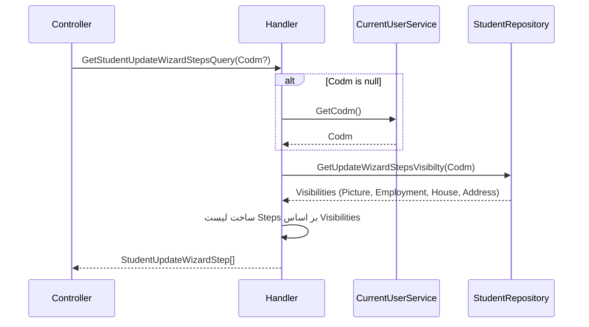

<div dir="rtl">

# GetStudentUpdateWizardStepsQuery

## 📄 اطلاعات کلی

**مسیر فایل:**
```
Csis.Admission.Application/Features/Students/Iranian/Queries/GetStudentUpdateWizardStepsQuery.cs
```

**Feature:** Students  
**نوع:** Query  
**هدف:** دریافت فرایندهای نیازمند بروزرسانی (Wizard Steps)

---

## 🎯 هدف (Purpose)

این Query برای **تعیین کدام بخش‌های اطلاعاتی دانشجو نیاز به بروزرسانی دارند** استفاده می‌شود. سیستم بر اساس قوانین کسب‌وکار مشخص می‌کند که دانشجو باید کدام اطلاعات را بروز کند.

**کاربرد:**
- نمایش Wizard بروزرسانی برای دانشجو
- هدایت دانشجو به بخش‌های خاص برای تکمیل
- اطمینان از کامل و به‌روز بودن اطلاعات

**Steps محتمل:**
1. Photo (تصویر پروفایل)
2. JobIncome (شغل و درآمد)
3. Housing (مسکن)
4. Address (آدرس)

---

## 📝 ساختار Query

### ورودی (Request)

```csharp
public sealed record GetStudentUpdateWizardStepsQuery(int? Codm) 
    : IRequest<StudentUpdateWizardStep[]>;
```

**پارامترها:**
- `Codm`: کد مرکز خدمات دانشجو (اختیاری - از CurrentUser دریافت می‌شود)

### خروجی (Response)

```csharp
StudentUpdateWizardStep[]  // آرایه‌ای از Steps نیازمند بروزرسانی
```

**مثال:**
```json
[
  "Photo",
  "JobIncome",
  "Housing"
]
```

---

## 🔄 جریان اجرا (Execution Flow)

### مراحل:

```
1. تعیین Codm
   ├─> اگر Codm ارسال نشده → دریافت از CurrentUser
   └─> Common.Utilities.SetCodm()

2. دریافت visibility flags
   ├─> repo.GetUpdateWizardStepsVisibilty(Codm)
   └─> شامل: PictureVisibility, EmploymentVisibility, HouseVisibility, AddressVisibility

3. ساخت لیست Steps
   ├─> اگر PictureVisibility → اضافه کردن Photo
   ├─> اگر EmploymentVisibility → اضافه کردن JobIncome
   ├─> اگر HouseVisibility → اضافه کردن Housing
   └─> اگر AddressVisibility → اضافه کردن Address

4. بازگشت آرایه
   └─> result.ToArray()
```

### نمودار توالی (Sequence Diagram)



---

## 📦 وابستگی‌ها (Dependencies)

### Repository ها
- `IStudentRepository`: Repository دانشجو
  - متد: `GetUpdateWizardStepsVisibilty(Codm)`: دریافت Visibility flags

### سرویس‌ها
- `ICurrentUserService`: اطلاعات کاربر جاری
  - برای دریافت Codm در صورت null بودن

### Enums
- `StudentUpdateWizardStep`: Steps قابل بروزرسانی
  ```csharp
  enum StudentUpdateWizardStep
  {
      Photo,
      JobIncome,
      Housing,
      Address
  }
  ```

### Utilities
- `Common.Utilities.SetCodm()`: تعیین Codm از Request یا CurrentUser

---

## ⚙️ قوانین کسب‌وکار (Business Rules)

### Visibility Rules

قوانین برای نمایش هر Step:

**1. Photo (تصویر):**
- تصویر قدیمی است (مثلاً بیش از 1 سال)
- تصویر با کیفیت پایین است
- تصویر توسط AI رد شده

**2. JobIncome (شغل و درآمد):**
- اطلاعات شغلی تکمیل نشده
- اطلاعات شغلی قدیمی است
- تغییر در وضعیت شغلی

**3. Housing (مسکن):**
- اطلاعات مسکن تکمیل نشده
- اطلاعات مسکن قدیمی است
- تغییر در وضعیت مسکن

**4. Address (آدرس):**
- آدرس تکمیل نشده
- آدرس قدیمی است
- نیاز به تایید آدرس

### ترتیب Steps

```csharp
1. Photo
2. JobIncome
3. Housing
4. Address
```

- ترتیب بر اساس اولویت
- دانشجو باید به ترتیب تکمیل کند

---

## 🔍 نکات پیاده‌سازی (Implementation Notes)

### 1. Codm اختیاری

```csharp
public sealed record GetStudentUpdateWizardStepsQuery(int? Codm)
```

- اگر دانشجو Query می‌کند → Codm از CurrentUser
- اگر کارمند Query می‌کند → Codm صریح ارسال می‌شود

### 2. Dynamic List Building

```csharp
var result = new List<StudentUpdateWizardStep>();
if (visibilties.PictureVisibility) {
    result.Add(StudentUpdateWizardStep.Photo);
}
```

- لیست به صورت پویا ساخته می‌شود
- فقط Steps نیازمند بروزرسانی اضافه می‌شوند

### 3. Discard Variable

```csharp
_ = await Common.Utilities.SetCodm(request, currentUser);
```

- نتیجه SetCodm نیاز نیست (Codm در request.Codm قرار می‌گیرد)
- استفاده از `_` برای Discard

### 4. Array Return

```csharp
return result.ToArray();
```

- تبدیل List به Array
- برای سازگاری با IRequest<StudentUpdateWizardStep[]>

---

## 🎯 Use Cases

### UC-CheckUpdateRequirements: بررسی نیاز به بروزرسانی

**Actor:** دانشجو، کارمند

**Preconditions:**
- دانشجو در سیستم موجود باشد

**Main Flow:**
1. سیستم نیازهای بروزرسانی را بررسی می‌کند
2. سیستم لیست Steps را برمی‌گرداند
3. UI Wizard بروزرسانی را نمایش می‌دهد
4. دانشجو Steps را یکی یکی تکمیل می‌کند

**Postconditions:**
- دانشجو می‌داند کدام اطلاعات را باید بروز کند

**Alternative Flows:**
- A1: همه اطلاعات به‌روز است → آرایه خالی

---

## ⚠️ ریسک‌ها و نکات (Risks & Notes)

### امنیتی (Security)

1. ✅ **Authorization:**
   - استفاده از CurrentUser برای دانشجو
   - دانشجو فقط Steps خودش را می‌بیند

### عملکردی (Performance)

1. ✅ **Simple Logic:**
   - منطق ساده و سریع
   - بدون Query های سنگین

2. ⚠️ **No Caching:**
   - می‌توان کش کرد (کوتاه مدت)

### کیفیت کد (Code Quality)

1. ✅ **Clean Code:**
   - کد ساده و خوانا
   - منطق واضح

2. ⚠️ **Hardcoded Logic:**
   - منطق Visibility در Repository
   - بهتر است قوانین در Configuration

---

## 📊 خلاصه نکات کلیدی

| جنبه | توضیح |
|------|-------|
| **الگوی طراحی** | CQRS + Wizard Pattern |
| **نوع خروجی** | Dynamic Array |
| **Authorization** | ✅ از CurrentUser |
| **Validation** | ✅ SetCodm |
| **Caching** | ⚠️ ندارد |
| **Performance** | ✅ خوب |
| **مستندات XML** | ✅ موجود |

---

## 🔗 لینک‌های مرتبط

### Queries مرتبط
- StudentInfoNeedUpdateByCodmQuery - جزئیات اطلاعات نیازمند بروزرسانی

### Commands مرتبط
- Update Wizard Commands - بروزرسانی هر Step

---

**نسخه مستندات:** 1.0  
**تاریخ ایجاد:** 2026-01-03

</div>
