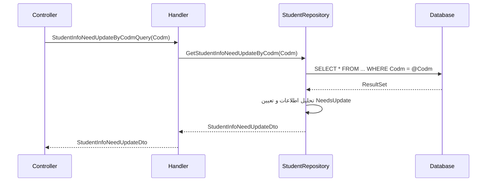

<div dir="rtl">

# StudentInfoNeedUpdateByCodmQuery

## 📄 اطلاعات کلی

**مسیر فایل:**
```
Csis.Admission.Application/Features/Students/Iranian/Queries/StudentInfoNeedUpdateByCodmQuery.cs
```

**Feature:** Students  
**نوع:** Query  
**هدف:** دریافت اطلاعات طلبه که نیاز به بروزرسانی دارند

---

## 🎯 هدف (Purpose)

این Query برای **دریافت جزئیات اطلاعاتی که نیاز به بروزرسانی دارند** استفاده می‌شود. این Query تکمیل‌کننده `GetStudentUpdateWizardStepsQuery` است:

- **GetStudentUpdateWizardStepsQuery**: مشخص می‌کند کدام Steps نیاز دارند (لیست کلی)
- **StudentInfoNeedUpdateByCodmQuery**: جزئیات دقیق اطلاعات قدیمی یا ناقص را برمی‌گرداند

**کاربرد:**
- نمایش اطلاعات فعلی برای بروزرسانی
- مقایسه قبل و بعد
- راهنمایی دانشجو برای تکمیل

---

## 📝 ساختار Query

### ورودی (Request)

```csharp
public sealed record StudentInfoNeedUpdateByCodmQuery(int Codm) 
    : IRequest<StudentInfoNeedUpdateDto>;
```

**پارامترها:**
- `Codm`: کد مرکز خدمات دانشجو

### خروجی (Response)

```csharp
StudentInfoNeedUpdateDto
```

**فیلدهای احتمالی:**
```csharp
{
    "ProfilePicture": {
        "CurrentImage": "...",
        "LastUpdateDate": "1400/05/15",
        "NeedsUpdate": true,
        "Reason": "تصویر قدیمی است (بیش از 2 سال)"
    },
    "Employment": {
        "CurrentJob": "معلم",
        "LastUpdateDate": "1401/02/10",
        "NeedsUpdate": true,
        "Reason": "نیاز به تایید سالانه"
    },
    "Housing": {
        "CurrentType": "Rental",
        "LastUpdateDate": "1400/10/05",
        "NeedsUpdate": true,
        "Reason": "اطلاعات ناقص است"
    },
    "Address": {
        "Current": "قم، خیابان...",
        "LastUpdateDate": "1399/08/20",
        "NeedsUpdate": false
    }
}
```

---

## 🔄 جریان اجرا (Execution Flow)

### مراحل:

```
1. فراخوانی Repository
   ├─> repo.GetStudentInfoNeedUpdateByCodm(Codm)
   └─> دریافت اطلاعات نیازمند بروزرسانی

2. بازگشت DTO
   └─> StudentInfoNeedUpdateDto
```

### نمودار توالی (Sequence Diagram)



---

## 📦 وابستگی‌ها (Dependencies)

### Repository ها
- `IStudentRepository`: Repository دانشجو
  - متد: `GetStudentInfoNeedUpdateByCodm(Codm)`: دریافت اطلاعات نیازمند بروزرسانی

### DTO ها
- `StudentInfoNeedUpdateDto`: DTO اطلاعات نیازمند بروزرسانی

---

## ⚙️ قوانین کسب‌وکار (Business Rules)

### قوانین NeedsUpdate

**تصویر پروفایل:**
- قدیمی‌تر از 2 سال
- کیفیت پایین
- رد شده توسط AI

**اطلاعات شغلی:**
- قدیمی‌تر از 1 سال (نیاز به تایید سالانه)
- ناقص یا ناقص

**اطلاعات مسکن:**
- قدیمی‌تر از 6 ماه
- اطلاعات ناقص (مثلاً عدم ثبت اجاره یا رهن)

**آدرس:**
- قدیمی‌تر از 1 سال
- آدرس پستی معتبر نیست

---

## 🔍 نکات پیاده‌سازی (Implementation Notes)

### 1. Direct Repository Call

```csharp
return await _repo.GetStudentInfoNeedUpdateByCodm(request.Codm);
```

- بدون پردازش اضافی
- منطق در Repository یا SP

### 2. تفاوت با GetStudentUpdateWizardStepsQuery

| ویژگی | GetStudentUpdateWizardStepsQuery | StudentInfoNeedUpdateByCodmQuery |
|------|----------------------------------|----------------------------------|
| **خروجی** | لیست Steps | جزئیات اطلاعات |
| **هدف** | چه چیزهایی نیاز دارد | چرا نیاز دارد + اطلاعات فعلی |
| **استفاده** | نمایش Wizard | نمایش فرم بروزرسانی |

---

## 🎯 Use Cases

### UC-ViewUpdateDetails: مشاهده جزئیات بروزرسانی

**Actor:** دانشجو

**Preconditions:**
- دانشجو در سیستم موجود باشد
- حداقل یک اطلاعات نیازمند بروزرسانی باشد

**Main Flow:**
1. دانشجو وارد بخش بروزرسانی می‌شود
2. سیستم جزئیات اطلاعات نیازمند بروزرسانی را نمایش می‌دهد
3. دانشجو اطلاعات فعلی و دلیل نیاز به بروزرسانی را می‌بیند
4. دانشجو شروع به بروزرسانی می‌کند

**Postconditions:**
- دانشجو از اطلاعات نیازمند بروزرسانی آگاه است

---

## ⚠️ ریسک‌ها و نکات (Risks & Notes)

### امنیتی (Security)

1. ⚠️ **No Authorization:**
   - بدون بررسی دسترسی
   - دانشجو باید فقط اطلاعات خودش را ببیند

### عملکردی (Performance)

1. ✅ **Simple Query:**
   - Query ساده
   - عملکرد خوب

2. ⚠️ **No Caching:**
   - می‌توان کش کرد

---

## 📊 خلاصه نکات کلیدی

| جنبه | توضیح |
|------|-------|
| **الگوی طراحی** | CQRS + Repository Pattern |
| **نوع خروجی** | DTO با جزئیات |
| **Authorization** | ⚠️ ندارد |
| **Validation** | ⚠️ ندارد |
| **Caching** | ⚠️ ندارد |
| **Performance** | ✅ خوب |
| **مستندات XML** | ✅ موجود |

---

**نسخه مستندات:** 1.0  
**تاریخ ایجاد:** 2026-01-03

</div>
