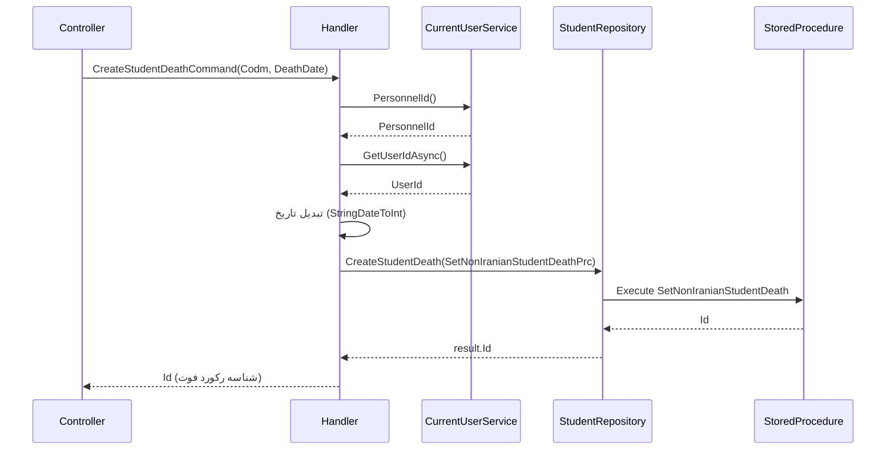

<div dir="rtl">

# CreateStudentDeathCommand

## 📄 اطلاعات کلی

**مسیر فایل:**
```
Csis.Admission.Application/Features/Students/NonIranian/Commands/CreateStudentDeathCommand.cs
```

**Feature:** Students (NonIranian)  
**نوع:** Command  
**هدف:** ثبت فوت دانشجوی غیرایرانی

---

## 🎯 هدف (Purpose)

این Command برای **ثبت واقعه فوت دانشجوی غیرایرانی** استفاده می‌شود. این عملیات معمولاً توسط کارمندان انجام می‌شود و منجر به تغییرات مهمی در پرونده دانشجو می‌شود:

1. ثبت تاریخ فوت
2. تغییر وضعیت دانشجو
3. غیرفعال کردن پرونده
4. قطع خدمات

**ویژگی‌های کلیدی:**
- ✅ Audit کامل (UserId, PersonnelId)
- ✅ استفاده از Stored Procedure
- ✅ ثبت DataSource
- ✅ حساس و بحرانی

---

## 📝 ساختار Command

### ورودی (Request)

```csharp
public sealed record CreateStudentDeathCommand : IRequest<long>
{
    /// <summary>
    /// کد مرکز طلبه
    /// </summary>
    public int Codm { get; init; }

    /// <summary>
    /// تاریخ فوت
    /// </summary>
    public string DeathDate { get; init; }
}
```

**پارامترها:**
- `Codm`: کد مرکز خدمات دانشجو
- `DeathDate`: تاریخ فوت (فرمت شمسی: `"1401/05/15"`)

### خروجی (Response)

```csharp
long  // شناسه رکورد فوت ایجاد شده
```

---

## 🔄 جریان اجرا (Execution Flow)

### مراحل:

```
1. دریافت اطلاعات کاربر جاری
   ├─> currentUserService.PersonnelId()
   └─> currentUserService.GetUserIdAsync()

2. تبدیل تاریخ فوت
   ├─> DeathDate.StringDateToInt()
   └─> "1401/05/15" → 14010515

3. ایجاد Command Stored Procedure
   ├─> SetNonIranianStudentDeathPrc
   ├─> Codm: از Request
   ├─> DeathDate: تبدیل شده به Integer
   ├─> DataSource: Employee
   ├─> PersonnelId: کارمند جاری
   ├─> UserId: کاربر جاری
   └─> ApplicationId: 66

4. اجرای Stored Procedure
   ├─> studentRepository.CreateStudentDeath(command)
   └─> Return: Id (شناسه رکورد فوت)

5. بازگشت شناسه
   └─> result.Id
```

### نمودار توالی (Sequence Diagram)



---

## 📦 وابستگی‌ها (Dependencies)

### Repository ها
- `IStudentRepository`: عملیات مربوط به دانشجو
  - متد: `CreateStudentDeath(SetNonIranianStudentDeathPrc)`: اجرای SP ثبت فوت

### سرویس‌ها
- `ICurrentUserService`: اطلاعات کاربر جاری
  - `PersonnelId()`: شناسه کارمند
  - `GetUserIdAsync()`: شناسه کاربر

### DTO ها
- `SetNonIranianStudentDeathPrc`: Command Stored Procedure

### Enums
- `DataSource`: منبع داده (Employee)

### Extensions
- `StringDateToInt()`: تبدیل تاریخ رشته‌ای به عدد صحیح

---

## ⚙️ قوانین کسب‌وکار (Business Rules)

### فرمت تاریخ

```csharp
DeathDate.StringDateToInt().Value
```

**تبدیل:**
- ورودی: `"1401/05/15"` (رشته)
- خروجی: `14010515` (عدد صحیح)

**الزامی:**
- تاریخ باید معتبر باشد
- اگر تبدیل ناموفق باشد → `.Value` خطا می‌دهد

### فیلدهای Audit

```csharp
{
    Codm = request.Codm,
    DeathDate = request.DeathDate.StringDateToInt().Value,
    ApplicationId = 66,
    DataSource = DataSource.Employee,
    PersonnelId = (await currentUserService.PersonnelId()) ?? 0,
    UserId = int.TryParse((await currentUserService.GetUserIdAsync())?.ToString(), 
        out var userId) ? userId : 0
}
```

**نکات:**
- `ApplicationId = 66`: Hardcoded (شناسه اپلیکیشن پذیرش)
- `DataSource = Employee`: فوت توسط کارمند ثبت می‌شود
- `PersonnelId` و `UserId`: برای Audit Trail

### تبدیل UserId

```csharp
UserId = int.TryParse((await currentUserService.GetUserIdAsync())?.ToString(), 
    out var userId) ? userId : 0
```

⚠️ **نکته:**
- استفاده از `TryParse` برای جلوگیری از Exception
- اگر `UserId` null باشد → `0`
- اگر تبدیل ناموفق باشد → `0`

---

## 🔍 نکات پیاده‌سازی (Implementation Notes)

### 1. Stored Procedure

```csharp
await studentRepository.CreateStudentDeath(command);
```

- عملیات پیچیده فوت در Stored Procedure انجام می‌شود
- احتمالاً شامل:
  - ثبت واقعه فوت
  - تغییر وضعیت دانشجو (IsDead = true)
  - غیرفعال کردن پرونده
  - قطع خدمات فعال

### 2. فقط برای غیرایرانی‌ها

⚠️ **توجه:**
- این Command در namespace `NonIranian` است
- احتمالاً Command مشابهی برای ایرانی‌ها نیز وجود دارد
- یا Stored Procedure خودش تشخیص می‌دهد

### 3. Hardcoded ApplicationId

```csharp
ApplicationId = 66
```

⚠️ **بهبود پیشنهادی:**
```csharp
ApplicationId = _configuration.GetValue<int>("ApplicationId")
```

یا

```csharp
public const int ADMISSION_APPLICATION_ID = 66;
ApplicationId = ADMISSION_APPLICATION_ID
```

### 4. عدم Validation

⚠️ **نکته:**
- بدون Validator
- Codm می‌تواند نامعتبر باشد
- تاریخ فوت می‌تواند آینده باشد
- تاریخ فوت می‌تواند قبل از تاریخ تولد باشد

**پیشنهاد Validator:**
```csharp
public class CreateStudentDeathCommandValidator : AbstractValidator<CreateStudentDeathCommand>
{
    public CreateStudentDeathCommandValidator()
    {
        RuleFor(x => x.Codm).GreaterThan(0);
        RuleFor(x => x.DeathDate)
            .NotEmpty()
            .Must(BeValidPersianDate).WithMessage("تاریخ فوت نامعتبر است.")
            .Must(NotBeFutureDate).WithMessage("تاریخ فوت نمی‌تواند در آینده باشد.");
    }
}
```

### 5. بازگشت Id

```csharp
var result = await studentRepository.CreateStudentDeath(command);
return result.Id;
```

- `Id` شناسه رکورد فوت است (نه شناسه دانشجو)
- معمولاً برای ردیابی یا Rollback استفاده می‌شود

---

## 🎯 Use Cases

### UC-RecordStudentDeath: ثبت فوت دانشجو

**Actor:** کارمند

**Preconditions:**
- دانشجو غیرایرانی در سیستم موجود باشد
- دانشجو قبلاً فوت نشده باشد
- کارمند مجوز ثبت فوت داشته باشد

**Main Flow:**
1. کارمند کد مرکز خدمات دانشجو را وارد می‌کند
2. کارمند تاریخ فوت را وارد می‌کند
3. سیستم تاریخ را تبدیل می‌کند
4. سیستم واقعه فوت را ثبت می‌کند
5. سیستم وضعیت دانشجو را تغییر می‌دهد
6. سیستم خدمات را قطع می‌کند
7. سیستم شناسه رکورد فوت را برمی‌گرداند

**Postconditions:**
- واقعه فوت دانشجو ثبت شده
- وضعیت دانشجو "فوت شده" است
- پرونده غیرفعال شده
- خدمات قطع شده

**Alternative Flows:**
- A1: دانشجو موجود نیست → خطا
- A2: دانشجو قبلاً فوت شده → خطا (از SP)
- A3: تاریخ نامعتبر → خطا

---

## ⚠️ ریسک‌ها و نکات (Risks & Notes)

### امنیتی (Security)

1. ⚠️ **No Authorization:**
   - بدون بررسی مجوز کارمند
   - همه کارمندان می‌توانند فوت ثبت کنند
   - نیاز به Permission مخصوص: `PermissionsEnum.RecordDeath`

2. ✅ **Audit Trail:**
   ```csharp
   PersonnelId = (await currentUserService.PersonnelId()) ?? 0
   UserId = ...
   ```
   - ثبت کامل اطلاعات کارمند ثبت‌کننده
   - قابل ردیابی

3. ⚠️ **Critical Operation:**
   - عملیات بسیار حساس و غیرقابل بازگشت
   - نیاز به Confirmation قبل از اجرا
   - بهتر است از Two-Step Confirmation استفاده شود

### عملکردی (Performance)

1. ✅ **Stored Procedure:**
   - عملیات پیچیده در DB انجام می‌شود
   - عملکرد بهتر (کمتر Round-trip)
   - تراکنش یکپارچه

### کیفیت کد (Code Quality)

1. ⚠️ **Missing Validation:**
   - بدون Validator
   - پارامترهای ورودی بررسی نمی‌شوند

2. ⚠️ **Hardcoded Values:**
   ```csharp
   ApplicationId = 66
   ```

3. ✅ **Simple and Clear:**
   - کد ساده و خوانا
   - منطق واضح

4. ⚠️ **Complex UserId Conversion:**
   ```csharp
   UserId = int.TryParse((await currentUserService.GetUserIdAsync())?.ToString(), 
       out var userId) ? userId : 0
   ```
   - پیچیده و غیرضروری
   - `GetUserIdAsync` احتمالاً همین الان `int?` برمی‌گرداند

---

## 📊 خلاصه نکات کلیدی

| جنبه | توضیح |
|------|-------|
| **الگوی طراحی** | CQRS + Stored Procedure |
| **نوع عملیات** | Critical (فوت دانشجو) |
| **Authorization** | ⚠️ ندارد (نیاز به بررسی مجوز) |
| **Validation** | ⚠️ ندارد (نیاز به Validator) |
| **Audit** | ✅ کامل (PersonnelId, UserId, DataSource) |
| **Confirmation** | ⚠️ ندارد (پیشنهاد Two-Step) |
| **Reversibility** | ⚠️ غیرقابل بازگشت |
| **Hardcoded Values** | ⚠️ ApplicationId = 66 |
| **مستندات XML** | ✅ موجود |

---

## 🔗 لینک‌های مرتبط

### Commands مرتبط
- CreateStudentDeathRequestCommand - درخواست ثبت فوت (احتمالاً)

### Repositories
- [StudentRepository.md](../../../../Persistence/StudentRepository.md) - Repository دانشجو

---

**نسخه مستندات:** 1.0  
**تاریخ ایجاد:** 2026-01-03

</div>
