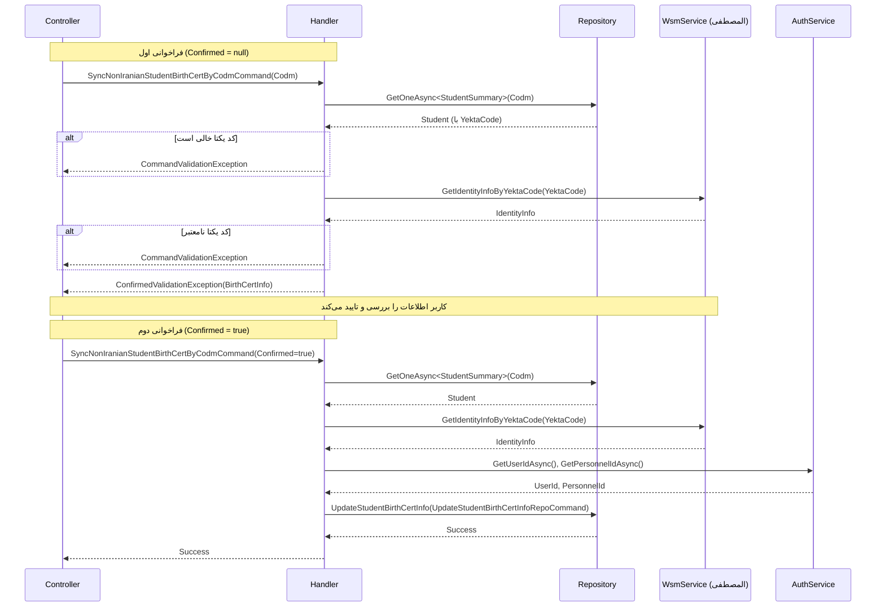

<div dir="rtl">

# SyncNonIranianStudentBirthCertByCodmCommand

## 📄 اطلاعات کلی

**مسیر فایل:**
```
Csis.Admission.Application/Features/Students/NonIranian/Commands/SyncNonIranianStudentBirthCertByCodmCommand.cs
```

**Feature:** Students (NonIranian)  
**نوع:** Command  
**هدف:** همگام‌سازی اطلاعات شناسنامه‌ای دانشجوی غیرایرانی با سیستم المصطفی

---

## 🎯 هدف (Purpose)

این Command برای **همگام‌سازی خودکار اطلاعات شناسنامه‌ای دانشجویان غیرایرانی** از سیستم المصطفی استفاده می‌شود. این فرآیند اطمینان می‌دهد که:

1. اطلاعات دانشجو با منبع رسمی المصطفی همخوانی دارد
2. تغییرات در سیستم المصطفی به سیستم پذیرش منتقل می‌شود
3. اطلاعات به‌روز و معتبر است

**تفاوت با UpdateNonIranianStudentBirthCertCommand:**
- این Command **همگام‌سازی خودکار** است
- UpdateCommand برای **ویرایش دستی** توسط کارمند است

**ویژگی‌های کلیدی:**
- ✅ استعلام از سیستم المصطفی
- ✅ الگوی Two-Step Confirmation
- ✅ اعتبارسنجی کد یکتا
- ✅ ثبت منبع داده (WebService)

---

## 📝 ساختار Command

### ورودی (Request)

```csharp
public sealed record SyncNonIranianStudentBirthCertByCodmCommand : IRequest
{
    /// <summary>کد مرکز خدمات</summary>
    public int Codm { get; init; }
    
    /// <summary>تایید</summary>
    [JsonIgnore]
    public bool? Confirmed { get; set; }
}
```

**پارامترها:**
- `Codm`: کد مرکز خدمات دانشجو
- `Confirmed`: تایید کاربر برای اعمال تغییرات (الگوی Two-Step)

### خروجی (Response)

```csharp
void  // هیچ خروجی ندارد (یا ConfirmedValidationException)
```

---

## 🔄 جریان اجرا (Execution Flow)

### مراحل:

```
1. دریافت اطلاعات دانشجو
   ├─> GetOneAsync<StudentSummary>(Codm)
   └─> شامل: YektaCode, IsSadat, Religion

2. اعتبارسنجی کد یکتا
   ├─> بررسی YektaCode خالی نباشد
   └─> در صورت خطا: پرتاب CommandValidationException

3. استعلام از سیستم المصطفی
   ├─> wsmService.GetIdentityInfoByYektaCode(YektaCode)
   ├─> بررسی اعتبار پاسخ (YektaCode نباید خالی باشد)
   └─> استخراج BirthCertInfo()

4. بررسی Confirmation
   ├─> اگر Confirmed != true
   └──> پرتاب ConfirmedValidationException (نمایش اطلاعات)

5. بروزرسانی اطلاعات (Confirmed == true)
   ├─> ایجاد UpdateStudentBirthCertInfoRepoCommand
   ├─> NationalCode = null (برای غیرایرانی‌ها)
   ├─> DataSource = WebService
   └─> اجرای studentRepo.UpdateStudentBirthCertInfo()
```

### نمودار توالی (Sequence Diagram)



---

## 📦 وابستگی‌ها (Dependencies)

### Repository ها
- `IStudentRepository`: عملیات مربوط به دانشجو
  - `UpdateStudentBirthCertInfo(UpdateStudentBirthCertInfoRepoCommand)`
- `IRepository<StudentSummary>`: دسترسی سریع به خلاصه اطلاعات دانشجو

### سرویس‌ها
- `ICsisWsmService`: وب سرویس المصطفی
  - `GetIdentityInfoByYektaCode(yektaCode)`: دریافت اطلاعات از المصطفی
- `ICsisAuthenticatedUserService`: اطلاعات کاربر احراز هویت شده
  - `GetUserIdAsync()`: شناسه کاربر
  - `GetPersonnelIdAsync()`: شناسه کارمند

### DTO ها
- `UpdateStudentBirthCertInfoRepoCommand`: دستور بروزرسانی Repository
- `IdentityInfo` + `BirthCertInfo()`: اطلاعات از المصطفی

### Enums
- `DataSource`: منبع داده (WebService)

### Exceptions
- `CommandValidationException`: اعتبارسنجی ناموفق
- `ConfirmedValidationException`: نیاز به تایید کاربر

---

## ⚙️ قوانین کسب‌وکار (Business Rules)

### اعتبارسنجی‌ها (Validations)

1. **کد یکتا اجباری:**
   ```csharp
   if (string.IsNullOrEmpty(student.YektaCode))
       throw new CommandValidationException("کد یکتا دانشجو در سیستم ثبت نشده است.");
   ```

2. **اعتبار کد یکتا در المصطفی:**
   ```csharp
   if (string.IsNullOrWhiteSpace(identityInfo.YektaCode))
       throw new CommandValidationException("کد یکتا در المصطفی یافت نشد / کد یکتا معتبر نمی‌باشد.");
   ```

### الگوی Two-Step Confirmation

**مرحله 1 (نمایش):**
```json
{
  "YektaCode": "12345",
  "FirstName": "محمد",
  "LastName": "احمدی",
  "FatherName": "علی",
  "BirthDate": "1380/05/15",
  "Gender": "Male",
  "IsDead": false,
  "Nationality": "افغانستان"
}
```

**مرحله 2 (اجرا):**
- کاربر اطلاعات را بررسی و تایید می‌کند
- `Confirmed=true` ارسال می‌شود
- اطلاعات در دیتابیس ذخیره می‌شوند

### فیلدهای بروزرسانی شده

```csharp
{
    Codm = command.Codm,
    NationalCode = null,              // برای غیرایرانی‌ها
    YektaCode = certInfo.YektaCode,   // از المصطفی
    BirthDate = certInfo.BirthDate.StringDateToInt().Value,  // از المصطفی
    IsSadat = student.IsSadat,        // از رکورد فعلی (بدون تغییر)
    Religion = student.Religion,      // از رکورد فعلی (بدون تغییر)
    BirthCertDescription = null,
    DataSource = DataSource.WebService,
    ApplicationId = 66,
    UserId = await authenticatedUser.GetUserIdAsync() ?? 0,
    PersonnelId = await authenticatedUser.GetPersonnelIdAsync() ?? 0
}
```

**توجه:**
- `NationalCode` برای غیرایرانی‌ها `null` است
- `YektaCode` و `BirthDate` از المصطفی دریافت می‌شوند
- `IsSadat` و `Religion` **از رکورد فعلی** حفظ می‌شوند (در المصطفی نیستند)

---

## 🔍 نکات پیاده‌سازی (Implementation Notes)

### 1. حفظ فیلدهای خاص

```csharp
IsSadat = student.IsSadat,      // از سیستم فعلی
Religion = student.Religion      // از سیستم فعلی
```

- این فیلدها در سیستم المصطفی وجود ندارند
- باید از رکورد فعلی حفظ شوند
- فقط `YektaCode` و `BirthDate` از المصطفی دریافت می‌شوند

### 2. تبدیل تاریخ

```csharp
BirthDate = certInfo.BirthDate.StringDateToInt().Value
```

- تاریخ از المصطفی به صورت String است
- تبدیل به Integer برای ذخیره در DB
- استفاده از `.Value` → اگر تبدیل ناموفق باشد Exception

### 3. Hardcoded ApplicationId

```csharp
ApplicationId = 66
```

⚠️ **توصیه:**
- بهتر است از Configuration خوانده شود

### 4. Null Coalescing

```csharp
UserId = await authenticatedUser.GetUserIdAsync() ?? 0
PersonnelId = await authenticatedUser.GetPersonnelIdAsync() ?? 0
```

- در صورت null، مقدار پیش‌فرض 0
- برای جلوگیری از Exception

---

## 📊 خلاصه نکات کلیدی

| جنبه | توضیح |
|------|-------|
| **الگوی طراحی** | CQRS + Two-Step Confirmation |
| **منبع داده** | سیستم المصطفی (WebService) |
| **Citizenship** | فقط NonIranian |
| **Sync Direction** | المصطفی → سیستم پذیرش |
| **فیلدهای Sync** | YektaCode, BirthDate |
| **فیلدهای حفظ شده** | IsSadat, Religion |
| **Authorization** | ✅ ثبت UserId و PersonnelId |
| **Validation** | ✅ YektaCode اجباری |
| **External Dependency** | ⚠️ المصطفی |
| **مستندات XML** | ✅ موجود |

---

## 🔗 لینک‌های مرتبط

### Commands مرتبط
- [UpdateNonIranianStudentBirthCertCommand.md](./UpdateNonIranianStudentBirthCertCommand.md) - بروزرسانی دستی
- [SyncDependentBirthCertByIdCommand.md](../Iranian/Commands/SyncDependentBirthCertByIdCommand.md) - همگام‌سازی تحت تکفل

### Services
- WsmService - سیستم المصطفی

---

**نسخه مستندات:** 1.0  
**تاریخ ایجاد:** 2026-01-03

</div>
