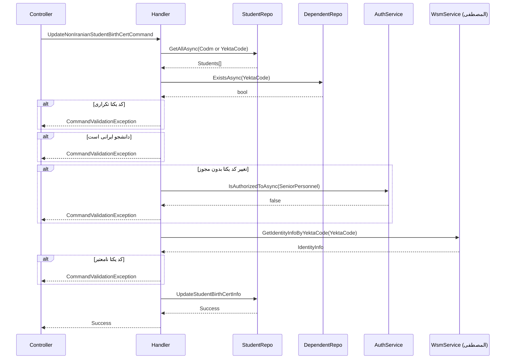

<div dir="rtl">

# UpdateNonIranianStudentBirthCertCommand

## 📄 اطلاعات کلی

**مسیر فایل:**
```
Csis.Admission.Application/Features/Students/NonIranian/Commands/UpdateNonIranianStudentBirthCertCommand.cs
```

**Feature:** Students (NonIranian)  
**نوع:** Command  
**هدف:** بروزرسانی اطلاعات شناسنامه‌ای دانشجویان غیرایرانی

---

## 🎯 هدف (Purpose)

این Command برای **بروزرسانی اطلاعات شناسنامه‌ای دانشجویان غیرایرانی** استفاده می‌شود. برخلاف دانشجویان ایرانی که از ثبت احوال استعلام می‌شوند، دانشجویان غیرایرانی از سیستم **المصطفی** با استفاده از **کد یکتا** اعتبارسنجی می‌شوند.

**ویژگی‌های کلیدی:**
- ✅ استعلام از سیستم المصطفی
- ✅ اعتبارسنجی یکتا بودن کد یکتا
- ✅ محدودیت تغییر کد یکتا (فقط Senior Personnel)
- ✅ بررسی تابعیت غیرایرانی

---

## 📝 ساختار Command

### ورودی (Request)

```csharp
public sealed record UpdateNonIranianStudentBirthCertCommand : IRequest
{
    /// <summary>کد مرکز خدمات</summary>
    public int Codm { get; init; }

    /// <summary>کد یکتا</summary>
    public string YektaCode { get; init; }

    /// <summary>مذهب</summary>
    public Religion Religion { get; init; }

    /// <summary>سید</summary>
    public bool IsSadat { get; init; }
    
    /// <summary>توضیحات شناسنامه‌ای</summary>
    public string? BirthCertDescription { get; init; }
}
```

**پارامترها:**
- `Codm`: کد مرکز خدمات دانشجو
- `YektaCode`: کد یکتای دانشجو در سیستم المصطفی
- `Religion`: مذهب دانشجو
- `IsSadat`: آیا دانشجو سید است؟
- `BirthCertDescription`: توضیحات اضافی شناسنامه‌ای (اختیاری)

### خروجی (Response)

```csharp
void  // هیچ خروجی ندارد
```

---

## 🔄 جریان اجرا (Execution Flow)

### مراحل:

```
1. بررسی یکتا بودن کد یکتا
   ├─> جستجوی دانشجویان با Codm یا YektaCode
   ├─> بررسی وجود تحت تکفل با همین کد یکتا
   └─> اگر بیش از 1 دانشجو یا تحت تکفل یافت شود → خطا

2. بررسی تابعیت دانشجو
   ├─> Citizenship == NonIranian?
   └─> اگر ایرانی باشد → خطا

3. بررسی مجوز تغییر کد یکتا
   ├─> آیا کد یکتا تغییر کرده؟
   ├─> اگر بله → بررسی مجوز Senior Personnel
   └─> اگر مجوز ندارد → خطا

4. استعلام از سیستم المصطفی
   ├─> wsmService.GetIdentityInfoByYektaCode(YektaCode)
   ├─> بررسی اعتبار پاسخ (YektaCode نباید خالی باشد)
   └─> دریافت تاریخ تولد

5. بروزرسانی اطلاعات
   ├─> ایجاد UpdateStudentBirthCertInfoRepoCommand
   ├─> NationalCode = null (برای غیرایرانی‌ها)
   ├─> BirthDate = از المصطفی
   └─> اجرای studentRepo.UpdateStudentBirthCertInfo()
```

### نمودار توالی (Sequence Diagram)



---

## 📦 وابستگی‌ها (Dependencies)

### Repository ها
- `IStudentRepository`: عملیات مربوط به دانشجو
  - `UpdateStudentBirthCertInfo(UpdateStudentBirthCertInfoRepoCommand)`
- `IRepository<StudentSummary>`: دسترسی سریع به خلاصه اطلاعات دانشجو
- `IRepository<DependentSummary, long>`: بررسی وجود افراد تحت تکفل

### سرویس‌ها
- `ICsisAuthenticatedUserService`: مدیریت احراز هویت و مجوزها
  - `IsAuthorizedToAsync(PermissionsEnum.SeniorPersonnel)`: بررسی مجوز تغییر کد یکتا
- `ICsisWsmService`: وب سرویس المصطفی
  - `GetIdentityInfoByYektaCode(yektaCode)`: دریافت اطلاعات از المصطفی

### DTO ها
- `UpdateStudentBirthCertInfoRepoCommand`: Command Repository برای بروزرسانی
- `GetIdentityInfoByYektaCodeResponse`: پاسخ سیستم المصطفی

### Enums
- `Religion`: مذهب (شیعه، سنی، ...)
- `Citizenship`: تابعیت (Iranian, NonIranian)
- `PermissionsEnum.SeniorPersonnel`: مجوز کارمند ارشد

---

## ⚙️ قوانین کسب‌وکار (Business Rules)

### اعتبارسنجی‌ها (Validations)

1. **یکتا بودن کد یکتا:**
   ```csharp
   if (students.Count > 1 || dependnet)
       throw new CommandValidationException("این کد یکتا قبلاً در سامانه ثبت شده است.");
   ```

2. **تابعیت غیرایرانی:**
   ```csharp
   if (student.Citizenship != Citizenship.NonIranian)
       throw new CommandValidationException("سرویس مخصوص طلاب غیرایرانی است.");
   ```

3. **مجوز تغییر کد یکتا:**
   ```csharp
   if (!isSenior && (command.YektaCode != student.YektaCode))
       throw new CommandValidationException("شما مجوز لازم برای تغییر کد یکتا را ندارید.");
   ```

4. **اعتبار کد یکتا در المصطفی:**
   ```csharp
   if (string.IsNullOrWhiteSpace(identityInfo.YektaCode))
       throw new CommandValidationException("کد یکتا در المصطفی یافت نشد / کد یکتا معتبر نمی باشد.");
   ```

### فیلدهای بروزرسانی شده

```csharp
{
    Codm = command.Codm,
    NationalCode = null,              // برای غیرایرانی‌ها
    YektaCode = command.YektaCode,    // از کاربر
    BirthDate = IdentityInfo.BirthDatePersianDate,  // از المصطفی
    Religion = command.Religion,       // از کاربر
    IsSadat = command.IsSadat,         // از کاربر
    BirthCertDescription = command.BirthCertDescription  // از کاربر
}
```

---

## 🔍 نکات پیاده‌سازی (Implementation Notes)

### 1. سیستم المصطفی

المصطفی سیستم مدیریت دانشجویان غیرایرانی حوزه‌های علمیه است که:
- کد یکتا (YektaCode) به هر دانشجو اختصاص می‌دهد
- اطلاعات شناسنامه‌ای را نگهداری می‌کند
- از طریق Web Service قابل استعلام است

---

## 📊 خلاصه نکات کلیدی

| جنبه | توضیح |
|------|-------|
| **الگوی طراحی** | CQRS + Permission-Based Authorization |
| **منبع داده** | سیستم المصطفی (YektaCode) |
| **Citizenship** | فقط NonIranian |
| **Authorization** | ✅ SeniorPersonnel برای تغییر YektaCode |
| **Uniqueness Check** | ✅ بررسی تکراری نبودن کد یکتا |
| **External Dependency** | ⚠️ المصطفی (نیاز به Retry) |
| **مستندات XML** | ✅ موجود |

---

**نسخه مستندات:** 1.0  
**تاریخ ایجاد:** 2026-01-03

</div>
