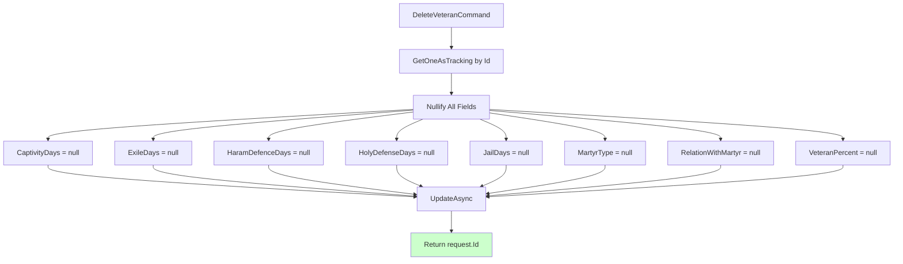

# DeleteVeteranCommand.cs

**مسیر**: `Csis.Admission.Application/Features/Veterans/Commands/DeleteVeteranCommand.cs`

## 1. هدف (Purpose)

این Command برای **حذف منطقی (Soft Delete) اطلاعات ایثارگری** استفاده می‌شود. برخلاف Delete Commands دیگر، این Command اطلاعات را **فیزیکی حذف نمی‌کند** بلکه تمام فیلدها را `null` می‌کند.

**ویژگی‌ها**:
- **Soft Delete Pattern**: Nullify به جای Delete
- ✅ **Logger وجود دارد** (برخلاف Delete Commands دیگر)
- ⚠️ **Codm استفاده نمی‌شود** (الگوی سیستماتیک)
- ⚠️ **فقدان Authorization**

## 2. ساختار کلی (Structure)

```csharp
public sealed record DeleteVeteranCommand(int Codm, int Id) : IRequest<int>;

internal sealed class DeleteVeteranCommandHandler(
    IRepository<Veteran> veteranRepository,
    ILogger<DeleteVeteranCommandHandler> logger  // ✅ وجود دارد اما استفاده نمی‌شود!
) : IRequestHandler<DeleteVeteranCommand, int>
```

## 3. جریان اجرا (Execution Flow)



## 4. قوانین کسب‌وکار (Business Rules)

### BR-1: Soft Delete با Nullify
```csharp
// طی صحبت با سید , در عملیات حذف , همه فیلدها به جز کد مرکز خدمات Null میشوند
veteran.CaptivityDays = null;
veteran.ExileDays = null;
veteran.HaramDefenceDays = null;
veteran.HolyDefenseDays = null;
veteran.JailDays = null;
veteran.MartyrType = null;
veteran.RelationWithMartyr = null;
veteran.VeteranPercent = null;
```

**نکته مهم**: `Codm` حفظ می‌شود!

## 5. ملاحظات امنیتی (Security Considerations)

### 🔴 مشکلات امنیتی:

#### 1. Codm استفاده نمی‌شود
```csharp
public sealed record DeleteVeteranCommand(int Codm, int Id) : IRequest<int>;
// ⚠️ Codm در Handler استفاده نمی‌شود!
```

#### 2. Logger وجود دارد اما استفاده نمی‌شود
```csharp
ILogger<DeleteVeteranCommandHandler> logger  // ⚠️ تزریق شده اما استفاده نشده!
```

## 6. الگوهای طراحی (Design Patterns)

### 1. **Soft Delete Pattern**
به جای حذف فیزیکی، تمام فیلدها null می‌شوند

### 2. **Nullify Pattern**
```csharp
veteran.Field1 = null;
veteran.Field2 = null;
// ...
```

## 7. یادداشت‌های توسعه (Development Notes)

### 🟢 نکات مثبت:
1. ✅ Soft Delete به جای Hard Delete
2. ✅ Logger inject شده (حتی اگر استفاده نشود)
3. ✅ Codm حفظ می‌شود
4. ✅ کامنت توضیحی از مذاکره با سید

### 🔴 نکات منفی:
1. ❌ Codm استفاده نمی‌شود
2. ❌ Logger استفاده نمی‌شود
3. ❌ فقدان Authorization
4. ❌ فقدان Null Check برای veteran

## 8. تغییرات پیشنهادی (Suggested Improvements)

### 1. استفاده از Logger
```diff
  public async Task<int> Handle(DeleteVeteranCommand request, CancellationToken cancellationToken) {
+     logger.LogInformation("حذف ایثارگری {VeteranId} توسط {Codm}", request.Id, request.Codm);
      
      var veteran = await veteranRepository.GetOneAsTrackingAsync(x => x.Id == request.Id, cancellationToken: cancellationToken);
+     
+     if (veteran == null) {
+         throw new RecordNotFoundException<Veteran>(request.Id);
+     }

      veteran.CaptivityDays = null;
      // ... rest of nullify code ...
      
      await veteranRepository.UpdateAsync(veteran, cancellationToken: cancellationToken);
+     logger.LogWarning("ایثارگری {VeteranId} حذف (Nullify) شد", request.Id);
      return request.Id;
  }
```

### 2. استفاده از Codm برای Authorization
```diff
  var veteran = await veteranRepository.GetOneAsTrackingAsync(x => x.Id == request.Id, cancellationToken: cancellationToken);
+     
+ if (veteran.Codm != request.Codm) {
+     throw new CommandValidationException("شما مجاز به حذف این ایثارگری نیستید.");
+ }
```

---

**نتیجه‌گیری**: DeleteVeteranCommand یک Command منحصر به فرد است که از **Soft Delete Pattern** استفاده می‌کند. Logger تزریق شده اما استفاده نمی‌شود و Codm برای Authorization بررسی نمی‌شود.
