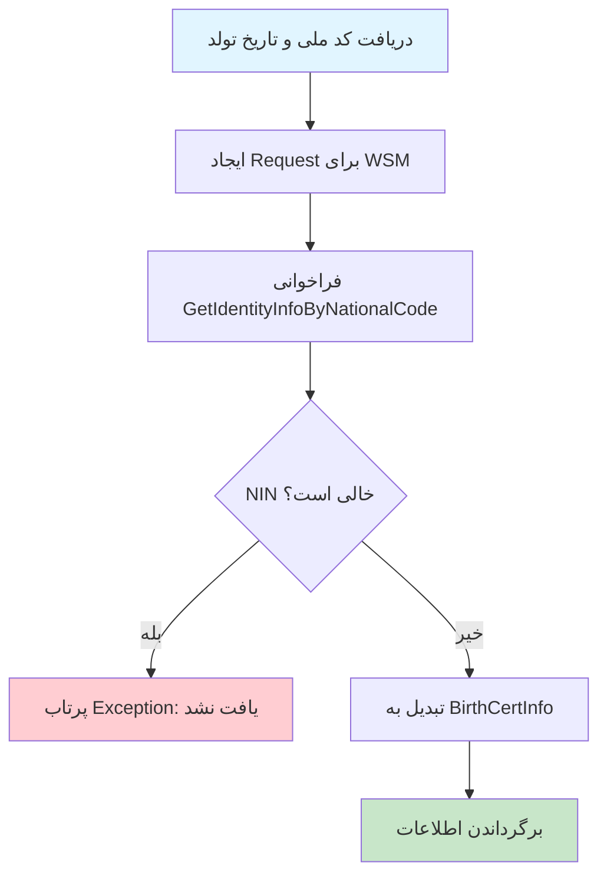
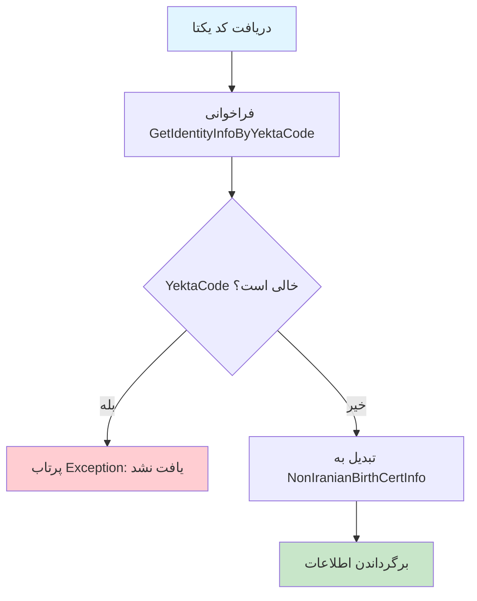

# BirthCertService.cs

**مسیر**: `Csis.Admission.Services/BirthCertService.cs`

## 1. هدف (Purpose)

این سرویس برای **دریافت اطلاعات شناسنامه‌ای افراد** از سامانه ثبت احوال (برای ایرانیان) و سامانه المصطفی (برای غیرایرانیان) استفاده می‌شود.

### کاربرد اصلی:
- اعتبارسنجی اطلاعات شناسنامه‌ای دانشجو
- سینک کردن اطلاعات با ثبت احوال
- تشکیل پرونده دانشجوی جدید
- بروزرسانی اطلاعات هویتی

---

## 2. Interface

```csharp
public interface IBirthCertService
{
    Task<BirthCertInfo> Iranian(string nationalCode, string birthDate, CancellationToken cancellation);
    Task<NonIranianBirthCertInfo> NonIranian(string yektaCode, CancellationToken cancellation);
}
```

---

## 3. متدها (Methods)

### 3.1. Iranian

**هدف**: دریافت اطلاعات شناسنامه‌ای افراد ایرانی از سامانه ثبت احوال

#### ورودی:
| پارامتر | نوع | اجباری | توضیحات |
|---------|-----|--------|---------|
| `nationalCode` | `string` | بله | کد ملی فرد (10 رقم) |
| `birthDate` | `string` | بله | تاریخ تولد (فرمت: yyyy/MM/dd) |
| `cancellation` | `CancellationToken` | بله | توکن کنسل کردن عملیات |

#### خروجی:
```csharp
BirthCertInfo // شامل: نام، نام خانوادگی، نام پدر، شماره شناسنامه، محل تولد، و...
```

#### مراحل اجرا:


#### Business Rules:
- **BR-1**: کد ملی و تاریخ تولد باید دقیقاً با اطلاعات ثبت احوال مطابقت داشته باشد
- **BR-2**: اگر اطلاعات یافت نشد، Exception پرتاب می‌شود

#### خطاها:
```csharp
// اگر کد ملی یا تاریخ تولد در ثبت احوال یافت نشد
throw new CommandValidationException("کد ملی یا تاریخ تولد وارد شده در سامانه ثبت احوال یافت نشد.");
```

---

### 3.2. NonIranian

**هدف**: دریافت اطلاعات شناسنامه‌ای افراد غیرایرانی از سامانه المصطفی

#### ورودی:
| پارامتر | نوع | اجباری | توضیحات |
|---------|-----|--------|---------|
| `yektaCode` | `string` | بله | کد یکتای فرد در سامانه المصطفی |
| `cancellation` | `CancellationToken` | بله | توکن کنسل کردن عملیات |

#### خروجی:
```csharp
NonIranianBirthCertInfo // شامل: نام، نام خانوادگی، کد یکتا، کشور، و...
```

#### مراحل اجرا:


#### Business Rules:
- **BR-1**: کد یکتا باید در سامانه المصطفی موجود باشد
- **BR-2**: اگر اطلاعات یافت نشد، Exception پرتاب می‌شود

#### خطاها:
```csharp
// اگر کد یکتا در سامانه المصطفی یافت نشد
throw new CommandValidationException(nameof(identityInfo), "کد یکتا در سامانه المصطفی یافت نشد.");
```

---

## 4. وابستگی‌ها (Dependencies)

**Dependencies تزریق شده:**
1. **ICsisWsmService**: سرویس اتصال به WSM (Web Service Management) برای ارتباط با ثبت احوال و المصطفی

---

## 5. الگوهای طراحی (Design Patterns)

### الگوهای استفاده شده:
1. **Service Layer Pattern**: لایه سرویس برای منطق کسب‌وکار
2. **Adapter Pattern**: تبدیل پاسخ WSM به مدل‌های داخلی
3. **Primary Constructor** (C# 12): تزریق وابستگی در تعریف کلاس
4. **Exception Handling Pattern**: پرتاب Exception در صورت عدم یافتن اطلاعات

---

## 6. نکات امنیتی (Security Considerations)

### ✅ **نکات مثبت:**
1. **اعتبارسنجی خارجی**: اطلاعات از منبع معتبر (ثبت احوال) دریافت می‌شود
2. **Exception در صورت عدم یافتن**: جلوگیری از ثبت اطلاعات نامعتبر

### ⚠️ **نکات قابل بهبود:**
1. **Logging**: اضافه کردن لاگ برای تمام درخواست‌ها (به خصوص خطاها)
2. **Rate Limiting**: محدود کردن تعداد درخواست‌ها به ثبت احوال
3. **Caching**: کش کردن نتایج برای کد ملی‌های تکراری (با احتیاط و زمان کوتاه)

---

## 7. عملکرد و بهینه‌سازی (Performance)

### ⚠️ **مشکلات احتمالی:**
1. **External Service Latency**: وابستگی به سامانه خارجی که ممکن است کند باشد
2. **Network Timeout**: احتمال timeout در شبکه
3. **No Caching**: هر بار درخواست جدید به سامانه خارجی ارسال می‌شود

### پیشنهادات بهبود:
```csharp
// اضافه کردن Caching با زمان کوتاه
private readonly IDistributedCache _cache;

public async Task<BirthCertInfo> Iranian(string nationalCode, string birthDate, CancellationToken cancellation) 
{
    var cacheKey = $"birthcert:{nationalCode}:{birthDate}";
    
    var cached = await _cache.GetStringAsync(cacheKey, cancellation);
    if (cached != null) 
    {
        return JsonSerializer.Deserialize<BirthCertInfo>(cached);
    }
    
    var request = new GetIdentityInfoByNationalCodeRequestApiM(nationalCode, birthDate);
    var identityInfo = await wsmService.GetIdentityInfoByNationalCode(request, cancellation);
    
    if (string.IsNullOrEmpty(identityInfo.Nin)) 
    {
        throw new CommandValidationException("کد ملی یا تاریخ تولد وارد شده در سامانه ثبت احوال یافت نشد.");
    }
    
    var result = identityInfo.BirthCertInfo();
    
    // Cache برای 5 دقیقه
    await _cache.SetStringAsync(
        cacheKey, 
        JsonSerializer.Serialize(result),
        new DistributedCacheEntryOptions { AbsoluteExpirationRelativeToNow = TimeSpan.FromMinutes(5) },
        cancellation
    );
    
    return result;
}
```

---

## 8. خطاها و استثناها (Error Handling)

### خطاهای محتمل:
| خطا | دلیل | راه‌حل |
|-----|------|--------|
| `CommandValidationException` | کد ملی/تاریخ تولد یا کد یکتا در سامانه یافت نشد | بررسی صحت ورودی |
| `HttpRequestException` | خطا در ارتباط با سامانه خارجی | Retry + Circuit Breaker |
| `TimeoutException` | زمان درخواست به سامانه خارجی تمام شد | افزایش Timeout |

---

## 9. تست‌پذیری (Testability)

### نمونه Unit Test:
```csharp
[Fact]
public async Task Iranian_WithValidData_ShouldReturnBirthCertInfo()
{
    // Arrange
    var nationalCode = "1234567890";
    var birthDate = "1370/01/01";
    var identityInfo = new IdentityInfoDto { Nin = nationalCode, FirstName = "علی" };
    
    _wsmServiceMock.Setup(x => x.GetIdentityInfoByNationalCode(
        It.IsAny<GetIdentityInfoByNationalCodeRequestApiM>(), 
        It.IsAny<CancellationToken>()))
        .ReturnsAsync(identityInfo);
    
    // Act
    var result = await _service.Iranian(nationalCode, birthDate, CancellationToken.None);
    
    // Assert
    Assert.NotNull(result);
}

[Fact]
public async Task Iranian_WithInvalidData_ShouldThrowException()
{
    // Arrange
    var nationalCode = "0000000000";
    var birthDate = "1370/01/01";
    var identityInfo = new IdentityInfoDto { Nin = "" }; // خالی
    
    _wsmServiceMock.Setup(x => x.GetIdentityInfoByNationalCode(
        It.IsAny<GetIdentityInfoByNationalCodeRequestApiM>(), 
        It.IsAny<CancellationToken>()))
        .ReturnsAsync(identityInfo);
    
    // Act & Assert
    await Assert.ThrowsAsync<CommandValidationException>(
        () => _service.Iranian(nationalCode, birthDate, CancellationToken.None)
    );
}
```

---

## 10. مثال استفاده (Usage Example)

### از Command Handler:
```csharp
internal class SyncStudentBirthCertCommandHandler : IRequestHandler<SyncStudentBirthCertCommand, BirthCertInfo>
{
    private readonly IBirthCertService _birthCertService;
    
    public async Task<BirthCertInfo> Handle(SyncStudentBirthCertCommand request, CancellationToken cancellationToken)
    {
        // دریافت اطلاعات از ثبت احوال
        var birthCertInfo = await _birthCertService.Iranian(
            request.NationalCode, 
            request.BirthDate, 
            cancellationToken
        );
        
        // ذخیره در دیتابیس...
        
        return birthCertInfo;
    }
}
```

---

## 11. Use Cases مرتبط

این سرویس در Use Case های زیر استفاده می‌شود:

- **UC-011**: بروزرسانی شناسنامه‌ای دانشجو با سینک از ثبت احوال
- **UC-012**: سینک اطلاعات با ثبت احوال
- **UC-030-Step04**: تشکیل پرونده - مرحله اعتبارسنجی اطلاعات شناسنامه‌ای
- **UC-040**: ثبت تکفل - اعتبارسنجی اطلاعات همسر/فرزند
- **UC-050**: ثبت ازدواج - اعتبارسنجی اطلاعات همسر

---

## نتیجه‌گیری

این سرویس **حیاتی** برای اعتبارسنجی اطلاعات هویتی افراد است و با سامانه‌های خارجی (ثبت احوال و المصطفی) ارتباط برقرار می‌کند.

### نقاط قوت:
✅ اعتبارسنجی از منبع معتبر (ثبت احوال)  
✅ پشتیبانی از ایرانیان و غیرایرانیان  
✅ Exception Handling مناسب  
✅ استفاده از Primary Constructor (C# 12)  

### نقاط ضعف:
⚠️ فقدان Logging  
⚠️ فقدان Caching  
⚠️ فقدان Retry/Circuit Breaker برای مقابله با خطای شبکه  
⚠️ وابستگی به سرویس خارجی (Single Point of Failure)  

### توصیه‌ها:
1. افزودن **Distributed Caching** با TTL کوتاه
2. پیاده‌سازی **Circuit Breaker Pattern** برای مدیریت خطای سرویس خارجی
3. افزودن **Retry Policy** با Exponential Backoff
4. افزودن **Comprehensive Logging** برای Audit Trail
