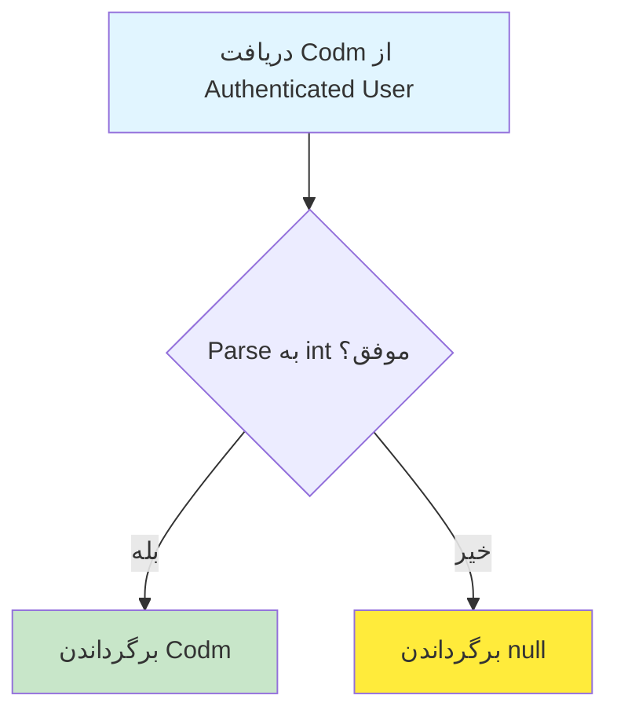
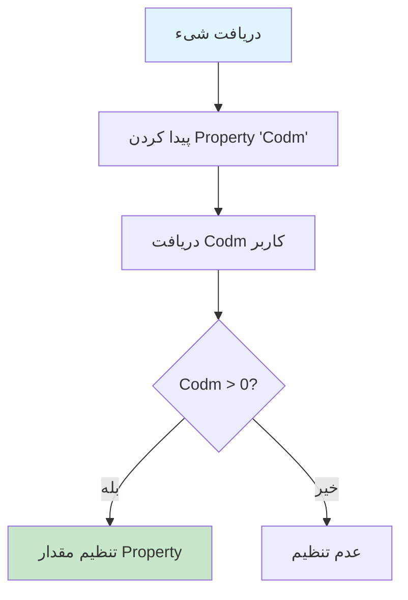

# CurrentUserService.cs

**مسیر**: `Csis.Admission.Services/CurrentUserService.cs`

## 1. هدف (Purpose)

این سرویس برای **دسترسی به اطلاعات کاربر جاری** (لاگین شده) در سیستم استفاده می‌شود. این سرویس یک Wrapper برای `ICsisAuthenticatedUserService` است و اطلاعات کاربر احراز هویت شده را فراهم می‌کند.

### کاربرد اصلی:
- دریافت شناسه کاربر (UserId)
- دریافت کد ملی دانشجو (Codm)
- دریافت شناسه پرسنلی کارمند (PersonnelId)
- بررسی نوع کاربر (دانشجو/کارمند)
- بررسی دسترسی‌های کاربر
- دریافت شناسه شعبه کاربر

---

## 2. Interface

```csharp
public interface ICurrentUserService
{
    Task<int?> GetUserIdAsync();
    Task<int?> GetDelegatedUserIdAsync();
    Task<bool> IsSenior();
    Task<bool> IsEmployee();
    Task<bool> IsStudent();
    Task<int?> Codm();
    Task SetCodm(object obj);
    Task<int?> PersonnelId();
    Task<int> GetEmployeeBranchIdAsync();
    Task<int> GetStudentBranchIdAsync();
    Task<int?> GetPersonnelIdAsync();
    Task<string> GetCodmAsync();
    Task<bool> IsEmployeeAsync();
    Task<bool> IsStudentAsync();
    Task<bool> IsAuthorizedAsync(PermissionsEnum permission);
    Task<bool> HasAccessToThisApplicationAsync();
}
```

---

## 3. متدها (Methods)

### 3.1. GetUserIdAsync()

**هدف**: دریافت شناسه کاربر جاری

#### خروجی:
```csharp
Task<int?> // شناسه کاربر یا null
```

#### کاربرد:
- Audit Logging
- ثبت تغییرات توسط کاربر
- فیلتر داده‌ها بر اساس کاربر

---

### 3.2. GetDelegatedUserIdAsync()

**هدف**: دریافت شناسه کاربر تفویض شده (در صورت وجود)

#### خروجی:
```csharp
Task<int?> // شناسه کاربر تفویض شده یا null
```

#### کاربرد:
- سیستم تفویض اختیار
- کاربر A به نمایندگی از کاربر B عمل می‌کند

---

### 3.3. IsSenior()

**هدف**: بررسی اینکه آیا کاربر جاری پرسنل ارشد است یا خیر

#### خروجی:
```csharp
Task<bool> // true اگر پرسنل ارشد باشد
```

#### Business Rule:
- کاربر باید دسترسی `PermissionsEnum.SeniorPersonnel` داشته باشد

---

### 3.4. IsEmployee() / IsEmployeeAsync()

**هدف**: بررسی اینکه آیا کاربر جاری کارمند است یا خیر

#### خروجی:
```csharp
Task<bool> // true اگر کارمند باشد
```

#### کاربرد:
- تفکیک عملیات دانشجو و کارمند
- Authorization

---

### 3.5. IsStudent() / IsStudentAsync()

**هدف**: بررسی اینکه آیا کاربر جاری دانشجو است یا خیر

#### خروجی:
```csharp
Task<bool> // true اگر دانشجو باشد
```

---

### 3.6. Codm()

**هدف**: دریافت کد ملی دانشجو (Codm = Code Melli)

#### خروجی:
```csharp
Task<int?> // کد ملی دانشجو یا null
```

#### مراحل:


---

### 3.7. SetCodm(object obj)

**هدف**: تنظیم خودکار فیلد `Codm` در یک شیء

#### ورودی:
| پارامتر | نوع | توضیحات |
|---------|-----|---------|
| `obj` | `object` | شیئی که دارای property به نام `Codm` است |

#### کاربرد:
```csharp
// استفاده در Command ها برای تنظیم خودکار Codm
var command = new CreateSomethingCommand();
await _currentUserService.SetCodm(command);
// حالا command.Codm مقدار دارد
```

#### مراحل:


---

### 3.8. PersonnelId() / GetPersonnelIdAsync()

**هدف**: دریافت شناسه پرسنلی کارمند

#### خروجی:
```csharp
Task<int?> // شناسه پرسنلی یا null
```

---

### 3.9. GetEmployeeBranchIdAsync()

**هدف**: دریافت شناسه شعبه کارمند

#### خروجی:
```csharp
Task<int> // شناسه شعبه (Exception اگر null باشد)
```

#### Exception:
```csharp
throw new EmptyBranchIdException(); // اگر کارمند شعبه نداشته باشد
```

---

### 3.10. GetStudentBranchIdAsync()

**هدف**: دریافت شناسه شعبه دانشجو

#### خروجی:
```csharp
Task<int> // شناسه شعبه (Exception اگر null باشد)
```

---

### 3.11. GetCodmAsync()

**هدف**: دریافت کد ملی دانشجو به صورت رشته

#### خروجی:
```csharp
Task<string> // کد ملی به صورت رشته
```

---

### 3.12. IsAuthorizedAsync(PermissionsEnum permission)

**هدف**: بررسی دسترسی کاربر به یک Permission خاص

#### ورودی:
| پارامتر | نوع | توضیحات |
|---------|-----|---------|
| `permission` | `PermissionsEnum` | نوع دسترسی مورد نیاز |

#### خروجی:
```csharp
Task<bool> // true اگر دسترسی داشته باشد
```

#### کاربرد:
```csharp
if (await _currentUserService.IsAuthorizedAsync(PermissionsEnum.EditStudent))
{
    // اجازه ویرایش دانشجو
}
```

---

### 3.13. HasAccessToThisApplicationAsync()

**هدف**: بررسی اینکه آیا کاربر به این اپلیکیشن دسترسی دارد یا خیر

#### خروجی:
```csharp
Task<bool> // true اگر دسترسی داشته باشد
```

---

## 4. وابستگی‌ها (Dependencies)

**Dependencies تزریق شده:**
1. **ICsisAuthenticatedUserService**: سرویس احراز هویت CSIS که اطلاعات کاربر را از JWT Token استخراج می‌کند

---

## 5. الگوهای طراحی (Design Patterns)

### الگوهای استفاده شده:
1. **Wrapper Pattern**: این سرویس یک Wrapper برای `ICsisAuthenticatedUserService` است
2. **Service Layer Pattern**: لایه سرویس برای منطق کسب‌وکار
3. **Primary Constructor** (C# 12): تزریق وابستگی در تعریف کلاس
4. **Singleton Scope**: این سرویس معمولاً با Scoped Lifetime ثبت می‌شود (یک نمونه در هر Request)

---

## 6. نکات امنیتی (Security Considerations)

### ✅ **نکات مثبت:**
1. **Centralized User Information**: تمرکز اطلاعات کاربر در یک سرویس
2. **Authorization Checks**: متدهایی برای بررسی دسترسی‌ها
3. **Safe Null Handling**: استفاده از `int?` و `throwExceptionIfFailed: false`

### ⚠️ **نکات قابل بهبود:**
1. **Caching**: اطلاعات کاربر می‌تواند برای هر Request کش شود (با احتیاط)
2. **Logging**: لاگ کردن تلاش‌های دسترسی ناموفق

---

## 7. عملکرد و بهینه‌سازی (Performance)

### فیلدهای Private برای Caching (موجود در کد):
```csharp
private int? _userId;
private int? _delegatedUserId;
private bool _userIdInitialized = false;
private bool _delegatedUserIdInitialized = false;
```

**توجه**: این فیلدها در کد تعریف شده‌اند اما استفاده نمی‌شوند! می‌توان از آن‌ها برای کش کردن اطلاعات در طول یک Request استفاده کرد.

### پیشنهاد بهبود:
```csharp
public async Task<int?> GetUserIdAsync() 
{
    if (!_userIdInitialized)
    {
        _userId = await authenticatedUser.GetUserIdAsync(throwExceptionIfFailed: false);
        _userIdInitialized = true;
    }
    return _userId;
}
```

---

## 8. تست‌پذیری (Testability)

### نمونه Unit Test:
```csharp
[Fact]
public async Task Codm_WithValidStudent_ShouldReturnCodm()
{
    // Arrange
    _authenticatedUserMock.Setup(x => x.GetStudentCodmAsync())
        .ReturnsAsync("1234567890");
    
    // Act
    var result = await _service.Codm();
    
    // Assert
    Assert.Equal(1234567890, result);
}

[Fact]
public async Task IsEmployee_WithEmployee_ShouldReturnTrue()
{
    // Arrange
    _authenticatedUserMock.Setup(x => x.IsEmployeeLoggedInAsync())
        .ReturnsAsync(true);
    
    // Act
    var result = await _service.IsEmployee();
    
    // Assert
    Assert.True(result);
}

[Fact]
public async Task SetCodm_WithValidObject_ShouldSetCodmProperty()
{
    // Arrange
    var obj = new TestCommand { Codm = 0 };
    _authenticatedUserMock.Setup(x => x.GetStudentCodmAsync())
        .ReturnsAsync("1234567890");
    
    // Act
    await _service.SetCodm(obj);
    
    // Assert
    Assert.Equal(1234567890, obj.Codm);
}
```

---

## 9. مثال استفاده (Usage Example)

### در Command Handler:
```csharp
internal class CreateStudentCommandHandler : IRequestHandler<CreateStudentCommand, int>
{
    private readonly ICurrentUserService _currentUser;
    
    public async Task<int> Handle(CreateStudentCommand request, CancellationToken cancellationToken)
    {
        // دریافت Codm دانشجو لاگین شده
        var codm = await _currentUser.Codm();
        
        // بررسی اینکه کاربر دانشجو است
        if (!await _currentUser.IsStudent())
        {
            throw new UnauthorizedException();
        }
        
        // دریافت شعبه دانشجو
        var branchId = await _currentUser.GetStudentBranchIdAsync();
        
        // ذخیره...
        
        return 1;
    }
}
```

### در Query Handler با Authorization:
```csharp
internal class GetStudentQueryHandler : IRequestHandler<GetStudentQuery, StudentDto>
{
    private readonly ICurrentUserService _currentUser;
    
    public async Task<StudentDto> Handle(GetStudentQuery request, CancellationToken cancellationToken)
    {
        // بررسی دسترسی
        if (!await _currentUser.IsAuthorizedAsync(PermissionsEnum.ViewStudent))
        {
            throw new ForbiddenException();
        }
        
        // اگر دانشجو است، فقط می‌تواند اطلاعات خودش را ببیند
        if (await _currentUser.IsStudent())
        {
            var codm = await _currentUser.Codm();
            if (request.Codm != codm)
            {
                throw new ForbiddenException("شما فقط می‌توانید اطلاعات خود را مشاهده کنید.");
            }
        }
        
        // دریافت داده...
        
        return null;
    }
}
```

---

## 10. Use Cases مرتبط

این سرویس در **تقریباً همه Use Case ها** استفاده می‌شود:

- **Authorization**: بررسی دسترسی در تمام Commands/Queries
- **Audit Logging**: ثبت کاربر ایجادکننده/ویرایش‌کننده
- **Data Filtering**: فیلتر داده‌ها بر اساس شعبه/نقش کاربر
- **UC-001, UC-002**: بعد از لاگین، دسترسی به اطلاعات کاربر
- **UC-030**: تشکیل پرونده - دریافت Codm دانشجو
- **UC-010 تا UC-016**: مدیریت دانشجو - بررسی دسترسی‌ها

---

## نتیجه‌گیری

این سرویس **پایه‌ای و حیاتی** برای تمام سیستم است و در هر جایی که نیاز به اطلاعات کاربر جاری است، استفاده می‌شود.

### نقاط قوت:
✅ Wrapper تمیز و ساده  
✅ پشتیبانی از دانشجو و کارمند  
✅ متدهای متنوع برای انواع نیازها  
✅ Safe Null Handling  
✅ استفاده از Primary Constructor (C# 12)  

### نقاط ضعف:
⚠️ فیلدهای Caching تعریف شده اما استفاده نمی‌شوند  
⚠️ فقدان Logging  
⚠️ تکرار متدها (`IsEmployee` و `IsEmployeeAsync` یکسان هستند)  

### توصیه‌ها:
1. استفاده از فیلدهای موجود برای **Caching** در طول Request
2. حذف متدهای تکراری
3. افزودن **Logging** برای تلاش‌های دسترسی ناموفق
